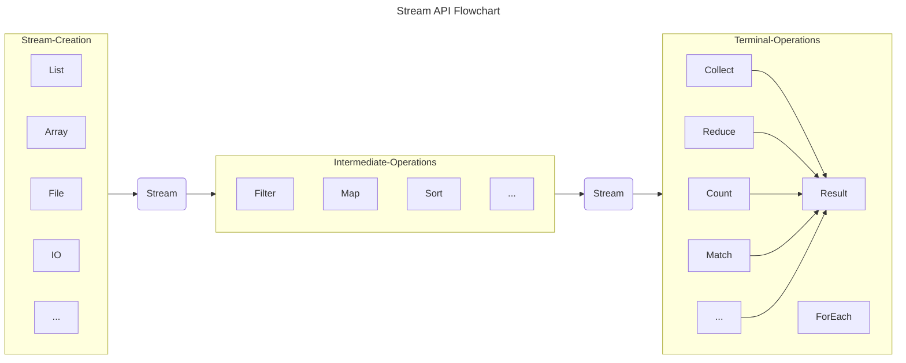

# Stream API

## 介绍

Stream API 的引入，为数据集合的操作提供了一种新的范式。Stream 本身并不是数据结构，不会存储数据和改变数据源，实际的数据依然存储在原始的数据源中。它仅定义数据处理方式，可以视为一种高级迭代器。不仅能够支持顺序处理，还可以支持并行处理。为集合的过滤、排序、映射、归约等操作提供了高效且易于使用的方法。

**使用 Stream 的三个步骤：**
1. 创建 Stream（Stream Creation）
2. 中间操作（Intermediate Operations）
3. 终止操作（Terminal Operations）

中间操作会返回一个新的 Stream，但是不会立即执行，只有遇到终止操作时才会执行。终端操作是整个流的实际执行部分，它会触发所有之前定义的中间操作，并生成最终结果。执行终端操作后，流中的元素会被消费，之后流不能再被使用。



## Stream Creation

### 从集合创建 Stream

任何实现了 Collection 接口的类都可以通过 `stream()` 方法创建 Stream。比如 List、Set、Queue 等。

```java
// 从 List 创建 Stream
List<String> list = Arrays.asList("a", "b", "c");
Stream<String> stream = list.stream();

// 从 Set 创建 Stream
Set<String> set = new HashSet<>(Arrays.asList("a", "b", "c"));
Stream<String> stream = set.stream();

// 从 Queue 创建 Stream
Queue<String> queue = new LinkedList<>(Arrays.asList("a", "b", "c"));
Stream<String> stream = queue.stream();

// 从 Map 创建 Stream
Map<String, String> map = new HashMap<>();
Stream<String> keyStream = map.keySet().stream();
Stream<String> valueStream = map.values().stream();

// 从数组创建 Stream
String[] array = new String[] {"a", "b", "c"};
Stream<String> stream = Arrays.stream(array);

// 从文件创建 Stream
Stream<String> stream = Files.lines(Paths.get("file.txt"));

// 从 IO 创建 Stream
BufferedReader reader = new BufferedReader(new FileReader("file.txt"));
Stream<String> stream = reader.lines();

// 从 Stream 创建 Stream
Stream<String> stream = Stream.of("a", "b", "c");
```


