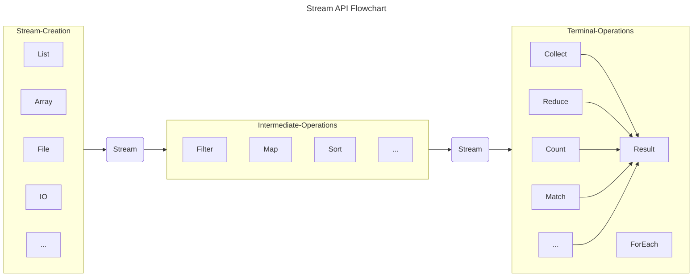

# Stream API

## 介绍

Stream API 的引入，为数据集合的操作提供了一种新的范式。Stream 本身并不是数据结构，不会存储数据和改变数据源，实际的数据依然存储在原始的数据源中。它仅定义数据处理方式，可以视为一种高级迭代器。不仅能够支持顺序处理，还可以支持并行处理。为集合的过滤、排序、映射、归约等操作提供了高效且易于使用的方法。

**使用 Stream 的三个步骤：**
1. 创建 Stream（Stream Creation）
2. 中间操作（Intermediate Operations）
3. 终止操作（Terminal Operations）

中间操作会返回一个新的 Stream，但是不会立即执行，只有遇到终止操作时才会执行。终端操作是整个流的实际执行部分，它会触发所有之前定义的中间操作，并生成最终结果。执行终端操作后，流中的元素会被消费，之后流不能再被使用。



## Stream Creation

### 从集合创建 Stream

任何实现了 Collection 接口的类都可以通过 `stream()` 方法创建 Stream。比如 List、Set、Queue 等。 Stream 可以从静态的数据结构中创建，也可以从动态的创建。

```java
// 从 List 创建 Stream
List<String> list = Arrays.asList("a", "b", "c");
Stream<String> stream = list.stream();

// 从 Set 创建 Stream
Set<String> set = new HashSet<>(Arrays.asList("a", "b", "c"));
Stream<String> stream = set.stream();

// 从 Queue 创建 Stream
Queue<String> queue = new LinkedList<>(Arrays.asList("a", "b", "c"));
Stream<String> stream = queue.stream();

// 从 Map 创建 Stream
Map<String, String> map = new HashMap<>();
Stream<String> keyStream = map.keySet().stream();
Stream<String> valueStream = map.values().stream();

// 从数组创建 Stream
String[] array = new String[] {"a", "b", "c"};
Stream<String> stream = Arrays.stream(array);

// 从文件创建 Stream
Stream<String> stream = Files.lines(Paths.get("file.txt"));

// 从 IO 创建 Stream
BufferedReader reader = new BufferedReader(new FileReader("file.txt"));
Stream<String> stream = reader.lines();

// 从 Stream 创建 Stream
Stream<String> stream = Stream.of("a", "b", "c");
```

#### 合并两个流

```java
Stream<String> stream1 = Stream.of("a", "b", "c");
Stream<String> stream2 = Stream.of("d", "e", "f");
Stream<String> stream = Stream.concat(stream1, stream2);
```

动态的决定是否将元素添加到 Stream 中：

```java
Stream.Builder<String> streamBuilder = Stream.builder();

if (condition) {
    streamBuilder.add("a");
}

// 使用 build() 方法创建 Stream
Stream<String> stream = streamBuilder.build();
```

一旦 Stream 被创建，就不能向 streamBuilder 添加更多元素。尝试调用 `add()` 方法会抛出 `IllegalStateException` 异常。

对于基本类型的处理，可以使用 `IntStream`、`LongStream`、`DoubleStream` 来分别处理 `int`、`long`、`double` 类型的数据。 通过使用 `range` 和 `rangeClosed` 等方法可以创建一个范围内的 Stream。

```java
IntStream intStream = IntStream.of(1, 2, 3);
LongStream longStream = LongStream.of(1, 2, 3);
DoubleStream doubleStream = DoubleStream.of(1, 2, 3);
```

```java
IntStream.range(1, 4).forEach(System.out::println); // 1, 2, 3
IntStream.rangeClosed(1, 4).forEach(System.out::println); // 1, 2, 3, 4
```

在 intStream 的基础上，生成对象流

```java
IntStream intStream = IntStream.of(1, 2, 3);
Stream<Integer> stream = intStream.boxed();
```

使用 Random 类生成随机流

```java
Random random = new Random();
random.ints(5).forEach(System.out::println);
```

### 无限流

无限流没有固定的大小，它可以无限的生成元素。Stream API 提供了一些方法来创建无限流，但是需要注意的是，无限流需要通过 limit() 方法限制流的大小，否则会导致无限循环。

```java
Stream.generate(() -> "a").limit(5).forEach(System.out::println);
Stream.iterate(0, i -> i + 1).limit(5).forEach(System.out::println);

// 带有终止条件的无限流，不需要使用 limit 进行限制
Stream.iterate(0, integer -> integer <= 10, integer -> integer + 2).forEach(System.out::println);
```

### 并行流

Stream API 提供了并行流的支持，可以通过 `parallel()` 方法将串行流转换为并行流。并行流可以充分利用多核处理器的优势，提高处理效率。

```java
// 直接从集合创建并行流
List<String> list = Arrays.asList("a", "b", "c");
Stream<String> parallelStream = list.parallelStream();

// 从串行流创建并行流
Stream<Integer> parallelStream2 = Stream.of(1, 2, 3).parallel();
```

## Intermediate Operations

中间操作是 Stream 的核心部分，它可以对 Stream 进行各种操作，如过滤、映射、排序等。中间操作会返回一个新的 Stream，但是不会立即执行，只有遇到终止操作时才会执行。

流的操作应该是链式调用的，即每次中间操作都应该基于前一次的操作结果，而不是重复使用同一个流实例进行多次操作，否则会抛出 `IllegalStateException` 异常。这是因为流的中间操作返回的是一个新的流，而原始流在第一次操作后就会被标记为已操作，不能再次进行操作。

```java

中间操作可以分为以下几个功能类别：

- **筛选与切片**：filter、distinct、limit、skip
- **映射**：map、flatMap、mapToInt、mapToLong、mapToDouble...
- **排序**：sorted

### 筛选与切片 Filtering and Slicing

用于过滤或缩减流中的元素数量，可以通过 `filter()` 方法过滤元素，通过 `distinct()` 方法去重，通过 `limit()` 方法限制元素数量，通过 `skip()` 方法跳过元素。

```java
List<String> list = Arrays.asList("a", "b", "c", "a", "b", "c");

// 过滤元素
list.stream().filter(s -> s.equals("a")).forEach(System.out::println);

// 去重
list.stream().distinct().forEach(System.out::println);

// 限制元素数量
list.stream().limit(2).forEach(System.out::println);

// 跳过元素
list.stream().skip(2).forEach(System.out::println);
```

#### distinct

如果需要对自定义对象进行 Distinct 操作，需要重写 `equals()` 和 `hashCode()` 方法。 Distinct 操作是通过 `hashCode()` 和 `equals()` 方法来判断元素是否相同的。

```java

class Person {
    private String name;
    private int age;

    // Getter and Setter

    @Override
    public boolean equals(Object o) {
        if (this == o) return true;
        if (o == null || getClass() != o.getClass()) return false;
        Person person = (Person) o;
        return age == person.age && Objects.equals(name, person.name);
    }

    @Override
    public int hashCode() {
        return Objects.hash(name, age);
    }
}

List<Person> list = Arrays.asList(
    new Person("Alice", 20),
    new Person("Bob", 30),
    new Person("Alice", 20)
);

list.stream().distinct().forEach(System.out::println);
```

#### limit

`limit()` 方法用于截取流中的前 N 个元素，如果流的长度小于 N，则返回原始流。

```java
List<String> list = Arrays.asList("a", "b", "c");
list.stream().limit(2).forEach(System.out::println);
```

#### skip

与 `limit()` 方法相反，`skip()` 方法用于跳过流中的前 N 个元素，返回剩余的元素。如果流的长度小于 N，则返回空流。

```java
List<String> list = Arrays.asList("a", "b", "c");
list.stream().skip(2).forEach(System.out::println);
```

### 映射 Mapping

用于转换流中的元素或提取元素的特定属性。通过 `map()` 方法可以将元素转换为其他形式，通过 `flatMap()` 方法可以将多个 Stream 合并为一个 Stream。映射是一个数据转换的过程，可以将一个元素转换为另一个元素。

#### map

`map()` 方法接受一个 Function 函数式接口，其中 T 是转换前的类型，R 是经过转换后返回的元素类型。`map()` 适用单层结构的流，进行一对一的转换，例如更改数据类型或提取信息。`map()` 方法会对流中的每个元素应用函数，并将返回的结果存储在新的流中。

```java
List<String> list = Arrays.asList("a", "b", "c");

// 将元素转换为大写
list.stream().map(String::toUpperCase).forEach(System.out::println);

// 将元素转换为长度
list.stream().map(String::length).forEach(System.out::println);
```


#### flatMap

对于嵌套的集合、数组或其他多层结构的数据，处理不够灵活。在这些情况下 `flatMap()` 方法更适合，它可以将多个 Stream 合并为一个 Stream，不仅能实现 `map()` 的功能，还能够扁平化多层数据结构，将它们转换合并成一个单层流。

和 `map()` 一样，`flatMap()` 会对每个元素调用传入的 Function 函数，但是这个函数的返回值是一个 Stream，而不是一个单个元素。`flatMap()` 方法会将多个 Stream 合并为一个 Stream。


```java
// 将多个 Stream 合并为一个 Stream
Stream<List<String>> stream = Stream.of(
    Arrays.asList("a", "b", "c"),
    Arrays.asList("d", "e", "f")
);
stream.flatMap(Collection::stream).forEach(System.out::println);
```

```java
        System.out.println("FlatMap for Object");
        List<List<Person>> personList = List.of(
                List.of(
                        new Person("John", 30, "USA"),
                        new Person("Sarah", 25, "USA"),
                        new Person("Alice", 35, "UK")
                ),
                List.of(
                        new Person("Bob", 40, "UK"),
                        new Person("Tom", 45, "USA"),
                        new Person("Tim", 50, "USA")
                ),
                List.of(
                        new Person("Sam", 55, "UK"),
                        new Person("Kim", 60, "UK"),
                        new Person("Jim", 65, "USA")
                )
        );
        Stream<List<Person>> personListStream = personList.stream();
        Stream<Person> personStream = personListStream.flatMap(Collection::stream);
        Stream<String> nameStream = personStream.map(Person::getName);
        nameStream.forEach(System.out::println);
```

```java
nestedPersonList.stream()
        .flatMap(people -> people.stream().map(Person::getName))
        .forEach(System.out::println);
```

以上两种写法等价。

第一种是将原始 Stream 中的每个元素转换为一个新的 `Stream<Person>`，然后将这些新的 `Stream<Person>` 合并为一个 Stream。第二种是将原始 Stream 中的每个元素通过 `people -> people.stream().map(Person::getName)` 将 `Stream<Person>` 直接转换为一个新的 `Stream<String>`，然后将这些新的 `Stream<String>` 合并为一个 Stream。

TODO diagram for above case

在使用 `flatMap()` 方法时，需要注意返回的 Stream 类型必须是相同的，否则会抛出 `ClassCastException` 异常。

在使用了 `flatMap()` 之后，可以再使用 `map()` 方法对元素进行转换或提取。

### 排序 Sorting

用于对流中的元素进行排序。通过 `sorted()` 方法可以对元素进行自然排序，通过 `sorted(Comparator)` 方法可以对元素进行定制排序。

Excalidraw
