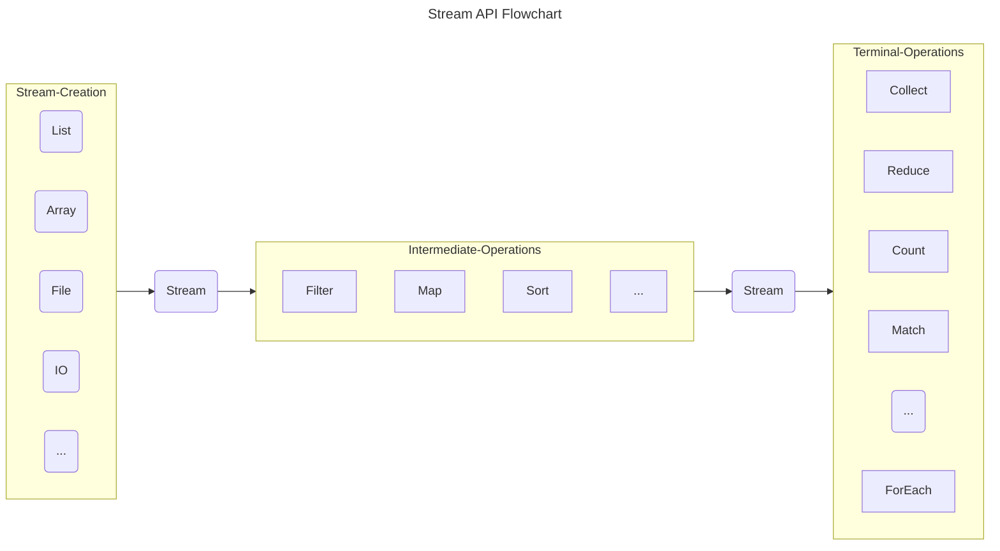

# Stream API

## 介绍

Stream API 的引入，为数据集合的操作提供了一种新的范式。Stream 本身并不是数据结构，不会存储数据和改变数据源，实际的数据依然存储在原始的数据源中。它仅定义数据处理方式，可以视为一种高级迭代器。不仅能够支持顺序处理，还可以支持并行处理。为集合的过滤、排序、映射、归约等操作提供了高效且易于使用的方法。

**使用 Stream 的三个步骤：**
1. 创建 Stream（Stream Creation）
2. 中间操作（Intermediate Operations）
3. 终止操作（Terminal Operations）

中间操作会返回一个新的 Stream，但是不会立即执行，只有遇到终止操作时才会执行。终端操作是整个流的实际执行部分，它会触发所有之前定义的中间操作，并生成最终结果。执行终端操作后，流中的元素会被消费，之后流不能再被使用。

