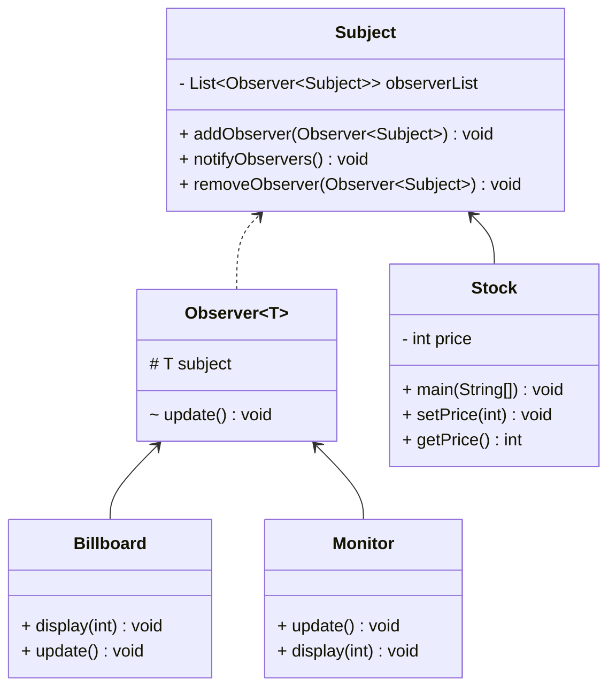

# Observer Pattern

## Class Diagram



Observer 类是一个抽象的观察者类，其有一个引用指向 Subject 类，即被观察者。当 Subject 的值被更新（在此为 price 的值），将调用 notifyObservers 方法，通知所有的观察者，调用其 update 方法。
Subject 类是一个定义 addObserver，notifyObservers，removeObserver公用方法的类，用于管理观察者。
Billboard 和 Monitor 类是具体的观察者类，实现了 Observer 类的 update 方法。
Stock 类是被观察者类，其有一个 price 属性，当 price 被更新时，调用 notifyObservers 方法，通知所有的观察者。

## Code

```java
public abstract class Observer<T extends Subject> {
    protected T subject;

    public Observer(T subject) {
        this.subject = subject;
        subject.addObserver(this);
    }

    abstract void update();
}
```

```java
public class Subject {
    private List<Observer<Subject>> observerList = new ArrayList<>();

    public void addObserver(Observer<Subject> observer) {
        observerList.add(observer);
    }

    public void removeObserver(Observer<Subject> observer) {
        observerList.remove(observer);
    }

    public void notifyObservers() {
        for (Observer<Subject> observer : observerList) {
            observer.update();
        }
    }
}
```

```java
public class Stock extends Subject {
    private int price;

    public void setPrice(int price) {
        this.price = price;
        notifyObservers();
    }

    public int getPrice() {
        return price;
    }
}
```

```java
public class Billboard extends Observer<Stock> {

    public Billboard(Stock stock) {
        super(stock);
    }

    public void display(int price) {
        System.out.println("Billboard: The price is: " + price);
    }

    public void update() {
        display(super.subject.getPrice());
    }
}
```

```java
public class Monitor extends Observer<Stock> {

    public Monitor(Stock stock) {
        super(stock);
    }

    public void display(int price) {
        System.out.println("Monitor: The price is: " + price);
    }

    public void update() {
        display(super.subject.getPrice());
    }
}
```

```java
public class ObserverPattern {
    public static void main(String[] args) {
        Stock stock = new Stock();
        Billboard billboard = new Billboard(stock);
        Monitor monitor = new Monitor(stock);

        stock.setPrice(100);
        stock.setPrice(200);
    }
}
```

**Output**

```
Billboard: The price is: 100
Monitor: The price is: 100
Billboard: The price is: 200
Monitor: The price is: 200
```

## Note

- Observer 类是一个抽象的观察者类，其有一个引用指向 Subject 类，即被观察者。当 Subject 的值被更新（在此为 price 的值），将调用 notifyObservers 方法，通知所有的观察者，调用其 update 方法。
- Subject 类是一个定义 addObserver，notifyObservers，removeObserver公用方法的类，用于管理观察者。
- Billboard 和 Monitor 类是具体的观察者类，实现了 Observer 类的 update 方法。
- Stock 类是被观察者类，其有一个 price 属性，当 price 被更新时，调用 notifyObservers 方法，通知所有的观察者。
- 在 ObserverPattern 类中，创建了一个 Stock 对象，以及一个 Billboard 和 Monitor 对象，当 Stock 的 price 被更新时，Billboard 和 Monitor 对象将会被通知，调用其 update 方法，更新显示的价格。
- Observer 模式是一种行为设计模式，其定义了一种一对多的依赖关系，当一个对象的状态发生改变时，所有依赖于它的对象都将得到通知并自动更新。
- Observer 模式的优点是将观察者和被观察者分离，使得代码更加模块化，易于扩展。
- Observer 模式的缺点是可能会导致循环引用，需要小心处理。
- Observer 模式的使用场景是当一个对象的改变需要同时改变其他对象，而且不知道具体有多少对象需要改变时，可以使用 Observer 模式。
- Observer 模式的实现方式有两种，一种是使用 Java 内置的 Observer 和 Observable 类，另一种是自定义 Observer 类。
- Observer 模式的角色有 Subject（被观察者），Observer（观察者），ConcreteSubject（具体的被观察者），ConcreteObserver（具体的观察者）。

## Reference

- [Observer Pattern](https://www.runoob.com/design-pattern/observer-pattern.html)
- [观察者模式](https://www.bilibili.com/video/BV14z421k7hv/?spm_id_from=333.1007.tianma.2-1-4.click&vd_source=f812625f00cdd1b06ca2f4281718b552)
- [Observer Pattern](https://en.wikipedia.org/wiki/Observer_pattern)
- [Observer Pattern](https://www.tutorialspoint.com/design_pattern/observer_pattern.htm)
- [Observer Pattern](https://www.geeksforgeeks.org/observer-pattern-set-1-introduction/)
