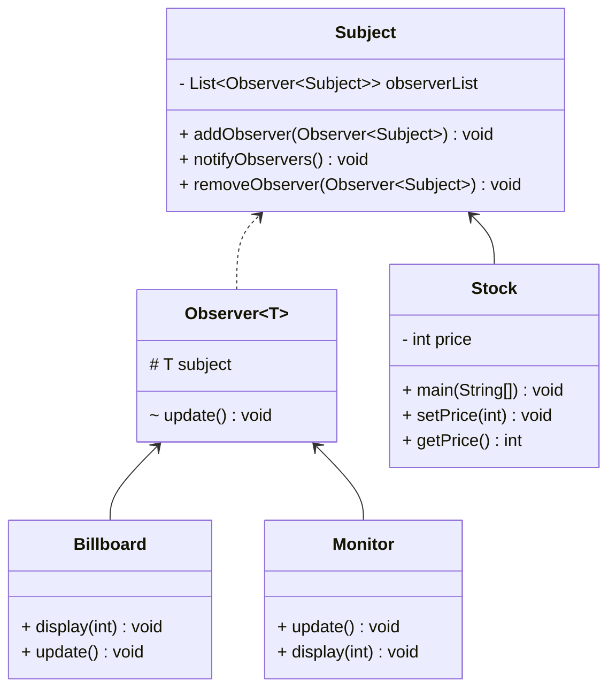

# Observer Pattern

https://www.runoob.com/design-pattern/observer-pattern.html

**Class Diagram**

Observer 类是一个抽象的观察者类，其有一个引用指向 Subject 类，即被观察者。当 Subject 的值被更新（在此为 price 的值），将调用 notifyObservers 方法，通知所有的观察者，调用其 update 方法。
