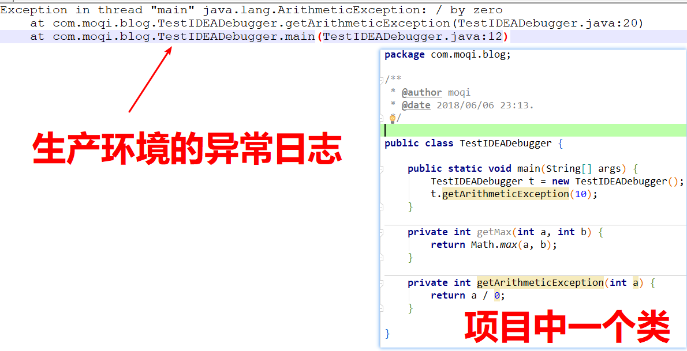
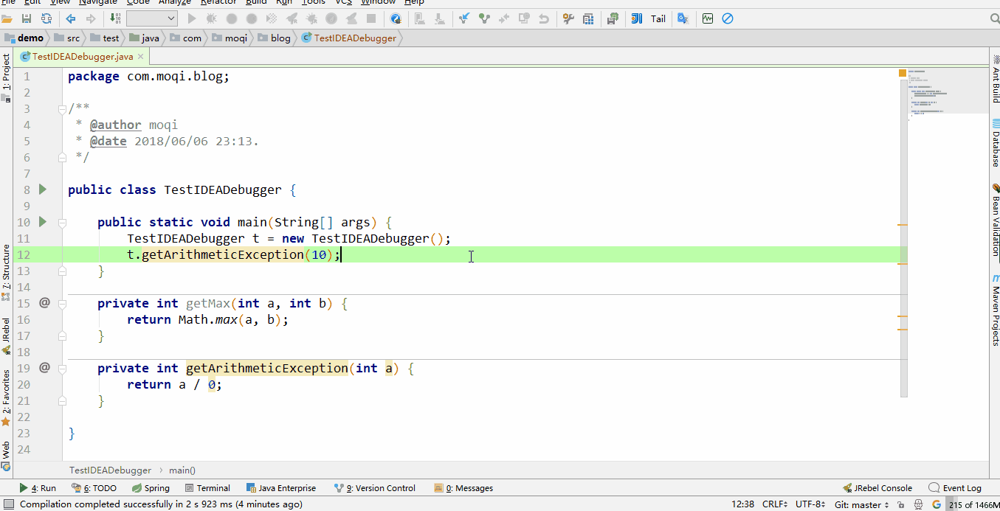
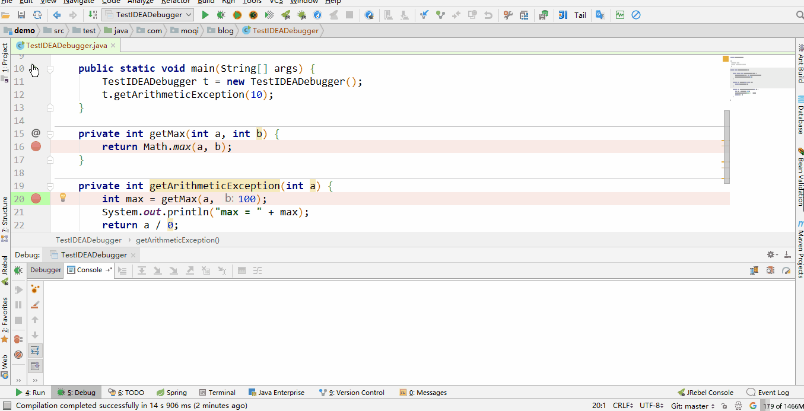
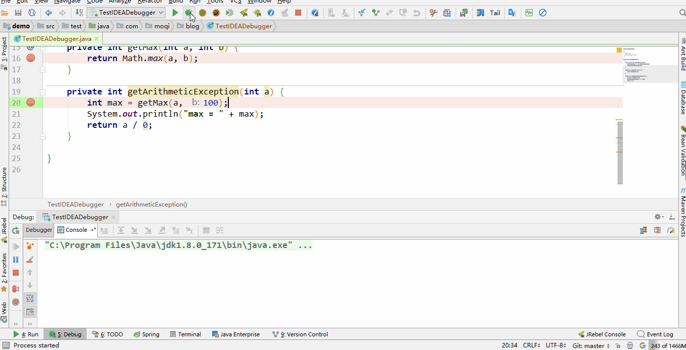
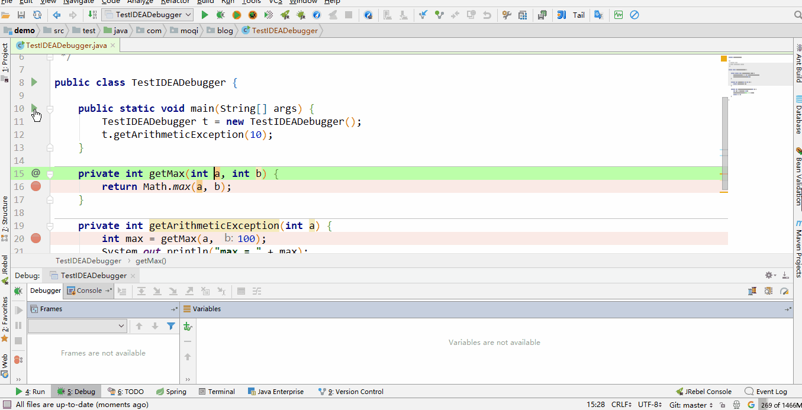
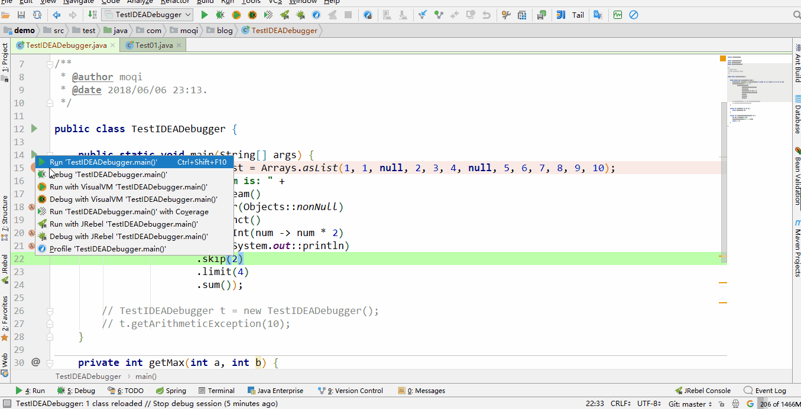

# IDEA - Debugger 经验总结 本文转载自 [https://moqimoqidea.github.io/2017/06/02/IDEA-Debugger/](https://moqimoqidea.github.io/2017/06/02/IDEA-Debugger/)

本文主要介绍 IDEA - Debugger 的一些操作。每个都有场景和操作说明。

## 分析外部堆栈跟踪

把报错信息复制到 Analyze -> Analyze Stacktrace，快速进入程序块。开发中经常可以看到生产环境有错误日志，依照此方法快速将日志导入项目，定位问题。

场景：

操作：

## 返回到前一个堆栈帧

IDEA 可在程序的执行流程中回退到先前的堆栈帧。要求不是最上面入口方法，选择 Drop Frame 后，等于未进入调用的方法。请注意：已经对全局状态进行的更改不会被恢复，只有本地变量会被重置。

## 强制从当前方法返回

在当前堆栈帧中右键单击选择 Force Return 然后根据需要的返回类型输入即可。

## 抛出一个异常

在当前堆栈帧中右键单击选择 Throw Exception 然后手动输入异常即可，比如 new NullPointerException();

## 重新加载修改的类

一般而言应用于在 Debugger 时发现未调用的方法有需要改动的地方，这时候修改未调用的方法，然后选择 Run -> Reload Changed Classes, 快捷键 Alt + U, 然后 A. 这时候 Debugger 继续进行调用，则执行的调用方法逻辑为重新编译之后。底层逻辑是用到 JVM 的 hotSwap.

## 分析 Java Stream 操作

IDEA Debugger 时可以可视化 Java Stream 进行的操作和对值数据的影响，需要断点停留在 Stream 上点击 Trace Current Stream Chain 按钮。

## 参考

[analyzing-external-stacktraces](https://www.jetbrains.com/help/idea/analyzing-external-stacktraces.html)
[altering-the-program-s-execution-flow](https://www.jetbrains.com/help/idea/altering-the-program-s-execution-flow.html)
[analyze-java-stream-operations](https://www.jetbrains.com/help/idea/analyze-java-stream-operations.html)
