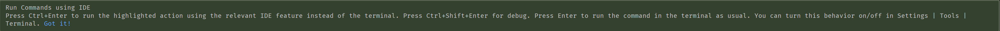
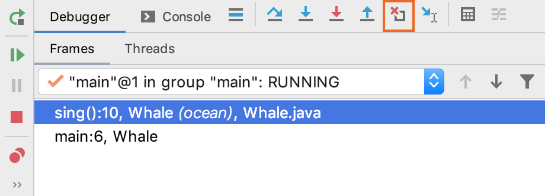

# IDEA使用笔记

[IntelliJ IDEA Help Documentation](https://www.jetbrains.com/help/idea)

## Plugins

1. Background Image Plus
2. CodeGlance: vscode右侧代码地图
3. Translation
4. Rainbow Brackets: 彩虹色括号
5. Grep Console: 日志着色控制台显示
6. Statistic: 代码统计
7. Markdown Navigator
8. RestfulToolkit: 快速定位controller层接口、接口测试
9. GsonFormat: Json转Java类
10. Mybatis Log Plugin: 快速打印SQL语句
11. Free Mybatis Plugin: mybatis xml id与接口间跳转

12. Material Theme UI: 美化
13. Lombok: 省掉手动set/get方法
14. Alibaba Java Coding Guidelines: 阿里巴巴开发规范
15. Easy Code: 数据库表生成JavaBean
16. JRebel for IntelliJ: JavaWeb项目热部署
17. Key Promoter X: 快捷键提示
18. .ignore: 生成git ignore文件

19. SonarLint 帮助你扫描代码的问题，例如 性能，安全和重复问题。新手必备！显著提升代码质量！
20. maven helpler 更好的进行依赖管理
21. mybatis pro 付费，但是可以有其他办法用[doge]
22. color themes 有各种好看的主题，推荐sublime 3主题

23. ANSI Highlighter 在IntelliJ编辑器下渲染ANSI转义序列
24. SequencePlugin 显示指定方法的序列图
25. javadoc 生成/删除/更新 javadoc

## Shortcut

- **Window Setting**
`ctrl + shift + F12`: 隐藏所有窗口,除了编辑器
`shift + F12`: 恢复默认窗口布局
`alt + 1`: 将焦点移至project窗口,在焦点已经在project窗口时,trigger该窗口
`ctrl + e`: 最近打开的文件

---

- **Editor**
`ctrl + shift + j`: 将光标处下一行的内容合并至当前行的行尾
`ctrl + shift + up/down`: 上移/下移语句或方法
`alt + insert`: 自动创建方法或文件解决错误等功能

---

- **Surround Code & Live Template**
`ctrl + alt + t`: **Surround** with **Suggest Code Block** and **Live Template**
`ctrl + alt + j`: **Surround** with **Live Template**
`ctrl + j`: Show **All Available Live Template** and Put It on **Current Cursor**

---

- **Reformat Code**
`ctrl + alt + o`: Optimize Imports
`ctrl + alt + l`: Reformat the **whole file** or **Selected File**
`ctrl + alt + shift + l`: Show Reformat Dialog

## Default Live Template

`.var`: 声明一个变量
`.if`: 将前面的对象用if进行包裹
`iter`: 遍历最近的可遍历对象
`sout`: System.out.println()
`main/psvm`: public static void main(String[] args) {}

## Live Template Variables

- **\$END\$**
The cursor position when all parameters are filled.
`$END$` indicates the position of the cursor when the code snippet is complete, and you can no longer press Tab to jump to the next variable.
- **\$SELECTION\$**
`$SELECTION$` is used in surround templates and denotes the code fragment to be wrapped. After the template expands, it wraps the selected text as specified in the template. For example, if you select EXAMPLE in your code and invoke the "`$SELECTION$`" template via the assigned abbreviation or by pressing `Ctrl+Alt+T` and selecting the desired template from the list, IntelliJ IDEA will wrap the selection in double quotes as follows: "EXAMPLE".

[Live Template Variables Usage](https://www.jetbrains.com/help/idea/2020.2/edit-template-variables-dialog.html)

## Reformat & Rearrange

[Reformat & Rearrange Offical Documentation](https://www.jetbrains.com/help/idea/reformat-and-rearrange-code.html)

- Code cleanup
Select this option to run the code cleanup inspections. IntelliJ IDEA finds and automatically fixes potentially problematic code fragments.

## Run Commands using IDE

- *IDEA 2020 new feature*

- Run Commands using IDE Press `Ctrl+Enter` to run the highlighted action using the relevant **IDE feature** instead of the terminal. Press `Ctrl+Shift+Enter` for **debug**. Press `Enter` to run the command in the terminal as **usual**. You can turn this behavior on/off in **Settings | Tools | Terminal**.

## Version Control

### Commit

- use non-modal commit interface (*IDEA 2020 new feature*)

## Changelist

[Manage changelist](https://www.jetbrains.com/help/idea/managing-changelists.html)

A changelist is a set of local changes that have not yet been committed to a VCS repository.

With changelists, you can group changes related to different tasks and commit these sets of changes independently.

## Debugger

[IDEA - Debugger 经验总结](https://moqimoqidea.github.io/2017/06/02/IDEA-Debugger/)
[IntelliJ IDEA Debugger 经验总结 - youtube](https://www.youtube.com/watch?v=H-nIkSJ_1Bc&list=WL&index=19)

### Analyze external stack traces

[Analyze external stack traces](https://www.jetbrains.com/help/idea/analyzing-external-stacktraces.html)

You might want to analyze exceptions received by someone else, for example, QA engineers, or investigate a deadlock, or a hang-problem. Unlike the exceptions that you get in the debug mode or when running unit tests, these exceptions do not have links that help you navigate to the corresponding locations in the source code. Moreover, the source code can be scrambled.

With IntelliJ IDEA, you can copy an exception or full thread dump, paste it to the Stack Trace Analyzer, explore information, and navigate to the corresponding source code.

### Alter the program's execution flow

[Alter the program's execution flow](https://www.jetbrains.com/help/idea/altering-the-program-s-execution-flow.html)

While debugging an application, you typically follow the normal flow of a program. However, there are cases when you need to deviate from it. This can be required in order to reproduce certain conditions or to test how the program deals with issues (for example, processes a null value or handles an exception).

#### Return to a previous stack frame

IntelliJ IDEA lets you fall back to a previous stack frame in a program's execution flow. This can be useful, for example, if you've mistakenly stepped too far, or want to re-enter a method where you missed a critical spot.

- Click the Drop Frame icon Drop frame on the toolbar of the Debug tool window.

#### Force return from the current method

You can exit a method before it reaches the return statement and make it `return` an arbitrary value. This is useful when the problem is related to the return value of the method and not to how it's produced. **Force return** helps you test how the return values are handled by the program without having to reproduce the conditions that lead to these values.

#### Throw an exception

#### Reload modified classes

### Analyze Java Stream operations

[Analyze Java Stream operations](https://www.jetbrains.com/help/idea/analyze-java-stream-operations.html)

Java 8 Streams may sometimes be difficult to debug. This happens because they require you to insert additional breakpoints and thoroughly analyze each transformation inside the stream. IntelliJ IDEA provides a solution to this by letting you visualize what is going on in Java Stream operations.

## Plugins Descriptions

### javadoc

[Github javadocs wiki](https://github.com/setial/intellij-javadocs/wiki)

Plugin generates java docs for all elements in java classes.
To generate javadocs for active element press "shift + alt + G".
To generate javadocs for all elements in current java file press "shift + ctrl + alt + G".
You can also select a part of code in editor and press "shift + alt + G" or from context dialog ("Javadocs -> Selected element" in case of Intellij Idea before 13 and "JavaDocs for the selected element" in case of Intellij Idea 13 and greater) and javadocs will be created for all selected elements.
Both of this actions could be executed from the generate popup dialog ("alt + insert").

Since release 1.0.11 new shortcuts are available:

- Remove javadocs on current/selected element: "shift + alt + Z"
- Remove javadocs on all elements of current class: "shift + ctrl + alt + Z"
- From project view available new option to Create javadocs for selected folder/files
- From project view available new option to Remove javadocs for selected folder/files
