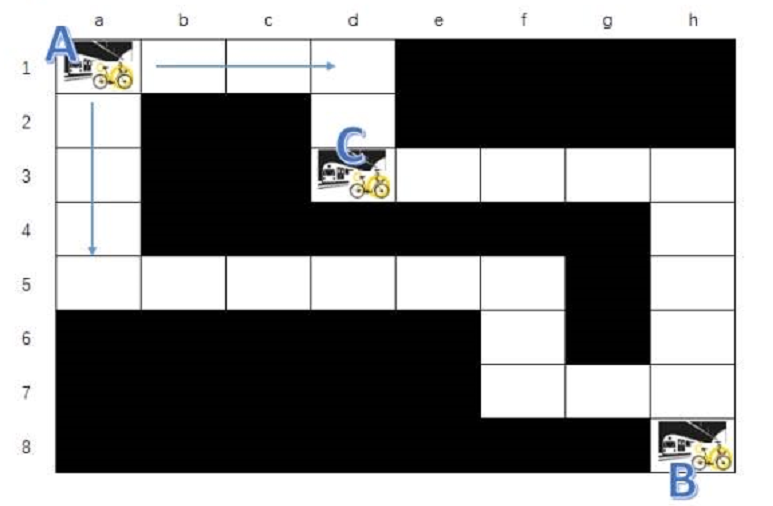

# 小黄车 编程考试试题

## 题目：

**请于2小时内提交编程结果，可以是未完成的代码。在提交编程结果后，如果未完成，可以自愿选择維续完成全部代码再次提交完整代码。**

1、地因上有三个地铁站，A 地铁站初始存放30辆小黄车，巳地铁站初始存放40辆小黄车，C地铁站初始30  
2、有两辆货车持续在A站、B站和C站之间运揄，货车最大满载20辆小黄车。每秒能移动3个格子距离，路线随机；货车运输小黄车（装卸时间不计），确保三个地铁站小黄车足够满足乘客需求。  
3、每秒钟会有一个乘客会在A、B、C站之间使用小黄车骑行，路线随机，每秒只能骑行1个格子距离

请模拟运行200秒钟，输出小黄车状态

**编程要求：**

1. 使用面向对象的方法进行编程，可以根据自己偏好自由选择编程语言。
2. **在编程时，可以使用多线程，也可以不使用多线程**
3. 代码实现要考虑到扩展性，本题目扩展性仅限于考虑货车，小黄车移动速度，地图布局发生变化时代码能够很容易地扩展和支持。
4. 输出结果：

示例参考如下：  
00:00:00 A站车30，B站车40．C站车30，路上车0  
00.01-00 A站车29，B站年40，C站车30，路上车1  
00:02:00 A站车29，B站车39，C站车30，路上车2  
00:03:00 A站车28，B站车39，C站车30，路上车3  
00:04:00 A站车28，B站车39，C站车29。路上车4  
00:05:00 A站年27，B站车38，C站车30。路上车5  
......  
00:25:00 A站车14，B站车36，C站车23，路上车22，B到A运输5辆车

**其他要求：**

1. 提交物包括：完整项目源程序和已经编泽好的可执行程序．并分别按照\src，\bin三个目录分别存放好，打包提交，如果是js或者python实现，则只需要按照\src目录存放好打包提交。
2. 可以网上查询相关技术资料，但要确保独立完成．不得互相抄袭代码。

**评分要点及检查项：**

1. 合理正确的使用面向对象的方法进行程序结构设计。
2. 类设计合理，数据结构运用合理，扩展性良好。
3. 编码规范，函数及类命名合理准确，无歧义。
4. 程序的关键实现部分要进行逻辑注释说明。
5. 程序源码可以编译通过，无错误及警告提示．无内存等资源泄露。
6. 请同学做好系统分析，准确理解题意，正确模拟运行结果。

---

由于该题题意不清，且出题人在题尾强调做题人需准确理解题意，故作出以下几种不同的题意假设，以提高该题的完整度，并避免理解歧义。

通用假设：

1. 示例图中，黑色方块为不可通行区域。
2. 题中，“其他要求”部分中的“分别按照\src，\bin三个目录分别存放”，其表达的正确含义为“分别按照
   \src，\bin 两个目录分别存放，源文件存放于 \src，可执行文件存放于 \bin。对于无法编译生成可执行文件的编程语言，则只需将源文件存放于
   \src 中”。
3. 当车站剩余小黄车无法满足骑行需求时，模拟程序提前结束运行并输出无法提供服务的车站的信息及其他统计数据。
4. 结合题中提供的示意图，车站两两之间只存在两条相通的路径，且“地图布局发生变化时”，也不会破坏该假设。
5. 题干中出现的“路线随机”，意为货车和小黄车随机选择两站的两条相通路径中的其中一条作为前进的路线，中途无法返回或驶出指定路线。
6. 货车的行驶仅路线随机，而下一个目标车站及抵达站点后的货物变化量则由程序计算得出。

假设1：

1. 货车在其中一个车站装车并出发，在目标车站卸车，可以只卸货车上的部分小黄车。也可在目标车站再次装车，或在目标车站即不装车也不卸车，继续前往下一车站。
2. 货车的下一目标车站可以是任意车站，可以将当前货车停靠的车站继续作为目标车站。即货车可在一段时间内停靠在一个车站，不执行任何运输任务。
3. 小黄车的源车站和目标车站均为随机指定，且目标车站和源车站不能是同一个车站。
4. 小黄车在抵达目标车站后立即被归还。
