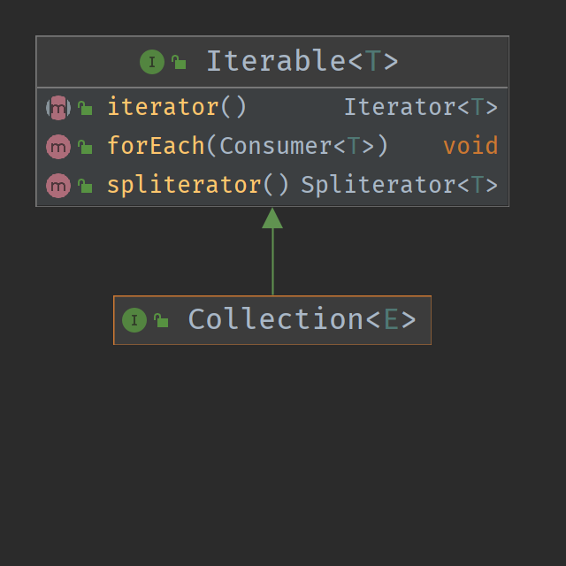
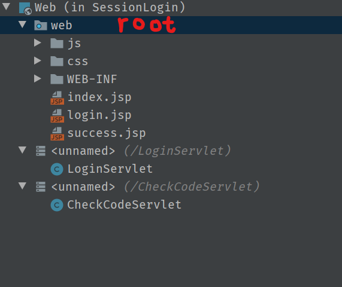

# Java学习笔记

[TOC]

## 学习路线

### 1. 语言的入门和进阶

- [x] Java基础语法
- [x] OO编程思想
- [x] 集合
- [x] IO
- [x] 异常
- [x] 泛型
- [x] 反射
- [x] 多线程
- [x] 函数式

Core Java

- [ ] lambada   1D
- [ ] 内部类    1D
- [ ] 代理      1D
- [ ] **异常**      1D
- [ ] 日志      1D
- [ ] **泛型**      2D
- [ ] 集合      3D
- [ ] 部署      2D
- [ ] 并发      4D
- [ ] JDBC

### 2.Web基础和工具

- [x] 前端基础(html/javascript/css) jquery, ajax, jsp, cookie, session
- [x] http基础
- [x] servlet基础
- [x] git,svn代码管理工具

### 3.企业级应用框架

- [x] maven/gradle项目管理工具
- [x] Spring全家桶(Spring, Spring MVC, Spring Boot)
- [x] 关系型数据库相关(MySQL, jdbc, MyBatis, Hibernate)
- [x] 非关系型数据库(Redis)
- [x] 模板引擎(thymeleaf, freemarker)

### 4.高级应用框架

- [ ] 搜索引擎(elastic search)
- [ ] RPC框架(Dubbo, Spring Cloud)
- [ ] 中间件技术(RabbitMQ, RocketMQ, ActiveMQ, Kafka)
- [ ] 虚拟化技术(Docker, Kubernetes)

### 5.高级话题

- [ ] jvm优化和排错, GC分析, 数据库高级优化

---

### IDEA常用快捷键


---

## 算法

### 冒泡排序

```java

public class ex5_5 {
    public static void main(String[] args) {
        int n = 10;
        int[] array = new int[n];
        for (int i = 0; i < n; i++) {
            array[i] = (int) (Math.random() * 101);
        }
        for (int num :
                array) {
            System.out.print(num + "\t");
        }
        System.out.println();
        int count = 1;
        for (int i = array.length - 1; i > 0; i--) {
            int moveCount = 0;
            for (int j = 0; j < i; j++) {
                int temp;
                if (array[j] > array[j + 1]) {
                    temp = array[j + 1];
                    array[j + 1] = array[j];
                    array[j] = temp;
                    moveCount++;
                }
            }
            System.out.print("\n第" + count + "次排序: \t");
            count++;
            for (int num :
                    array) {
                System.out.print(num + "\t");
            }
            //若数组元素一次都未移动，则不再进行排序
            if (moveCount == 0)
                break;
        }

    }
}

```

## 数值类型之间的转换

```java
int n = 123456789;
float f = n;    // f is 1.2345679E8
```

使用上面两个数值进行二元操作时，先要将两个操作数转换为同一种类型，然后再进行计算。

- 如果两个操作数中有一个是double类型，另一个操作数将会转换成double类型

- 否则，如果其中一个操作数是float类型，另一个操作数将会转换成float类型

- 否则，如果其中一个操作数是long类型，另一个操作数将会转换成long类型

- 否则，两个操作数都将被转换成为int类型

### 强制类型转换

- 若存在信息丢失的可能性，则必须显式的的强制类型转换

## Java中用于控制可见性的4个访问修饰符

1.仅对**本类**可见——`private`
2.对所有类可见——`public`
3.对本包和所有子类可见——`protected`
4.对本包可见——default，不需要修饰符

## 类、超类和子类

> 如果子类的构造器没有显式地调用超类的构造器，则将自动地调用超类默认(没有参数)的构造器。如果超类没有不带参数的构造器，并且在子类的构造器中又没有显式地调用超类的其他构造器，则Java编译器将报告错误。

```java
Object.equals() 比较两个对象变量是否指向同一个引用，Object的equals的作用与==相同
==              比较是否为同一个引用
```

equals()方法的用途是比较两个对象之间的内容是否相等
在两个对象相等(未必是同一个引用)的情况下，其hashCode也应该相等，hashCode应该反映该对象的所有域变量的状态

## 接口

### 静态方法

Java SE8中，允许在接口中增加**静态方法**。

### 默认方法

```java
public interface Comparable<T>
{
    default int compareTo(T other) { return 0; }
    // 默认所有元素相同
}
```

使用默认方法能够保证 *源代码兼容*

### 解决默认方法冲突

1. 超类优先
2. 接口冲突 在实现类中必须指定调用哪个接口的默认方法，只要有一个接口实现了同名的默认方法，就必须指明调用哪个接口的对应方法

```java
class Student implements Person, Named
{
    public String getName() { return Person.super.getName(); }
    // 即Named的getName方法
}
```

通过实现Comparable和Comparator接口来调用Arrays.sort()方法来进行数组的排序
浅拷贝值只拷贝java基础数据类型，而不拷贝对象
数组类型的clone()方法均为深拷贝

## 内部类

### 成员内部类

#### 非静态内部类

由于非静态内部类可以访问外部类的实例域，所以一定要在外部类已经实现的情况下才能实现非静态内部类。

- **使用说明:**

1. 非静态内部类必须寄存在一个**外部类对象**里。因此，如果有一个非静态内部类对象那么一定存在对应的外部类对象。非静态内部类对象单独属于外部类的某个对象。(所以非静态内部类可以访问外部类的实例域)
2. 非静态内部类可以直接访问外部类的成员，但是外部类不能直接访问非静态内部类成员。(因为内部类可能还没有实例化)
3. 非静态内部类不能有静态方法、静态属性和静态初始化块。
4. 外部类的静态方法、静态代码块不能访问非静态内部类，包括不能使用非静态内部类定义变量、创建实例。(此时外部类还未实例化，所以内部类也不能实例化，不能使用内部类的变量和创建实例)
5. 成员变量访问要点：
  i. 内部类里方法的局部变量：变量名。
  ii. 内部类属性：this.变量名。
  iii. 外部类属性：外部类名.this.变量名。

#### 静态内部类

- **使用要点:**

1. 当一个静态内部类对象存在，并不一定存在对应的外部类对象。 因此，静态内部类的实例方法不能直接访问外部类的实例方法。
2. 静态内部类看做外部类的一个静态成员。 因此，外部类的方法中可以通过：“静态内部类.名字”的方式访问静态内部类的静态成员，通过 new 静态内部类()访问静态内部类的实例域和实例方法。

由于静态内部类不需要实例化，所以无法使用外部类中需要实例化的域和方法。

#### 匿名内部类

适合那种只需要使用一次的类。比如：键盘监听操作等等。

1. 匿名内部类没有访问修饰符。
2. 匿名内部类没有构造方法。因为它连名字都没有那又何来构造方法呢。

## 函数式接口

有且仅有一个**未实现**的方法，存在任意个默认(default)方法、任意个静态方法 的接口称为**函数式接口**(FunctionalInterface)

函数式接口要使用 `@FunctionalInterface` 注解来标识。

```java
@FunctionalInterface
interface Foo {

    int add(int a, int b);

    default double div(double a, double b) {
        return a / b;
    }

    default double mod(int a, int b) {
        return a % b;
    }

    static double mul(double a, double b) {
        return a * b;
    }
}
```

### 常用的函数式接口

// TODO 常用的函数式接口

## Lambda 表达式

`Lambda Expression` 可以简化匿名内部类的编写，可以直接实现函数式接口

```java
System.out.println(Foo.mul(4, 5));
Foo foo = (a, b) -> a + b;
System.out.println(foo.add(4, 5));
System.out.println(foo.div(20, 4));
```

## 字符串比较

>1. equals方法用来检测两个字符串内容是否相等。如果字符串s和t内容相等，则s.equals(t)返回true，否则返回false。  
>2. 要测试两个字符串除了大小写区别外是否是相等的，需要使用equalsIgnoreCase方法。  
>3. 判断字符串是否相等不要使用"=="。

## 面向对象的内存分析

Java虚拟机的内存可以分为三个区域：栈stack、堆heap、方法区method area。

**栈的特点如下**：

1. 栈描述的是方法执行的内存模型。每个方法被调用都会创建一个栈帧(存储局部变量、操作数、方法出口等)
2. JVM为每个线程创建一个栈，用于存放该线程执行方法的信息(实际参数、局部变量等)
3. 栈属于线程私有，不能实现线程间的共享!
4. 栈的存储特性是“先进后出，后进先出”
5. 栈是由系统自动分配，速度快!栈是一个连续的内存空间!

**堆的特点如下：**

1. 堆用于存储创建好的对象和数组(数组也是对象)
2. JVM只有一个堆，被所有线程共享
3. 堆是一个不连续的内存空间，分配灵活，速度慢!

**方法区(又叫静态区)特点如下：**

1. JVM只有一个方法区，被所有线程共享!
2. 方法区实际也是堆，只是用于存储类、常量相关的信息!
3. 用来存放程序中永远是不变或唯一的内容。(类信息【Class对象】、静态变量、字符串常量等)


### 数组的创建和初始化过程

定义数组只是在栈内存中创建**局部变量**，该变量为指向任何内存空间，即null

```java
Object[] array;
```


创建数组对象，并将数组变量指向堆中创建的数组对象

```java
Object[] array = new Object[7];
```


动态初始化数组

```java
array[0] = new Object();
```


## instanceof

引用变量名 instanceof 类名 来判断该引用类型变量所“指向”的对象是否属于该类或该类的子类。

## 自动装箱和拆箱

由编译器提供的功能，使Java原始类型能够自动的转变为对应的包装类对象。

### 自动装箱

基本类型的数据处于需要对象的环境中时，会自动转为“对象”。

```java
Integer i = 100;//自动装箱
//相当于编译器自动为您作以下的语法编译：
Integer i = Integer.valueOf(100);//调用的是valueOf(100)，而不是new Integer(100)
```

### 自动拆箱

每当需要一个值时，对象会自动转成基本数据类型，没必要再去显式调用intValue()、doubleValue()等转型方法。

```java
Integer i = 100;
int j = i;//自动拆箱
//相当于编译器自动为您作以下的语法编译：
int j = i.intValue();
```

整型、char类型所对应的包装类，在自动装箱时，对于-128~127之间的值会进行缓存处理，其目的是提高效率。

## StringBuild & StringBuffer

>StringBuffer JDK1.0版本提供的类，线程安全，做线程同步检查， 效率较低。  
StringBuilder JDK1.5版本提供的类，线程不安全，不做线程同步检查，因此效率较高。 建议采用该类。

### 常用方法

```java
public StringBuilder append(String str);
public StringBuilder deleteCharAt(int index);
public StringBuilder delete(int start, int end);
public StringBuilder insert(int offset, char c);
public StringBuilder reverse();
public String toString();
```

## 容器/集合

### Collection

Collection 接口中定义了 `add` 和 `remove` 方法，以及 `toArray` 方法，将集合中的元素输出到数组中。由于 Collection 有不同的实现，如 List、Set、Queue 等，没有一个统一的元素遍历规则、方式。如 List 使用下标访问元素，Queue 只能访问队列两端的元素。所以 Collection 实现了 Iterable 接口。



#### Iterable

Iterable 接口中需要实现 `Iterator<T> iterator()` 方法，该方法用于返回集合对应的迭代器对象。只有实现了 Iterable 接口的类才能够使用 for-each 循环。

#### Iterator

Iterator 接口中定义了两个方法。
`hasNext()` 方法用于判断是否存在下一个元素，存在则返回 true
`next()` 方法返回下移个元素，并将游标后移一个元素

```java
/**
 * Returns {@code true} if the iteration has more elements.
 * (In other words, returns {@code true} if {@link #next} would
 * return an element rather than throwing an exception.)
 *
 * @return {@code true} if the iteration has more elements
 */
boolean hasNext();

/**
 * Returns the next element in the iteration.
 *
 * @return the next element in the iteration
 * @throws NoSuchElementException if the iteration has no more elements
 */
E next();
```

#### For-Each

JDK 1.8 中提供一个新的遍历集合的语法糖，如下所示。

```java
public static void test() {
    Collection<String> collection = new ArrayList<>();
    for (String str : collection) {
        System.out.println(str);
    }
}
```

其原理是调用集合的 iterator 方法获取迭代器，后调用迭代器的 `hasNext()` 方法判断是否调用 `next()` 方法并进入循环体。所以使用 For-Each Loop 的对象必须实现 Iterable 接口。
字节码如下：

```text
 0 new #2 <java/util/ArrayList>
 3 dup
 4 invokespecial #3 <java/util/ArrayList.<init> : ()V>
 7 astore_0
 8 aload_0
 9 invokeinterface #6 <java/util/Collection.iterator : ()Ljava/util/Iterator;> count 1
14 astore_1
15 aload_1
16 invokeinterface #7 <java/util/Iterator.hasNext : ()Z> count 1
21 ifeq 44 (+23)
24 aload_1
25 invokeinterface #8 <java/util/Iterator.next : ()Ljava/lang/Object;> count 1
30 checkcast #9 <java/lang/String>
33 astore_2
34 getstatic #10 <java/lang/System.out : Ljava/io/PrintStream;>
37 aload_2
38 invokevirtual #11 <java/io/PrintStream.println : (Ljava/lang/String;)V>
41 goto 15 (-26)
44 return
```

在 offset 9 的位置，调用的 ArrayList 对象的 iterator 方法，返回了一个 Iterator 对象，并存入了 LV 索引为 1 的位置。
然后调用该迭代器的 `hasNext()` 方法，如果其返回不为 false，则调用该迭代器的 `next()` 方法，将其返回值进行类型检查后存入 LV Slot 2。最后执行循环体中的代码。

### List

List是有序，元素内容可重复的容器
**有序**:List中每个元素都有索引标记。可以根据元素的索引标记(在List中的位置)访问元素，从而精确控制这些元素。
**可重复**:List允许加入重复的元素。更确切地讲，List通常允许满足 e1.equals(e2) 的元素重复加入容器。
List接口常用的实现类有3个：`ArrayList`、`LinkedList`和`Vector`。


如何选用`ArrayList`、`LinkedList`、`Vector`?

 1. 需要线程安全时，用`Vector`。
 2. 不存在线程安全问题时，并且查找较多用`ArrayList`(一般使用它)。
 3. 不存在线程安全问题时，增加或删除元素较多用`LinkedList`。

#### ArrayList

ArrayList底层是用数组实现的存储。 特点：查询效率高，增删效率低，线程不安全。

##### Iterator

ArrayList 中的迭代器是 fail-fast 的。

> if the list is structurally modified at any time after the iterator is created, in any way except through the iterator's own remove or add methods, the iterator will throw a ConcurrentModificationException.

Itr 的 field expectedModCount 为 ArrayList.this.modCount。若 ArrayList.this.modCount 发生了变化（调用了 ArrayList 的 add 或者 remove 方法使 elements 发生了变化），则在执行 next 方法时将抛出 `ConcurrentModificationException`。

```java
private class Itr implements Iterator<E> {
    int cursor;       // index of next element to return
    int lastRet = -1; // index of last element returned; -1 if no such
    int expectedModCount = modCount;
}
```

```java
final void checkForComodification() {
    if (modCount != expectedModCount)
        throw new ConcurrentModificationException();
}
```

```java
@SuppressWarnings("unchecked")
public E next() {
    checkForComodification();
    int i = cursor;
    if (i >= size)
        throw new NoSuchElementException();
    Object[] elementData = ArrayList.this.elementData;
    // 若 elementData 在此时发生了 trim，则可能会抛出并发修改异常
    if (i >= elementData.length)
        throw new ConcurrentModificationException();
    cursor = i + 1;
    return (E) elementData[lastRet = i];
}
```

#### LinkedList

LinkedList底层用双向链表实现的存储。特点：查询效率低，增删效率高，线程不安全。

#### Vector

Vector底层是用数组实现的List，相关的方法都加了同步检查，因此“线程安全,效率低”。

### Map

Map就是用来存储“键(key)-值(value) 对”的。 Map类中存储的“键值对”通过键来标识，所以“键对象”不能重复。
Map 接口的实现类有`HashMap`、`TreeMap`、`HashTable`、`Properties`等。


#### HashMap

HashMap采用哈希算法实现，是Map接口最常用的实现类。 由于底层采用了哈希表存储数据，我们要求键不能重复，如果发生重复，新的键值对会替换旧的键值对。 HashMap在查找、删除、修改方面都有非常高的效率。
线程不安全，效率高。允许key或value为null。

#### HashTable

线程安全，效率低。不允许key或value为null。

#### TreeMap

TreeMap和HashMap实现了同样的接口Map，因此，用法对于调用者来说没有区别。HashMap效率高于TreeMap;在需要**排序**的Map时才选用TreeMap。

### Set

Set容器特点：无序、不可重复。
**无序**指Set中的元素没有索引，我们只能遍历查找;
**不可重复**指不允许加入重复的元素。更确切地讲，新元素如果和Set中某个元素通过equals()方法对比为true，则不能加入;
甚至，Set中也只能放入一个null元素，不能多个。**对自定义对象排序需要实现Compareable接口**

Set常用的实现类有：`HashSet`、`TreeSet`等，我们一般使用`HashSet`。

#### HashSet

HashSet是采用哈希算法实现，底层实际是用HashMap实现的(HashSet本质就是一个简化版的HashMap)，因此，查询效率和增删效率都比较高。

#### TreeSet

TreeSet底层实际是用TreeMap实现的，内部维持了一个简化版的TreeMap，通过key来存储Set的元素。 TreeSet内部需要对存储的元素进行排序，因此，我们对应的类需要实现Comparable接口。这样，才能根据compareTo()方法比较对象之间的大小，才能进行内部排序。

1. 由于使用排序二叉树实现排序，需要对元素做内部排序。 如果要放入TreeSet中的类没有实现Comparable接口，则会抛出异常：java.lang.ClassCastException。
2. TreeSet中不能放入null元素。(null无法进行比较、排序)

### 遍历结合的方法总结

#### 遍历List

1.普通`for`循环

```java
for(int i=0;i<list.size();i++){//list为集合的对象名
    String temp = (String)list.get(i);
    System.out.println(temp);
}
```

2.增强for循环

```java
for (String temp : list) {
    System.out.println(temp);
}
```

3.Iterator迭代器(1)

```java
for(Iterator iter= list.iterator();iter.hasNext();){
    String temp = (String)iter.next();
    System.out.println(temp);
}
```

4.Iterator迭代器(2)

```java
Iterator  iter =list.iterator();
while(iter.hasNext()){
    Object  obj =  iter.next();
    iter.remove();//如果要遍历时，删除集合中的元素，建议使用这种方式！
    System.out.println(obj);
}
```

#### 遍历Set

1.增强for循环

```java
for(String temp:set){
    System.out.println(temp);
}
```

2.Iterator迭代器

```java
for(Iterator iter = set.iterator();iter.hasNext();){
    String temp = (String)iter.next();
    System.out.println(temp);
}
```

#### 遍历Map

1.根据keySet获取value

```java
Map<Integer, Man> maps = new HashMap<Integer, Man>();
Set<Integer>  keySet =  maps.keySet();
for(Integer id : keySet){
    System.out.println(maps.get(id).name);
}
```

2.遍历entrySet

```java
Set<Entry<Integer, Man>>  ss = maps.entrySet();
for (Iterator iterator = ss.iterator(); iterator.hasNext();) {
    Entry e = (Entry) iterator.next();
    System.out.println(e.getKey()+"--"+e.getValue());
```

## IO

### File类

#### File类 常用方法

##### 路径相关

`File.separator` : 操作系统的文件分割符(如Linux的'/'、Windows的'\\')
`getName()` : 获取文件(目录或文件)名
`getPath()` : 获取路径名(即创建File对象时传入的实参)
`getAbsolutePath()` : 永远返回File对象的绝对路径
`getParent()` : 返回父级路径(以传入参数为准)
`getParentFile()` : 返回父级File对象，不存在则为null

---

##### 文件相关

`exists()` : 文件是否存在
`isFile()` : 文件是否是文件
`isDirectory()` : 文件是否是目录文件

`length()` : 文件存储空间大小

`createNewFile()` : 创建文件
`delete()` : 删除文件

---

##### 目录相关

若需要创建的目录已存在，则返回false
`mkdir()` : 创建目录，需保证上一级目录存在，否则创建失败，返回false
`mkdirs()` : 如果父目录不存在则一同创建

`list()` : 列出下级文件名称
`listFiles()` : 返回下级文件对应的File对象(使用绝对路径创建的File对象)
`listRoots()` : 根路径

### 字符集

#### 常用字符集

`utf-8` `utf-16` `utf-16 LE`(小端) `utf-16 BE`(大端) `ISO-8859-1` `GBK`

utf-8中，中文占用3个字节，字母(A to Z 0 to 9)占用1个字节
默认使用项目字符集

#### 编码

字符 --> 字节(二进制)
`"test".getByes()` : 返回字符串对应的`Byte[]`

#### 解码

字节(二进制) --> 字符
解码使用String的构造方法

```java
String(byte bytes[], int offset, int length, Charset charset)
String(byte bytes[], Charset charset)
```

#### 乱码

1. 字节数不够
2. 字符集不统一

### 四个抽象类

#### InputStream

字节输入流的父类，数据单位为字节
`FileInputStream`

#### OutputStream

字节输出流的父类，数据单位为字节
`FileOutputStream`

#### Reader

字符输入流的父类，数据单位为字符
`FileReader`

#### Writer

字符输出流的父类，数据单位为字符
`FileWriter`

### IO标准步骤

1. 创建源
2. 选择流
3. 操作
4. 释放系统资源

`FileInputStream` 无法访问目录文件，会抛出 `FileNotFoundException`
`FileOutputStream.write(byte[] flush,int offest,int length)` 方法需要指定写入byte数组的长度，来避免将byte数组末尾未读取到数据的元素写入目标文件(EOF的位置)，造成不可预知的问题
`write(byte[] flush)` 可能会输出多余的数据
`String(byte[] bytes)` 方法也应注意bytes长度的问题，默认解码长度为`bytes.length`

### 节点流

与数据源直接交互
文件字节流 `FileInputStream` `FileOutputStream`
文件字符流 `FileReader` `FileWriter`
字节数组流 `ByteArrayInputStream` `ByteArrayOutStream`
其中 `ByteArrayOutStream` 由于需要使用 `toByteArray()` 方法，父类中不存在，所以不能使用多态来调用该方法，需向下强制转型

#### 字节数组流

用于缓冲输入输出的字节
缓冲器中的内容可以通过 `baos.toByteArray()` 获得
使用字节数组流能够更加方便的在内存中保存字节流，使循环得到的byte[] 能够最终合并为一个完整的、包含整个文件的字节数组
尽管使用`FileInputStream`也能够将文件的字节传输到栈内存中，但单次read的大小有限，不易将每个flush合并成一个完整的byte[]。使用`ByteArrayOutputStream`可以将通过`FileInputStream`获得的`字节数组`存入一块连续的内存中，然后通过`toByteArray()`方法返回完整的字节数组(类似`StringBuilder.toString()`返回完整的字符串)。然后在需要使用该数据的时候，再使用`ByteArrayInputStream`字节数组输入流 分批读取内存中的数据 到程序中 (虽然还是内存->内存，但内存大小、位置不同)。

`ByteArrayInputStream` : 字节数组输入流
`ByteArrayOutputStream` : 字节数组输出流

### 处理流

#### 缓冲流

`BufferedInputStream` 缓冲字节输入流  
`BufferedOutputStream` 缓冲字节输出流
选择合适的单次读入字节数也能大幅提高流的速度

`BufferedReader` 缓冲字符输入流 readLine()方法不返回换行符，需要结合使用`BufferedWrite.newLine()`方法来换行
`BufferedWriter` 缓冲字符输出流

#### 转换流

`InputStreamReader` 将字节流转换为字符流，以字符流的形式操作字节流，并且能为字节流指定字符集
`OutputStreamWriter`

#### 数据流

`DataInputStream`
`DataOutputStream` 输出Java原始类型的变量到 字节数组 或 文件中

#### 对象流

`ObjectInputStream` 反序列化
`ObjectOutputStream` 序列化
只有继承`java.io.Serializable`接口的对象，才能够序列化。该接口为空接口，只用于JVM使用
Java关键词: `transient` 不需要序列化的域
该流未继承`closeable`接口，故无法使用`try...with`

#### 随机读取写入流

`RandomAccessFile` 通过 `seed()` 方法来指定读写的位置

`SequenceInputStream` 将多个输入流合并为一个输入流，多个输入流压入Vector中，然后使用Vector创建序列流。

### 总结

1. 按流的方向分类：
    输入流：数据源到程序(InputStream、Reader读进来)。
    输出流：程序到目的地(OutPutStream、Writer写出去)。
2. 按流的处理数据单元分类：
    字节流：按照字节读取数据(InputStream、OutputStream)。
    字符流：按照字符读取数据(Reader、Writer)。
3. 按流的功能分类：
    节点流：可以直接从数据源或目的地读写数据。
    处理流：不直接连接到数据源或目的地，是处理流的流。通过对其他流的处理提高程序的性能。
4. IO的四个基本抽象类：InputStream、OutputStream、Reader、Writer
5. InputStream的实现类：
    FileInputStream
    ByteArrayInutStream
    BufferedInputStream
    DataInputStream
    ObjectInputStream
6. OutputStream的实现类：
    FileOutputStream
    ByteArrayOutputStream
    BufferedOutputStream
    DataOutputStream
    ObjectOutputStream
    PrintStream
7. Reader的实现类
    FileReader
    BufferedReader
    InputStreamReader
8. Writer的实现类
    FileWriter
    BufferedWriter
    OutputStreamWriter
9. 把Java对象转换为字节序列的过程称为对象的序列化。被`static` `transient`修饰的实例域无法被序列化，其值为默认值(0,false,null)
10. 把字节序列恢复为Java对象的过程称为对象的反序列化。

## 多线程

### 实现多线程的几种方式

1. 继承Thread类并重写run方法，通过start方法启动线程
2. 继承Runnable接口(推荐) 使用代理类对象启动线程
3. 继承Callable接口，重写call方法

> 简单的线程体可以使用lambda表达式来实现

### 线程的5个状态

一个线程对象在它的生命周期内，需要经历5个状态。

**新生状态(New)**
用new关键字建立一个线程对象后，该线程对象就处于新生状态。处于新生状态的线程有自己的内存空间，通过调用start方法进入就绪状态。

**就绪状态(Runnable)**
处于就绪状态的线程已经具备了运行条件，但是还没有被分配到CPU，处于“线程就绪队列”，等待系统为其分配CPU。就绪状态并不是执行状态，当系统选定一个等待执行的Thread对象后，它就会进入执行状态。一旦获得CPU，线程就进入运行状态并自动调用自己的run方法。有4中原因会导致线程进入就绪状态：

1. 新建线程：调用start()方法，进入就绪状态;
2. 阻塞线程：阻塞解除，进入就绪状态;
3. 运行线程：调用yield()方法，直接进入就绪状态;
4. 运行线程：JVM将CPU资源从本线程切换到其他线程。

**运行状态(Running)**
在运行状态的线程执行自己run方法中的代码，直到调用其他方法而终止或等待某资源而阻塞或完成任务而死亡。如果在给定的时间片内没有执行结束，就会被系统给换下来回到就绪状态。也可能由于某些“导致阻塞的事件”而进入阻塞状态。

**阻塞状态(Blocked)**
阻塞指的是暂停一个线程的执行以等待某个条件发生(如某资源就绪)。有4种原因会导致阻塞：

1. 执行sleep(int millsecond)方法，使当前线程休眠，进入阻塞状态。当指定的时间到了后，线程进入就绪状态。
2. 执行wait()方法，使当前线程进入阻塞状态。当使用nofity()方法唤醒这个线程后，它进入就绪状态。
3. 线程运行时，某个操作进入阻塞状态，比如执行IO流操作(read()/write()方法本身就是阻塞的方法)。只有当引起该操作阻塞的原因消失后，线程进入就绪状态。
4. join()线程联合: 当某个线程等待另一个线程执行结束后，才能继续执行时，使用join()方法。

**死亡状态(Terminated)**
死亡状态是线程生命周期中的最后一个阶段。线程死亡的原因有两个。一个是正常运行的线程完成了它run()方法内的全部工作; 另一个是线程被强制终止，如通过执行stop()或destroy()方法来终止一个线程(注：stop()/destroy()方法已经被JDK废弃，不推荐使用)。
当一个线程进入死亡状态以后，就不能再回到其它状态了。

### Thread的常用方法

**Thread.sleep()**
使线程阻塞millis毫秒，进入TIMED_WATING状态，该线程阻塞

**Thread.yield()**
使线程直接进入就绪状态，让出本次cpu调度

**start()**
使线程进入就绪状态，运行状态与就绪状态称为 RUNNABLE

**join()**
使当前线程需要等待另一个线程执行完毕后，在继续执行，当前线程进入BLOCKED状态
IO操作也会导致线程进入BLOCKED状态

**Thread.currentThread()**
返回调用start()方法的对象(Thread及其子类)

**Thread.activeCount()**
返回当前执行的线程数

**setName()**
设置该Thread对象的线程名

**getName()**
获取该Thread对象的线程名

**isAlive()**
判断该线程是否存活

**getState()**
获取该线程的状态(`NEW` `RUNNABLE` `WAITING` `TIMED_WAITING` `BLOCKER` `TERMINATED`)

### 守护线程

线程分为用户线程和守护线程，守护线程是为用户线程服务的，jvm停止不用等待守护线程执行完毕
默认创建的线程为用户线程，JVM需要等待所有用户线程执行完毕才会停止
>每个线程都有优先权。 具有较高优先级的线程优先于优先级较低的线程执行。 每个线程可能也可能不会被标记为守护程序。 当在某个线程中运行的代码创建一个新的Thread对象时，新线程的优先级最初设置为等于创建线程的优先级，并且当且仅当创建线程是守护进程时才是守护线程。
当Java虚拟机启动时，通常有一个非守护进程线程（通常调用某些指定类的名为main的方法）。 Java虚拟机将继续执行线程，直到发生以下任一情况：
1.已经调用了Runtime类的exit方法，并且安全管理器已经允许进行退出操作。
2.所有不是守护进程线程的线程都已经死亡，无论是从调用返回到run方法还是抛出超出run方法的run 。

### 并发与并行的区别

**并发** 两个线程(任务)交替执行
**并行** 两个线程(任务)同时执行
**主线程** 即为main方法执行的线程

### Thread和Runable的区别

如果一个类继承Thread，则不适合资源共享。但是如果实现了Runable接口，则很容易的实现资源共享。
**总结：**
**实现Runable接口比继承Thread类具有的优势：**

1. 适合多个相同的程序代码的线程去共享一个资源
2. 可以避免Java中单继承的局限性
3. 增加程序健壮性，实现解耦操作，代码可以被多个线程共享，代码和线程独立
4. 线程池只能放入实现Runable或Callable类线程，不能直接放入继承Thread的类

>在Java中，每次程序运行至少启动2个线程。一个是main线程，一个是垃圾回收线程。因为每当使用Java命令执行一个类的时候，实际上都会启动一个JVM，每一个JVM其实就是在操作系统中启动了一个进程。

### 同步

为了防止多个线程修改同一对象共享数据(堆中对象的实例域)，而造成的数据不一致的问题。使用同步来确保只有一个线程在执行指定的代码块。一般在**判断**共享数据和**修改**共享数据的时候(读写操作)，只允许一个线程进行操作，确保线程安全。
线程执行的最小单元为JVM的一条指令，一条Java语句可能对应多条虚拟机指令，所以完全有可能在语句执行到一半时，该线程被中断，CPU控制权转移到另一个线程。
同步提供了线程、数据安全，但会降低多线程的运行效率。

#### 1. java.util.concurrent.locks.ReentrantLock

```java
Lock lock = new ReentrantLock();
lock.lock();
// do something
lock.unlock();
```

只有在线程获取到该锁时才能继续执行下方的代码，否则进入BLOCKED状态，直到获取到锁为止。
**可重入锁**
`lock`锁对象可以嵌套，被一个锁保护的代码可以调用另一个使用相同的锁的方法。线程每调用一次lock()方法，这个锁的 *持有计数* (*hold count*)加一，调用unlock() *hold count*减一，当锁的 *hold count* == 0 时，该锁即被释放。
内部锁均为可重入锁

##### 条件对象

当线程进入临界区(被锁的代码区域)，却发现在某一个条件满足之后才能继续执行。这时要使用一个条件对象来管理那些已经获得了一个锁，但是不能做有用工作的线程。

```java
Condition condition = lock.newCondition();
condition.await();
condition.signalAll();
condition.signal();
```

**await()** 使该线程释放当前持有的锁，并进入*WAITING*状态，直至其他线程调用**signalAll()** 或 **signal()** 方法，该线程才会回到*RUNABLE*状态，并尝试获取锁。将该线程放到条件的等待集中。
**signalAll()** 解除所有被该Condition阻塞的线程。解除该条件的等待集中的所有线程的阻塞状态。
**signal()** 随机解除等待集中的某个线程的阻塞状态。(存疑，在吃包子例子中，多个顾客线程总是交替执行，可能存在等待线程队列，而不是随机执行)
以上方法均需要在持有条件对应锁时才能够调用，否则抛出*IllegalMonitorStateException*异常。

**锁(Lock) 和 条件(Condition) 的关键之处:**

- 锁用来保护代码片段，任何时刻只能有一个线程执行被保护的代码。
- 锁可以管理试图进入被保护代码的线程。
- 锁可以拥有一个或多个相关的条件对象。
- 每个条件对象管理那些已经进入被保护的代码段但还不能运行的线程。

#### 2.synchronized 关键字

每个对象都存在一个内部锁和内部条件变量。可以在方法名返回值前进行修饰，该方法就称为同步方法，只有在获取当前对象的内部锁时才能执行方法。使用*Object*的**wait()** 、**notify()** 和 **notifyAll()** 方法实现线程的等待和解除。
以上方法均需要在同步方法中才能够调用，否则抛出*IllegalMonitorStateException*异常。
阻塞状态的线程产生中断，会抛出*InterruptedException*，因为该线程此时无法检查中断状态。

```java
public synchronized void methodName() {...}
```

**内部锁和条件存在一些局限:**

- 不能中断一个正在试图获取锁的线程。
- 试图获取锁时不能设定超时。
- 每个锁仅有单一的条件，可能不够。
- 如果特别需要使用Lock/Condition结构提供的独有特性时，才使用Lock/Condition。

#### 3.同步阻塞(同步块)

```java
synchronized(obj) {...}
```

obj可以是任意对象的内部锁
>一旦获得了Vector对象的内部锁，那么任何调用该对象同步方法的线程都将被阻塞。

#### volatile域

>“如果向一个变量写入值，而这个变量接下来可能会被另一个线程读取，或者，从一个变量读值，而这个变量可能是之前被另一个线程写入的，此时必须使用同步”

`volatile`变量不能提供原子性。
如果对共享变量除了赋值之外并不完成其他操作，呢么可以将这些共享变量声明为*volatile*。
被*volatile*修饰的变量的值发生了更改后，便会立即写会到主内存中(堆内存?)。并且不会发生指令重排。保证了数据的同步、可见性。

#### Read/Write Lock

- Lock readLock()
得到一个可以被多个读操作公用的读锁，但会排斥所有写操作。
- Lock writeLock()
得到一个写锁，排斥所有其他的读操作和写操作。

#### 测试锁与超时

- boolean tryLock()
- boolean tryLock(long time, TimeUnit unit)
- void lockInterruptibly()
- boolean await(long time, TimeUnit unit)
- void awaitUninterruptibly()

#### Timer/TimerTask

**java.util.Timer**
在这种实现方式中，Timer类作用是类似闹钟的功能，也就是定时或者每隔一定时间触发一次线程。其实，Timer类本身实现的就是一个线程，只是这个线程是用来实现调用其它线程的。

**java.util.TimerTask**
TimerTask类是一个抽象类，该类实现了Runnable接口，所以该类具备多线程的能力。
在这种实现方式中，通过继承TimerTask使该类获得多线程的能力，将需要多线程执行的代码书写在run方法内部，然后通过Timer类启动线程的执行。

```java
package com.wuyue.thread;

import java.text.SimpleDateFormat;
import java.util.Date;
import java.util.Timer;
import java.util.TimerTask;

public class TimerTest {
    public static void main(String[] args) {
        Timer timer = new Timer();
//        timer.schedule(new MyTimer(), 2000, 5000);
        // 5000ms后执行任务，循环执行周期为2000ms
        timer.schedule(new MyTimer(), new Date(System.currentTimeMillis() + 5000), 2000);
    }
}

class MyTimer extends TimerTask {
    @Override
    public void run() {
        System.out.println(new SimpleDateFormat("HH:mm:ss").format(new Date()) + "\tHello world!");
    }
}
```

#### quartz任务定时调度框架

#### 指令重排

虚拟机和CPU硬件都有可能将不相互依赖的指令在执行顺序上进行重排。代码执行顺序与预期不一致。目的是为了提高性能。

#### DCL单例模式

Double Checked Lock + 单例模式

```java
package com.wuyue.thread;

public class DoubleCheckTest {
    private static volatile DoubleCheckTest instance;

    private DoubleCheckTest() {
        try {
            Thread.sleep(9000); //增加出错概率
        } catch (InterruptedException e) {
            e.printStackTrace();
        }
    }

    public static DoubleCheckTest getInstance() {
        // 如果instance已存在则直接返回，减少线程等待锁的时间，但instance初始化时可能存在指令重排，并且存在Double Check，导致返回一个未初始化完成的实例，返回给另一个线程
        // instance引用先得到内存地址，而初始化未完成，下方判断直接返回instance
        // 使用volatile来阻止实例化时的可能发生的指令重拍
        if (instance != null)
            return instance;
        synchronized (DoubleCheckTest.class) {
            if (instance == null) {
                instance = new DoubleCheckTest();
            }
        }
        return instance;
    }

    public void testMethod() {
        System.out.println(System.currentTimeMillis());
    }

    public static void main(String[] args) throws InterruptedException {
        new Thread(() -> {
            System.out.println(DoubleCheckTest.getInstance());
        }).start();

        Thread.sleep(5000);
        System.out.println(DoubleCheckTest.getInstance());
        DoubleCheckTest.getInstance().testMethod();
    }
}
```

### ThreadLocal

ThreadLocal类对象能够为每个线程提供独立的内存空间、局部的存储环境，不会影响其他线程。
ThreadLocal对象建议定义为`private static`
通过重写其`protected <E> initialValue()`来实现值的初始化。
`threadLocal.set() threadLocal.get()`来设置和获取值。
使用ThreadLocal需要注意上下文环境 对象构造器是哪个线程调用的 相关的ThreadLocal对象就属于 哪个线程
run方法 中的 ThreadLocal对象 属于 线程自身
`InheritableThreadLocal`:继承上下文，拷贝一份数据给子线程。

### 可重入锁/不可重入锁

**可重入锁**：锁可以延续使用，已获得锁的线程不需要再次获得该锁便能执行需要该锁的代码块。
**不可重入锁**：锁在线程中不能延续。

```java
package com.wuyue.thread.lock;

/**
 * 不可重入锁
 */
public class UnReentryLockTest {
    private static ReLockTest lock = new ReLockTest();

    public static void main(String[] args) {
        new Thread(() -> {
            try {
                lock.lock();
                System.out.println(Thread.currentThread().getName() + " I have lock now");
                test();
            } catch (InterruptedException e) {
                e.printStackTrace();
            }
            lock.unlock();
        }).start();
    }

    public static void test() throws InterruptedException {
        lock.lock();
        System.out.println("Hello World!");
        lock.unlock();
    }
}

class LockTest {
    private boolean isLocked = false;

    public synchronized void lock() throws InterruptedException {
        while (isLocked)
            wait();
        isLocked = true;
    }

    public synchronized void unlock() {
        isLocked = false;
        notify();
    }
}
```

```java
package com.wuyue.thread.lock;

/**
 * 可重入锁
 */
public class ReentryLockTest {
    private static ReLockTest lock = new ReLockTest();

    public static void main(String[] args) {
        new Thread(() -> {
            try {
                lock.lock();
                System.out.println(Thread.currentThread().getName() + " I have lock now");
                test();
            } catch (InterruptedException e) {
                e.printStackTrace();
            }
            lock.unlock();
        }).start();
    }

    public static void test() throws InterruptedException {
        lock.lock();
        System.out.println("Hello World!");
        lock.unlock();
    }
}

class ReLockTest {
    private boolean isLocked = false;
    private Thread LockedBy = null;
    private int holdCount = 0;

    public synchronized void lock() throws InterruptedException {
        Thread thread = Thread.currentThread();
        while (isLocked && thread != LockedBy)
            wait();
        LockedBy = thread;
        holdCount++;
        isLocked = true;
    }

    public synchronized void unlock() {
        if (Thread.currentThread() == LockedBy) {
            holdCount--;
            if (holdCount == 0) {
                isLocked = false;
                notify();
                LockedBy = null;
            }
        }
    }
}
```

可重入锁相较于不可重入锁，多了`LockedBy`变量用于检查调用`lock()`的线程是否已经持有该锁，如果已持有则直接`holdCount++`，否则该线程进入*WAITING*状态，并释放lock对象的内部锁。当调用`unlock()`时，先检查该线程是否持有该锁，若持有则`holdCount--`，如果`holdCount==0`，则表明该锁已被完全释放，将`isLocked = false;LockedBy = null;`并唤醒该对锁象内部Condition的等待队列的第一个线程(即此前调用`lock()`但锁已被占用，进入*WAITING*状态的第一个线程)。

### 悲观锁/乐观锁

- **悲观锁**：`synchronized`是独占锁即悲观锁，它会导致其他所有需要锁的线程挂起，等待持有锁的线程释放锁。
- **乐观锁**：每次不加锁而是假设没有冲突而去完成某项操作，如果因为冲突失败就重试，直到成功为止。

**CAS**(Compare And Swap) 比较并交换
比较并交换(compare and swap, CAS)，是原子操作的一种，可用于在多线程编程中实现不被打断的数据交换操作，从而避免多线程同时改写某一数据时由于执行顺序不确定性以及中断的不可预知性产生的数据不一致问题。 该操作通过将内存中的值与指定数据进行比较，当数值一样时将内存中的数据替换为新的值。

```c
int cas(long *addr, long old, long new)
{
    /* Executes atomically. */
    if(*addr != old)
        return 0;
    *addr = new;
    return 1;
}
```

在使用上，通常会记录下某块内存中的旧值，通过对旧值进行一系列的操作后得到新值，然后通过CAS操作将新值与旧值进行交换。如果这块内存的值在这期间内没被修改过，则旧值会与内存中的数据相同，这时CAS操作将会成功执行 使内存中的数据变为新值。如果内存中的值在这期间内被修改过，则一般来说旧值会与内存中的数据不同，这时CAS操作将会失败，新值将不会被写入内存。

## 网络

|层次|协议|
|--|--|
|应用层|HTTP、FTP|
|传输层|TCP、UDP|
|网络层|IP、ICMP|
|物理层||

端口号由两字节表示，范围为 0 ~ 2^16-1  (0 ~ 65535)，TCP/UDP的端口号独立，但同一协议的端口号不能重复占用。
|端口号范围|作用|
|--|--|
0 ~ 1023|公认端口
1024 ~ 49151|分配给用户进程或应用程序
49152 ~ 65535|动态/私有端口

### InetAddress

**静态方法**:

- getLocalHost() 返回本机的InetAddress对象
- getByName() 根据域名|IP返回InetAddress对象

**成员方法**:

- getHostAddress() 返回IP地址
- getHostName() 返回计算机名

### InetSocketAddress

常用方法

|方法名|作用|
|--|--|
|InetSocketAddress(String hostname, int port)| Creates a socket address from a hostname and a port number.|
|InetAddress getAddress()|Gets the InetAddress.|
|String getHostName()|Gets the hostname.|
|int getPort()|Gets the port number.|

### URL

Universal Resource Locator : 统一资源定位符 包括 protocol host port path parameter anchor
Universal Resource Identifier : 统一资源标志符
Universal Resource Name : 统一资源名称

|方法名|作用|
|--|--|
|URL(String spec)|Creates a URL object from the String representation.|
|String getProtocol()|获取协议名|
|String getHost()|获取域名或IP|
|int getPort()|获取端口号|
|String getFile()|获取端口号与锚点之间的字符，即path + parameter|
|String getPath()|获取资源路径|
|String getQuery()|获取参数|
|String getRef()|获取锚点|

### Socket

套接字，传输层与应用层之间的接口

#### UDP

**DatagramSocket**:基于UDP协议，接收和发送用的Socket对象。

|方法名|作用|
|--|--|
|DatagramSocket(int port, InetAddress laddr)|Creates a datagram socket, bound to the specified local address.|
|void send(DatagramPacket p)|Sends a datagram packet from this socket.|
|void receive(DatagramPacket p)|Receives a datagram packet from this socket.|

其中*receive()* 方法会阻塞当前线程。

**DatagramPacket**:用于接收或发送的数据包。

| 方法名                                                       | 作用                                                         |
| ------------------------------------------------------------ | ------------------------------------------------------------ |
| `DatagramPacket(byte[] buf, int length)`                     | Constructs a `DatagramPacket` for receiving packets of length `length`. |
| `DatagramPacket(byte[] buf, int offset, int length)`         | Constructs a `DatagramPacket` for receiving packets of length `length`, specifying an offset into the buffer. |
| `DatagramPacket(byte[] buf, int offset, int length, InetAddress address, int port)` | Constructs a datagram packet for sending packets of length `length` with offset `offset` to the specified port number on the specified host. |
| `DatagramPacket(byte[] buf, int offset, int length, SocketAddress address)` | Constructs a datagram packet for sending packets of length `length` with offset `offset` to the specified port number on the specified host. |
| `DatagramPacket(byte[] buf, int length, InetAddress address, int port)` | Constructs a datagram packet for sending packets of length `length` to the specified port number on the specified host. |
| `DatagramPacket(byte[] buf, int length, SocketAddress address)` | Constructs a datagram packet for sending packets of length `length` to the specified port number on the specified host. |

- 接收端操作
  1. 使用`DatagramSocket`指定端口，创建接收端
  2. 装备容器，封装成`DatagramPacket`
  3. 阻塞式接收包裹`receive(DatagramPacket p)`
  4. 分析数据
  5. 释放资源

```java
package com.wuyue.net.udp.transString;

import java.io.IOException;
import java.net.DatagramPacket;
import java.net.DatagramSocket;

/**
 * udp的接收端
 */
public class UdpServer {
    public static void main(String[] args) throws IOException {
        DatagramSocket server = new DatagramSocket(10240);
        byte[] container = new byte[1024 * 64];
        DatagramPacket sendData = new DatagramPacket(container, 0, container.length);
        server.receive(sendData);
        byte[] receiveData = sendData.getData();        // 接收的字节数组长度即为先前创建的container的长度
        int len = sendData.getLength();
        System.out.println(new String(receiveData, 0, len));    // 所以在还原字节数组时，需要确定传输数据包的长度，来避免将多余的字节数组转换成字符串
        server.close();
    }
}
```

- 发送端
  1. 使用`DatagramSocket`指定端口，创建接收端
  2. 准备数据并转换成字节数组
  3. 封装成`DatagramPacket`，需要指定目的地
  4. 发送包裹`send(DatagramPacket p)`
  5. 释放资源

```java
package com.wuyue.net.udp.transString;

import java.io.IOException;
import java.net.DatagramPacket;
import java.net.DatagramSocket;
import java.net.InetAddress;
import java.nio.charset.StandardCharsets;

/**
 * udp的发送端
 */
public class UdpClient {
    public static void main(String[] args) throws IOException {
        DatagramSocket client = new DatagramSocket(20480);
        byte[] sendMsg = "来打我啊".getBytes(StandardCharsets.UTF_8);
        DatagramPacket datas = new DatagramPacket(sendMsg, 0, sendMsg.length, InetAddress.getLocalHost(), 10240);
        client.send(datas);
        client.close();
    }
}
```

配合IO中的`ByteArrayOutputStream` `BufferedOutputStream` `DataOutStream` `ObjectOutStream` `FileUtils.readFileToByteArray` 等IO流，可以将Java基本类型、引用类型变量、文件转换为字节数组，再通过UDP数据包发送。

```java
package com.wuyue.net.udp.transObj;

import java.io.*;
import java.net.DatagramPacket;
import java.net.DatagramSocket;
import java.net.InetSocketAddress;
import java.util.Date;

/**
 * udp的发送端
 */
public class UdpClient {
    public static void main(String[] args) throws IOException {
        DatagramSocket client = new DatagramSocket(20480);
        ByteArrayOutputStream byteArrayOutputStream = new ByteArrayOutputStream();
        ObjectOutputStream oos = new ObjectOutputStream(new BufferedOutputStream(byteArrayOutputStream));
        oos.writeUTF("来打我啊");
        oos.writeBoolean(true);
        oos.writeDouble(3.1415926);
        oos.writeObject(new Date());
        oos.flush();
        byte[] sendMsg = byteArrayOutputStream.toByteArray();
        DatagramPacket datas = new DatagramPacket(sendMsg,
                0,
                sendMsg.length,
                new InetSocketAddress("localhost", 10240));
        client.send(datas);
        oos.close();
        client.close();
        System.out.println("发送完成！");
    }
}
```

```java
package com.wuyue.net.udp.transObj;

import java.io.BufferedInputStream;
import java.io.ByteArrayInputStream;
import java.io.IOException;
import java.io.ObjectInputStream;
import java.net.DatagramPacket;
import java.net.DatagramSocket;
import java.util.Date;

/**
 * udp的接收端
 */
public class UdpServer {
    public static void main(String[] args) throws IOException, ClassNotFoundException {
        DatagramSocket server = new DatagramSocket(10240);
        byte[] container = new byte[1024 * 64];
        DatagramPacket sendData = new DatagramPacket(container, 0, container.length);
        server.receive(sendData);
        byte[] receiveData = sendData.getData();
        int len = sendData.getLength();
        ObjectInputStream ois = new ObjectInputStream(new BufferedInputStream(new ByteArrayInputStream(receiveData)));
        String msg = ois.readUTF();
        boolean flag = ois.readBoolean();
        double num = ois.readDouble();
        Object obj = ois.readObject();
        Date date = null;
        if (obj instanceof Date)
            date = (Date) obj;
        System.out.println(msg + " " + flag + " " + num);
        System.out.println(date);
        ois.close();
        server.close();
    }
}
```

#### TCP编程

- 创建服务器
  1. 指定端口，使用`ServerSocket`创建服务器
  2. 阻塞式等待连接`accept`
  3. 操作：输入输出流操作
  4. 释放资源

```java
package com.wuyue.net.tcp.tcpDemo;

import java.io.DataInputStream;
import java.io.IOException;
import java.net.ServerSocket;
import java.net.Socket;

/**
 * TCP服务端
 */
public class Server {
    public static void main(String[] args) throws IOException {
        ServerSocket server = new ServerSocket(10240);
        System.out.println("--------Server is Running--------");
        Socket socket = server.accept();
        System.out.println("--------One client has get Connection--------");
        DataInputStream dis = new DataInputStream(socket.getInputStream());
        System.out.println(dis.readUTF());
        dis.close();
        socket.close();
    }
}
```

- 创建客户端
  1. 建立连接：使用Socket创建客户端，并指定服务端的地址和端口
  2. 输入输出流的操作
  3. 释放资源

```java
package com.wuyue.net.tcp.tcpDemo;

import java.io.DataOutputStream;
import java.io.IOException;
import java.net.Socket;

public class Client {
    public static void main(String[] args) throws IOException {
        Socket socket = new Socket("localhost", 10240);
        DataOutputStream dos = new DataOutputStream(socket.getOutputStream());
        dos.writeUTF("你好！");
        dos.close();
        socket.close();
    }
}
```

## 反射

一个类被加载后，JVM会创建一个对应该类的Class对象，类的整个结构信息会放到对应的Class对象中。
一个类只对应一个Class对象
class,interface,annotation,primitive type,array,enum,void都有对应的Class对象
通过反射来获取类的信息，类、构造器、方法、域、注解、泛型
禁用访问权限安全检查能够提高反射的运行效率
`methodObj.setAccessiable(true)`

### 获取Class对象的三种方式

1. obj.getClass();
2. 类.class
3. Class.forName("包名.类名");

### 创建对象

```java
Class clz = Class.forName(com.wuyue.TestClass);
TestClass tc = (TestClass)clz.getConstructor().newInstance();
```

## 字节码操作

- **运行时操作字节码可以让我们实现如下功能:**

  - 动态生成新的类
  - 动态改变某个类的结构(添加/删除/修改 新的属性/方法)

- **优势:**

  - 比反射开销小，性能高
  - Javassist性能高于反射，低于ASM

## Generics 泛型

### Reference

[java 泛型详解-绝对是对泛型方法讲解最详细的，没有之一](https://blog.csdn.net/s10461/article/details/53941091)
[Java泛型指南](https://blog.csdn.net/qq_36622496/article/details/108998744)

泛型，即“参数化类型”。

### 泛型类

```java
package com.deltav;

/**
 * @author DeltaV235
 * @version 1.0
 */
public class GenericClass<T> {
    private T key;

    public GenericClass(T key) {
        this.key = key;
    }

    public T getKey() {
        return key;
    }

    public void setKey(T key) {
        this.key = key;
    }

    public static void main(String[] args) {
        GenericClass<String> stringGenericClass = new GenericClass<>("test");
        System.out.println("stringGenericClass.getKey() = " + stringGenericClass.getKey());
    }
}
```

### 泛型接口

**Interface:**

```java
package com.deltav;

/**
 * The interface Generic interface.
 *
 * @param <K> the type parameter
 * @param <V> the type parameter
 * @author DeltaV235
 * @version 1.0
 */
public interface GenericInterface<K, V> {
    /**
     * Print k.
     *
     * @param v the v
     * @return the k
     */
    K print(V v);
}
```

**Implement class with generics arguments:**

```java
package com.deltav;

/**
 * @author DeltaV235
 * @version 1.0
 */
public class GenericInterClass implements GenericInterface<String, Integer> {
    @Override
    public String print(Integer integer) {
        return integer.toString();
    }

    public static void main(String[] args) {
        GenericInterClass genericInterClass = new GenericInterClass();
        System.out.println("genericInterClass.print(2938) = " + genericInterClass.print(2938));
    }
}
```

**Implement class without specified generics:**

```java
package com.deltav;

/**
 * The type Generic inter class without type.
 *
 * @param <K> the type parameter
 * @param <V> the type parameter
 * @author DeltaV235
 * @version 1.0
 */
public class GenericInterClassWithoutType<K, V> implements GenericInterface<K, V> {

    @Override
    public K print(V v) {
        return (K)v.getClass();
    }
}
```

### 泛型方法

```java
package com.deltav;


/**
 * @author DeltaV235
 * @version 1.0
 */
public class GenericMethod {
    public <T> void genericMethod(T t) {
        System.out.println("t.hashCode() = " + t.hashCode());
    }

    public static void main(String[] args) {
        GenericMethod genericMethod = new GenericMethod();
        genericMethod.genericMethod("test");
    }
}
```

## JVM

### 类加载全过程


[详细说明](https://blog.csdn.net/justloveyou_/article/details/72466105)

- 类的主动引用(一定会发生类的初始化)
  - new一个类的对象。
  - 调用类的静态成员(除了final常量)和静态方法。
  - 使用java.lang.reflect包中的方法对类进行反射调用。
  - 当虚拟机启动，java HelloWorld，则一定会初始化HelloWorld类。JVM必定加载main方法所在的类。
  - 当初始化一个类，如果其父类没有被初始化，则会先初始化其父类。

- 类的被动应用(不会发生类的初始化)
  - 当访问一个静态域时，只有真正声明这个域的类才会被初始化。
    - 通过子类引用父类的静态变量，不会导致子类初始化。
  - 通过数组定义类的引用，不会触发此类的初始化。
  - 引用常量不会触发此类的初始化(常量在编译阶段就长存入调用类的常量池中了)。

**注意:类的初始化的过程中可以实例化类对象**(如饿汉式单例模式、枚举类，它们都在static块中实例化了对象)(静态变量在准备阶段便已经分配了内存和设零值，所以实例化先于类初始化完成也是可以的)。

### 初始化对象实例域的顺序

[详细说明](https://blog.csdn.net/justloveyou_/article/details/72466416)

#### 1.判断对象对应的类是否加载、链接、初始化

1. 虚拟机遇到一条new指令，首先去检查这个指令的参数能否在Metaspace的常量池中定位到一个类的符号引用，并且检查这个符号引用代表的类是否已经被加载，解析和初始化。（即判断类元信息是否存在）。
2. 如果该类没有加载，那么在双亲委派模式下，使用当前类加载器以ClassLoader + 包名 + 类名为key进行查找对应的.class文件，如果没有找到文件，则抛出**ClassNotFoundException**异常，如果找到，则进行类加载，并生成对应的Class对象。

#### 2.为对象分配内存

1. 首先计算对象占用空间的大小，接着在堆中划分一块内存给新对象。如果实例成员变量是引用变量，仅分配引用变量空间即可，即4个字节大小
2. 如果内存规整：采用指针碰撞分配内存
    - 如果内存是规整的，那么虚拟机将采用的是指针碰撞法（Bump The Point）来为对象分配内存。
      - 意思是所有用过的内存在一边，空闲的内存放另外一边，中间放着一个指针作为分界点的指示器，分配内存就仅仅是把指针往空闲内存那边挪动一段与对象大小相等的距离罢了。
      - 如果垃圾收集器选择的是Serial ，ParNew这种基于压缩算法的，虚拟机采用这种分配方式。一般使用带Compact（整理）过程的收集器时，使用指针碰撞。
      - 标记压缩（整理）算法会整理内存碎片，堆内存一存对象，另一边为空闲区域

3. 如果内存不规整：采用空闲列表

- 如果内存不是规整的，已使用的内存和未使用的内存相互交错，那么虚拟机将采用的是空闲列表来为对象分配内存。
  - 意思是虚拟机维护了一个列表，记录上哪些内存块是可用的，再分配的时候从列表中找到一块足够大的空间划分给对象实例，并更新列表上的内容。这种分配方式成为了 “空闲列表（Free List）”
  - 选择哪种分配方式由Java堆是否规整所决定，而Java堆是否规整又由所采用的垃圾收集器是否带有压缩整理功能决定
  - 标记清除算法清理过后的堆内存，就会存在很多内存碎片。

#### 3.处理并发问题

1. 采用CAS+失败重试保证更新的原子性
2. 每个线程预先分配TLAB - 通过设置 -XX:+UseTLAB参数来设置（区域加锁机制）
3. 在Eden区给每个线程分配一块区域

#### 4.初始化分配到的空间

1. **实例域分配内存、设零值:** 所有数据域(包括父类的实例域)被分配内存并初始化为默认值(0、false、null)，保证对象实例字段在不赋值可以直接使用;
2. **初始化父类对象:** 调用父类的无参构造方法，或指定的构造方法，初始化父类对象;如果构造器第一行调用了第二个本类构造器，则通过调用的第二个构造器初始化父类对象(`super()`)，若第二个构造器也调用了本类的其他构造器，则递归到没有调用本类构造器的构造器(总是存在一个构造器没有调用本类构造器)，初始化父类;
3. **执行初始化语句:** 按照在类声明中出现的次序，依次执行所有域初始化语句(`private int temp = 20;`)和初始化块(`{temp = 20;}`);
4. **完成调用的构造函数体:** 递归执行所有调用的构造器主体(`this(···);`);
5. **完成本构造函数:** 执行这个构造器的主体。

- 若子类的构造器中未显式的调用父类的构造器，则编译器会自动在该构造器首行调用父类的无参(默认)构造器(`super();`)。若父类无无参构造器，则编译器报错，或需要显式的调用父类指定的构造器。

- 若子类构造器中调用了本类的其他构造器(`this()`)，则`super()`将不会自动添加在构造器首行。

- 实际上，如果我们对实例变量直接赋值或者使用实例代码块赋值，那么编译器会将其中的代码放到类的构造函数中去，并且这些代码会被放在对**超类构造函数**的调用语句**之后**(还记得吗？Java要求构造函数的第一条语句必须是超类构造函数的调用语句)，**构造函数**本身的代码**之前**。

#### 5.设置对象的对象头

将对象的所属类（即类的元数据信息）、对象的HashCode和对象的GC信息、锁信息等数据存储在对象的对象头中。这个过程的具体设置方式取决于JVM实现。

#### 6.执行init方法进行初始化

1. 在Java程序的视角看来，初始化才正式开始。初始化成员变量，执行实例化代码块，调用类的构造方法，并把堆内对象的首地址赋值给引用变量

2. 因此一般来说（由字节码中跟随invokespecial指令所决定），new指令之后会接着就是执行init方法，把对象按照程序员的意愿进行初始化，这样一个真正可用的对象才算完成创建出来。

### 类加载器


- **相同**的类加载器只会加载类**一次**，**不同**的类加载器加载**同一个类**，会在方法区生成两个**不同**的类信息以及Class对象。

- 类加载时机
  - 什么情况下虚拟机需要开始加载一个类呢？虚拟机规范中并没有对此进行强制约束，这点可以交给虚拟机的具体实现来自由把握。
  - 可以使用反射(`Class.forName()`)和用户自定义类加载器动态的加载指定的类。

**自定义文件系统类加载器**:

```java
package com.wuyue.classLoader;

import org.apache.commons.io.FileUtils;

import java.io.File;
import java.io.IOException;

public class FileSystemClassLoader extends ClassLoader {
    private String rootPath;

    public FileSystemClassLoader(String rootPath) {
        this.rootPath = rootPath;
    }

    public Class<?> load(String className) {
        String fullName = rootPath + (rootPath.indexOf(rootPath.length() - 1) == '/' ? "" : "/") +
                className.replace('.', '/');
        Class<?> clz = null;
        try {
            clz = this.getParent().loadClass(fullName);
            if (clz != null)
                return clz;
        } catch (ClassNotFoundException e) {
            e.printStackTrace();
        }

        try {
            byte[] classFileByteArray = FileUtils.readFileToByteArray(new File(fullName + ".class"));
            clz = defineClass(className, classFileByteArray, 0, classFileByteArray.length);
            if (clz != null)
                return clz;
            else throw new ClassNotFoundException();
        } catch (IOException | ClassNotFoundException e) {
            e.printStackTrace();
        }
        return null;
    }
}
```

## XML

### SAX使用流程

1. 获取解析工厂对象
2. 从解析工厂获取解析器
3. 编写处理器
4. 加载文档Document注册处理器
5. 解析

```java
package com.wuyue.server.xml;

import org.xml.sax.Attributes;
import org.xml.sax.SAXException;
import org.xml.sax.helpers.DefaultHandler;

import javax.xml.parsers.ParserConfigurationException;
import javax.xml.parsers.SAXParser;
import javax.xml.parsers.SAXParserFactory;
import java.io.IOException;
import java.util.ArrayList;
import java.util.List;

public class XmlParse02 {
    public static void main(String[] args) throws ParserConfigurationException, SAXException, IOException {
        SAXParserFactory factory = SAXParserFactory.newInstance();
        SAXParser parser = factory.newSAXParser();
        PersonHandler personHandler = new PersonHandler();
        parser.parse(Thread.currentThread().getContextClassLoader().getResourceAsStream("com/wuyue/server/xml/test.xml"), personHandler);
    }
}

class Person {
    private String name;
    private int age;

    public Person() {
    }

    public Person(String name, int age) {
        this.name = name;
        this.age = age;
    }

    public String getName() {
        return name;
    }

    public void setName(String name) {
        this.name = name;
    }

    public int getAge() {
        return age;
    }

    public void setAge(int age) {
        this.age = age;
    }

    @Override
    public String toString() {
        return "Person{" +
                "name='" + name + '\'' +
                ", age=" + age +
                '}';
    }
}

class PersonHandler extends DefaultHandler {
    private List<Person> persons;
    private Person person;
    private String tag; //存储当前操作的标签

    @Override
    public void startDocument() throws SAXException {
        persons = new ArrayList<>();
    }

    @Override
    public void endDocument() throws SAXException {
        System.out.println("解析文档结束");
        for (Person person : persons)
            System.out.println(person);
    }

    @Override
    public void startElement(String uri, String localName, String qName, Attributes attributes) throws SAXException {
        if (null != qName)
            tag = qName;
        if (tag.equals("person")) {
            person = new Person();
        }
    }

    @Override
    public void endElement(String uri, String localName, String qName) throws SAXException {
        if (qName.equals("person")) {
            persons.add(person);
        }
        tag = null;
    }

    @Override
    public void characters(char[] ch, int start, int length) throws SAXException {
        String string = new String(ch, start, length).trim();
        if (null != tag) {
            if (tag.equals("name"))
                person.setName(string);
            else if (tag.equals("age"))
                if (string.length() > 0)
                    person.setAge(Integer.parseInt(string));
        }
    }
}
```

## 注解

### 内置注解(Annotation)

- @Override
检查该方法是否覆盖了超类中的方法，如果没有则编译器报错

- @Deprecated
已废弃的方法

- @SuppressWarning(value = {"unchecked", "all"})
抑制警告，需要提供String[]

### 元注解

负责注解其他注解，提供对其他annotation类型的说明

- @Target 描述注解的使用范围

  | 所修饰的范围                     | 取值 ElementType               |
  | -------------------------------- | ------------------------------ |
  | package 包                       | PACKAGE                        |
  | 类、接口、枚举、Annotation类     | TYPE                           |
  | 类成员(方法、构造方法、成员变量) | CONSTRUCTOR    FIELD    METHOD |
  | 方法参数、本地变量               | LOCAL_VARIABLE    PARAMETER    |

- @Retention 表示需要在什么级别保留该注解信息，用于描述注解的生命周期

  | RetentionPolicy | 作用                                      |
  | --------------- | ----------------------------------------- |
  | SOURCE          | 在源文件中有效(即源文件保留)              |
  | CLASS           | 在class文件中有效(即class保留)            |
  | RUNTIME         | 在运行时有效，为Runtime可以被反射机制读取 |
  
- @Documented
- @Inherited

若注解只有一个参数，则传参时可以省略参数名

## 设计模式

- **创建型模式**
  - 单例模式、工厂模式、抽象工厂模式、建造者模式、原型模式
- **结构型模式**
  - 适配器模式、桥接模式、装饰模式、组合模式、外观模式、享元模式、代理模式
- **行为型模式**
  - 模板方法模式、命令模式、迭代器模式、观察者模式、中介者模式、备忘录模式、解释器模式、状态模式、策略模式、职责链模式、访问者模式

### 单例模式

#### 饿汉式实现

线程安全，调用效率高，但不能延时实例化。

```java
package com.wuyue.pattern.singleton;

/**
 * 饿汉式单例模式
 */
public class HungrySingleton {
    // 类初始化时，立刻实例化该对象，在类初始化时线程安全，所以getInstance()方法不用添加同步。
    private final static HungrySingleton instance = new HungrySingleton();

    private HungrySingleton() {
    }

    public static HungrySingleton getInstance() {
        return instance;
    }
}
```

#### 懒汉式实现

线程安全，调用效率不高，但可以延时加载。

```java
package com.wuyue.pattern.singleton;

/**
 * 懒汉式单例
 */
public class LazySingleton {
    // 类初始化时不实例化该对象，在使用的时候再实例化。
    private static LazySingleton instance;

    private LazySingleton() {
    }

    // 同步方法，调用效率低。
    public static synchronized LazySingleton getInstance() {
        if (instance == null)
            instance = new LazySingleton();
        return instance;
    }
}
```

#### 双重检测锁式

由于JVM底层内部模型原因，偶尔会出问题。不建议使用。

```java
package com.wuyue.pattern.singleton;

/**
 * 双重检查锁单例模式
 *
 * @author DeltaV235
 */
public class DoubleCheckLockSingleton {
    // volatile关键字禁用了指令重排序以及在该对象被修改时及时将工作内存中的副本同步至主内存，并更新所有线程的副本
    private static volatile DoubleCheckLockSingleton instance;

    private DoubleCheckLockSingleton() {
    }

    /**
     * 减少了多线程中同步等待的时间
     *
     * @return 该对象实例
     */
    public static DoubleCheckLockSingleton getInstance() {
        // 若instance不为null，则直接返回instance，省去了线程等待同步锁的时间
        if (instance == null)
            synchronized (DoubleCheckLockSingleton.class) {
                // 防止多个线程重复实例化对象
                if (instance == null)
                    instance = new DoubleCheckLockSingleton();
            }
        return instance;
    }
}
```

#### 静态内部类式

线程安全，调用效率高，且能够延时加载。

```java
package com.wuyue.pattern.singleton;

/**
 * 静态内部类单例模式
 * 线程安全，调用效率高，支持延时加载
 */
public class StaticInnerClassSingleton {
    // 类初始化时能够保证线程安全
    private static class SingletonInnerClass {
        private static final StaticInnerClassSingleton instance = new StaticInnerClassSingleton();
    }

    private StaticInnerClassSingleton() {
    }

    public static StaticInnerClassSingleton getInstance() {
        return SingletonInnerClass.instance;
    }
}
```

#### 枚举单例式

线程安全，调用效率高，但不能延时加载。

```java
package com.wuyue.pattern.singleton;

/**
 * 枚举式单例模式
 * 不能延时加载
 */
public enum EnumSingleton {
    // 枚举元素本身就是单例对象
    INSTANCE;

    // 添加需要的操作
    public void singletonOperation() {
    }
}
```

- 在需要频繁获取对象且不需要延时加载的场景，使用**枚举类单例模式**
- 在需要延时加载的场景，优先使用**静态内部类单例模式**

**反射**和**反序列化**能够越过除了**枚举类**以外的单例模式
通过反射获取私有构造器便能实例化多个对象。通过反序列化创建多个实例对象。

### 工厂模式

- 实现了创建者和调用者的分离

[详细说明](https://www.jianshu.com/p/bf8341c75304)

#### 简单工厂模式

- 在工厂类中创建并返回需要的对象。实际使用最多。

#### 工厂方法模式

- 创建一个接口，每个产品使用一个类来继承这个接口，并生产产品。符合OCP原则。
- 一个抽象产品类，可以派生出多个具体产品类。
- 一个抽象工厂类，可以派生出多个具体工厂类。
- 每个具体工厂类只能创建一个具体产品类的实例。

#### 抽象工厂模式

- 可以增加产品族
- 多个抽象产品类，每个抽象产品类可以派生出多个具体产品类。
- 一个抽象工厂类，可以派生出多个具体工厂类。
- 每个具体工厂类可以创建多个具体产品类的实例。

## 日期API

使用说明:
[Java 中的时间日期 API](https://juejin.im/post/5adb06cdf265da0b7b3579fb)
[Java 8 的时间日期 API](https://juejin.im/post/5addc7a66fb9a07aa43bd2a0)

### Date

用于描述日期和时间，内部存放的是时间戳(从1970.1.1 00:00:00 至 目标时间的 毫秒数)
在实例化时若不提供参数，则表示当前时间

### DateFormat

DateFormat 就是用来处理格式化字符串和日期时间之间的转换操作的。

**SimpleDateFormat**是**DateFormat**的具体子类，可以自定义输出或解析的格式内容。

### Calender

Calendar 用于表示年月日等日期信息，它是一个抽象类，所以一般通过以下四种工厂方法获取它的实例对象。

### Instant

Instant 和 Date 一样，表示一个时间戳，用于描述一个时刻，只不过它较 Date 而言，可以描述更加精确的时刻。并且 Instant 是时区无关的。
Date 最多可以表示毫秒级别的时刻，而 Instant 可以表示纳秒级别的时刻。例如：

public static Instant now()：根据系统当前时间创建一个 Instant 实例，表示当前时刻
public static Instant ofEpochSecond(long epochSecond)：通过传入一个标准时间的偏移值来构建一个 Instant 实例
public static Instant ofEpochMilli(long epochMilli)：通过毫秒数值直接构建一个 Instant 实例

### LocalDate

LocalDate 专注于处理日期相关信息。
LocalDate 依然是一个不可变类，它关注时间中年月日部分，我们可以通过以下的方法构建和初始化一个 LocalDate 实例：

public static LocalDate now()：截断当前系统时间的年月日信息并初始化一个实例对象
public static LocalDate of(int year, int month, int dayOfMonth)：显式指定年月日信息
public static LocalDate ofYearDay(int year, int dayOfYear)：根据 dayOfYear 可以推出 month 和 dayOfMonth
public static LocalDate ofEpochDay(long epochDay)：相对于格林零时区时间的日偏移量

### LocalTime

类似于 LocalDate，LocalTime 专注于时间的处理，它提供小时，分钟，秒，毫微秒的各种处理，我们依然可以通过类似的方式创建一个 LocalTime 实例。

public static LocalTime now()：根据系统当前时刻获取其中的时间部分内容
public static LocalTime of(int hour, int minute)：显式传入小时和分钟来构建一个实例对象
public static LocalTime of(int hour, int minute, int second)：通过传入时分秒构造实例
public static LocalTime of(int hour, int minute, int second, int nanoOfSecond)：传入时分秒和毫微秒构建一个实例
public static LocalTime ofSecondOfDay(long secondOfDay)：传入一个长整型数值代表当前日已经过去的秒数
public static LocalTime ofNanoOfDay(long nanoOfDay)：传入一个长整型代表当前日已经过去的毫微秒数

### LocalDateTime

LocalDateTime 类则是集成了 LocalDate 和 LocalTime，它既能表示日期，又能表述时间信息。

### ZonedDateTime

ZonedDateTime 可以被理解为 LocalDateTime 的外层封装，它的内部存储了一个 LocalDateTime 的实例，专门用于普通的日期时间处理。此外，它还定义了 ZoneId 和 ZoneOffset 来描述时区的概念。

- 构建一个 ZonedDateTime 实例有以下几种方式：
public static ZonedDateTime now()：系统将以默认时区计算并存储日期时间信息
public static ZonedDateTime now(ZoneId zone)：指定时区
public static ZonedDateTime of(LocalDate date, LocalTime time, ZoneId zone)：指定日期时间和时区
public static ZonedDateTime of(LocalDateTime localDateTime, ZoneId zone)
public static ZonedDateTime ofInstant(Instant instant, ZoneId zone)：通过时刻和时区构建实例对象

其中，通过Instant对象实例化时，具体输出的时间根据传入的时区来确定。因为Instant对象与时区无关，即永远是GMT，所以ZonedDateTime对象输出的时间是经过时区偏移后的时间。

### DateTimeFormatter

用于格式化日期，它与之前的 DateFormat 类最大的不同就在于它是线程安全的，其他的使用上的操作基本类似。

```java
public static void main(String[] a){
    DateTimeFormatter formatter = DateTimeFormatter.ofPattern("yyyy年MM月dd日 HH:mm:ss");
    LocalDateTime localDateTime = LocalDateTime.now();
    System.out.println(formatter.format(localDateTime));

    String str = "2008年08月23日 23:59:59";
    DateTimeFormatter formatter2 = DateTimeFormatter.ofPattern("yyyy年MM月dd日 HH:mm:ss");
    LocalDateTime localDateTime2 = LocalDateTime.parse(str,formatter2);
    System.out.println(localDateTime2);
}
```

**复制代码输出结果：**
2018年04月23日 17:27:24
2008-08-23T23:59:59

复制代码格式化主要有两种情况，一种是将日期时间格式化成字符串，另一种则是将格式化的字符串装换成日期时间对象。
DateTimeFormatter 提供将 format 方法将一个日期时间对象转换成格式化的字符串，但是反过来的操作却建议使用具体的日期时间类自己的 parse 方法，这样可以省去类型转换的步骤。

### 时间差

现实项目中，我们也经常会遇到计算两个时间点之间的差值的情况，最粗暴的办法是，全部幻化成毫秒数并进行减法运算，最后在转换回日期时间对象。
但是 java.time 包中提供了两个日期时间之间的差值的计算方法。

关于时间差的计算，主要涉及到两个类：
Period：处理两个日期之间的差值
Duration：处理两个时间之间的差值

例如：

```java
public static void main(String[] args){
    LocalDate date = LocalDate.of(2017,7,22);
    LocalDate date1 = LocalDate.now();
    Period period = Period.between(date,date1);
    System.out.println(period.getYears() + "年" +
            period.getMonths() + "月" +
            period.getDays() + "天");

    LocalTime time = LocalTime.of(20,30);
    LocalTime time1 = LocalTime.of(23,59);
    Duration duration = Duration.between(time,time1);
    System.out.println(duration.toMinutes() + "分钟");
}
```

**复制代码输出结果：**
0年9月1天
209分钟

复制代码显然，年月日的日期间差值的计算使用 Period 类足以，而时分秒毫秒的时间的差值计算则需要使用 Duration 类。

**上文关于Java时间API的笔记来自于:**
作者：YangAM
链接：[Java 8 的时间日期 API](https://juejin.im/post/5addc7a66fb9a07aa43bd2a0)

## JDBC

### ResultSet

**ResultSet**中的getInt() getDouble()当获取到null值时，将返回0。

## JDK动态代理

真实对象: 被代理的对象
代理对象: 代理真实对象的对象

使用Proxy.newProxyInstance()方法创建一个JDK动态代理对象,该方法需要三个参数: 真实对象的类加载器,真实对象的所有实现的接口,一个实现了InvocationHandler接口的类对象.

这个InvocationHandler的实现类需要实现invoke方法:`public Object invoke(Object proxy, Method method, Object[] args)`
该方法就是代理对象执行真实对象方法时调用的方法,其参数:
**Object proxy**:代理对象；给jdk使用，任何时候都不要动这个对象
**Method method**:当前将要执行的目标对象的方法
**Object[] args**:这个方法调用时外界传入的参数值

```java
public class CalculatorProxy {
    public static Calculator getProxy(Calculator calculator) {
        return (Calculator) Proxy.newProxyInstance(calculator.getClass().getClassLoader(), new Class[]{Calculator.class},
                (proxy, method, args) -> {
                    try {
                        LogUtils.methodStart(method, args);
                        Object result = method.invoke(calculator, args);
                        LogUtils.methodEnd(method, result);
                        return result;
                    } catch (Exception e) {
                        LogUtils.methodException(method, e);
                    }
                    return null;
                });
    }
}
```

若目标对象没有实现任何接口,则无法为其创建动态代理对象

## MISC

### native关键字

>使用native关键字说明这个方法是原生函数，也就是这个方法是用C/C++语言实现的，并且被编译成了DLL，由java去调用。 这些函数的实现体在DLL中，JDK的源代码中并不包含，你应该是看不到的。对于不同的平台它们也是不同的。这也是java的底层机制，实际上java就是在不同的平台上调用不同的native方法实现对操作系统的访问的。
版权声明：本文为CSDN博主「youjianbo_han_87」的原创文章，遵循 CC 4.0 BY-SA 版权协议，转载请附上原文出处链接及本声明。
[原文链接](https://blog.csdn.net/youjianbo_han_87/article/details/2586375)

### CountDownLatch

`CountDownLatch`类能够帮助我们调试多线程，可以阻塞一个线程，直到指定的线程都执行完，再唤醒被阻塞的线程。

### 面向对象设计的基本原则

- OCP(开闭原则):一个软件的实体对扩展开发，对修改关闭。
- DIP(依赖倒转原则):要针对接口编程，不要针对实现编程。
- LoD(迪米特法则):只与你直接的朋友通信，而避免和陌生人通信。

### Enum

[好吃的](https://blog.csdn.net/javazejian/article/details/71333103)

枚举类常量其实指向该枚举类的一个引用类型变量。

```java
//枚举类型，使用关键字enum
enum Day {
    MONDAY, TUESDAY, WEDNESDAY,
    THURSDAY, FRIDAY, SATURDAY, SUNDAY
}
```

```java
//反编译Day.class
final class Day extends Enum
{
    //编译器为我们添加的静态的values()方法
    public static Day[] values()
    {
        return (Day[])$VALUES.clone();
    }
    //编译器为我们添加的静态的valueOf()方法，注意间接调用了Enum也类的valueOf方法
    public static Day valueOf(String s)
    {
        return (Day)Enum.valueOf(com/zejian/enumdemo/Day, s);
    }
    //私有构造函数
    private Day(String s, int i)
    {
        super(s, i);
    }
     //前面定义的7种枚举实例
    public static final Day MONDAY;
    public static final Day TUESDAY;
    public static final Day WEDNESDAY;
    public static final Day THURSDAY;
    public static final Day FRIDAY;
    public static final Day SATURDAY;
    public static final Day SUNDAY;
    private static final Day $VALUES[];

    static
    {
        //实例化枚举实例
        MONDAY = new Day("MONDAY", 0);
        TUESDAY = new Day("TUESDAY", 1);
        WEDNESDAY = new Day("WEDNESDAY", 2);
        THURSDAY = new Day("THURSDAY", 3);
        FRIDAY = new Day("FRIDAY", 4);
        SATURDAY = new Day("SATURDAY", 5);
        SUNDAY = new Day("SUNDAY", 6);
        $VALUES = (new Day[] {
            MONDAY, TUESDAY, WEDNESDAY, THURSDAY, FRIDAY, SATURDAY, SUNDAY
        });
    }
}
```

上方两段代码等价

### 动态语言

程序运行时，可以改变程序结构或变量类型。如**python** **javascript**等

### http

#### http请求协议

1. 请求行: 方法(GET/POST)、URI、协议/版本
2. 请求头
3. 请求正文

#### http响应协议

1. 状态行: 协议/版本、状态码、状态描述
2. 响应头
3. 响应正文

格式化小数(double...)

```java
DecimalFormat formater = new DecimalFormat("#.##%");
```

对于只有一个抽象方法的接口，需要这种接口的对象时，就可以提供一个lambda表达式。这种接口称为*函数式接口*(functional interface)

### 参数传递

**传入数组** 若形参为可变参数，则实参列表中放入一个数组，编译器会自动将数组中的所有元素拆开，变成多个实际参数。可以在传递的数组前使用`(Object)`强制转型，来避免这个问题。

Java中没有指针，所以也没有引用传递了，仅仅有值传递不过可以通过对象的方式来实现引用传递 类似java没有多继承 但可以用多次implements 接口实现多继承的功能

- 值传递：方法调用时，实际参数把它的值传递给对应的形式参数，方法执行中形式参数值的改变不影响实际参 数的值。
- 引用传递：也称为传地址。方法调用时，实际参数的引用(地址，而不是参数的值)被传递给方法中相对应的形式参数，在方法执行中，对形式参数的操作实际上就是对实际参数的操作，方法执行中形式参数值的改变将会影响实际参数的值。

 a.传递值的数据类型：八种基本数据类型和String(这样理解可以，但是事实上String也是传递的地址,只是string对象和其他对象是不同的，string对象是不能被改变的，内容改变就会产生新对象。那么StringBuffer就可以了，但只是改变其内容。不能改变外部变量所指向的内存地址)。
 b.传递地址值的数据类型：除String以外的所有复合数据类型，包括数组、类和接口
 对于对象类型，也就是Object的子类，如果你在方法中修改了它的成员的值，那个修改是生效的，方法调用结束后，它的成员是新的值，但是如果你把它指向一个其它的对象，方法调用结束后，原来对它的引用并没用指向新的对象。

Java参数，不管是原始类型还是引用类型，传递的都是副本(有另外一种说法是传值，但是说传副本更好理解吧，传值通常是相对传址而言)。
如果参数类型是原始类型，那么传过来的就是这个参数的一个副本，也就是这个原始参数的值，这个跟之前所谈的传值是一样的。如果在函数中改变了副本的值不会改变原始的值。
如果参数类型是引用类型，那么传过来的就是这个引用参数的副本，这个副本存放的是参数的地址。如果在函数中没有改变这个副本的地址，而是改变了地址中的值，那么在函数内的改变会影响到传入的参数。如果在函数中改变了副本的地址，如new一个，那么副本就指向了一个新的地址，此时传入的参数还是指向原来的地址，所以不会改变参数的值。

### Integer.parseInt()

Java包装类中的parse方法能够将字符串转换为对应的Java基础类型

### Cloneable

尽管clone方法属于Object类，但类无法直接调用clone方法，需要实现空接口Cloneable，随后覆盖clone方法才能实现对象的克隆。
浅克隆不克隆引用类型的对象。

### 路径

- 使用IO或File对象时，使用的相对路径是基于`System.getperporty("user.dir);`的，即项目的跟目录，不是module的根目录。
- `String path = className.class.getClassLoader().getResource("相对于class的路径").getPath();`该方法获取的是相对于该.class文件的相对路径的文件的绝对路径

### 解决Tomcat startup.bat 和 IDEA中控制台乱码的问题

- %TOMCAT_HOME%/bin/startup.bat乱码:
regedit中`HKEY_CURRENT_USER/Console`下创建Tomcat，新建DWORD键值对，`CodePage:65001` 65001为十进制

- IDEA中Tomcat控制台乱码
windows默认用gbk所以idea显示默认为gbk编码，【一定】在 Help-- custom vm options 添加`-Dfile.encoding=UTF-8`，强制为utf8编码显示，不要自己改.vmoptions可能位置不对，idea会在用户目录复制一个

### 解决IDEA中Tomcat控制台中文乱码的问题

- 控制台输出日志乱码
IDEA -> Help -> Edit Custom VM Options
增加: `-Dfile.encoding=UTF-8`

- Servlet标准输出中文乱码
IDEA -> Run/Debug Configurations -> Tomcat Server -> VM options
增加: `-Dfile.encoding=UTF-8`

### 关于Web项目中的绝对路径和相对路径

**绝对路径**: 以`/`开头，基于某个根目录。如linux中基于`/`根目录
**相对路径**: 当前目录的相对位置

**服务端**:

**绝对路径**基于web项目的根目录。
例如: `/ == localhost/contextPath/`  `/login/index.jsp == localhost/contextPath/login/index.jsp`

**相对路径**相对于当前文件所在目录的相对位置
例如: `localhost/contextPath/login/index.jsp 中的路径 pay.jsp 表示 localhost/contextPath/login/pay.jsp`

**浏览器端**:

**绝对路径**基于访问的域名开始
例如: `/index == domain/index` `/contextPath/login.jsp == domain/contextPath/login.jsp`

**相对路径**相对于当前访问的资源的相对位置
例如: `domain/index.html : next.jsp == domain/next.jsp` `domain/contextPath/index.html : ..next.jsp == domain/next.jsp`

**总结**:

**web项目从contextPath开始，contextPath只影响访问web项目的浏览器，不对web项目中目录结构发生影响**
所以服务器内部的请求转发可以通过绝对路径或相对路径完成，不需要考虑contextPath。

而响应的重定向是由浏览器来完成了，浏览器并不能区分哪个path是contextPath，哪些是web项目路径，所以浏览器端的根目录(绝对路径基准)是域名。通过浏览器发出的请求若使用绝对路径，则需要指定完整的contextPath和项目文件路径，才能正确地访问资源。若在浏览器端发出的资源请求使用相对路径，则基于浏览器当前所在目录开始进行相对。

**注意**: Servlet在项目中的位置由`url-pattern`决定，例如`LoginServlet`的`url-pattern="/LoginServlet"`，则相当于该Servlet位于项目的根目录下。可以通过绝对路径或相对路径访问该资源。



### cookie & session

session可以用于在不同的servlet之间共享数据，其本质是通过request来传递数据。同一个request中获取的session是同一个session(请求转发)。

### Underscores in Numeric Literals

Java 7 及其之后的版本，可以在数字字面量中添加下划线，来增加代码的可读性。
下划线只能放置在数字之间，不能放在如下的区域：

- 在数字开始或结束的地方
- 邻近浮点字面量的小数点
- 在 F 或 L 后缀前
- 在数字的字符串期望出现的地方(Wrong: `String number = "100_000";`)

**Reference**
[Underscores in Numeric Literals](https://docs.oracle.com/javase/7/docs/technotes/guides/language/underscores-literals.html)

> In Java SE 7 and later, any number of underscore characters (_) can appear anywhere between digits in a numerical literal. This feature enables you, for example, to separate groups of digits in numeric literals, which can **improve the readability** of your code.
>
> For instance, if your code contains numbers with many digits, you can use an underscore character to separate digits in groups of three, similar to how you would use a punctuation mark like a comma, or a space, as a separator.
>
> The following example shows other ways you can use the underscore in numeric literals:
>
> long creditCardNumber = 1234_5678_9012_3456L;
> long socialSecurityNumber = 999_99_9999L;
> float pi = 3.14_15F;
> long hexBytes = 0xFF_EC_DE_5E;
> long hexWords = 0xCAFE_BABE;
> long maxLong = 0x7fff_ffff_ffff_ffffL;
> byte nybbles = 0b0010_0101;
> long bytes = 0b11010010_01101001_10010100_10010010;
>
> You can place underscores only between digits; you cannot place underscores in the following places:
>
> - At the beginning or end of a number
> - Adjacent to a decimal point in a floating point literal
> - Prior to an F or L suffix
> - In positions where a string of digits is expected
