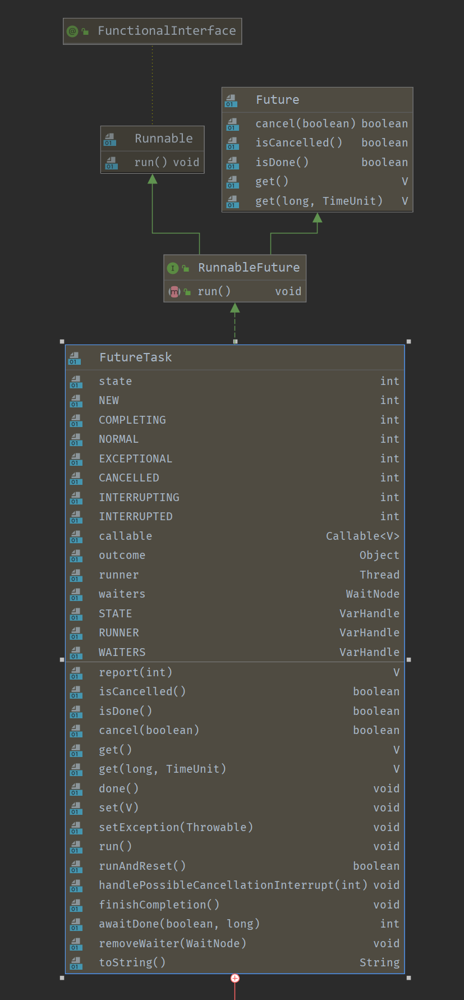

# Java Util Concurrent

## 基础概念

### 进程

> 进程是一个具有一定独立功能的程序关于某个数据集合的一次运行活动。它是操作系统动态执行的基本单元，在传统的操作系统中，进程既是基本的分配单元，也是基本的执行单元。

进程是一个操作系统运行的独立程序

### 线程

> 通常在一个进程中可以包含若干个线程，当然一个进程中至少有一个线程，不然没有存在的意义。线程可以利用进程所拥有的资源，在引入线程的操作系统中，通常都是把进程作为分配资源的基本单位，而把线程作为独立运行和独立调度的基本单位，由于线程比进程更小，基本上不拥有系统资源，故对它的调度所付出的开销就会小得多，能更高效的提高系统多个程序间并发执行的程度。

轻量级的进程，依附于某个进程，使用某个进程的系统资源

### 并发

如果某个系统支持两个或者多个动作（Action）同时**存在**，那么这个系统就是一个并发系统。
并发的关键是有处理多个任务的能力，**不一定要同时**。

### 并行

如果某个系统支持两个或者多个动作同时执行，那么这个系统就是一个**并行**系统。
并行的关键是有**同时**处理多个任务的能力。

### 并发与并行的区别


## 线程的虚假唤醒

在多线程交互的过程中，由于是否继续执行的判断只使用了 `if ()` 做了一次判断，所以会存在虚假唤醒错误线程的情况。

```java
class Cake {
    private int count = 0;

    public synchronized void increment() throws InterruptedException {
        if (count != 0) {
            wait();
        }
        count++;
        System.out.println(Thread.currentThread().getName() + " : " + count);
        notifyAll();
    }

    public synchronized void decrement() throws InterruptedException {
        if (count == 0) {
            wait();
        }
        count--;
        System.out.println(Thread.currentThread().getName() + " : " + count);
        notifyAll();
    }
}
```

若存在大于 2 个线程操作资源类，可能存在虚假唤醒的问题。
只要相邻 2 个被唤醒的线程是同一个操作，那么 `count` 将不再交替增减。因为在线程唤醒时，无法指定唤醒线程执行的操作，而线程在唤醒后直接进行增减操作，而没有再次进行判断，从而导致不再交替增减。并且存在死锁的可能(判断条件的问题)。

所以线程的唤醒需要使用 `while ()` 来作为判断的条件。

**synchronized 实现**：

```java
class Cake {
    private int count = 0;

    public synchronized void increment() throws InterruptedException {
        while (count > 0) {
            wait();
        }
        count++;
        System.out.println(Thread.currentThread().getName() + " : " + count);
        notifyAll();
    }

    public synchronized void decrement() throws InterruptedException {
        while (count <= 0) {
            wait();
        }
        count--;
        System.out.println(Thread.currentThread().getName() + " : " + count);
        notifyAll();
    }
}
```

**ReentrantLock 实现**：

```java
class DiffCake {
    private int count = 0;
    private final Lock lock = new ReentrantLock();
    private final Condition condition = lock.newCondition();

    public void increment() throws InterruptedException {
        lock.lock();
        try {
            while (this.count != 0) {
                condition.await();
            }
            System.out.println(Thread.currentThread().getName() + " count: " + ++count);
            condition.signalAll();
        } finally {
            lock.unlock();
        }
    }

    public void decrement() throws InterruptedException {
        lock.lock();
        try {
            while (this.count == 0) {
                condition.await();
            }
            System.out.println(Thread.currentThread().getName() + " count: " + --count);
            condition.signalAll();
        } finally {
            lock.unlock();
        }
    }
}
```

## 线程的精准顺序唤醒

```java
class Resource {
    private int number = 1; // 1:A 2:B 3:C
    private final Lock lock = new ReentrantLock();
    private final Condition condition1 = lock.newCondition();
    private final Condition condition2 = lock.newCondition();
    private final Condition condition3 = lock.newCondition();

    public void print5() {
        lock.lock();
        try {
            while (this.number != 1) {
                condition1.await();
            }
            for (int i = 0; i < 5; i++) {
                System.out.printf("%s : %s%n", Thread.currentThread().getName(), i);
            }
            number = 2;
            condition2.signal();
        } catch (Exception e) {
            e.printStackTrace();
        } finally {
            lock.unlock();
        }
    }

    public void print10() {
        lock.lock();
        try {
            while (this.number != 2) {
                condition2.await();
            }
            for (int i = 0; i < 10; i++) {
                System.out.printf("%s : %s%n", Thread.currentThread().getName(), i);
            }
            number = 3;
            condition3.signal();
        } catch (Exception e) {
            e.printStackTrace();
        } finally {
            lock.unlock();
        }
    }

    public void print15() {
        lock.lock();
        try {
            while (this.number != 3) {
                condition3.await();
            }
            for (int i = 0; i < 15; i++) {
                System.out.printf("%s : %s%n", Thread.currentThread().getName(), i);
            }
            number = 1;
            condition1.signal();
        } catch (Exception e) {
            e.printStackTrace();
        } finally {
            lock.unlock();
        }
    }
}
```

`number` 用于指定运行的线程，`signal()` 时指定线程唤醒，线程之间不再争抢锁

## 多线程锁的几种使用示例

### 1.同步方法

资源类：

```java
class LockResource {
    public synchronized void sendEmail() throws InterruptedException {
        System.out.println("email.....");
    }

    public synchronized void sendSMS() {
        System.out.println("SMS.....");
    }
}
```

线程启动类：

```java
public class EightLock {
    public static void main(String[] args) throws InterruptedException {
        LockResource resource = new LockResource();
        new Thread(() -> {
            try {
                resource.sendEmail();
            } catch (InterruptedException e) {
                e.printStackTrace();
            }
        }, "A").start();

        TimeUnit.MILLISECONDS.sleep(100L);

        new Thread(() -> {
            try {
                resource.sendSMS();
            } catch (Exception e) {
                e.printStackTrace();
            }
        }, "B").start();
    }
}
```

`TimeUnit.MILLISECONDS.sleep(100L);` 主线程在此阻塞 100 ms，以提高 `sendEmail()` 限制性的概率。
**运行结果**：email 先于 sms 打印
`sendEmail()` **A** 线程先进入运行状态(Running)（大概率），后 **B** 线程进入就绪状态(Runable)

### 2.sendEmail()暂停 4 秒

资源类：

```java
class LockResource {
    public synchronized void sendEmail() throws InterruptedException {
        TimeUnit.SECONDS.sleep(4L);
        System.out.println("email.....");
    }

    public synchronized void sendSMS() {
        System.out.println("SMS.....");
    }
}
```

线程启动类：

```java
public class EightLock {
    public static void main(String[] args) throws InterruptedException {
        LockResource resource = new LockResource();
        new Thread(() -> {
            try {
                resource.sendEmail();
            } catch (InterruptedException e) {
                e.printStackTrace();
            }
        }, "A").start();

        TimeUnit.MILLISECONDS.sleep(100L);

        new Thread(() -> {
            try {
                resource.sendSMS();
            } catch (Exception e) {
                e.printStackTrace();
            }
        }, "B").start();
    }
}
```

**运行结果**：email 先于 sms 打印
`sendEmail()` **A** 拿到 Lock 后，进入 Running 状态，随后 `Thread.sleep(4000)` 进入 Blocked 状态，但没有释放锁，当 Blocked 结束，打印 email，后释放锁，`sendSMS()` **B** 线程获得 Lock，然后打印 SMS

### 3.同步方法与普通方法

资源类：

```java
class LockResource {
    public synchronized void sendEmail() throws InterruptedException {
        TimeUnit.SECONDS.sleep(4L);
        System.out.println("email.....");
    }

    public void hello() {
        System.out.println("hello.....");
    }
}
```

线程启动类：

```java
public class EightLock {
    public static void main(String[] args) throws InterruptedException {
        LockResource resource = new LockResource();
        new Thread(() -> {
            try {
                resource.sendEmail();
            } catch (InterruptedException e) {
                e.printStackTrace();
            }
        }, "A").start();

        TimeUnit.MILLISECONDS.sleep(100L);

        new Thread(() -> {
            try {
                resource.hello();
            } catch (Exception e) {
                e.printStackTrace();
            }
        }, "B").start();
    }
}
```

**运行结果**：hello 先于 email 打印
`hello()` **B** 线程不需要获取 Lock，所以直接打印 hello，两个线程之间无锁关系

### 4.两个资源类

资源类：

```java
class LockResource {
    public synchronized void sendEmail() throws InterruptedException {
        TimeUnit.SECONDS.sleep(4L);
        System.out.println("email.....");
    }

    public synchronized void sendSMS() {
        System.out.println("SMS.....");
    }
}
```

线程启动类：

```java
public class EightLock {
    public static void main(String[] args) throws InterruptedException {
        LockResource resource = new LockResource();
        LockResource resource2 = new LockResource();
        new Thread(() -> {
            try {
                resource.sendEmail();
            } catch (InterruptedException e) {
                e.printStackTrace();
            }
        }, "A").start();

        TimeUnit.MILLISECONDS.sleep(100L);

        new Thread(() -> {
            try {
                resource2.sendSMS();
            } catch (Exception e) {
                e.printStackTrace();
            }
        }, "B").start();
    }
}
```

**运行结果**：sms 先于 email 打印
两个线程获取两个不同对象的锁，两个线程之间无锁关系，锁对象为 `resource` 和 `resource2`

### 5.两个静态同步方法，同一个资源类

资源类：

```java
class LockResource {
    public static synchronized void sendEmail() throws InterruptedException {
        TimeUnit.SECONDS.sleep(4L);
        System.out.println("email.....");
    }

    public static synchronized void sendSMS() {
        System.out.println("SMS.....");
    }
}
```

线程启动类：

```java
public class EightLock {
    public static void main(String[] args) throws InterruptedException {
        LockResource resource = new LockResource();
        new Thread(() -> {
            try {
                resource.sendEmail();
            } catch (InterruptedException e) {
                e.printStackTrace();
            }
        }, "A").start();

        TimeUnit.MILLISECONDS.sleep(100L);

        new Thread(() -> {
            try {
                resource.sendSMS();
            } catch (Exception e) {
                e.printStackTrace();
            }
        }, "B").start();
    }
}
```

**运行结果**：email 先于 sms 打印
两个线程获取同一个类的锁，**A** 线程先获得 Lock，Timed_waiting 后又不释放锁，所以 email 先于 sms 打印，与是否为同一资源类无关
锁对象为 `LockResource.class`

### 6.两个静态同步方法，两个资源类

**运行结果**：email 先于 sms 打印
同上，两个线程获取同一个类的锁，**A** 线程先获得 Lock，Timed_waiting 后又不释放锁，所以 email 先于 sms 打印，与是否为同一资源类无关
锁对象为 `LockResource.class`

### 7.一个同步方法，一个静态同步方法，一个资源类

**运行结果**：sms 先于 email 打印
锁对象为 `resource` `LockResource.class`，无锁关系

### 8.一个同步方法，一个静态同步方法，两个资源类

**运行结果**：sms 先于 email 打印
锁对象为 `resource` `LockResource.class`，无锁关系

## 锁相关总结

一个对象里如果有多个 `synchronized` 方法，某一时刻内，只要一个线程去调用其中的一个 `synchronized` 方法，那么其他的线程只能等待，即某一时刻内，只有**唯一一个**线程去访问这些 `synchronized` 方法。
锁的是当前对象 `this`，被锁定后，其他的线程都不能进入到当前对象的其他 `synchronized` 方法中。

普通的非同步方法不受 Lock 的影响。

若多个线程调用不同对象的同步方法，锁的是不同的对象。
所有非静态同步方法用的多是同一把锁——实例对象本身。
静态同步方法锁的是当前类的 `Class` 对象。

Java 中的**每个对象**都可以作为锁。
**普通同步方法**锁的是当前的**实例对象**。
**静态同步方法**锁的是当前类的 `Class` 对象
对于同步方法块，锁是 `synchronized` 括号里配置的对象

当一个线程试图访问同步代码块时，它首先必须得到锁，退出或抛出异常时必须释放锁。

也就是说如果一个实例对象的非静态同步方法获取锁后，该实例对象的其他非静态同步方法必须等待获取锁的方法释放锁后才能获取锁，可是别的实例对象的非静态同步方法因为跟该实例对象的非静态同步方法用的是不同的锁，所以无须等待该实例对象已获取锁的非静态同步方法释放锁就可以获取他们自己的锁。

所有的静态同步方法用的也是同一把锁——类对象本身，这两把锁是两个不同的对象，所以静态同步方法与非静态同步方法之间是不会有竞态条件的。

但是一旦一个静态同步方法获取锁后，其他的静态同步方法都必须等待该方法释放锁后才能获取锁，而不管是同一个实例对象的静态同步方法之间，还是不同的实例对象的静态同步方法之间，只要它们同一个类的实例对象！

## java.util.concurrent

> 高内聚低耦合的前提下，线程 操作 资源类
> 判断、干活、通知
> 多线程交互中，必须要防止多线程的虚假唤醒，也即（判断只用 while，不能用 if）
> 标志位
> PC 程序计数器

### 线程不安全集合

`ArrayList` `HashSet` `HashMap`

Demo:

```java
public static void main(String[] args) {
    List<String> list = new ArrayList<>();
    for (int i = 0; i < 200; i++) {
        new Thread(() -> {
            list.add(UUID.randomUUID().toString().substring(0, 8));
            System.out.println(list);
        }, String.valueOf(i)).start();
    }
}
```

### 线程安全集合

`CopyOnWriteArrayList` `CopyOnWriteHashSet` `ConcurrentHashMap`

前两者采用读写分离的思想实现

#### Vector(非 juc)

#### Collections.synchronizedList() (非 juc)

#### CopyOnWriteArrayList()

`CopyOnWrite` 容器即写时复制的容器。往一个容器添加元素的时候，不直接往当前容器Object[\]添加，而是先将当前容器Object[\]进行Copy，复制出一个新的容器Object[] newElements，然后向新的容器Object[] newElements里添加元素。
添加元素后，再将原容器的引用指向新的容器setArray(newElements)。
这样做的好处是可以对CopyOnWrite容器进行并发的读，而不需要加锁，因为当前容器不会添加任何元素。
所以CopyOnWrite容器也是一种读写分离的思想，读和写不同的容器。

source:

```java
public boolean add(E e) {
    synchronized (lock) {
        Object[] es = getArray();
        int len = es.length;
        es = Arrays.copyOf(es, len + 1);
        es[len] = e;
        setArray(es);
        return true;
    }
}
```

### Callable

- 与 `Runable` 的区别
  - `Callable` 有返回值
  - `Callable` 能够抛出异常
  - `Callable` 支持泛型，能够控制 `call()` 方法的返回值
  - `Callable` 需实现 `call()` 方法， `Runable` 需要实现 `run()` 方法
  - 需要 `FutureTask` 类来启动线程

- Demo:

```java
public class CallableDemo {
    public static void main(String[] args) throws ExecutionException, InterruptedException {
        FutureTask<Integer> integerFutureTask = new FutureTask<>(new CallableThread());
        new Thread(integerFutureTask, "A").start();
        System.out.println("integerFutureTask.get() = " + integerFutureTask.get());
    }

    static class CallableThread implements Callable<Integer> {
        @Override
        public Integer call() throws Exception {
            System.out.println("hello callable");
            return 2048;
        }
    }
}
```

#### FutureTask

- 一个继承了 `RunableFuture` 接口的实现类



通过 `get()` 方法获取 `Callable` `call()` 方法的返回值
`get()` 方法应放于主线程最后的位置，因为 `FutureTask.get()` 方法会阻塞调用的线程。
`Callable` 接口实现类里的 `call()` 方法只会被执行一次。

### CountDownLatch

A synchronization aid that allows one or more threads to wait until a set of operations being performed in other threads completes.

demo:

```java
public class CountDownLatchDemo {

    public static void main(String[] args) throws InterruptedException {

        CountDownLatch countDownLatch = new CountDownLatch(6);

        for (int i = 0; i < 6; i++) {
            new Thread(new Runnable() {
                @Override
                public void run() {
                    System.out.println(Thread.currentThread().getName() + "\t finish");
                    countDownLatch.countDown();
                    System.out.println("countDownLatch.getCount() = " + countDownLatch.getCount());
                }
            }, String.valueOf(i)).start();
        }

        countDownLatch.await();
        System.out.println(Thread.currentThread().getName() + "\t main finish");

    }

}
```

`countDownLatch.countDown` 使 `countDownLatch` 的计数减一。
`countDownLatch.await()` 在 **count** 不为 **0** 时，会阻塞当前线程。

### CyclicBarrier

A synchronization aid that allows a set of threads to all wait for each other to reach a common barrier point. CyclicBarriers are useful in programs involving a fixed sized party of threads that must occasionally wait for each other. The barrier is called cyclic because it can be re-used after the waiting threads are released.

**CyclicBarrier** 一个同步的辅助工具，可以使线程的集合全部等待这些线程都到达一个公共的障碍点后再继续执行。`CyclicBarrier` 对于程序执行一个固定大小的线程组，并且必须偶尔的等待其他线程，非常有用。这个阻碍点称为可循环的因为它可以被重用，在所有的等待线程被释放后。

A CyclicBarrier supports an optional Runnable command that is run once per barrier point, after the last thread in the party arrives, but before any threads are released. This barrier action is useful for updating shared-state before any of the parties continue.

CyclicBarrier 支持一个可选的 Runable 命令，每次所有线程都到达阻碍点后会被运行，在线程组里的最后一个线程到达阻碍点，在所有等待线程被释放前。这个阻碍动作(Runable)很有用，在更新共享的状态，在任何线程继续执行前。

demo:

```java
/**
 * CyclicBarrier 演示类
 *
 * @author DeltaV235
 * @version 1.0
 * @date 2020/11/8 17:22
 */
public class CyclicBarrierDemo {
    public static void main(String[] args) {
        CyclicBarrier cyclicBarrier = new CyclicBarrier(6, new Runnable() {
            @Override
            public void run() {
                System.out.println("total count has arrive threshold");
            }
        });

        for (int i = 0; i < 6; i++) {
            final int temp = i;
            new Thread(new Runnable() {
                @Override
                public void run() {
                    for (int j = 0; j < 3; j++) {
                        System.out.println(Thread.currentThread().getName() + "\t" + temp);
                        try {
                            cyclicBarrier.await();
                            System.out.println(Thread.currentThread().getName() + "\twaiting finish");
                        } catch (InterruptedException e) {
                            e.printStackTrace();
                        } catch (BrokenBarrierException e) {
                            e.printStackTrace();
                        }
                    }
                }
            }, String.valueOf(i)).start();
        }
    }
}
```

- Constructor
  - **CyclicBarrier(int parties, Runnable barrierAction)**
  Creates a new CyclicBarrier that will trip when the given number of parties (threads) are waiting upon it, and which will execute the given barrier action when the barrier is tripped, performed by the last thread entering the barrier.

- Method
  - **await()**
  Waits until all parties have invoked await on this barrier.
    - Returns:
    the arrival index of the current thread, where index getParties() - 1 indicates the first to arrive and zero indicates the last to arrive
    - Throws:
      - InterruptedException - if the current thread was interrupted while waiting
      - BrokenBarrierException - if another thread was interrupted or timed out while the current thread was waiting, or the barrier was reset, or the barrier was broken when await was called, or the barrier action (if present) failed due to an exception
  - **await(long timeout, TimeUnit unit)**
  Waits until all parties have invoked await on this barrier, or the specified waiting time elapses.

### Semaphore

A counting semaphore. Conceptually, a semaphore maintains a set of permits. Each acquire() blocks if necessary until a permit is available, and then takes it. Each release() adds a permit, potentially releasing a blocking acquirer. However, no actual permit objects are used; the Semaphore just keeps a count of the number available and acts accordingly.

Semaphores are often used to restrict the number of threads than can access some (physical or logical) resource.

demo:

```java
/**
 * Semaphore 信号量 示例代码
 *
 * @author DeltaV235
 * @version 1.0
 * @date 2020/11/8 18:33
 */
public class SemaphoreDemo {
    public static void main(String[] args) {
        Semaphore semaphore = new Semaphore(3);
        for (int i = 0; i < 6; i++) {
            new Thread(() -> {
                try {
                    semaphore.acquire();
                    System.out.println(Thread.currentThread().getName() + "\tget semaphore");
                    TimeUnit.SECONDS.sleep(new Random().nextInt(10));
                    System.out.println(Thread.currentThread().getName() + "\trelease semaphore");
                } catch (InterruptedException e) {
                    e.printStackTrace();
                } finally {
                    semaphore.release();
                }
            }).start();
        }
    }
}
```

- **void acquire()**
  - Acquires a permit from this semaphore, blocking until one is available, or the thread is interrupted.
- **void acquire(int permits)**
  - Acquires the **given number** of permits from this semaphore, blocking until all are available, or the thread is interrupted.
- **void release()**
  - Releases a permit, returning it to the semaphore.
- **void release(int permits)**
  - Releases the **given number** of permits, returning them to the semaphore.

`new Semaphore(1)` <==> `new ReentrantLock()`

### ReadWriteLock

- 读写锁
  - 读读不互斥
  - 读写互斥
  - 写写互斥

demo:

```java
/**
 * ReentrantReadWriteLock 示例类
 *
 * @author DeltaV235
 * @version 1.0
 * @date 2020/11/8 20:58
 */
public class ReadWriteLockDemo {
    public static void main(String[] args) {
        Cache cache = new Cache();
        // write threads
        for (int i = 0; i < 5; i++) {
            final int temp = i;
            new Thread(() -> {
                cache.put("key" + temp, temp);
            }).start();
        }

        // read threads
        for (int i = 0; i < 5; i++) {
            final int temp = i;
            new Thread(() -> {
                Object value = cache.get("key" + temp);
                System.out.println("value = " + value);
            }).start();
        }
    }

    static class Cache {
        ReadWriteLock readWriteLock = new ReentrantReadWriteLock();
        Lock lock = new ReentrantLock();
        private Map<String, Object> map = new HashMap<>();

        public void put(String key, Object element) {
            readWriteLock.writeLock().lock();
//            lock.lock();
            try {
                System.out.println(Thread.currentThread().getName() + "\twrite start\t" + element);
                map.put(key, element);
                System.out.println(Thread.currentThread().getName() + "\twrite finish\t" + element);
            } finally {
                readWriteLock.writeLock().unlock();
//                lock.unlock();
            }

        }

        public Object get(String key) {
            readWriteLock.readLock().lock();
//            lock.lock();
            try {
                System.out.println(Thread.currentThread().getName() + "\tread start\t" + key);
                Object retVal = map.get(key);
                System.out.println(Thread.currentThread().getName() + "\tread finish\t" + key);
                return retVal;
            } finally {
                readWriteLock.readLock().unlock();
//                lock.unlock();
            }

        }
    }
}
```

在使用 `ReadWriteLock` 时，输出结果中，读写操作交替出现，写操作的开始和完成在相邻的输出语句完成，读操作并发出现，但读写不交叉。

output:

```java
Thread-9    read start  key4
Thread-8    read start  key3
Thread-9    read finish  key4
Thread-8    read finish  key3
Thread-3    write start  3
Thread-3    write finish  3
Thread-1    write start  1
Thread-1    write finish  1
Thread-4    write start  4
Thread-4    write finish  4
Thread-6    read start  key1
Thread-6    read finish  key1
Thread-0    write start  0
Thread-0    write finish  0
Thread-2    write start  2
Thread-2    write finish  2
Thread-7    read start  key2
Thread-7    read finish  key2
value = 2
value = null
Thread-5    read start  key0
Thread-5    read finish  key0
value = 0
value = 1
value = null
```

在使用 `Lock` 使，读写交替出现，但写操作不存在并发执行。

### BlockingQueue

阻塞队列


- 当队列是空的，从队列中获取元素的操作将会被阻塞
- 当队列是满的，从队列中添加元素的操作将会被阻塞
- 试图从空的队列中获取元素的线程将会被阻塞，直到其他线程往空的队列插入新的元素
- 试图向已满的队列中添加新元素的线程将会被阻塞，直到其他线程从队列中移除一个或多个元素或者完全清空，使队列变得空闲起来并后续新增

我们不需要关心什么时候需要阻塞线程，什么时候需要唤醒线程，因为这一切BlockingQueue都一手包办了

| 方法类型 | 抛出异常  |  特殊值  |  阻塞  |         超时         |
| :------: | :-------: | :------: | :----: | :------------------: |
|   插入   |  add(e)   | offer(e) | put(e) | offer(e, time, unit) |
|   移除   | remove()  |  poll()  | take() |   poll(time, unit)   |
|   检查   | element() |  peek()  | 不可用 |        不可用        |

| 类型     | 队列为空或满时执行的动作                                     |
| :------- | :----------------------------------------------------------- |
| 抛出异常 | 当阻塞队列满时，再往队列里add插入元素会抛 IllegalStateException:Queue full;当阻塞队列空时，再往队列里remove移除元素会抛 NoSuchElementException |
| 特殊值   | 插入方法，成功ture失败falses;移除方法，成功返回出队列的元素，队列里没有就返回null |
| 一直阻塞 | 当阻塞队列满时，生产者线程继续往队列里put元素，队列会一直阻塞生产者线程直到put数据or响应中断退出;当阻塞队列空时，消费者线程试图从队列里take元素，队列会一直阻塞消费者线程直到队列可用 |
| 超时退出 | 当阻塞队列满时，队列会阻塞生产者线程一定时间，超过限时后生产者线程会退出 |

**demo**:

- add()

```java
public class BlockingQueueDemo {

    public static void main(String[] args) {
        BlockingQueue<String> blockingQueue = new ArrayBlockingQueue<>(3);

        System.out.println("blockingQueue.add(\"a\") = " + blockingQueue.add("a"));
        System.out.println("blockingQueue.add(\"b\") = " + blockingQueue.add("b"));
        System.out.println("blockingQueue.add(\"c\") = " + blockingQueue.add("c"));
        System.out.println("blockingQueue.add(\"d\") = " + blockingQueue.add("d"));

    }
}
```

- output

```java
blockingQueue.add("a") = true
blockingQueue.add("b") = true
blockingQueue.add("c") = true
Exception in thread "main" java.lang.IllegalStateException: Queue full
    at java.base/java.util.AbstractQueue.add(AbstractQueue.java:98)
    at java.base/java.util.concurrent.ArrayBlockingQueue.add(ArrayBlockingQueue.java:326)
    at com.wuyue.BlockingQueueDemo.main(BlockingQueueDemo.java:21
```

---

- remove()

```java
public class BlockingQueueDemo {

    public static void main(String[] args) {
        BlockingQueue<String> blockingQueue = new ArrayBlockingQueue<>(3);

        System.out.println("blockingQueue.add(\"a\") = " + blockingQueue.add("a"));
        System.out.println("blockingQueue.add(\"b\") = " + blockingQueue.add("b"));
        System.out.println("blockingQueue.add(\"c\") = " + blockingQueue.add("c"));

        System.out.println("blockingQueue.remove() = " + blockingQueue.remove());
        System.out.println("blockingQueue.remove() = " + blockingQueue.remove());
        System.out.println("blockingQueue.remove() = " + blockingQueue.remove());
        System.out.println("blockingQueue.remove() = " + blockingQueue.remove());
    }
}
```

- output

```java
blockingQueue.add("a") = true
blockingQueue.add("b") = true
blockingQueue.add("c") = true
blockingQueue.remove() = a
blockingQueue.remove() = b
blockingQueue.remove() = c
Exception in thread "main" java.util.NoSuchElementException
    at java.base/java.util.AbstractQueue.remove(AbstractQueue.java:117)
    at com.wuyue.BlockingQueueDemo.main(BlockingQueueDemo.java:25)
```

---

- element()

```java
public class BlockingQueueDemo {
    public static void main(String[] args) {
        BlockingQueue<String> blockingQueue = new ArrayBlockingQueue<>(3);

        System.out.println("blockingQueue.add(\"a\") = " + blockingQueue.add("a"));
        System.out.println("blockingQueue.add(\"b\") = " + blockingQueue.add("b"));
        System.out.println("blockingQueue.add(\"c\") = " + blockingQueue.add("c"));
        System.out.println("blockingQueue.element() = " + blockingQueue.element());
    }
}
```

- output

```java
blockingQueue.add("a") = true
blockingQueue.add("b") = true
blockingQueue.add("c") = true
blockingQueue.element() = a
```

---

- offer(e)

```java
public class BlockingQueueDemo {
    public static void main(String[] args) {
        BlockingQueue<String> blockingQueue = new ArrayBlockingQueue<>(3);

        System.out.println("blockingQueue.offer(\"a\") = " + blockingQueue.offer("a"));
        System.out.println("blockingQueue.offer(\"b\") = " + blockingQueue.offer("b"));
        System.out.println("blockingQueue.offer(\"c\") = " + blockingQueue.offer("c"));
        System.out.println("blockingQueue.offer(\"d\") = " + blockingQueue.offer("d"));
    }
}
```

- output

```java
blockingQueue.offer("a") = true
blockingQueue.offer("b") = true
blockingQueue.offer("c") = true
blockingQueue.offer("d") = false
```

---

- poll() & peek()

```java
public class BlockingQueueDemo {
    public static void main(String[] args) {
        BlockingQueue<String> blockingQueue = new ArrayBlockingQueue<>(3);

        System.out.println("blockingQueue.offer(\"a\") = " + blockingQueue.offer("a"));
        System.out.println("blockingQueue.offer(\"b\") = " + blockingQueue.offer("b"));
        System.out.println("blockingQueue.offer(\"c\") = " + blockingQueue.offer("c"));

        System.out.println("blockingQueue.peek() = " + blockingQueue.peek());

        System.out.println("blockingQueue.poll() = " + blockingQueue.poll());
        System.out.println("blockingQueue.poll() = " + blockingQueue.poll());
        System.out.println("blockingQueue.poll() = " + blockingQueue.poll());
        System.out.println("blockingQueue.poll() = " + blockingQueue.poll());
    }
}
```

- output

```java
blockingQueue.offer("a") = true
blockingQueue.offer("b") = true
blockingQueue.offer("c") = true
blockingQueue.peek() = a
blockingQueue.poll() = a
blockingQueue.poll() = b
blockingQueue.poll() = c
blockingQueue.poll() = null
```

---

- put(e)

```java
public class BlockingQueueDemo {
    public static void main(String[] args) throws InterruptedException {
        BlockingQueue<String> blockingQueue = new ArrayBlockingQueue<>(3);

        blockingQueue.put("a");
        blockingQueue.put("a");
        blockingQueue.put("a");
        blockingQueue.put("a");
    }
}
```

- output

程序阻塞，`take()` 同理

---

- offer(e, time, unit)
- 阻塞指定时间后，若队列仍满，则返回false，继续执行程序，`poll(time, unit)` 同理

### 线程池

线程池的作用：

1. 线程复用
2. 控制最大并发数
3. 管理线程

#### 继承结构


#### 线程池的创建

```java

```

#### 几种常见的线程池

**1.Executors.newFixedThreadPool**
执行长期任务性能好，创建一个线程池，一池有N个固定的线程，有固定线程数的线程

```java
ExecutorService executorService = Executors.newFixedThreadPool(10);
```

方法签名：

```java
/**
 * Creates a thread pool that reuses a fixed number of threads
 * operating off a shared unbounded queue.  At any point, at most
 * {@code nThreads} threads will be active processing tasks.
 * If additional tasks are submitted when all threads are active,
 * they will wait in the queue until a thread is available.
 * If any thread terminates due to a failure during execution
 * prior to shutdown, a new one will take its place if needed to
 * execute subsequent tasks.  The threads in the pool will exist
 * until it is explicitly {@link ExecutorService#shutdown shutdown}.
 *
 * @param nThreads the number of threads in the pool
 * @return the newly created thread pool
 * @throws IllegalArgumentException if {@code nThreads <= 0}
 */
public static ExecutorService newFixedThreadPool(int nThreads) {
    return new ThreadPoolExecutor(nThreads, nThreads,
                                  0L, TimeUnit.MILLISECONDS,
                                  new LinkedBlockingQueue<Runnable>());
}
```

newFixedThreadPool创建的线程池corePoolSize和maximumPoolSize值是相等的，它使用的是LinkedBlockingQueue

**2.Executor.newSingleThreadExecutor**
一个任务一个任务的执行，一池一线程

```java
ExecutorService executorService1 = Executors.newSingleThreadExecutor();
```

```java
/**
 * Creates an Executor that uses a single worker thread operating
 * off an unbounded queue. (Note however that if this single
 * thread terminates due to a failure during execution prior to
 * shutdown, a new one will take its place if needed to execute
 * subsequent tasks.)  Tasks are guaranteed to execute
 * sequentially, and no more than one task will be active at any
 * given time. Unlike the otherwise equivalent
 * {@code newFixedThreadPool(1)} the returned executor is
 * guaranteed not to be reconfigurable to use additional threads.
 *
 * @return the newly created single-threaded Executor
 */
public static ExecutorService newSingleThreadExecutor() {
    return new FinalizableDelegatedExecutorService
        (new ThreadPoolExecutor(1, 1,
                                0L, TimeUnit.MILLISECONDS,
                                new LinkedBlockingQueue<Runnable>()));
}
```

newSingleThreadExecutor 创建的线程池corePoolSize和maximumPoolSize值都是1，它使用的是LinkedBlockingQueue

**3.Executors.newCachedThreadPool**
执行很多短期异步任务，线程池根据需要创建新线程，但在先前构建的线程可用时将重用它们。可扩容，遇强则强

```java
ExecutorService executorService2 = Executors.newCachedThreadPool();
```

```java
/**
 * Creates a thread pool that creates new threads as needed, but
 * will reuse previously constructed threads when they are
 * available.  These pools will typically improve the performance
 * of programs that execute many short-lived asynchronous tasks.
 * Calls to {@code execute} will reuse previously constructed
 * threads if available. If no existing thread is available, a new
 * thread will be created and added to the pool. Threads that have
 * not been used for sixty seconds are terminated and removed from
 * the cache. Thus, a pool that remains idle for long enough will
 * not consume any resources. Note that pools with similar
 * properties but different details (for example, timeout parameters)
 * may be created using {@link ThreadPoolExecutor} constructors.
 *
 * @return the newly created thread pool
 */
public static ExecutorService newCachedThreadPool() {
    return new ThreadPoolExecutor(0, Integer.MAX_VALUE,
                                  60L, TimeUnit.SECONDS,
                                  new SynchronousQueue<Runnable>());
}
```

newCachedThreadPool创建的线程池将corePoolSize设置为0，将maximumPoolSize设置为Integer.MAX_VALUE，它使用的是SynchronousQueue，也就是说来了任务就创建线程运行，当线程空闲超过60秒，就销毁线程。

#### 线程池的7个参数

```java
/**
 * Creates a new {@code ThreadPoolExecutor} with the given initial
 * parameters.
 *
 * @param corePoolSize the number of threads to keep in the pool, even
 *        if they are idle, unless {@code allowCoreThreadTimeOut} is set
 * @param maximumPoolSize the maximum number of threads to allow in the
 *        pool
 * @param keepAliveTime when the number of threads is greater than
 *        the core, this is the maximum time that excess idle threads
 *        will wait for new tasks before terminating.
 * @param unit the time unit for the {@code keepAliveTime} argument
 * @param workQueue the queue to use for holding tasks before they are
 *        executed.  This queue will hold only the {@code Runnable}
 *        tasks submitted by the {@code execute} method.
 * @param threadFactory the factory to use when the executor
 *        creates a new thread
 * @param handler the handler to use when execution is blocked
 *        because the thread bounds and queue capacities are reached
 * @throws IllegalArgumentException if one of the following holds:<br>
 *         {@code corePoolSize < 0}<br>
 *         {@code keepAliveTime < 0}<br>
 *         {@code maximumPoolSize <= 0}<br>
 *         {@code maximumPoolSize < corePoolSize}
 * @throws NullPointerException if {@code workQueue}
 *         or {@code threadFactory} or {@code handler} is null
 */
public ThreadPoolExecutor(int corePoolSize,
                          int maximumPoolSize,
                          long keepAliveTime,
                          TimeUnit unit,
                          BlockingQueue<Runnable> workQueue,
                          ThreadFactory threadFactory,
                          RejectedExecutionHandler handler) {
    if (corePoolSize < 0 ||
        maximumPoolSize <= 0 ||
        maximumPoolSize < corePoolSize ||
        keepAliveTime < 0)
        throw new IllegalArgumentException();
    if (workQueue == null || threadFactory == null || handler == null)
        throw new NullPointerException();
    this.corePoolSize = corePoolSize;
    this.maximumPoolSize = maximumPoolSize;
    this.workQueue = workQueue;
    this.keepAliveTime = unit.toNanos(keepAliveTime);
    this.threadFactory = threadFactory;
    this.handler = handler;
}
```

**1.corePoolSize**
线程池中的常驻核心线程数

**2.maximumPoolSize**
线程池中能够容纳同时执行的最大线程数，此值必须大于等于1

**3.keepAliveTime**
多余的空闲线程的存活时间

当前池中线程数量超过 **corePoolSize** 时，当空闲时间达到 **keepAliveTime** 时，多余线程会被销毁直到只剩下 **corePoolSize** 个线程为止

**4.unit**
keepAliveTime的单位

**5.workQueue**
任务队列，被提交但尚未被执行的任务

**6.threadFactory**
表示生成线程池中工作线程的线程工厂，用于创建线程，一般默认的即可

**7.handler**
拒绝策略，表示当队列满了，并且工作线程大于等于线程池的最大线程数（**maximumPoolSize**）时如何来拒绝请求执行的 runnable 的策略

#### 线程池的任务运行流程

1. 在创建了线程池后，开始等待请求。
2. 当调用 **execute()** 方法添加一个请求任务时，线程池会做出如下判断：
    (1) 如果正在运行的线程数量小于 **corePoolSize**，那么马上创建线程运行这个任务；
    (2) 如果正在运行的线程数量大于或等于 **corePoolSize**，那么将这个任务放入**队列**；
    (3) 如果这个时候队列满了且正在运行的线程数量还小于 **maximumPoolSize**，那么还是要创建非核心线程立刻运行这个任务；
    (4) 如果队列满了且正在运行的线程数量大于或等于 **maximumPoolSize**，那么线程池会启动饱和**拒绝策略**来执行。
3. 当一个线程完成任务时，它会从队列中取下一个任务来执行。
4. 当一个线程无事可做超过一定的时间（**keepAliveTime**）时，线程会判断：
    如果当前运行的线程数大于 **corePoolSize**，那么这个线程就被停掉。
    所以线程池的所有任务完成后，它最终会收缩到 **corePoolSize** 的大小。

执行流程如下所示：


#### 拒绝策略

等待队列已经满，同时线程池中的活动线程数已经达到了 **maximumPoolSize**，无法继续为新任务服务。
这个时候拒绝策略就会被触发。

##### JDK 内置的拒绝策略

**AbortPolicy** (Default)
直接抛出 **RejectedExecutionException** 异常阻止系统正常运行

**CallerRunsPolicy**
“调用者运行”一种调节机制，该策略既不会抛弃任务，也不会抛出异常，而是将某些任务回退到调用者，从而降低新任务的流量。

**DiscardOldestPolicy**
抛弃队列中等待最久的任务，然后把当前任务加入队列中，尝试再次提交当前任务。

**DiscardPolicy**
该策略默默地丢弃无法处理的任务，不予任何处理也不抛出异常。如果允许任务丢失，这是最好的一种策略。

以上内置拒绝策略均实现了 **RejectedExecutionHandle** 接口

### Exception

#### java.util.ConcurrentModificationException

```java
Exception in thread "0" java.util.ConcurrentModificationException
    at java.base/java.util.ArrayList$Itr.checkForComodification(ArrayList.java:1043)
    at java.base/java.util.ArrayList$Itr.next(ArrayList.java:997)
    at java.base/java.util.AbstractCollection.toString(AbstractCollection.java:472)
    at java.base/java.lang.String.valueOf(String.java:2951)
    at java.base/java.io.PrintStream.println(PrintStream.java:897)
    at com.wuyue.NotSafeListDemo.lambda$main$0(NotSafeListDemo.java:20)
    at java.base/java.lang.Thread.run(Thread.java:834)
```

### java.util.concurrent.TimeUnit

一个用于转换时间单位，阻塞线程指定时间的枚举类

```java
TimeUnit.SECONDS.sleep(4);
```

<==>

```java
Thread.sleep(4 * 1000);
```

### java.util.concurrent.lock

#### Lock

#### ReentrantLock

可重入锁

```java
lock.lock();
try {
    if (this.count > 0) {
        System.out.printf("%s:\t卖出第 %d 张\t还剩 %d 张%n", Thread.currentThread().getName(), count--, count);
    }
} finally {
    lock.unlock();
}
```

`ReentrantLock`要放在 `try-catch-finally` 块外。

> 在使用阻塞等待获取锁的方式中，必须在 try 代码块之外，并且在加锁方法与 try 代码块之间没有任何可能抛出异常的方法调用，避免加锁成功后，在 finally 中无法解锁。
> 说明一：如果在 lock 方法与 try 代码块之间的方法调用抛出异常，那么无法解锁，造成其它线程无法成功获取锁。
> 说明二：如果 lock 方法在 try 代码块之内，可能由于其它方法抛出异常，导致在 finally 代码块中，unlock 对未加锁的对象解锁，它会调用 AQS 的 tryRelease 方法（取决于具体实现类），抛出 IllegalMonitorStateException 异常。
> 说明三：在 Lock 对象的 lock 方法实现中可能抛出 unchecked 异常，产生的后果与说明二相同。
