# Principles of Concurrent Programming

## ThreadLocal Principle

Please refer to *P40*.

Each **Thread** object has two instance fields.

## Principles of LongAccumulator

下文中的 *slot* 值 **Striped64** 中 *cells[]* 数据的元素。

### LongAccumulator.java

```java
// accumulate function decide how to accumulate old value and new value
private final LongBinaryOperator function;

// the identity value equivalent to superclass instance field base.
// In the constructor as a parameter passed into the member variable of the parent class
private final long identity;

/**
 * Creates a new instance using the given accumulator function
 * and identity element.
 * @param accumulatorFunction a side-effect-free function of two arguments
 * @param identity identity (initial value) for the accumulator function
 */
public LongAccumulator(LongBinaryOperator accumulatorFunction,
                        long identity) {
    // input two arguments
    // first one is accumulation method
    this.function = accumulatorFunction;
    // 父类的 base 变量的值会被赋值为 identity 的值
    base = this.identity = identity;
}

/**
 * Updates with the given value.
 *
 * @param x the value
 */
// 执行累加的方法
public void accumulate(long x) {
    Cell[] as; long b, v, r; int m; Cell a;
    // 若父类 Striped64 的 cells[] 已经被实例化，则直接执行 cell 的 cas()
    if ((as = cells) != null ||
        // 若 cells[] 未被初始化
        // 若累加后的值和原值一致，则不进行任何操作
        // 尝试对 base 进行 cas()，若失败则执行代码块
        (r = function.applyAsLong(b = base, x)) != b && !casBase(b, r)) {
        // 初始状态的“未发生竞争”为 true
        boolean uncontended = true;
        // cells 未初始化，则执行 longAccumulate() 进行初始化
        if (as == null || (m = as.length - 1) < 0 ||
            // cells 已初始化，若当前线程的 slot 未初始化，则执行 longAccumulate()，初始化对应的 slot
            (a = as[getProbe() & m]) == null ||
            // cells 以及 slot 已初始化，在累加结果与 slot 中的值不一致时，尝试对 slot 进行 cas，若 cas 成功，则该次累加结束
            // 否则执行 longAccumulate()，并且 uncontended = false，表示在执行 cells 扩容前已经发生了竞争(cells 和 slot 存在，那该判断成立的情况下，longAccumulate() 方法只能执行扩容或 rehashed threadLocalRandomProbe 后重新 cas 或直接在 base 中 cas)
            !(uncontended =
                (r = function.applyAsLong(v = a.value, x)) == v ||
                a.cas(v, r)))
            // 执行 cells 初始化、slot 初始化、cells 扩容、rehasded、重新 slot cas、base case 的操作
            longAccumulate(x, function, uncontended);
    }
}
```

**总结**：

- 若累加后的值与 `base` 相同，则不做任何操作，方法结束
  - 若 `cells[]` 为 null，则尝试对 `base` 进行 cas，若成功则结束该次累加操作
    - 若 casBase 失败，若 `cells[]` 及 `slot` 已完成初始化，则尝试 casCell
      - 若累加后的值与 `slot` 的值一致，则结束操作
      - 否则
        - 若 cas 成功，则累加结束
        - 若 cas 失败，则 call `longAccumulate()`，来扩容 `cells[]` 或重新尝试 `casCell` 和 `casBase`，并且 `uncontended = false`，表示在 call `longAccumulate()` 前 `casCell` 时发生的冲突
    - 若 casBase 失败，`cells[]` 未初始化 或 `slot` 未初始化，则执行 `longAccumulate()` 初始化 `slot`

### Striped64.java

```java
/**
 * Padded variant of AtomicLong supporting only raw accesses plus CAS.
 *
 * JVM intrinsics note: It would be possible to use a release-only
 * form of CAS here, if it were provided.
 */
// cells 的元素
@sun.misc.Contended static final class Cell {
    // volatile 修饰，使每个线程中的该变量都能及时的更新，而非从缓存中读取旧值
    volatile long value;
    Cell(long x) { value = x; }
    final boolean cas(long cmp, long val) {
        // 使用 UNSAFE.casLong 安全替换 value 的值
        return UNSAFE.compareAndSwapLong(this, valueOffset, cmp, val);
    }

    // Unsafe mechanics
    private static final sun.misc.Unsafe UNSAFE;
    // value 在 Cell 类中的内存偏移量
    private static final long valueOffset;
    static {
        try {
            // 获取 UNSAFE 实例
            UNSAFE = sun.misc.Unsafe.getUnsafe();
            Class<?> ak = Cell.class;
            // 获取 value 在 Cell 中的内存偏移量
            valueOffset = UNSAFE.objectFieldOffset
                (ak.getDeclaredField("value"));
        } catch (Exception e) {
            throw new Error(e);
        }
    }
}

/** Number of CPUS, to place bound on table size */
static final int NCPU = Runtime.getRuntime().availableProcessors();

/**
 * Table of cells. When non-null, size is a power of 2.
 */
transient volatile Cell[] cells;

/**
 * Base value, used mainly when there is no contention, but also as
 * a fallback during table initialization races. Updated via CAS.
 */
transient volatile long base;

/**
 * Spinlock (locked via CAS) used when resizing and/or creating Cells.
 */
transient volatile int cellsBusy;

/**
 * Package-private default constructor
 */
Striped64() {
}

/**
 * CASes the base field.
 */
final boolean casBase(long cmp, long val) {
    return UNSAFE.compareAndSwapLong(this, BASE, cmp, val);
}

/**
 * CASes the cellsBusy field from 0 to 1 to acquire lock.
 */
final boolean casCellsBusy() {
    return UNSAFE.compareAndSwapInt(this, CELLSBUSY, 0, 1);
}

/**
 * Returns the probe value for the current thread.
 * Duplicated from ThreadLocalRandom because of packaging restrictions.
 */
// 获取当前线程中的 threadLocalRandomProbe
static final int getProbe() {
    return UNSAFE.getInt(Thread.currentThread(), PROBE);
}

/**
 * Pseudo-randomly advances and records the given probe value for the
 * given thread.
 * Duplicated from ThreadLocalRandom because of packaging restrictions.
 */
// 伪随机一个新的 threadLocalRandomProbe 并设置回当前线程
static final int advanceProbe(int probe) {
    probe ^= probe << 13;   // xorshift
    probe ^= probe >>> 17;
    probe ^= probe << 5;
    UNSAFE.putInt(Thread.currentThread(), PROBE, probe);
    return probe;
}

/**
 * Handles cases of updates involving initialization, resizing,
 * creating new Cells, and/or contention. See above for
 * explanation. This method suffers the usual non-modularity
 * problems of optimistic retry code, relying on rechecked sets of
 * reads.
 *
 * @param x the value
 * @param fn the update function, or null for add (this convention
 * avoids the need for an extra field or function in LongAdder).
 * @param wasUncontended false if CAS failed before call
 */
 // rehash & new cells[] & new Cell & casCell & casBase & expand cells[]
 // 在 casCell 有冲突的情况下，先 rehash，再重新 casCell，即对不同的 slot 进行 casCell
final void longAccumulate(long x, LongBinaryOperator fn,
                            boolean wasUncontended) {
    int h;
    // 若当前线程未初始化 threadLocalProbe，则先初始化该变量
    if ((h = getProbe()) == 0) {
        ThreadLocalRandom.current(); // force initialization
        h = getProbe();
        wasUncontended = true;
    }
    boolean collide = false;                // True if last slot nonempty slot 非空时为 true
    // 循环直到 accumulate 成功
    for (;;) {
        Cell[] as; Cell a; int n; long v;
        // 1.cells 不为 null，即 cells[] 已初始化；且 cells[] 长度 > 0，即 至少一个 slot 已初始化
        // summary: 初始化 slot
        if ((as = cells) != null && (n = as.length) > 0) {
            // (1)判断 slot 是否为 null
            if ((a = as[(n - 1) & h]) == null) {
                // 判断是否加锁
                if (cellsBusy == 0) {       // Try to attach new Cell
                    // 实例化 slot，并赋值
                    Cell r = new Cell(x);   // Optimistically create
                    // 加锁
                    if (cellsBusy == 0 && casCellsBusy()) {
                        boolean created = false;
                        try {               // Recheck under lock
                            Cell[] rs; int m, j;
                            // 判断 cells 已初始化，对应 slot 未被初始化
                            if ((rs = cells) != null &&
                                (m = rs.length) > 0 &&
                                rs[j = (m - 1) & h] == null) {
                                // 更新 cells 数组元素引用
                                rs[j] = r;
                                created = true;
                            }
                        } finally {
                            cellsBusy = 0;
                        }
                        if (created)
                            break;
                        // slot 已被初始化
                        continue;           // Slot is now non-empty
                    }
                }
                // 初始化 slot 后不立即进行 cells[] 的扩容
                collide = false;
            }
            // (2)在调用 longAccumulate 前，对 slot cas 已经发生了冲突 Continue after rehash，rehash & casCell 依旧失败才会尝试 cells[] 扩容
            else if (!wasUncontended)       // CAS already known to fail
                wasUncontended = true;      // Continue after rehash
            // (4)对 slot cas，成功则结束 accumulate 操作
            else if (a.cas(v = a.value, ((fn == null) ? v + x :
                                            fn.applyAsLong(v, x))))
                break;
            // (5)若 slot 数量大于等于 逻辑 CPU 的数量，则永不扩容 cells[]。或 cells 已扩容，不再执行下方的扩容
            else if (n >= NCPU || cells != as)
                collide = false;            // At max size or stale
            // 防止进行两次连续的 cells 扩容
            else if (!collide)
                collide = true;
            // (6)扩容 cells，cellBusy 加锁
            else if (cellsBusy == 0 && casCellsBusy()) {
                try {
                    // 加锁后，cells 未发生扩容在其他线程中
                    if (cells == as) {      // Expand table unless stale
                        // new 新的 Cell 数组
                        Cell[] rs = new Cell[n << 1];
                        // 迁移旧数组中的 Cell 对象到新数组中
                        for (int i = 0; i < n; ++i)
                            rs[i] = as[i];
                        // this.cells 更新引用地址
                        cells = rs;
                    }
                } finally {
                    // 解锁
                    cellsBusy = 0;
                }
                // 进行 2 次 casCell 失败才会继续扩容
                collide = false;
                continue;                   // Retry with expanded table
            }
            // (3)重新设置当前线程的 threadLocalProbe，rehashed
            h = advanceProbe(h);
        }
        // 2.否则实例化 cells[] 以及 slot
        // 3.判断 cellsBusy 是否加锁 && cells[] 未被其他线程实例化（若 cells[] 被其他线程实例化，则 cells != as） && cellsBusy CAS 加锁成功
        else if (cellsBusy == 0 && cells == as && casCellsBusy()) {
            // 该次初始化成功标志位
            boolean init = false;
            try {                           // Initialize table
                // Double check，确保在 cellsBusy 加锁后，cells[] 仍未被实例化 <==> cells == null，或未发生数组扩容
                if (cells == as) {
                    // 实例化 Cell 数组
                    Cell[] rs = new Cell[2];
                    // 实例化当前 slot，并将 value 赋值
                    // h & 1 <==> threadLocalProbe & cells.length
                    rs[h & 1] = new Cell(x);
                    // 赋值 this.cells
                    cells = rs;
                    // init 成功
                    init = true;
                }
            } finally {
                // 释放 cellsBusy 锁，因为此处已加锁，所以对 cellsBusy 的操作时线程安全的
                cellsBusy = 0;
            }
            // 初始化 cells 及 slot 成功，并对 slot 赋值，累加操作结束
            if (init)
                break;
        }
        // 4.有其他线程在初始化 cells 和 slot 导致 cellsBusy != 0 或 casCellsBusy 失败，或 cells[] 已初始化完成
        // 对 base 尝试 cas
        else if (casBase(v = base, ((fn == null) ? v + x :
                                    fn.applyAsLong(v, x))))
            // casBase 成功后结束该次累加操作
            break;                          // Fall back on using base
    }
}
```

**功能总结**：

1. 初始化 `cells[]` 及 `slot`
2. 初始化 `slot`
3. `cells[]` 扩容
4. `threadLocalProbe` rehash
5. casCell
6. casBase


