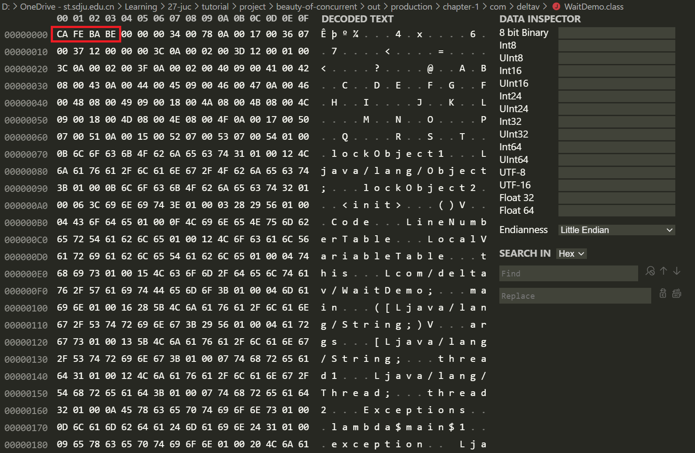
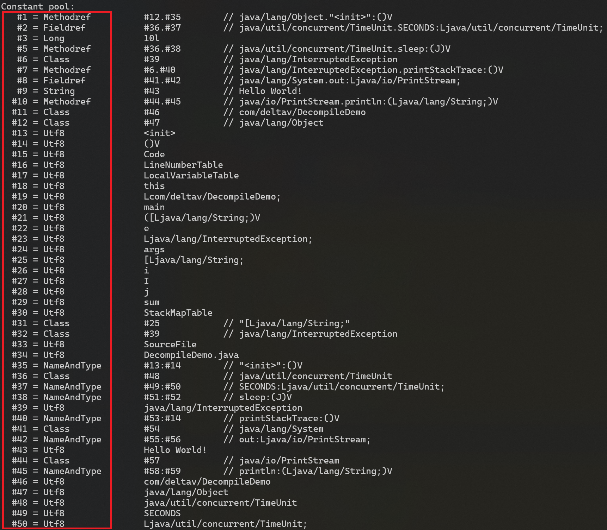
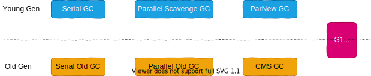
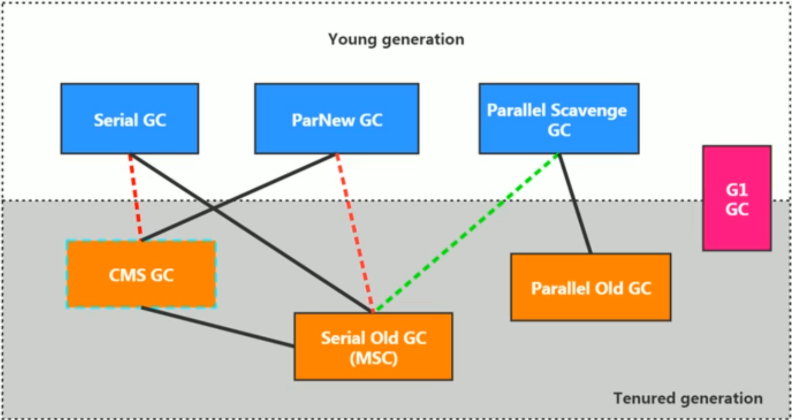
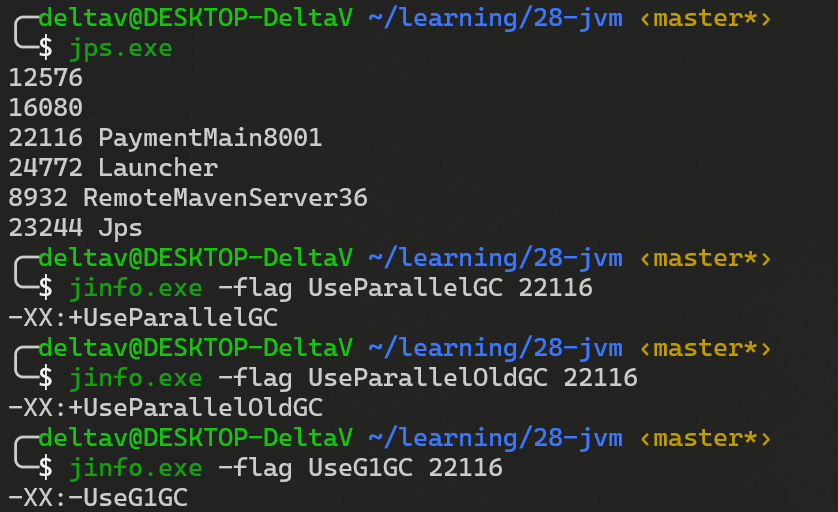
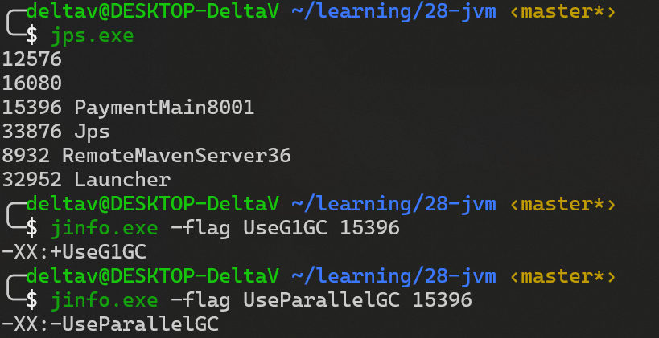
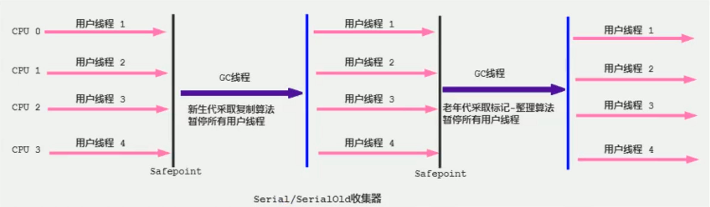
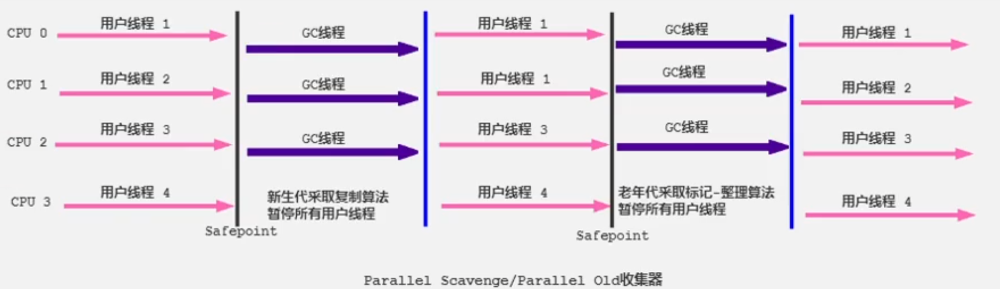
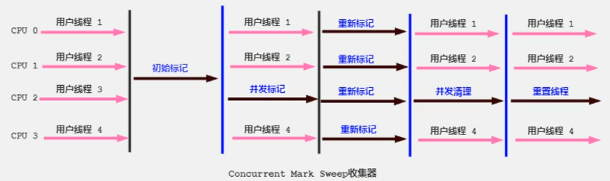

# JVM Note

## Reference document

[Oracle JDK Java Command Options Explain](https://docs.oracle.com/javase/8/docs/technotes/tools/windows/java.html)

## 一、JVM 与 Java 体系结构

### 1.JVM 的架构模型

### 2.JVM 的生命周期

1.启动

通过引导类加载器（bootstrap class loader）创建一个初始类（initial class）来完成的，这个类是由虚拟机的具体实现指定的.

2.执行

- 一个运行中的 java 虚拟机有着一个清晰的任务：执行 Java 程序；
- 程序开始执行的时候他才运行，程序结束时他就停止；
- 执行一个所谓的 Java 程序的时候，真真正正在执行的是一个叫做 Java 虚拟机的进程。

  3.退出

- 程序正常执行结束
- 程序异常或错误而异常终止
- 操作系统错误导致终止
- 某线程调用 Runtime 类或 System 类的 exit 方法，或 Runtime 类的 halt 方法，并且 java 安全管理器也允许这次 exit 或 halt 操作
- 除此之外，JNI 规范描述了用 JNI Invocation API 来加载或卸载 Java 虚拟机时，Java 虚拟机的退出情况

### 3.JVM 的发展历史

#### Sun Classic VM

- 1996 年 JDK1.0 发布时，Sun 公司发布了一款名为 Sun Classic VM 的 Java 虚拟机，它同时是**世界上第一款商用 Java 虚拟机**，JDK1.4 时完全被淘汰。
- 这款虚拟机内部只提供解释器。
- 如果使用 JIT 编译器，就需要进行外挂。但是一旦使用了 JIT 编译器，JIT 就会接管虚拟机的执行系统。解释器就不再工作。解释器和编译器不能配合工作。
- 现在 HotSpot 内置了次虚拟机

#### Exact VM

1.为了解决上一个虚拟机问题，jdk1.2 时，Sun 提供了此虚拟机。

2.Exact Memory Management：准确式内存管理

- 也可以叫 Non-Conservative/Accurate Memory Management
- 虚拟机可以知道内存中某个位置的数据具体是什么类型。

  3.具备现代高性能虚拟机的维形

- 热点探测（寻找出热点代码进行缓存）
- 编译器与解释器混合工作模式

  4.只在 Solaris 平台短暂使用，其他平台上还是 classic vm，英雄气短，终被 Hotspot 虚拟机替换

#### HotSpot VM

1.HotSpot 历史

- 最初由一家名为“Longview Technologies”的小公司设计
- 1997 年，此公司被 Sun 收购；2009 年，Sun 公司被甲骨文收购。
- JDK1.3 时，HotSpot VM 成为默认虚拟机

  2.目前 Hotspot 占有绝对的市场地位，称霸武林。

- 不管是现在仍在广泛使用的 JDK6，还是使用比例较多的 JDK8 中，默认的虚拟机都是 HotSpot
- Sun/oracle JDK 和 openJDK 的默认虚拟机
- 因此本课程中默认介绍的虚拟机都是 HotSpot，相关机制也主要是指 HotSpot 的 GC 机制。（比如其他两个商用虚机都没有方法区的概念）

  3.从服务器、桌面到移动端、嵌入式都有应用。

  4.名称中的 HotSpot 指的就是它的热点代码探测技术。

- 通过计数器找到最具编译价值代码，触发即时编译或栈上替换
- 通过编译器与解释器协同工作，在最优化的程序响应时间与最佳执行性能中取得平衡

#### JRockit（商用三大虚拟机之一）

1.专注于服务器端应用：它可以不太关注程序启动速度，因此 JRockit 内部不包含解析器实现，全部代码都靠即时编译器编译后执行。

2.大量的行业基准测试显示，JRockit JVM 是世界上最快的 JVM：使用 JRockit 产品，客户已经体验到了显著的性能提高（一些超过了 70%）和硬件成本的减少（达 50%）。

3.优势：全面的 Java 运行时解决方案组合

- JRockit 面向延迟敏感型应用的解决方案 JRockit Real Time 提供以毫秒或微秒级的 JVM 响应时间，适合财务、军事指挥、电信网络的需要
- Mission Control 服务套件，它是一组以极低的开销来监控、管理和分析生产环境中的应用程序的工具。

  4.2008 年，JRockit 被 Oracle 收购。

  5.Oracle 表达了整合两大优秀虚拟机的工作，大致在 JDK8 中完成。整合的方式是在 HotSpot 的基础上，移植 JRockit 的优秀特性。

#### IBM 的 J9（商用三大虚拟机之一）

1. 全称：IBM Technology for Java Virtual Machine，简称 IT4J，内部代号：J9
2. 市场定位与 HotSpot 接近，服务器端、桌面应用、嵌入式等多用途 VM 广泛用于 IBM 的各种 Java 产品。
3. 目前，有影响力的三大商用虚拟机之一，也号称是世界上最快的 Java 虚拟机。
4. 2017 年左右，IBM 发布了开源 J9VM，命名为 openJ9，交给 Eclipse 基金会管理，也称为 Eclipse OpenJ9
5. OpenJDK -> 是 JDK 开源了，包括了虚拟机

#### KVM 和 CDC/CLDC Hotspot

1.Oracle 在 Java ME 产品线上的两款虚拟机为：CDC/CLDC HotSpot Implementation VM

2.KVM（Kilobyte）是 CLDC-HI 早期产品

3.目前移动领域地位尴尬，智能机被 Android 和 iOS 二分天下。

4.KVM 简单、轻量、高度可移植，面向更低端的设备上还维持自己的一片市场

- 智能控制器、传感器
- 老人手机、经济欠发达地区的功能手机

  5.所有的虚拟机的原则：一次编译，到处运行。

#### Azul VM（饿了吗）

1. 前面三大“高性能 Java 虚拟机”使用在通用硬件平台上
2. 这里 Azul VW 和 BEA Liquid VM 是与特定硬件平台绑定、软硬件配合的专有虚拟机：高性能 Java 虚拟机中的战斗机。
3. Azul VM 是 Azul Systems 公司在 HotSpot 基础上进行大量改进，运行于 Azul Systems 公司的专有硬件 Vega 系统上的 Java 虚拟机。
4. 每个 Azul VM 实例都可以管理至少数十个 CPU 和数百 GB 内存的硬件资源，并提供在巨大内存范围内实现可控的 GC 时间的垃圾收集器、专有硬件优化的线程调度等优秀特性。
5. 2010 年，Azul Systems 公司开始从硬件转向软件，发布了自己的 Zing JVM，可以在通用 x86 平台上提供接近于 Vega 系统的特性。

#### Liquid VM

1. 高性能 Java 虚拟机中的战斗机。
2. BEA 公司开发的，直接运行在自家 Hypervisor 系统上
3. Liquid VM 即是现在的 JRockit VE（Virtual Edition）。Liquid VM 不需要操作系统的支持，或者说它自己本身实现了一个专用操作系统的必要功能，如线程调度、文件系统、网络支持等。
4. 随着 JRockit 虚拟机终止开发，Liquid vM 项目也停止了。

#### Apache Marmony

1. pache 也曾经推出过与 JDK1.5 和 JDK1.6 兼容的 Java 运行平台 Apache Harmony。
2. 它是 IElf 和 Intel 联合开发的开源 JVM，受到同样开源的 Open JDK 的压制，Sun 坚决不让 Harmony 获得 JCP 认证，最终于 2011 年退役，IBM 转而参与 OpenJDK
3. 虽然目前并没有 Apache Harmony 被大规模商用的案例，但是它的 Java 类库代码吸纳进了 Android SDK。

#### Micorsoft JVM

1. 微软为了在 IE3 浏览器中支持 Java Applets，开发了 Microsoft JVM。
2. 只能在 window 平台下运行。但确是当时 Windows 下性能最好的 Java VM。
3. 1997 年，Sun 以侵犯商标、不正当竞争罪名指控微软成功，赔了 Sun 很多钱。微软 WindowsXP SP3 中抹掉了其 VM。现在 Windows 上安装的 jdk 都是 HotSpot。

#### Taobao JVM

1.由 AliJVM 团队发布。阿里，国内使用 Java 最强大的公司，覆盖云计算、金融、物流、电商等众多领域，需要解决高并发、高可用、分布式的复合问题。有大量的开源产品。

2.基于 OpenJDK 开发了自己的定制版本 AlibabaJDK，简称 AJDK。是整个阿里 Java 体系的基石。

3.基于 OpenJDK Hotspot VM 发布的国内第一个优化、深度定制且开源的高性能服务器版 Java 虚拟机。

- 创新的 GCIH（GCinvisible heap）技术实现了 off-heap，即将生命周期较长的 Java 对象从 heap 中移到 heap 之外，并且 GC 不能管理 GCIH 内部的 Java 对象，以此达到降低 GC 的回收频率和提升 GC 的回收效率的目的。
- GCIH 中的对象还能够在多个 Java 虚拟机进程中实现共享
- 使用 crc32 指令实现 JvM intrinsic 降低 JNI 的调用开销
- PMU hardware 的 Java profiling tool 和诊断协助功能
- 针对大数据场景的 ZenGC

  4.taobao vm 应用在阿里产品上性能高，硬件严重依赖 inte1 的 cpu，损失了兼容性，但提高了性能

- 目前已经在淘宝、天猫上线，把 Oracle 官方 JvM 版本全部替换了。

#### Dalvik VM

1.谷歌开发的，应用于 Android 系统，并在 Android2.2 中提供了 JIT，发展迅猛。

2.Dalvik VM 只能称作虚拟机，而不能称作“Java 虚拟机”，它没有遵循 Java 虚拟机规范

3.不能直接执行 Java 的 Class 文件

4.基于寄存器架构，不是 jvm 的栈架构。

5.执行的是编译以后的 dex（Dalvik Executable）文件。执行效率比较高。

- 它执行的 dex（Dalvik Executable）文件可以通过 class 文件转化而来，使用 Java 语法编写应用程序，可以直接使用大部分的 Java API 等。

  6.Android 5.0 使用支持提前编译（Ahead of Time Compilation，AoT）的 ART VM 替换 Dalvik VM。

#### Graal VM（未来虚拟机）

1. 2018 年 4 月，Oracle Labs 公开了 GraalvM，号称 “Run Programs Faster Anywhere”，勃勃野心。与 1995 年 java 的”write once，run anywhere"遥相呼应。

2. GraalVM 在 HotSpot VM 基础上增强而成的**跨语言全栈虚拟机，可以作为“任何语言”**的运行平台使用。语言包括：Java、Scala、Groovy、Kotlin；C、C++、Javascript、Ruby、Python、R 等

3. 支持不同语言中混用对方的接口和对象，支持这些语言使用已经编写好的本地库文件

4. 工作原理是将这些语言的源代码或源代码编译后的中间格式，通过解释器转换为能被 Graal VM 接受的中间表示。Graal VM 提供 Truffle 工具集快速构建面向一种新语言的解释器。在运行时还能进行即时编译优化，获得比原生编译器更优秀的执行效率。

5. 如果说 HotSpot 有一天真的被取代，Graalvm 希望最大。但是 Java 的软件生态没有丝毫变化。

#### 总结

具体 JVM 的内存结构，其实取决于其实现，不同厂商的 JVM，或者同一厂商发布的不同版本，都有可能存在一定差异。主要以 Oracle HotSpot VM 为默认虚拟机。

## 二.类加载子系统

[参考笔记(https://github.com/youthlql/JavaYouth/blob/main/docs/Java/JVM/JVM%E7%B3%BB%E5%88%97-%E7%AC%AC2%E7%AB%A0-%E7%B1%BB%E5%8A%A0%E8%BD%BD%E5%AD%90%E7%B3%BB%E7%BB%9F.md)](https://github.com/youthlql/JavaYouth/blob/main/docs/Java/JVM/JVM%E7%B3%BB%E5%88%97-%E7%AC%AC2%E7%AB%A0-%E7%B1%BB%E5%8A%A0%E8%BD%BD%E5%AD%90%E7%B3%BB%E7%BB%9F.md)

### 内存结构概述

TODO 简图
TODO 详细图

### 类加载子系统

#### 类加载器子系统作用

1. 类加载器子系统负责从文件系统或者网络中加载 Class 文件，class 文件在文件开头有特定的文件标识。
2. ClassLoader 只负责 class 文件的加载，至于它是否可以运行，则由 Execution Engine 决定。
3. **加载的类信息存放于一块称为方法区的内存空间**。除了类的信息外，方法区中还会存放运行时常量池信息，可能还包括字符串字面量和数字常量（这部分常量信息是 Class 文件中常量池部分的内存映射）

#### 类加载的过程

##### Loading

**加载：**

1. 通过一个类的全限定名获取定义此类的二进制字节流
2. 将这个字节流所代表的静态存储结构转化为方法区的运行时数据结构
3. 在内存中生成一个代表这个类的 java.lang.Class 对象，作为方法区这个类的各种数据的访问入口

**加载 class 文件的方式：**

1. 从本地系统中直接加载
2. 通过网络获取，典型场景：Web Applet
3. 从 zip 压缩包中读取，成为日后 jar、war 格式的基础
4. 运行时计算生成，使用最多的是：动态代理技术
5. 由其他文件生成，典型场景：JSP 应用从专有数据库中提取.class 文件，比较少见
6. 从加密文件中获取，典型的防 Class 文件被反编译的保护措施

##### Linking

链接分为三个子阶段：**验证** -> **准备** -> **解析**

**验证(Verify)**:

1. 目的在于确保 Class 文件的字节流中包含信息符合当前虚拟机要求，保证被加载类的正确性，不会危害虚拟机自身安全
2. 主要包括四种验证，文件格式验证，元数据验证，字节码验证，符号引用验证。

查看字节码文件，其开头均为 CAFE BABE ，如果出现不合法的字节码文件，那么将会验证不通过。



**准备(Prepare)**:

1. 为类变量（static 变量）分配内存并且设置该类变量的默认初始值，即零值
2. 这里不包含用 final 修饰的 static，因为 final 在编译的时候就会分配好了默认值，准备阶段会显式初始化
3. 注意：这里不会为**实例变量**分配初始化，**类变量**会分配在方法区中，而实例变量是会随着对象一起分配到 Java 堆中

变量 a 在准备阶段会赋初始值，但不是 1，而是 0，在初始化阶段会被赋值为 1

```java
public class HelloApp {
    private static int a = 1;//prepare：a = 0 ---> initial : a = 1

    public static void main(String[] args) {
        System.out.println(a);
    }
}
```

**解析(Resolve)**:

1. **将常量池内的符号引用转换为直接引用的过程**
2. 事实上，解析操作往往会伴随着 JVM 在执行完初始化之后再执行
3. 符号引用就是一组符号来描述所引用的目标。符号引用的字面量形式明确定义在《java 虚拟机规范》的 class 文件格式中。直接引用就是直接指向目标的指针、相对偏移量或一个间接定位到目标的句柄
4. 解析动作主要针对类或接口、字段、类方法、接口方法、方法类型等。对应常量池中的 CONSTANT Class info、CONSTANT Fieldref info、CONSTANT Methodref info 等

**符号引用**:

- 反编译 class 文件后可以查看符号引用，下面带# 的就是符号引用



##### Initialization

## 三、方法区

- 方法区的演进

Hotspot

| JDK1.6及以前 | 有永久代（permanent generation），静态变量存储在永久代上     |
| ------------ | ------------------------------------------------------------ |
| JDK1.7       | 有永久代，但已经逐步 “去永久代”，**字符串常量池，静态变量移除，保存在堆中** |
| JDK1.8       | 无永久代，类型信息，字段，方法，常量保存在本地内存的元空间，但字符串常量池、静态变量仍然在堆中。 |

## StringTable

Use below method will not generate string in String Pool.
So `String str = new String(char[])` and `str.intern() == str` is true.
`str.intern()` will put non-exists string to string pool, but in this case the reference of the string in String Pool will link to `str` object which allocated in heap. (JDK7 and later)
In JDK6, a copy of `str` will generate in String Pool, so `str.intern() != str`.

Advantages of making a string pool object refer to a string object that exists in the heap instead of creating a new copy of it and putting it into the string pool:

1. Save memory space. JVM only need 4 Byte space for store reference type object.
2. Save time. The JVM does not need to copy the entire character array to the string pool.

```java
java.lang.String#String(char[], int, int)
```

Use following method, the parameter will be generated in String Pool. So return value of `String str = new String(String)` is not equal `str.intern()`

```java
java.lang.String#String(java.lang.String)
```

### 总结 intern() 的使用

- JDK1.6 中，将这个字符串对象尝试放入串池。

  - 如果 String Pool 中有，则不会放入。返回已有的串池中的对象的地址。
  - 如果没有，会把**此对象复制一份**，放入 String Pool，并返回 String Pool 中的对象地址。

- JDK1.7 起，将这个字符串对象尝试放入串池。
  - 如果串池中有，则并不会放入。返回已有的串池中的对象的地址。
  - 如果没有，则会把**对象的引用地址复制一份**，放入串池，并返回串池中的引用地址。

## GC method

```java
/**
  * Runs the garbage collector.
  * <p>
  * Calling the <code>gc</code> method suggests that the Java Virtual
  * Machine expend effort toward recycling unused objects in order to
  * make the memory they currently occupy available for quick reuse.
  * When control returns from the method call, the Java Virtual
  * Machine has made a best effort to reclaim space from all discarded
  * objects.
  * <p>
  * The call <code>System.gc()</code> is effectively equivalent to the
  * call:
  * <blockquote><pre>
  * Runtime.getRuntime().gc()
  * </pre></blockquote>
  *
  * @see     java.lang.Runtime#gc()
  */
public static void gc() {
    Runtime.getRuntime().gc();
}

/**
  * Runs the finalization methods of any objects pending finalization.
  * <p>
  * Calling this method suggests that the Java Virtual Machine expend
  * effort toward running the <code>finalize</code> methods of objects
  * that have been found to be discarded but whose <code>finalize</code>
  * methods have not yet been run. When control returns from the
  * method call, the Java Virtual Machine has made a best effort to
  * complete all outstanding finalizations.
  * <p>
  * The call <code>System.runFinalization()</code> is effectively
  * equivalent to the call:
  * <blockquote><pre>
  * Runtime.getRuntime().runFinalization()
  * </pre></blockquote>
  *
  * @see     java.lang.Runtime#runFinalization()
  */
public static void runFinalization() {
    Runtime.getRuntime().runFinalization();
}
```

## Reference

### Strong Reference

String Reference will not be cleared at any time.

### Soft Reference

Reclaim when memory is insufficient.

### Weak Reference

只要 GC 就会被回收。

### Phantom Reference

任何时候都会被回收，回收后放入 Reference Queue 中。

`System.gc()` and `System.runFinalization()` jsut suggest JVM to recyclie memeory space and run finalize method of object that have been not yet run. It is not ensure that these two methods affected after they return.

## GC 分类





1. 两个收集器间有连线，表明它们可以搭配使用：
    - Serial/Serial old
    - Serial/CMS    （JDK9废弃）
    - ParNew/Serial Old （JDK9废弃）
    - ParNew/CMS
    - Parallel Scavenge/Serial Old  （预计废弃）
    - Parallel Scavenge/Parallel Old
    - G1
2. 其中Serial Old作为CMS出现"Concurrent Mode Failure"失败的后备预案。
3. （红色虚线）由于维护和兼容性测试的成本，在JDK 8时将Serial+CMS、ParNew+Serial Old这两个组合声明为废弃（JEP173），并在JDK9中完全取消了这些组合的支持（JEP214），即：移除。
4. （绿色虚线）JDK14中：弃用Parallel Scavenge和Serial Old GC组合（JEP366）
5. （青色虚线）JDK14中：删除CMS垃圾回收器（JEP363）

### check default GC

1. -XX:+PrintCommandLineFlags：查看命令行相关参数（包含使用的垃圾收集器）
2. 使用命令行指令：jinfo -flag 相关垃圾回收器参数 进程ID

```bash
jps
jinfo -flag UseParallelGC 进程id
jinfo -flag UseParallelOldGC 进程id
```



**NOTE**: `ParallelGC` 和 `ParallelOldGC` 默认绑定使用，所以在 `PrintCommandLineFlags` 中只打印了 `+XX:+UseParallelGC`

**JDK12**:

默认使用 G1GC

```java
-XX:-BytecodeVerificationLocal -XX:-BytecodeVerificationRemote -XX:G1ConcRefinementThreads=4 -XX:GCDrainStackTargetSize=64 -XX:InitialHeapSize=266846528 -XX:+ManagementServer -XX:MaxHeapSize=4269544448 -XX:+PrintCommandLineFlags -XX:ReservedCodeCacheSize=251658240 -XX:+SegmentedCodeCache -XX:TieredStopAtLevel=1 -XX:+UseCompressedClassPointers -XX:+UseCompressedOops -XX:+UseG1GC -XX:-UseLargePagesIndividualAllocation 
```

jinfo:



### Serial GC

Command Line

```bash
-XX:+UseSerialGC
```

在 HotSpot 虚拟机中，使用`-XX:+UseSerialGC`参数可以指定年轻代和老年代都使用串行收集器。即新生代使用 `Serial GC`，老年代使用 `Serial Old GC`。

1. Serial收集器是最基本、历史最悠久的垃圾收集器了。JDK1.3之前回收新生代唯一的选择。
2. Serial收集器作为HotSpot中Client模式下的默认新生代垃圾收集器。
3. Serial收集器采用复制算法、串行回收和"Stop-the-World"机制的方式执行内存回收。
4. 除了年轻代之外，Serial收集器还提供用于执行老年代垃圾收集的Serial Old收集器。Serial old收集器同样也采用了串行回收和"Stop the World"机制，只不过内存回收算法使用的是标记-压缩算法。
5. Serial Old是运行在Client模式下默认的老年代的垃圾回收器，Serial Old在Server模式下主要有两个用途：
    - 与新生代的Parallel Scavenge配合使用
    - 作为老年代CMS收集器的后备垃圾收集方案

这个收集器是一个单线程的收集器，“单线程”的意义：它只会使用一个CPU（串行）或一条收集线程去完成垃圾收集工作。更重要的是在它进行垃圾收集时，必须暂停其他所有的工作线程，直到它收集结束（Stop The World）



### ParNew GC

```bash
-XX:+UseParNewGC        # enable ParNew GC
-XX:ParallelGCThreads   # set number of GC thread
```

1. 如果说Serial GC是年轻代中的单线程垃圾收集器，那么ParNew收集器则是Serial收集器的多线程版本。
    - Par是Parallel的缩写，New：只能处理新生代
2. ParNew 收集器除了采用**并行回收**的方式执行内存回收外，两款垃圾收集器之间几乎没有任何区别。ParNew收集器在年轻代中同样也是采用复制算法、"Stop-the-World"机制。
3. ParNew 是很多JVM运行在Server模式下新生代的默认垃圾收集器。


1. 对于新生代，回收次数频繁，使用并行方式高效。
2. 对于老年代，回收次数少，使用串行方式节省资源。（CPU并行需要切换线程，串行可以省去切换线程的资源）

**设置 ParNew 垃圾回收器**:

1. 在程序中，开发人员可以通过选项"-XX:+UseParNewGC"手动指定使用ParNew收集器执行内存回收任务。它表示年轻代使用并行收集器，不影响老年代。
2. -XX:ParallelGCThreads限制线程数量，默认开启和CPU数据相同的线程数。

### Parallel GC

**Commond Line**:

```bash
-XX:+UseParallelGC    # enable Parallel GC
-XX:+UseParallelOldGC
-XX:ParallelGCThreads
```

**Parallel Scavenge 回收器：吞吐量优先**:

1. HotSpot的年轻代中除了拥有ParNew收集器是基于并行回收的以外，Parallel Scavenge收集器同样也采用了复制算法、并行回收和"Stop the World"机制。
2. 那么Parallel收集器的出现是否多此一举？
    - 和ParNew收集器不同，Parallel Scavenge收集器的目标则是达到一个**可控制的吞吐量**（Throughput），它也被称为吞吐量优先的垃圾收集器。
    - 自适应调节策略也是Parallel Scavenge与ParNew一个重要区别。（动态调整内存分配情况，以达到一个最优的吞吐量或低延迟）
3. 高吞吐量则可以高效率地利用CPU时间，尽快完成程序的运算任务，**主要适合在后台运算而不需要太多交互的任务**。因此，常见在服务器环境中使用。例如，那些执行批量处理、订单处理、工资支付、科学计算的应用程序。
4. Parallel收集器在JDK1.6时提供了用于执行老年代垃圾收集的Parallel Old收集器，用来代替老年代的Serial Old收集器。
5. Parallel Old收集器采用了标记-压缩算法，但同样也是基于并行回收和"Stop-the-World"机制。



1. 在程序吞吐量优先的应用场景中，Parallel收集器和Parallel Old收集器的组合，在server模式下的内存回收性能很不错。
2. **在Java8中，默认是此垃圾收集器。**

**Parallel Scavenge 回收器参数设置**:

1. -XX:+UseParallelGC 手动指定年轻代使用Parallel并行收集器执行内存回收任务。
2. -XX:+UseParallelOldGC：手动指定老年代都是使用并行回收收集器。
   - 分别适用于新生代和老年代
   - 上面两个参数分别适用于新生代和老年代。默认jdk8是开启的。默认开启一个，另一个也会被开启。（互相激活）
3. -XX:ParallelGCThreads：设置年轻代并行收集器的线程数。一般地，最好与CPU数量相等，以避免过多的线程数影响垃圾收集性能。
    1. 在默认情况下，当CPU数量小于8个，ParallelGCThreads的值等于CPU数量。
    2. 当CPU数量大于8个，ParallelGCThreads的值等于 3+\[5*CPU_Count\]/8
4. -XX:MaxGCPauseMillis 设置垃圾收集器最大停顿时间（即STW的时间）。单位是毫秒。
    1. 为了尽可能地把停顿时间控制在XX:MaxGCPauseMillis 以内，收集器在工作时会调整Java堆大小或者其他一些参数。
    2. 对于用户来讲，停顿时间越短体验越好。但是在服务器端，我们注重高并发，整体的吞吐量。所以服务器端适合Parallel，进行控制。
    3. 该参数使用需谨慎。

5. -XX:GCTimeRatio垃圾收集时间占总时间的比例，即等于 1 / (N+1) ，用于衡量吞吐量的大小。
    1. 取值范围(0, 100)。默认值99，也就是垃圾回收时间占比不超过1。
    2. 与前一个-XX:MaxGCPauseMillis参数有一定矛盾性，STW暂停时间越长，Radio参数就容易超过设定的比例。

6. -XX:+UseAdaptiveSizePolicy 设置Parallel Scavenge收集器具有**自适应调节策略**
    1. 在这种模式下，年轻代的大小、Eden和Survivor的比例、晋升老年代的对象年龄等参数会被自动调整，已达到在堆大小、吞吐量和停顿时间之间的平衡点。
    2. 在手动调优比较困难的场合，可以直接使用这种自适应的方式，仅指定虚拟机的最大堆、目标的吞吐量（GCTimeRatio）和停顿时间（MaxGCPauseMillis），让虚拟机自己完成调优工作。

### CMS

Concurrent Mark Sweep

**Commond Line**:

```bash
-XX:+UseConcMarkSweepGC
```



### G1

Garbage First

**Commond Line**:

```bash
-XX:+UseG1GC
```

## ++ 运算符

```java
public void method6() {
    int i = 10;
    i++;
}
```

```java
public void method6() {
    int i = 10;
    ++i;
}
```

如上的两种情况，由于 i 自增后并未赋值给其他变量，所以它们生成的字节码相同。

Byte Code:

```text
0 bipush 10
2 istore_1
3 iinc 1 by 1
6 return
```

---

```java
public void method7() {
    int i = 10;
    int a = i++;

    int j = 20;
    int b = ++j;
}
```

Byte code of code attribute in method_info:

```text
 0 bipush 10
 2 istore_1
 3 iload_1
 4 iinc 1 by 1
 7 istore_2
 8 bipush 20
10 istore_3
11 iinc 3 by 1
14 iload_3
15 istore 4
17 return
```

不难发现，对于 `int a = i++;`，会先把 `i` 的值压入操作数栈中，随后对局部变量表中的 `i` 自增 1，最后将操作数栈中的未自增的 `i` 存入局部变量表中的 `a`。
`int b = ++j;` 先将局部变量表中的 j++，随后压入栈再存入局部变量表中的 `b`。

---

```java
@Test
public void method8() {
    int i = 10;
    i = i++;
    System.out.println(i);
}
```

Byte Code:

```text
 0 bipush 10
 2 istore_1
 3 iload_1
 4 iinc 1 by 1
 7 istore_1
 8 getstatic #2 <java/lang/System.out : Ljava/io/PrintStream;>
11 iload_1
12 invokevirtual #5 <java/io/PrintStream.println : (I)V>
15 return
```

1. 将 10 压入操作数栈
2. 存入 1 索引位置的局表变量表中
3. 将局部表量表中索引为 1 的变量值压入操作数栈
4. 局部变量表索引位置 1 的变量值 +1
5. 将操作数栈中的变量存入局部变量表中索引为 1 的位置

综述，i = 10

## command

### javac

用法: `javac <options> <source files>`

```bash
-g                           生成所有调试信息
-g:{lines,vars,source}       只生成某些调试信息
-g:none                      不生成任何调试信息
```

### javap

显示通过字节码反编译后的 **Java** 代码。

**usage**:

```shell
用法: javap <options> <classes>
其中, 可能的选项包括:
  -? -h --help -help               输出此帮助消息
  -version                         版本信息
  -v  -verbose                     输出附加信息
  -l                               输出行号和本地变量表
  -public                          仅显示公共类和成员
  -protected                       显示受保护的/公共类和成员
  -package                         显示程序包/受保护的/公共类
                                   和成员 (默认)
  -p  -private                     显示所有类和成员 (inculde private modifier)
  -c                               对代码进行反汇编
  -s                               输出内部类型签名
  -sysinfo                         显示正在处理的类的
                                   系统信息 (路径, 大小, 日期, MD5 散列)
  -constants                       显示最终常量
  --module <模块>, -m <模块>       指定包含要反汇编的类的模块
  --module-path <路径>             指定查找应用程序模块的位置
  --system <jdk>                   指定查找系统模块的位置
  --class-path <路径>              指定查找用户类文件的位置
  -classpath <路径>                指定查找用户类文件的位置
  -cp <路径>                       指定查找用户类文件的位置
  -bootclasspath <路径>            覆盖引导类文件的位置

GNU 样式的选项可使用 = (而非空白) 来分隔选项名称
及其值。

每个类可由其文件名, URL 或其
全限定类名指定。示例:
   path/to/MyClass.class
   jar:file:///path/to/MyJar.jar!/mypkg/MyClass.class
   java.lang.Object
```

```shell
javap [-v] classFile
```

### jps

```bash
jps
```

show JVM instance run on the system.

### jstat

```bash
jstat [-gc] pid   # show gc status of specificate pid
```

### jinfo

```bash
jinfo -flag [JVM XX parameter] pid   # show the flag of pid
```

### jmap

Export dump file.

## JVM Command Line Options

### -Xss

Max memory size of JVM Stack. `-Xx:Stack Size`

```bash
-Xss10m
```

### -Xms

Initial heap memory size. `-Xx:Memory Start`

```bash
-Xms600m
```

### -Xmx

Max heap memory size. `-Xx:Memory maX`

```bash
-Xmx600m
```

### -Xmn

Young generation memory size. Priority is higher than `-XX:NewRatio` parameter. `-Xx:Memory of New`

```bash
-Xmn100m
```

### -server

Enable server mode. In this mode, Scalar Replace and Escape Analysis function will start working.

Selects the Java HotSpot Server VM. The 64-bit version of the JDK supports only the Server VM, so in that case the option is implicit.

### -Xint

Runs the application in interpreted-only mode. Compilation to native code is disabled, and all bytecode is executed by the interpreter. The performance benefits offered by the just in time (JIT) compiler are not present in this mode.

### -Xcomp

Forces compilation of methods on first invocation. By default, the Client VM (-client) performs 1,000 interpreted method invocations and the Server VM (-server) performs 10,000 interpreted method invocations to gather information for efficient compilation. Specifying the -Xcomp option disables interpreted method invocations to increase compilation performance at the expense of efficiency.

You can also change the number of interpreted method invocations before compilation using the -XX:CompileThreshold option.

### -Xmixed

Executes all bytecode by the interpreter except for hot methods, which are compiled to native code.

### -XX Options

- Boolean options are turned on with -XX:+<option> and turned off with -XX:-<option>
- Numeric options are set with -XX:<option>=<number>. Numbers can include 'm' or 'M' for megabytes, 'k' or 'K' for kilobytes, and 'g' or 'G' for gigabytes (for example, 32k is the same as 32768).
- String options are set with -XX:<option>=<string>, are usually used to specify a file, a path, or a list of commands

#### -XX:NewRatio

The old generation and young generation memory size ratio. Default value is 2.

```bash
-XX:NewRatio=2
```

#### -XX:SurvivorRatio

The Eden and Survivor generation memory size ratio.Default ratio is 8.
Because of Adaptive Memory Size Policy, the ratio between Eden and Survivor generation is not the default value. You must set `SurvivorRatio` to 8 obviously， then the ratio can take effect.

```bash
-XX:SurvivorRatio=8
```

#### -XX:-UseAdaptiveSizePolicy

Disable Adaptive memory size policy.(Not effection, Need set ratio)

```bash
-XX:-UseAdaptiveSizePolicy
```

#### -XX:+PrintGCDetails

Print GC Details Infomation after JVM instance stop.

```bash
-XX:+PrintGCDetails
```

#### -XX:+PrintGC

Print GC simplified information.

#### -XX:MaxTenuringThreshold

The threshold which time to promote the survivor object ot tenuring generation.

```bash
-XX:MaxTenuringThreshold=15
```

#### -XX:+DoEscapeAnalysis

Enable escape analysis in HotSpot. Accurately the Scalar Replace function in HotSpot.

#### -XX:+EliminateAllocations

Enable Scalar replace function in HotSpot. The function will allocate object which allocate on heap memory originally on Stack Frame, and split the polymer(object) into scalar(local variables).

#### -XX:PermSize

Before JDK8, the implementation of `method area` is `Permanent Generation`.
Sets initial permanent generation memory size. Default value is 20.75 MiB.

```bash
-XX:PermSize=100m
-XX:PermSize=2g
```

#### -XX:MaxPermSize

Before JDK8.
Sets max permanent generation memory size. Default valus is 82 MiB.

```bash
-XX:MaxPermSize=100m
-XX:MaxPermSize=1G
```

#### -XX:MetaspaceSize

After JDK8, Metaspace replace PermGen.
Sets initial metaspace size. Default value of metaspace is 21 MiB.

```bash
-XX:MetaspaceSize=100m
```

#### -XX:MaxMetaspaceSize

After JDK8, sets max metaspace size. Default value is -1(all native heap memory).

```bash
-XX:MaxMetaspaceSize=100m
-XX:MaxMetaspaceSize=1g
```

#### -XX:StringTableSize

Set HashTable size of String constant pool.
At JDK8, the default value upper to  60013. The min value is 1009.

```bash
-XX:StringTableSize=1009
```

#### -XX:+PrintCommandLineFlags

Print Command Line parameters in console when application started.

```bash
-XX:+PrintCommandLineFlags
```

**Console:**

```log
-XX:-BytecodeVerificationLocal -XX:-BytecodeVerificationRemote -XX:InitialHeapSize=266846528 -XX:+ManagementServer -XX:MaxHeapSize=4269544448 -XX:+PrintCommandLineFlags -XX:TieredStopAtLevel=1 -XX:+UseCompressedClassPointers -XX:+UseCompressedOops -XX:-UseLargePagesIndividualAllocation -XX:+UseParallelGC 
```

#### -XX:+LogCompilation

-XX:+LogCompilation
Enables logging of compilation activity to a file named hotspot.log in the current working directory. You can specify a different log file path and name using the -XX:LogFile option.

By default, this option is disabled and compilation activity is not logged. The -XX:+LogCompilation option has to be used together with the -XX:+UnlockDiagnosticVMOptions option that unlocks diagnostic JVM options.

You can enable verbose diagnostic output with a message printed to the console every time a method is compiled by using the -XX:+PrintCompilation option.

#### -XX:+TraceClassLoading

Print class load info.

#### -XX:+PrintAssembly

Let HotSpot output the disassembled native code.

#### -XX:+PrintCodeCache

#### -XX:+PrintCodeCacheOnCompilation

#### -XX:+PrintAssembly

Print disassembled native code of HotSpot.

> This requires you to use a debug JVM build or have built the hsdis (HotSpot disassembler) binary. The source for hsdis is part of OpenJDK

**file name for Windows:**
`hsdis-amd64.dll`

**location:**
```text
/${JAVA_HOME}/jre/bin/server
```

## The Java Virtual Machine Instruction Set

### 操作数栈入栈指令

#### load series

局部变量压栈指令将给定的局部变量表中的数据压入操作数栈。

`xload` **(x = i / l / f / d / a)**
- i = int / short / char / byte / boolean
- l = long
- f = float
- d = double
- a = reference

`xload_<n>` **(n = [0, 3], n ∈ Z)**

#### const series

常量入栈指令的功能是将常数压入操作数栈，根据数据类型和入栈内容的不同，又可以分为 `const` 系列、`push` 系列和 `ldc` 指令。

- int
`iconst_m1`
`iconst_x` **(x = [0, 5], x ∈ Z)**

- long
`lconst_x` **(x = [0, 1], x ∈ Z)**

- float
`fconst_x` **(x = [0, 2], x ∈ Z)**

- double
`dconst_x` **(x = [0, 1], x ∈ Z)**

- reference
`aconst_null`

#### push series

- `bipush`
Push byte

- `sipush`
Push short
> The immediate unsigned byte1 and byte2 values are assembled into an intermediate short, where the value of the short is (byte1 << 8) | byte2. The intermediate value is then sign-extended to an int value. That value is pushed onto the operand stack.

### 操作数出栈存储至局部变量表指令

将当前操作数栈顶的元素存储至局部变量变中。

`xstore`
`xstore_<n>` **(n = [0, 3], n ∈ Z)**

`x`: i/l/f/d/a <=> int/long/float/double/ref
`n`: 局部变量表的索引

### 算数指令

- 加法指令：iadd、ladd、fadd、dadd
- 减法指令：isub、lsub、fsub、dsub
- 乘法指令：imul、lmul、fmul、dmul
- 除法指令：idiv、ldiv、fdiv、ddiv
- 求余指令：irem、lrem、frem、drem(remainder：余数)
- 取反指令：ineg、lneg、fneg、dneg(negation：取反)
- 自增指令：iinc
- 位运算指令，又可分为：
  - 位移指令：ishl(int shift left)、ishr、iushr、lshl、lshr、lushr
  - 按位或指令：ior、lor
  - 按位与指令：iand、land
  - 按位异或指令：ixor、lxor
- 比较指令：dcmpg、dcmlp、fcmpg、fcmpl、lcmp

### 类型转换指令

#### 宽化类型转换

- 从 int 类型到 long、float 或者 double 类型，对应的指令为：i2l、i2f、i2d
- 从 long 类型到 float、double 类型。对应的指令为：l2f、l2d
- 从 float 类型到 double 类型。对应的指令为：f2d

`int --> long --> float --> double`

#### 窄化类型转换

- 从 int 类型至 byte、short 或者 char 类型。对应的指令有：i2b、i2s、i2c
- 从 long 类型到 int 类型。对应的指令有：l2i
- 从 float 类型到 int 或者 long
类型。对应的指令有：f2i、f2l
- 从 double 类型到 int、long 或者 float 类型。对应的指令有：d2i、d2l、d2f

### 对象的创建于访问指令

#### 1.创建指令

1. 创建类实例的指令：
创建类实例的指令：new 

- 它接收一个操作数，为指向常量池的索引，表示要创建的类型，执行完成后， 将对象的引用压入栈

2. 创建数组的指令： 创建数组的指令：newarray、anewarray、multianewarray

- newarray：创建基本类型数组
- anewarray：创建引用类型数组
- multianewarray：创建多维数组

| Array Type  | *atype* |
| ----------- | ------- |
| `T_BOOLEAN` | 4       |
| `T_CHAR`    | 5       |
| `T_FLOAT`   | 6       |
| `T_DOUBLE`  | 7       |
| `T_BYTE`    | 8       |
| `T_SHORT`   | 9       |
| `T_INT`     | 10      |
| `T_LONG`    | 11      |

**Note**

如下代码，二维数组并未初始化，所以在此只当做引用类型数组创建实例

```java
// bipush 10
// anewarray #7 <[Ljava/lang/String;>
String[][] strArray = new String[10][];

// bipush 10
// iconst_5
// multianewarray #8 <[[Ljava/lang/String;> dim 2
String[][] strArray2 = new String[10][5];
```

#### 2.字段访问指令

- 访问类字段(static 字段，或者称为类变量)的指令：getstatic、putstatic
- 访问类实例字段(非 static 字段，或者称为实例变量)的指令：getfield、putfield

#### 3.数组操作指令

- 把一个数组元素加载到操作数栈的指令：baload、caload、saload、iaload、 laload、faload、daload、aaload 
- 将一个操作数栈的值存储到数组元素中的指令：bastore、castore、sastore、 iastore、lastore、fastore、dastore、aastore
- 取数组长度的指令：arraylength

#### 4.类型检查指令

- 指令 checkcast 用于检查类型强制转换是否可以进行。如果可以进行，那么 checkcast 指令不会改变操作数栈，否则它会抛出 ClassCastException 异常
- 指令 instanceof 用来判断给定对象是否是某一个类的实例，它会将判断结果压入操作数栈

### 方法调用与返回指令

#### 方法调用指令

- invokevirtual 指令用于调用对象的实例方法，根据对象的实际类型进行分派 (虚方法分派)，支持多态。这也是 Java 语言中最常见的方法分派方式
- invokeinterface 指令用于调用接口方法，它会在运行时搜索由特定对象所实 现的这个接口方法，并找出适合的方法进行调用
- invokespecial 指令用于调用一些需要特殊处理的实例方法，包括实例初始化 方法(构造器)、私有方法和父类方法。这些方法都是静态类型绑定的，不会 在调用时进行动态派发
- invokestatic 指令用于调用命名类中的类方法(static 方法)。这是静态绑定的
- invokedynamic 调用动态绑定的方法，这个是 JDK 1.7 后新加入的指令。用于在运行时动态解析出调用点限定符所引用的方法，并执行该方法。前面 4 条调用指令的分派逻辑都固化在 Java 虚拟机内部，而 invokedynamic 指令的分派逻辑是由用户所设定的引导方法决定的

**NOTE**

如果调用的方法是 private 和 static 修饰的，则使用 `invokestatic` 调用方法。
若调用 Interface 中的 default，则使用 `invokeinterface`。
若调用 Interface 中的 static 方法，则使用 `invokestatic`。

**总结**


调用 Interface 变量的方法，就使用 `invokeinterface`。
调用的是 Static 方法，无论在类还是接口，无论有什么修饰符，都使用 `invokestatic`。

#### 方法返回指令

- 包括 ireturn(当返回值是 boolean、byte、char、short 和 int 类型时使用)、lreturn、freturn、dreturn 和 areturn
- 另外还有一条 return 指令供声明为 void 的方法、实例初始化方法以及 类和接口的类初始化方法使用

| 返回类型                            | 返回指令    |
|---------------------------------|---------|
| void                            | return  |
| int(boolean, byte, char, short) | ireturn |
| long                            | lreturn |
| float                           | freturn |
| double                          | dreturn |
| reference                       | areturn |

> 通过 `ireturn` 指令，将当前函数操作数栈的顶层元素弹出，并将这个元素压入调用者函数的操作数栈中(因为调用者非常关心函数的返回值)，所有在当前函数操作数栈中的其他元素都会被丢弃。
> 如果当前返回的是 synchronized 方法，那么还会执行一个隐含的 `monitorexit` 指令，退出临界区。
> 最后，会丢弃当前方法的整个帧，恢复调用者的帧，并将控制权转交给调用者。

### 操作数栈管理指令
