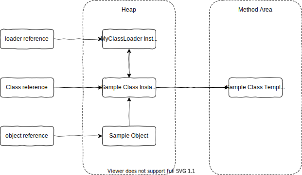

# JVM Note

## Reference document

[Oracle JDK Java Command Options Explain](https://docs.oracle.com/javase/8/docs/technotes/tools/windows/java.html)

## 一、JVM 与 Java 体系结构

### 1.JVM 的架构模型

### 2.JVM 的生命周期

1.启动

通过引导类加载器（bootstrap class loader）创建一个初始类（initial class）来完成的，这个类是由虚拟机的具体实现指定的.

2.执行

- 一个运行中的 java 虚拟机有着一个清晰的任务：执行 Java 程序；
- 程序开始执行的时候他才运行，程序结束时他就停止；
- 执行一个所谓的 Java 程序的时候，真真正正在执行的是一个叫做 Java 虚拟机的进程。

  3.退出

- 程序正常执行结束
- 程序异常或错误而异常终止
- 操作系统错误导致终止
- 某线程调用 Runtime 类或 System 类的 exit 方法，或 Runtime 类的 halt 方法，并且 java 安全管理器也允许这次 exit 或 halt 操作
- 除此之外，JNI 规范描述了用 JNI Invocation API 来加载或卸载 Java 虚拟机时，Java 虚拟机的退出情况

### 3.JVM 的发展历史

#### Sun Classic VM

- 1996 年 JDK1.0 发布时，Sun 公司发布了一款名为 Sun Classic VM 的 Java 虚拟机，它同时是**世界上第一款商用 Java 虚拟机**，JDK1.4 时完全被淘汰。
- 这款虚拟机内部只提供解释器。
- 如果使用 JIT 编译器，就需要进行外挂。但是一旦使用了 JIT 编译器，JIT 就会接管虚拟机的执行系统。解释器就不再工作。解释器和编译器不能配合工作。
- 现在 HotSpot 内置了次虚拟机

#### Exact VM

1.为了解决上一个虚拟机问题，jdk1.2 时，Sun 提供了此虚拟机。

2.Exact Memory Management：准确式内存管理

- 也可以叫 Non-Conservative/Accurate Memory Management
- 虚拟机可以知道内存中某个位置的数据具体是什么类型。

  3.具备现代高性能虚拟机的维形

- 热点探测（寻找出热点代码进行缓存）
- 编译器与解释器混合工作模式

  4.只在 Solaris 平台短暂使用，其他平台上还是 classic vm，英雄气短，终被 Hotspot 虚拟机替换

#### HotSpot VM

1.HotSpot 历史

- 最初由一家名为“Longview Technologies”的小公司设计
- 1997 年，此公司被 Sun 收购；2009 年，Sun 公司被甲骨文收购。
- JDK1.3 时，HotSpot VM 成为默认虚拟机

  2.目前 Hotspot 占有绝对的市场地位，称霸武林。

- 不管是现在仍在广泛使用的 JDK6，还是使用比例较多的 JDK8 中，默认的虚拟机都是 HotSpot
- Sun/oracle JDK 和 openJDK 的默认虚拟机
- 因此本课程中默认介绍的虚拟机都是 HotSpot，相关机制也主要是指 HotSpot 的 GC 机制。（比如其他两个商用虚机都没有方法区的概念）

  3.从服务器、桌面到移动端、嵌入式都有应用。

  4.名称中的 HotSpot 指的就是它的热点代码探测技术。

- 通过计数器找到最具编译价值代码，触发即时编译或栈上替换
- 通过编译器与解释器协同工作，在最优化的程序响应时间与最佳执行性能中取得平衡

#### JRockit（商用三大虚拟机之一）

1.专注于服务器端应用：它可以不太关注程序启动速度，因此 JRockit 内部不包含解析器实现，全部代码都靠即时编译器编译后执行。

2.大量的行业基准测试显示，JRockit JVM 是世界上最快的 JVM：使用 JRockit 产品，客户已经体验到了显著的性能提高（一些超过了 70%）和硬件成本的减少（达 50%）。

3.优势：全面的 Java 运行时解决方案组合

- JRockit 面向延迟敏感型应用的解决方案 JRockit Real Time 提供以毫秒或微秒级的 JVM 响应时间，适合财务、军事指挥、电信网络的需要
- Mission Control 服务套件，它是一组以极低的开销来监控、管理和分析生产环境中的应用程序的工具。

  4.2008 年，JRockit 被 Oracle 收购。

  5.Oracle 表达了整合两大优秀虚拟机的工作，大致在 JDK8 中完成。整合的方式是在 HotSpot 的基础上，移植 JRockit 的优秀特性。

#### IBM 的 J9（商用三大虚拟机之一）

1. 全称：IBM Technology for Java Virtual Machine，简称 IT4J，内部代号：J9
2. 市场定位与 HotSpot 接近，服务器端、桌面应用、嵌入式等多用途 VM 广泛用于 IBM 的各种 Java 产品。
3. 目前，有影响力的三大商用虚拟机之一，也号称是世界上最快的 Java 虚拟机。
4. 2017 年左右，IBM 发布了开源 J9VM，命名为 openJ9，交给 Eclipse 基金会管理，也称为 Eclipse OpenJ9
5. OpenJDK -> 是 JDK 开源了，包括了虚拟机

#### KVM 和 CDC/CLDC Hotspot

1.Oracle 在 Java ME 产品线上的两款虚拟机为：CDC/CLDC HotSpot Implementation VM

2.KVM（Kilobyte）是 CLDC-HI 早期产品

3.目前移动领域地位尴尬，智能机被 Android 和 iOS 二分天下。

4.KVM 简单、轻量、高度可移植，面向更低端的设备上还维持自己的一片市场

- 智能控制器、传感器
- 老人手机、经济欠发达地区的功能手机

  5.所有的虚拟机的原则：一次编译，到处运行。

#### Azul VM（饿了吗）

1. 前面三大“高性能 Java 虚拟机”使用在通用硬件平台上
2. 这里 Azul VW 和 BEA Liquid VM 是与特定硬件平台绑定、软硬件配合的专有虚拟机：高性能 Java 虚拟机中的战斗机。
3. Azul VM 是 Azul Systems 公司在 HotSpot 基础上进行大量改进，运行于 Azul Systems 公司的专有硬件 Vega 系统上的 Java 虚拟机。
4. 每个 Azul VM 实例都可以管理至少数十个 CPU 和数百 GB 内存的硬件资源，并提供在巨大内存范围内实现可控的 GC 时间的垃圾收集器、专有硬件优化的线程调度等优秀特性。
5. 2010 年，Azul Systems 公司开始从硬件转向软件，发布了自己的 Zing JVM，可以在通用 x86 平台上提供接近于 Vega 系统的特性。

#### Liquid VM

1. 高性能 Java 虚拟机中的战斗机。
2. BEA 公司开发的，直接运行在自家 Hypervisor 系统上
3. Liquid VM 即是现在的 JRockit VE（Virtual Edition）。Liquid VM 不需要操作系统的支持，或者说它自己本身实现了一个专用操作系统的必要功能，如线程调度、文件系统、网络支持等。
4. 随着 JRockit 虚拟机终止开发，Liquid vM 项目也停止了。

#### Apache Marmony

1. pache 也曾经推出过与 JDK1.5 和 JDK1.6 兼容的 Java 运行平台 Apache Harmony。
2. 它是 IElf 和 Intel 联合开发的开源 JVM，受到同样开源的 Open JDK 的压制，Sun 坚决不让 Harmony 获得 JCP 认证，最终于 2011 年退役，IBM 转而参与 OpenJDK
3. 虽然目前并没有 Apache Harmony 被大规模商用的案例，但是它的 Java 类库代码吸纳进了 Android SDK。

#### Micorsoft JVM

1. 微软为了在 IE3 浏览器中支持 Java Applets，开发了 Microsoft JVM。
2. 只能在 window 平台下运行。但确是当时 Windows 下性能最好的 Java VM。
3. 1997 年，Sun 以侵犯商标、不正当竞争罪名指控微软成功，赔了 Sun 很多钱。微软 WindowsXP SP3 中抹掉了其 VM。现在 Windows 上安装的 jdk 都是 HotSpot。

#### Taobao JVM

1.由 AliJVM 团队发布。阿里，国内使用 Java 最强大的公司，覆盖云计算、金融、物流、电商等众多领域，需要解决高并发、高可用、分布式的复合问题。有大量的开源产品。

2.基于 OpenJDK 开发了自己的定制版本 AlibabaJDK，简称 AJDK。是整个阿里 Java 体系的基石。

3.基于 OpenJDK Hotspot VM 发布的国内第一个优化、深度定制且开源的高性能服务器版 Java 虚拟机。

- 创新的 GCIH（GCinvisible heap）技术实现了 off-heap，即将生命周期较长的 Java 对象从 heap 中移到 heap 之外，并且 GC 不能管理 GCIH 内部的 Java 对象，以此达到降低 GC 的回收频率和提升 GC 的回收效率的目的。
- GCIH 中的对象还能够在多个 Java 虚拟机进程中实现共享
- 使用 crc32 指令实现 JvM intrinsic 降低 JNI 的调用开销
- PMU hardware 的 Java profiling tool 和诊断协助功能
- 针对大数据场景的 ZenGC

  4.taobao vm 应用在阿里产品上性能高，硬件严重依赖 Intel 的 CPU，损失了兼容性，但提高了性能

- 目前已经在淘宝、天猫上线，把 Oracle 官方 JVM 版本全部替换了。

#### Dalvik VM

1.谷歌开发的，应用于 Android 系统，并在 Android2.2 中提供了 JIT，发展迅猛。

2.Dalvik VM 只能称作虚拟机，而不能称作“Java 虚拟机”，它没有遵循 Java 虚拟机规范

3.不能直接执行 Java 的 Class 文件

4.基于寄存器架构，不是 jvm 的栈架构。

5.执行的是编译以后的 dex（Dalvik Executable）文件。执行效率比较高。

- 它执行的 dex（Dalvik Executable）文件可以通过 class 文件转化而来，使用 Java 语法编写应用程序，可以直接使用大部分的 Java API 等。

  6.Android 5.0 使用支持提前编译（Ahead of Time Compilation，AoT）的 ART VM 替换 Dalvik VM。

#### Graal VM（未来虚拟机）

1. 2018 年 4 月，Oracle Labs 公开了 GraalVM，号称 “Run Programs Faster Anywhere”，勃勃野心。与 1995 年 java 的”write once，run anywhere"遥相呼应。

2. GraalVM 在 HotSpot VM 基础上增强而成的**跨语言全栈虚拟机，可以作为“任何语言”**的运行平台使用。语言包括：Java、Scala、Groovy、Kotlin、C、C++、Javascript、Ruby、Python、R 等

3. 支持不同语言中混用对方的接口和对象，支持这些语言使用已经编写好的本地库文件

4. 工作原理是将这些语言的源代码或源代码编译后的中间格式，通过解释器转换为能被 Graal VM 接受的中间表示。Graal VM 提供 Truffle 工具集快速构建面向一种新语言的解释器。在运行时还能进行即时编译优化，获得比原生编译器更优秀的执行效率。

5. 如果说 HotSpot 有一天真的被取代，GraalVM 希望最大。但是 Java 的软件生态没有丝毫变化。

#### 总结

具体 JVM 的内存结构，其实取决于其实现，不同厂商的 JVM，或者同一厂商发布的不同版本，都有可能存在一定差异。主要以 Oracle HotSpot VM 为默认虚拟机。

## 二、类加载子系统

[参考笔记(https://github.com/youthlql/JavaYouth/blob/main/docs/Java/JVM/JVM%E7%B3%BB%E5%88%97-%E7%AC%AC2%E7%AB%A0-%E7%B1%BB%E5%8A%A0%E8%BD%BD%E5%AD%90%E7%B3%BB%E7%BB%9F.md)](https://github.com/youthlql/JavaYouth/blob/main/docs/Java/JVM/JVM%E7%B3%BB%E5%88%97-%E7%AC%AC2%E7%AB%A0-%E7%B1%BB%E5%8A%A0%E8%BD%BD%E5%AD%90%E7%B3%BB%E7%BB%9F.md)

### 内存结构概述

TODO 简图
TODO 详细图

### 类加载子系统

**类的生命周期**



#### 类加载器子系统作用

1. 类加载器子系统负责从文件系统或者网络中加载 Class 文件，class 文件在文件开头有特定的文件标识。
2. ClassLoader 只负责 class 文件的加载，至于它是否可以运行，则由 Execution Engine 决定。
3. **加载的类信息存放于一块称为方法区的内存空间** (JDK7 or before: Permanent Generation Space, JDK8 or after: Metaspace)。除了类的信息外，方法区中还会存放运行时常量池信息，可能还包括字符串字面量和数字常量（这部分常量信息是 Class 文件中常量池部分的内存映射）

### 类的生命周期

#### 1.Loading

所谓加载，简而言之就是将 Java 类的字节码文件加载到机器内存中，并在内存中构建出 Java 的原型——类模板对象。
所谓类模板对象，其实就是 Java 类在 JVM 内存中的一个快照，JVM 将从字节码文件中解析出的常量池、类字段、类方法等信息存储到模板中，这样 JVM 在运行期便能通过类模板而获取 Java 类中的任意信息，能够对 Java 类的成员变量进行遍历，也能进行 Java 方法的调用。
反射的机制即基于这一基础。如果 JVM 没有将 Java 类的声明信息存储起来，则 JVM 在运行期也无法反射。

**加载完成的操作：**

1. 通过一个类的全限定名获取定义此类的二进制字节流
2. 将这个字节流所代表的静态存储结构转化为方法区的运行时数据结构
3. 在内存中生成一个代表这个类的 java.lang.Class 对象，作为方法区这个类的各种数据的访问入口

**加载 class 文件的方式：**

1. 从本地系统中直接加载
2. 通过网络获取，典型场景：Web Applet
3. 从 zip 压缩包中读取，成为日后 jar、war 格式的基础
4. 运行时计算生成，使用最多的是：动态代理技术
5. 由其他文件生成，典型场景：JSP 应用从专有数据库中提取.class 文件，比较少见
6. 从加密文件中获取，典型的防 Class 文件被反编译的保护措施

**Class 实例的位置**

类将 .class 文件加载至元空间后，会在堆中创建一个 java.lang.Class 对象，用来封装类位于方法区内的数据结构，该 Class 对象是在加载类的过程中创建的，每个类都对应有一个 Class类型的对象



外部可以通过访问代表 Object 类的 Class 对象来获取 Object 的类数据结构。

**NOTE**

如果输入数据不是 ClassFile 的结构，则会抛出 **ClassFormatError**。
**Class 类的构造方法是私有的，只有 JVM 能够创建。**
java.lang.Class 实例是访问类型元数据的接口，也是实现反射的关键数据、入口。通过 Class 类提供的接口，可以获得目标类所关联的 .class 文件中具体的数据结构：方法、字段等信息。

#### 2.Linking

链接分为三个子阶段：**验证 -> 准备 -> 解析**

##### (1) 验证(Verification)

1. 目的在于确保 Class 文件的字节流中包含信息符合当前虚拟机要求，保证被加载类的正确性，不会危害虚拟机自身安全
2. 主要包括四种验证，文件格式验证，元数据验证，字节码验证，符号引用验证。

查看字节码文件，其开头均为 CAFE BABE ，如果出现不合法的字节码文件，那么将会验证不通过。


验证的内容则涵盖了类数据信息的格式验证、语义检查、字节码验证，以及符号引用验证等。

- 其中格式验证会和加载阶段一起执行。验证通过之后，类加载器才会成功将类的二进制数据信息加载到方法区中。
- 格式验证之外的验证操作将会在方法区中进行。
链接阶段的验证虽然拖慢了加载速度，但是它避免了在字节码运行时还需要进行各种检查。

**具体说明：**

1. 格式验证：是否以魔数0xCAFEBABE开头，主版本和副版本号是否在当前 Java 虚拟机的支持范围内，数据中每一个项是否都拥有正确的长度等。
2. Java虚拟机会进行字节码的语义检查，但凡在语义上不符合规范的，虚拟机也不会给予验证通过。比如：
    - 是否所有的类都有父类的存在(在Java里，除了Object外，其他类都应该有父类)
    - 是否一些被定义为final的方法或者类被重写或继承了
    - 非抽象类是否实现了所有抽象方法或者接口方法
    - 是否存在不兼容的方法(比如方法的签名除了返回值不同，其他都一样，这种方法会让虚拟机无从下手调度；absract情况下的方法，就不能是final的了)
3. Java虚拟机还会进行字节码验证，字节码验证也是验证过程中最为复杂的一个过程。它试图通过对字节码流的分析，判断字节码是否可以被正确地执行。比如：
    - 在字节码的执行过程中，是否会跳转到一条不存在的指令
    - 函数的调用是否传递了正确类型的参数
    - 变量的赋值是不是给了正确的数据类型等
    - 栈映射帧(StackMapTable)就是在这个阶段，用于检测在特定的字节码处，其局部变量表和操作数栈是否有着正确的数据类型。但遗憾的是，100%准确地判断一段字节码是否可以被安全执行是无法实现的，因此，该过程只是尽可能地检查出可以预知的明显的问题。如果在这个阶段无法通过检查，虚拟机也不会正确装载这个类。但是，如果通过了这个阶段的检查，也不能说明这个类是完全没有问题的。
4. 校验器还将进行符号引用的验证。Class文件在其常量池会通过字符串记录自己将要使用的其他类或者方法。因此，在验证阶段，虚拟机就会检查这些类或者方法确实是存在的，并且当前类有权限访问这些数据，如果一个需要使用类无法在系统中找到，则会抛出 `NoClassDefFoundError`，如果一个方法无法被找到，则会抛出 `NoSuchMethdError` 此阶段在解析环节才会执行

##### (2) 准备(Preparation)

准备阶段(Preparation)，简言之，为类的静态变量分配内存，并将其初始化为默认值。

1. 为类变量（static 变量）分配内存并且设置该类变量的默认初始值，即零值
2. 这里不包含用 final 修饰的 static，因为 final 在编译的时候就会分配好了默认值，准备阶段会显式初始化
3. 注意：这里不会为**实例变量**分配初始化，**类变量**会分配在方法区中，而实例变量是会随着对象一起分配到 Java 堆中

变量 a 在准备阶段会赋初始值，但不是 1，而是 0，在初始化阶段会被赋值为 1

```java
public class HelloApp {
    private static int a = 1;//prepare：a = 0 ---> initial : a = 1

    public static void main(String[] args) {
        System.out.println(a);
    }
}
```

当一个类验证通过时，虚拟机就会进入准备阶段。在这个阶段，虚拟机就会为这个类分配相应的内存空间，并设置默认初始值。Java虚拟机为各类型变量默认的初始值如表所示：

| 类型      | 默认初始值 |
| --------- | ---------- |
| byte      | (byte)0    |
| short     | (short)0   |
| int       | 0          |
| long      | 0L         |
| float     | 0.0f       |
| double    | 0.0        |
| char      | \u0000     |
| boolean   | false      |
| reference | null       |

##### (3) 解析(Resolution)

在解析阶段(Resolution)，简言之，将类、接口、字段和方法的符号引用转为直接引用。

1. **将常量池内的符号引用转换为直接引用的过程**
2. 事实上，解析操作往往会伴随着 JVM 在执行完初始化之后再执行
3. 符号引用就是一组符号来描述所引用的目标。符号引用的字面量形式明确定义在《java 虚拟机规范》的 class 文件格式中。直接引用就是直接指向目标的指针、相对偏移量或一个间接定位到目标的句柄
4. 解析动作主要针对类或接口、字段、类方法、接口方法、方法类型等。对应常量池中的 CONSTANT Class info、CONSTANT Fieldref info、CONSTANT Methodref info 等

**符号引用**:

- 反编译 class 文件后可以查看符号引用，下面带# 的就是符号引用


- 符号引用就是一些字面量的引用，和虚拟机的内部数据结构和内存分布无关。比较容理解的就是在Class类文件中，通过常量池进行了大量的符号引用。但是在程序实际运行时，只有符号引用是不够的，系统需要明确知道该方法的在内存中位置。
- 以方法为例，Java虚拟机为每个类都准备了一张方法表，将其所有的方法都列在表中，当需要调用一个类的方法的时候，只要知道这个方法在方法表中的偏移量就可以直接调用该方法。通过解析操作，符号引用就可以转变为目标方法在类中方法表中的位置，从而使得方法被成功调用。

**总结**

所谓解析就是将符号引用转为直接引用，也就是得到类、字段、方法在内存中的指针或者偏移量。因此，可以说，如果直接引用存在，那么可以肯定系统中存在该类、方法或者字段。但只存在符号引用，不能确定系统中一定存在该结构。
不过Java虚拟机规范并没有明确要求解析阶段一定要按照顺序执行。在HotSpotVM中，加载、验证、准备和初始化会按照顺序有条不紊地执行，但链接阶段中的解析操作往往会伴随着JVM在执行完初始化之后再执行。

当在 Java 代码中直接使用字符串常量时，就会在类中出现 CONSTANT_String，它表示字符串常量，并且会引用一个 CONSTANT_UTF8 的常量项。在 JVM 内部运行中的常量池，会维护一张字符串拘留表(intern)，它会保存所有出现过的字符串常量，并且没有重复项。只要以CONSTANT_String 形式出现的字符串也都会在这张表中。使用 `String.intern()` 方法可以得到一个字符串在拘留表中的引用，因为该表中没有重复项，所以任何字面相同的字符串的 `String.intern()` 方法返回总是相等的。


#### 3.Initialization

初始化阶段，简言之，为类的静态变量赋予正确的初始值。

- `<clinit>` 方法仅能由 Java 编译器生成并由 JVM 调用，程序开发者无法自定义一个同名的方法，更无法直接在 Java 程序中调用该方法，虽然该方法也是由字节码指令所组成。
- 它是类静态成员的赋值语句以及static语句块合并产生的

1. 在加载一个类之前，虚拟机总是会试图加载该类的父类，因此父类的总是在子类之前被调用，也就是说，父类的static块优先级高于子类
2. Java 编译器并不会为所有的类都产生 `<clinit>` 初始化方法。

**无 `<clinit>` 方法：**
- 一个类中并没有声明任何的类变量，也没有静态代码块时
- 一个类中声明类变量，但是没有明确使用类变量的初始化语句以及静态代码块来执行初始化操作时

**有 `<clinit>` 方法：**
- 一个类中使用的静态初始化代码块。
- 一个类中声明了静态变量，并且对它进行了显示的赋值。不过请注意如下的例外情况。

**NOTE**
使用 `static final` 修饰，且显示赋值中不涉及到方法或构造器调用的 **基本数据类型** 或 **String** 类型的显式赋值（字面量赋值），是在链接阶段的准备环节进行。即被 `static final`修饰的，使用字面量进行显示赋值的基本数据类型和 String，是在类的链接阶段的准备环节进行赋值的。除此之外的，被 `static final` 修饰的变量是在 `<clinit>` 中进行赋值的。

**`<clinit>` 的线程安全**

对于 `<clinit>` 方法的调用，也就是类的初始化，虚拟机会在内部确保其多线程环境中的安全性。
虚拟机会保证一个类的 `<clinit>` 方法在多线程环境中被正确地加锁、同步，如果多个线程同时去初始化一个类，那么只会有一个线程去执行这个类的 `<clinit>` 方法，其他线程都需要阻塞等待，直到活动线程执行 `<clinit>` 方法完毕。
正是因为函数 `<clinit>` 带锁线程安全的，因此，如果一个在类的 `<clinit>` 方法中有耗时很长的操作，就可能造成多个线程阻塞，引发死锁。并且这种死锁是很难发现的，因为看起来它们并没有可用的锁信息。
如果之前的线程成功加载了类，则等在队列中的线程就没有机会再执行 `<clinit>` 方法了。那么，当需要使用这个类时，虚拟机会直接返回给它已经准备好的信息。

##### 类的主动加载和被动加载

Java 程序对类的使用分为两种：主动使用和被动使用

**1.主动使用**

如果出现如下的情况，则会对类进行初始化操作。而初始化操作之前的加载、验证、准备已经完成。

1. 当创建一个类的实例时，比如使用 new 关键字，或者通过反射、克隆、反序列化
2. 当调用类的静态方法时，即当使用了字节码 `invokestatic` 指令
3. 当使用类、接口的静态字段时(final修饰特殊考虑)，比如，使用 `getstatic` 或者 `putstatic` 指令。(对应访问变量、赋值变量操作)
    - 通过查看字节码，可以发现如果调用的是类或接口中使用 static final 修饰的字面量成员变量，则该字面量会直接出现在调用者的常量池中。调用者直接使用常量池中的字面量，而非使用 getstatic 获取类变量，所以也无需被调用的类或接口执行 `<clinit>` 实例化。
    - 在编译阶段，被调用的类或接口需要先于调用的类进行编译，否则会出现 `Cannot Resolve Symbol` 的 compile issue。
    - 编译阶段存在类的依赖关系，也可能存在循环依赖。由于 `javac` 可以同时编译多个 class，`javac` 可以解决类的依赖问题，包括循环依赖问题。

    ```bash
    javac -encoding utf-8 -cp "\Learning\28-jvm\src\JVM\lib\junit-4.13.1.jar" *.java
    ```
4. 当使用java.lang.reflect包中的方法反射类的方法时。比如：`Class.forname("java.lang.Object")`
5. 当初始化子类时，如果发现其分类还没有进行过初始化，则需要先触发其父类的初始化
    - 当Java虚拟机初始化一个类时，要求它的所有父类都已经被初始化，但是这条规则并不适用于接口
      - 在初始化一个类时，并不会先初始化它所实现的接口
      - 在初始化一个接口时，并不会先初始化它的父接口
      - 因此，一个父接口并不会因为它的子接口或者实现类的初始化而初始化，只有当程序首次使用特定接口的静态字段时，才会导致该接口的初始化
6. 如果一个接口定义了default方法，那么直接实现或者间接实现该接口的类的初始化，该接口要在其之前被初始化
7. 当虚拟机启动时，用户需要指定一个要执行的主类(包含main()方法的那个类)，虚拟机会先初始化这个主类
8. 当初次调用 MethodHandle 实例时，初始化该 MethodHandle 指向的方法所在的类。(涉及解析 `REF_getStatic`、`REF_putStatic`、`REF_invokeStatic` 方法句柄对应的类)

**2.被动使用**

除了以上的情况属于主动使用，其他的情况均属于被动使用。被动使用不会引起类的初始化。

1. 当访问一个静态字段时，只有真正声明这个字段的类才会被初始化
    - 当通过子类引用父类的静态变量，不会导致子类初始化
2. 通过数组定义类引用，不会触发此类的初始化
3. 引用变量不会触发此类或接口的初始化。因为常量在链接阶段就已经被显式赋值了
4. 调用 `ClassLoader` 类的 `loadClass()` 方法加载一个类，并不是对类的主动使调用 `ClassLoader` 类的 `loadClass()` 方法加载一个类，并不是对类的主动使用，不会导致类的初始化

#### 4.Using

```java
Object object = new Object();
```

#### 5.Unloading

1. 启动类加载器加载的类型在整个运行期间是不可能被卸载的(JVM和JSL规范)
2. 被系统类加载器和扩展类加载器加载的类型在运行期间不太可能被卸载，因为系统类加载器实例或者扩展类的实例基本上在整个运行期间总能直接或者间接的访问的到，其达到unreachable的可能性极小
3. 被开发者自定义的类加载器实例加载的类型只有在很简单的上下文环境中才能被卸载，而且一般还要借助于强制调用虚拟机的垃圾收集功能才可以做到。可以预想，稍微复杂点的应用场景(比如：很多时候用户在开发自定义类的加载器实例的时候采用缓存的策略以提高系统性能)，被加载的类型在运行期间也是几乎不太可能被卸载的(至少卸载的时间是不确定的)



上图中的引用关系需要全部断开，类才有可能被卸载。

### ClassLoader

#### BootStrap ClassLoader

#### Extension ClassLoader

#### Application ClassLoader

#### Thread Context ClassLoader

默认为 Appication ClassLoader。
ContextClassLoader 在 BootstrapClassLoader 需要使用子类加载器加载的类的时候被使用。

> 有了线程上下文类加载器，程序就可以做一些"舞弊"的事情了。JNDI服务使用这个线程上下文类加载器去加载所需的SPI服务代码。这是一种父类加载器去请求子类加载器完成类加载的行为，这种行为实际上是打通了双亲委派模型的层次结构来逆向使用类加载器，已经违背了双亲委派模型的一般性原则，但也是无可奈何的事情。Java中涉及SPI的加载基本上都采用这种方式来完成，例如JNDI、JDBC、JCE、JAXB和JBI等。不过，当SPI的服务提供者多于一个的时候，代码就只能根据具体提供者的类型来硬编码判断，为了消除这种极不优雅的方式，在JDK6时，JDK提供了java.util.ServiceLoader类，以META-INF/Services中的配置信息，辅以责任链模式，这才算是给SPI的加载提供了一种相对合理的解决方案

```java
try {
    this.loader = Launcher.AppClassLoader.getAppClassLoader(var1);
} catch (IOException var9) {
    throw new InternalError("Could not create application class loader", var9);
}

Thread.currentThread().setContextClassLoader(this.loader);
```

#### ClassLoader 源码

```java
public abstract class ClassLoader {

    private static native void registerNatives();
    static {
        registerNatives();
    }

    // The parent class loader for delegation
    // Note: VM hardcoded the offset of this field, thus all new fields
    // must be added *after* it.
    private final ClassLoader parent;

}
```

ClassLoader 类中存在一个 parent 的字段，用于引用 ClassLoader 的父类加载器。

---

```java
public class Launcher {

    public Launcher() {
        Launcher.ExtClassLoader var1;
        try {
            var1 = Launcher.ExtClassLoader.getExtClassLoader();
        } catch (IOException var10) {
            throw new InternalError("Could not create extension class loader", var10);
        }

        try {
            this.loader = Launcher.AppClassLoader.getAppClassLoader(var1);
        } catch (IOException var9) {
            throw new InternalError("Could not create application class loader", var9);
        }

        Thread.currentThread().setContextClassLoader(this.loader);
        // ......
    }

}
```

在 Launcher 的构造器，首先实例化 ExtClassLoader，随后将 ExtClassLoader 作为参数，实例化 AppClassLoader。AppClassLoader 将其 parent 字段设置为 ExtClassLoader。

```java
public ExtClassLoader(File[] var1) throws IOException {
    super(getExtURLs(var1), (ClassLoader)null, Launcher.factory);
    SharedSecrets.getJavaNetAccess().getURLClassPath(this).initLookupCache(this);
}
```

对于 ExtClassLoader 而言，其 parent 字段就设置为了 null。

---

##### loadClass 方法

双亲委派机制的实现。

```java
protected Class<?> loadClass(String name, boolean resolve)
    throws ClassNotFoundException
{
    synchronized (getClassLoadingLock(name)) {
        // First, check if the class has already been loaded
        // 若 name 对应的 Class 已经被加载过，则返回对应的 Class 对象，否则返回 null
        Class<?> c = findLoadedClass(name);
        if (c == null) {
            // 若 c == null，即 name 未被加载过，则尝试加载
            long t0 = System.nanoTime();
            try {
                if (parent != null) {
                    // 若存在父类类加载器，则使用父类的 loadClass 方法尝试加载类
                    c = parent.loadClass(name, false);
                } else {
                    // 若无父类加载器，则说明父类加载器为 Bootstrap ClassLoader，使用 findBootstrapClassOrNull 方法尝试使用 Bootstrap ClassLoader 加载，若无法加载则返回 null
                    c = findBootstrapClassOrNull(name);
                }
            } catch (ClassNotFoundException e) {
                // ClassNotFoundException thrown if class not found
                // from the non-null parent class loader
            }

            if (c == null) {
                // 若父类加载无法加载 或 Bootstrpa ClassLoader 无法加载，则使用当前 ClassLoader 的 findClass 方法
                // If still not found, then invoke findClass in order
                // to find the class.
                long t1 = System.nanoTime();
                c = findClass(name);

                // this is the defining class loader; record the stats
                sun.misc.PerfCounter.getParentDelegationTime().addTime(t1 - t0);
                sun.misc.PerfCounter.getFindClassTime().addElapsedTimeFrom(t1);
                sun.misc.PerfCounter.getFindClasses().increment();
            }
        }
        
        // resolve - 是否执行解析操作
        if (resolve) {
            resolveClass(c);
        }
        // name 类已经被加载，则直接返回
        return c;
    }
}
```

###### getClassLoadingLock 方法

其中 `getClassLoadingLock()` 方法通过被加载的类的全类名获取一个唯一的锁对象，该锁对象对于当前的 ClassLoader 而言是唯一的。

映射类名和对应的锁对象，当当前的 ClassLoader 是可并行的。JVM 也会使用这个字段决定当前的 ClassLoader 是否是可并行的，以及锁对象是否适合类加载。

```java
// Maps class name to the corresponding lock object when the current
// class loader is parallel capable.
// Note: VM also uses this field to decide if the current class loader
// is parallel capable and the appropriate lock object for class loading.
private final ConcurrentHashMap<String, Object> parallelLockMap;
```

根据全类名，返回一个锁对象。
若当前 ClassLoader 不可并行加载 Class，则返回 this。由于 ClassLoader 是单例的，所以在这种情况下所有的类都串行加载。
在可并行加载的情况下，每个被加载类的全类名对应一个唯一的锁对象。

为何不直接使用 String 对象作为锁对象呢？
- 对于字面量 String，若将其作为锁对象，所有同时加载该类的 ClassLoader 将公用一个锁对象。String 字面量存于字符串常量池中，JVM 中只有一份，同一个字面量返回同一个引用。

以下的方式也可以用于对 Integer 的加锁。

```java
/**
 * Returns the lock object for class loading operations.
 * For backward compatibility, the default implementation of this method
 * behaves as follows. If this ClassLoader object is registered as
 * parallel capable, the method returns a dedicated object associated
 * with the specified class name. Otherwise, the method returns this
 * ClassLoader object.
 *
 * @param  className
 *         The name of the to-be-loaded class
 *
 * @return the lock for class loading operations
 *
 * @throws NullPointerException
 *         If registered as parallel capable and <tt>className</tt> is null
 *
 * @see #loadClass(String, boolean)
 *
 * @since  1.7
 */
protected Object getClassLoadingLock(String className) {
    Object lock = this;
    // 若当前的 ClassLoader 不是可并行加载类的，则跳过下方代码块，直接 return this
    if (parallelLockMap != null) {
        Object newLock = new Object();
        
        lock = parallelLockMap.putIfAbsent(className, newLock);
        
        // 若 lock == null，则说明此前当前 ClassLoader 并未加载过当前需要加载的类，将 newLock 存入 Map 中，并返回 newLock
        // 若 parallelLockMap 中已存在被加载类的全类名的 key-value pair，则不会对 map 赋值，并返回之前已经存入 map 的锁对象
        if (lock == null) {
            lock = newLock;
        }

    }
    return lock;
}
```

###### findLoadedClass 方法

Returns the class with the given **binary name** if this loader has been recorded by the Java virtual machine as an initiating loader of a class with that **binary name**. Otherwise null is returned.

**Binary names**
Any class name provided as a String parameter to methods in ClassLoader must be a binary name as defined by The Java™ Language Specification.
Examples of valid class names include:
     "java.lang.String"
     "javax.swing.JSpinner$DefaultEditor"
     "java.security.KeyStore$Builder$FileBuilder$1"
     "java.net.URLClassLoader$3$1"

```java
/**
 * Returns the class with the given <a href="#name">binary name</a> if this
 * loader has been recorded by the Java virtual machine as an initiating
 * loader of a class with that <a href="#name">binary name</a>.  Otherwise
 * <tt>null</tt> is returned.
 *
 * @param  name
 *         The <a href="#name">binary name</a> of the class
 *
 * @return  The <tt>Class</tt> object, or <tt>null</tt> if the class has
 *          not been loaded
 *
 * @since  1.1
 */
protected final Class<?> findLoadedClass(String name) {
    if (!checkName(name))
        return null;
    return findLoadedClass0(name);
}
```

其中的 `checkName` 方法，若 name 为 null 或有成为合法 binary name 的可能的，返回 true。
若 name 中含有 "/" 或以 "[" 开头的，返回 false。`VM.allowArraySyntax()` 默认为 False，即不允许数组语法。

```java
// true if the name is null or has the potential to be a valid binary name
private boolean checkName(String name) {
    if ((name == null) || (name.length() == 0))
        return true;
    if ((name.indexOf('/') != -1)
        || (!VM.allowArraySyntax() && (name.charAt(0) == '[')))
        return false;
    return true;
}
```

**VM.class**

```java
private static boolean defaultAllowArraySyntax = false;
private static boolean allowArraySyntax;

static {
    allowArraySyntax = defaultAllowArraySyntax;
    savedProps = new Properties();
    finalRefCount = 0;
    peakFinalRefCount = 0;
    initialize();
}
```

`findLoadedClass0` 为 native 方法。

```java
private native final Class<?> findLoadedClass0(String name);
```

###### findBootstrapClassOrNull 方法

在执行 `findBootstrapClass` 方法前，也会先进行 `checkName` 检查 name 是否合规，有成功加载类的潜力。

```java
/**
 * Returns a class loaded by the bootstrap class loader;
 * or return null if not found.
 */
private Class<?> findBootstrapClassOrNull(String name)
{
    if (!checkName(name)) return null;

    return findBootstrapClass(name);
}
```

**findBootstrapClass()** 为 native 方法。

return null if not found

```java
// return null if not found
private native Class<?> findBootstrapClass(String name)
```

##### findClass 方法

findClass 方法在 ClassLoader 中会抛出一个 `ClassNotFoundException`，该方法需要实现类实现。

找到指定二进制文件名的类。这个方法应该被实现的 ClassLoader 覆盖，并且 findClass 方法会在在调用了 loadClass 方法之后被执行，在检查了父类加载器之后。默认的实现会抛出 ClassNotFoundException。

```java
/**
 * Finds the class with the specified <a href="#name">binary name</a>.
 * This method should be overridden by class loader implementations that
 * follow the delegation model for loading classes, and will be invoked by
 * the {@link #loadClass <tt>loadClass</tt>} method after checking the
 * parent class loader for the requested class.  The default implementation
 * throws a <tt>ClassNotFoundException</tt>.
 *
 * @param  name
 *         The <a href="#name">binary name</a> of the class
 *
 * @return  The resulting <tt>Class</tt> object
 *
 * @throws  ClassNotFoundException
 *          If the class could not be found
 *
 * @since  1.2
 */
protected Class<?> findClass(String name) throws ClassNotFoundException {
    throw new ClassNotFoundException(name);
}
```

**URLClassLoader 的 findClass 的实现代码**

继承于 URLClasLoader 的 ExtClassLoader 和 AppClassLoader 均使用该重写的方法。

该方法中使用 `deineClass` 方法来加载类。

```java
/**
 * Finds and loads the class with the specified name from the URL search
 * path. Any URLs referring to JAR files are loaded and opened as needed
 * until the class is found.
 *
 * @param name the name of the class
 * @return the resulting class
 * @exception ClassNotFoundException if the class could not be found,
 *            or if the loader is closed.
 * @exception NullPointerException if {@code name} is {@code null}.
 */
protected Class<?> findClass(final String name)
    throws ClassNotFoundException
{
    final Class<?> result;
    try {
        result = AccessController.doPrivileged(
            new PrivilegedExceptionAction<Class<?>>() {
                public Class<?> run() throws ClassNotFoundException {
                    String path = name.replace('.', '/').concat(".class");
                    Resource res = ucp.getResource(path, false);
                    if (res != null) {
                        try {
                            return defineClass(name, res);
                        } catch (IOException e) {
                            throw new ClassNotFoundException(name, e);
                        }
                    } else {
                        return null;
                    }
                }
            }, acc);
    } catch (java.security.PrivilegedActionException pae) {
        throw (ClassNotFoundException) pae.getException();
    }
    if (result == null) {
        throw new ClassNotFoundException(name);
    }
    return result;
}
```

---

`defineClass` 方法会使用传入的字节数组，实现类的加载。

```java
return defineClass(name, b, 0, b.length, cs);
```

```java
/*
 * Defines a Class using the class bytes obtained from the specified
 * Resource. The resulting Class must be resolved before it can be
 * used.
 */
private Class<?> defineClass(String name, Resource res) throws IOException {
    long t0 = System.nanoTime();
    int i = name.lastIndexOf('.');
    URL url = res.getCodeSourceURL();
    if (i != -1) {
        String pkgname = name.substring(0, i);
        // Check if package already loaded.
        Manifest man = res.getManifest();
        definePackageInternal(pkgname, man, url);
    }
    // Now read the class bytes and define the class
    java.nio.ByteBuffer bb = res.getByteBuffer();
    if (bb != null) {
        // Use (direct) ByteBuffer:
        CodeSigner[] signers = res.getCodeSigners();
        CodeSource cs = new CodeSource(url, signers);
        sun.misc.PerfCounter.getReadClassBytesTime().addElapsedTimeFrom(t0);
        return defineClass(name, bb, cs);
    } else {
        byte[] b = res.getBytes();
        // must read certificates AFTER reading bytes.
        CodeSigner[] signers = res.getCodeSigners();
        CodeSource cs = new CodeSource(url, signers);
        sun.misc.PerfCounter.getReadClassBytesTime().addElapsedTimeFrom(t0);
        return defineClass(name, b, 0, b.length, cs);
    }
}
```

在 `native defineClass1` 前，`preDefineClass` 方法会对加载的类名进行判断，若 name 是 `java.` 开头，则抛出 `SecurityException`。

```java
/* Determine protection domain, and check that:
    - not define java.* class,
    - signer of this class matches signers for the rest of the classes in
      package.
*/
private ProtectionDomain preDefineClass(String name,
                                        ProtectionDomain pd)
{
    if (!checkName(name))
        throw new NoClassDefFoundError("IllegalName: " + name);

    // Note:  Checking logic in java.lang.invoke.MemberName.checkForTypeAlias
    // relies on the fact that spoofing is impossible if a class has a name
    // of the form "java.*"
    if ((name != null) && name.startsWith("java.")) {
        throw new SecurityException
            ("Prohibited package name: " +
              name.substring(0, name.lastIndexOf('.')));
    }
    if (pd == null) {
        pd = defaultDomain;
    }

    if (name != null) checkCerts(name, pd.getCodeSource());

    return pd;
}
```

##### Overall

`loadClass` 方法实现了 ClassLoader 的双亲委派模式。若要破坏双亲委派机制，可以重写该方法。在 `loadClass` 方法中，若父类无法加载指定的类，将使用当前 ClassLaoder 的 `findClass` 方法尝试加载类。
`findClass` 方法需要具体的 ClassLoader 实现。若要实现自定义的类加载器，可重写该方法。
`defineClas` 方法将加载字节数组，并返回 Class 对象。`defineClass` 在 URLClassLoader 中为 private 方法，无法被子类重写。

`defineClass()` 方法通常与 `findClass()` 方法一起使用，一般情况下，在自定义类加载器时，会直接覆盖 ClassLoader 的 `findClass()` 方法并编写加载规则，取得要加载类的字节码后转换成流，然后调用 `defineClass()` 方法生成类的 Class 对象。

#### 双亲委派机制的破坏

1. 重写 `ClassLoader.loadClass()` 方法，或使用 1.2 版本之前的 JDK。
2. 线程像下文类加载器
3. 码热替换(HotSwap)、模块热部署(HotDeployment) 等

#### 自定义类加载器

**自定义类加载器的目的**

1. 隔离加载类
2. 修改类加载的方式
3. 扩展加载源
4. 防止源码泄露

**实现方式**

Java提供了抽象类java.lang.ClassLoader，所有用户自定义的类加载器都应该继承ClassLoader类。

- 方式一：重写loadClass()方法
- 方式二：重写findClass()方法

建议优先使用方式二，不去破坏双亲委派机制。
自定义类加载器的父类是 `AppClassLoader`。

**Example**

从文件系统中加载字节码，调用 `defineClass()` 生成 Class 对象。

```java
package com.deltav.classloader;

import java.io.*;

/**
 * custom classloader
 *
 * @author DeltaV235
 * @version 1.0
 */
public class MyClassLoader extends ClassLoader {
    private String rootPath;

    public MyClassLoader(ClassLoader parent, String rootPath) {
        super(parent);
        this.rootPath = rootPath;
    }

    public MyClassLoader(String rootPath) {
        this.rootPath = rootPath;
    }

    @Override
    protected Class<?> findClass(String name) {
        final String fileName = rootPath + File.separator + name + ".class";
        byte[] byteCode;
        try {
            ByteArrayOutputStream byteArrayOutputStream;
            try (BufferedInputStream bufferedInputStream = new BufferedInputStream(new FileInputStream(fileName))) {
                byteArrayOutputStream = new ByteArrayOutputStream();

                int length;
                byte[] buffer = new byte[1024];

                while ((length = bufferedInputStream.read(buffer)) != -1) {
                    byteArrayOutputStream.write(buffer, 0, length);
                }
            }

            byteCode = byteArrayOutputStream.toByteArray();
            return defineClass(null, byteCode, 0, byteCode.length);
        } catch (IOException e) {
            e.printStackTrace();
        }

        return null;
    }
}
```

## 三、方法区

- 方法区的演进

Hotspot

| JDK1.6及以前 | 有永久代（permanent generation），静态变量存储在永久代上     |
| ------------ | ------------------------------------------------------------ |
| JDK1.7       | 有永久代，但已经逐步 “去永久代”，**字符串常量池，静态变量移除，保存在堆中** |
| JDK1.8       | 无永久代，类型信息，字段，方法，常量保存在本地内存的元空间，但字符串常量池、静态变量仍然在堆中。 |

## StringTable

Use below method will not generate string in String Pool.
So `String str = new String(char[])` and `str.intern() == str` is true.
`str.intern()` will put non-exists string to string pool, but in this case the reference of the string in String Pool will link to `str` object which allocated in heap. (JDK7 and later)
In JDK6, a copy of `str` will generate in String Pool, so `str.intern() != str`.

Advantages of making a string pool object refer to a string object that exists in the heap instead of creating a new copy of it and putting it into the string pool:

1. Save memory space. JVM only need 4 Byte space for store reference type object.
2. Save time. The JVM does not need to copy the entire character array to the string pool.

```java
java.lang.String#String(char[], int, int)
```

Use following method, the parameter will be generated in String Pool. So return value of `String str = new String(String)` is not equal `str.intern()`

```java
java.lang.String#String(java.lang.String)
```

### 总结 intern() 的使用

- JDK1.6 中，将这个字符串对象尝试放入串池。

  - 如果 String Pool 中有，则不会放入。返回已有的串池中的对象的地址。
  - 如果没有，会把**此对象复制一份**，放入 String Pool，并返回 String Pool 中的对象地址。

- JDK1.7 起，将这个字符串对象尝试放入串池。
  - 如果串池中有，则并不会放入。返回已有的串池中的对象的地址。
  - 如果没有，则会把**对象的引用地址复制一份**，放入串池，并返回串池中的引用地址。

## GC method

```java
/**
  * Runs the garbage collector.
  * <p>
  * Calling the <code>gc</code> method suggests that the Java Virtual
  * Machine expend effort toward recycling unused objects in order to
  * make the memory they currently occupy available for quick reuse.
  * When control returns from the method call, the Java Virtual
  * Machine has made a best effort to reclaim space from all discarded
  * objects.
  * <p>
  * The call <code>System.gc()</code> is effectively equivalent to the
  * call:
  * <blockquote><pre>
  * Runtime.getRuntime().gc()
  * </pre></blockquote>
  *
  * @see     java.lang.Runtime#gc()
  */
public static void gc() {
    Runtime.getRuntime().gc();
}

/**
  * Runs the finalization methods of any objects pending finalization.
  * <p>
  * Calling this method suggests that the Java Virtual Machine expend
  * effort toward running the <code>finalize</code> methods of objects
  * that have been found to be discarded but whose <code>finalize</code>
  * methods have not yet been run. When control returns from the
  * method call, the Java Virtual Machine has made a best effort to
  * complete all outstanding finalizations.
  * <p>
  * The call <code>System.runFinalization()</code> is effectively
  * equivalent to the call:
  * <blockquote><pre>
  * Runtime.getRuntime().runFinalization()
  * </pre></blockquote>
  *
  * @see     java.lang.Runtime#runFinalization()
  */
public static void runFinalization() {
    Runtime.getRuntime().runFinalization();
}
```

## Reference

### Strong Reference

String Reference will not be cleared at any time.

### Soft Reference

Reclaim when memory is insufficient.

### Weak Reference

只要 GC 就会被回收。

### Phantom Reference

任何时候都会被回收，回收后放入 Reference Queue 中。

`System.gc()` and `System.runFinalization()` jsut suggest JVM to recyclie memeory space and run finalize method of object that have been not yet run. It is not ensure that these two methods affected after they return.

## GC 分类


1. 两个收集器间有连线，表明它们可以搭配使用：
    - Serial/Serial old
    - Serial/CMS    （JDK9废弃）
    - ParNew/Serial Old （JDK9废弃）
    - ParNew/CMS
    - Parallel Scavenge/Serial Old  （预计废弃）
    - Parallel Scavenge/Parallel Old
    - G1
2. 其中Serial Old作为CMS出现"Concurrent Mode Failure"失败的后备预案。
3. （红色虚线）由于维护和兼容性测试的成本，在JDK 8时将Serial+CMS、ParNew+Serial Old这两个组合声明为废弃（JEP173），并在JDK9中完全取消了这些组合的支持（JEP214），即：移除。
4. （绿色虚线）JDK14中：弃用Parallel Scavenge和Serial Old GC组合（JEP366）
5. （青色虚线）JDK14中：删除CMS垃圾回收器（JEP363）

### check default GC

1. -XX:+PrintCommandLineFlags：查看命令行相关参数（包含使用的垃圾收集器）
2. 使用命令行指令：jinfo -flag 相关垃圾回收器参数 进程ID

```bash
jps
jinfo -flag UseParallelGC 进程id
jinfo -flag UseParallelOldGC 进程id
```


**NOTE**: `ParallelGC` 和 `ParallelOldGC` 默认绑定使用，所以在 `PrintCommandLineFlags` 中只打印了 `+XX:+UseParallelGC`

**JDK12**:

默认使用 G1GC

```java
-XX:-BytecodeVerificationLocal -XX:-BytecodeVerificationRemote -XX:G1ConcRefinementThreads=4 -XX:GCDrainStackTargetSize=64 -XX:InitialHeapSize=266846528 -XX:+ManagementServer -XX:MaxHeapSize=4269544448 -XX:+PrintCommandLineFlags -XX:ReservedCodeCacheSize=251658240 -XX:+SegmentedCodeCache -XX:TieredStopAtLevel=1 -XX:+UseCompressedClassPointers -XX:+UseCompressedOops -XX:+UseG1GC -XX:-UseLargePagesIndividualAllocation 
```

jinfo:


### Serial GC

Command Line

```bash
-XX:+UseSerialGC
```

在 HotSpot 虚拟机中，使用`-XX:+UseSerialGC`参数可以指定年轻代和老年代都使用串行收集器。即新生代使用 `Serial GC`，老年代使用 `Serial Old GC`。

1. Serial收集器是最基本、历史最悠久的垃圾收集器了。JDK1.3之前回收新生代唯一的选择。
2. Serial收集器作为HotSpot中Client模式下的默认新生代垃圾收集器。
3. Serial收集器采用复制算法、串行回收和"Stop-the-World"机制的方式执行内存回收。
4. 除了年轻代之外，Serial收集器还提供用于执行老年代垃圾收集的Serial Old收集器。Serial old收集器同样也采用了串行回收和"Stop the World"机制，只不过内存回收算法使用的是标记-压缩算法。
5. Serial Old是运行在Client模式下默认的老年代的垃圾回收器，Serial Old在Server模式下主要有两个用途：
    - 与新生代的Parallel Scavenge配合使用
    - 作为老年代CMS收集器的后备垃圾收集方案

这个收集器是一个单线程的收集器，“单线程”的意义：它只会使用一个CPU（串行）或一条收集线程去完成垃圾收集工作。更重要的是在它进行垃圾收集时，必须暂停其他所有的工作线程，直到它收集结束（Stop The World）


### ParNew GC

```bash
-XX:+UseParNewGC        # enable ParNew GC
-XX:ParallelGCThreads   # set number of GC thread
```

1. 如果说Serial GC是年轻代中的单线程垃圾收集器，那么ParNew收集器则是Serial收集器的多线程版本。
    - Par是Parallel的缩写，New：只能处理新生代
2. ParNew 收集器除了采用**并行回收**的方式执行内存回收外，两款垃圾收集器之间几乎没有任何区别。ParNew收集器在年轻代中同样也是采用复制算法、"Stop-the-World"机制。
3. ParNew 是很多JVM运行在Server模式下新生代的默认垃圾收集器。


1. 对于新生代，回收次数频繁，使用并行方式高效。
2. 对于老年代，回收次数少，使用串行方式节省资源。（CPU并行需要切换线程，串行可以省去切换线程的资源）

**设置 ParNew 垃圾回收器**:

1. 在程序中，开发人员可以通过选项"-XX:+UseParNewGC"手动指定使用ParNew收集器执行内存回收任务。它表示年轻代使用并行收集器，不影响老年代。
2. -XX:ParallelGCThreads限制线程数量，默认开启和CPU数据相同的线程数。

### Parallel GC

**Commond Line**:

```bash
-XX:+UseParallelGC    # enable Parallel GC
-XX:+UseParallelOldGC
-XX:ParallelGCThreads
```

**Parallel Scavenge 回收器：吞吐量优先**:

1. HotSpot的年轻代中除了拥有ParNew收集器是基于并行回收的以外，Parallel Scavenge收集器同样也采用了复制算法、并行回收和"Stop the World"机制。
2. 那么Parallel收集器的出现是否多此一举？
    - 和ParNew收集器不同，Parallel Scavenge收集器的目标则是达到一个**可控制的吞吐量**（Throughput），它也被称为吞吐量优先的垃圾收集器。
    - 自适应调节策略也是Parallel Scavenge与ParNew一个重要区别。（动态调整内存分配情况，以达到一个最优的吞吐量或低延迟）
3. 高吞吐量则可以高效率地利用CPU时间，尽快完成程序的运算任务，**主要适合在后台运算而不需要太多交互的任务**。因此，常见在服务器环境中使用。例如，那些执行批量处理、订单处理、工资支付、科学计算的应用程序。
4. Parallel收集器在JDK1.6时提供了用于执行老年代垃圾收集的Parallel Old收集器，用来代替老年代的Serial Old收集器。
5. Parallel Old收集器采用了标记-压缩算法，但同样也是基于并行回收和"Stop-the-World"机制。


1. 在程序吞吐量优先的应用场景中，Parallel收集器和Parallel Old收集器的组合，在server模式下的内存回收性能很不错。
2. **在Java8中，默认是此垃圾收集器。**

**Parallel Scavenge 回收器参数设置**:

1. -XX:+UseParallelGC 手动指定年轻代使用Parallel并行收集器执行内存回收任务。
2. -XX:+UseParallelOldGC：手动指定老年代都是使用并行回收收集器。
   - 分别适用于新生代和老年代
   - 上面两个参数分别适用于新生代和老年代。默认jdk8是开启的。默认开启一个，另一个也会被开启。（互相激活）
3. -XX:ParallelGCThreads：设置年轻代并行收集器的线程数。一般地，最好与CPU数量相等，以避免过多的线程数影响垃圾收集性能。
    1. 在默认情况下，当CPU数量小于8个，ParallelGCThreads的值等于CPU数量。
    2. 当CPU数量大于8个，ParallelGCThreads的值等于 3+\[5*CPU_Count\]/8
4. -XX:MaxGCPauseMillis 设置垃圾收集器最大停顿时间（即STW的时间）。单位是毫秒。
    1. 为了尽可能地把停顿时间控制在XX:MaxGCPauseMillis 以内，收集器在工作时会调整Java堆大小或者其他一些参数。
    2. 对于用户来讲，停顿时间越短体验越好。但是在服务器端，我们注重高并发，整体的吞吐量。所以服务器端适合Parallel，进行控制。
    3. 该参数使用需谨慎。

5. -XX:GCTimeRatio垃圾收集时间占总时间的比例，即等于 1 / (N+1) ，用于衡量吞吐量的大小。
    1. 取值范围(0, 100)。默认值99，也就是垃圾回收时间占比不超过1。
    2. 与前一个-XX:MaxGCPauseMillis参数有一定矛盾性，STW暂停时间越长，Radio参数就容易超过设定的比例。

6. -XX:+UseAdaptiveSizePolicy 设置Parallel Scavenge收集器具有**自适应调节策略**
    1. 在这种模式下，年轻代的大小、Eden和Survivor的比例、晋升老年代的对象年龄等参数会被自动调整，已达到在堆大小、吞吐量和停顿时间之间的平衡点。
    2. 在手动调优比较困难的场合，可以直接使用这种自适应的方式，仅指定虚拟机的最大堆、目标的吞吐量（GCTimeRatio）和停顿时间（MaxGCPauseMillis），让虚拟机自己完成调优工作。

### CMS

Concurrent Mark Sweep

**Commond Line**:

```bash
-XX:+UseConcMarkSweepGC
```


### G1

Garbage First

**Commond Line**:

```bash
-XX:+UseG1GC
```

## ++ 运算符

```java
public void method6() {
    int i = 10;
    i++;
}
```

```java
public void method6() {
    int i = 10;
    ++i;
}
```

如上的两种情况，由于 i 自增后并未赋值给其他变量，所以它们生成的字节码相同。

Byte Code:

```text
0 bipush 10
2 istore_1
3 iinc 1 by 1
6 return
```

---

```java
public void method7() {
    int i = 10;
    int a = i++;

    int j = 20;
    int b = ++j;
}
```

Byte code of code attribute in method_info:

```text
 0 bipush 10
 2 istore_1
 3 iload_1
 4 iinc 1 by 1
 7 istore_2
 8 bipush 20
10 istore_3
11 iinc 3 by 1
14 iload_3
15 istore 4
17 return
```

不难发现，对于 `int a = i++;`，会先把 `i` 的值压入操作数栈中，随后对局部变量表中的 `i` 自增 1，最后将操作数栈中的未自增的 `i` 存入局部变量表中的 `a`。
`int b = ++j;` 先将局部变量表中的 j++，随后压入栈再存入局部变量表中的 `b`。

---

```java
@Test
public void method8() {
    int i = 10;
    i = i++;
    System.out.println(i);
}
```

Byte Code:

```text
 0 bipush 10
 2 istore_1
 3 iload_1
 4 iinc 1 by 1
 7 istore_1
 8 getstatic #2 <java/lang/System.out : Ljava/io/PrintStream;>
11 iload_1
12 invokevirtual #5 <java/io/PrintStream.println : (I)V>
15 return
```

1. 将 10 压入操作数栈
2. 存入 1 索引位置的局表变量表中
3. 将局部表量表中索引为 1 的变量值压入操作数栈
4. 局部变量表索引位置 1 的变量值 +1
5. 将操作数栈中的变量存入局部变量表中索引为 1 的位置

综述，i = 10

## command

### javac

用法: `javac <options> <source files>`

```bash
-g                           生成所有调试信息
-g:{lines,vars,source}       只生成某些调试信息
-g:none                      不生成任何调试信息
```

### javap

显示通过字节码反编译后的 **Java** 代码。

**usage**:

```shell
用法: javap <options> <classes>
其中, 可能的选项包括:
  -? -h --help -help               输出此帮助消息
  -version                         版本信息
  -v  -verbose                     输出附加信息
  -l                               输出行号和本地变量表
  -public                          仅显示公共类和成员
  -protected                       显示受保护的/公共类和成员
  -package                         显示程序包/受保护的/公共类
                                   和成员 (默认)
  -p  -private                     显示所有类和成员 (inculde private modifier)
  -c                               对代码进行反汇编
  -s                               输出内部类型签名
  -sysinfo                         显示正在处理的类的
                                   系统信息 (路径, 大小, 日期, MD5 散列)
  -constants                       显示最终常量
  --module <模块>, -m <模块>       指定包含要反汇编的类的模块
  --module-path <路径>             指定查找应用程序模块的位置
  --system <jdk>                   指定查找系统模块的位置
  --class-path <路径>              指定查找用户类文件的位置
  -classpath <路径>                指定查找用户类文件的位置
  -cp <路径>                       指定查找用户类文件的位置
  -bootclasspath <路径>            覆盖引导类文件的位置

GNU 样式的选项可使用 = (而非空白) 来分隔选项名称
及其值。

每个类可由其文件名, URL 或其
全限定类名指定。示例:
   path/to/MyClass.class
   jar:file:///path/to/MyJar.jar!/mypkg/MyClass.class
   java.lang.Object
```

```shell
javap [-v] classFile
```

### jps

```bash
jps
```

show JVM instance run on the system.

### jstat

```bash
jstat [-gc] pid   # show gc status of specificate pid
```

### jinfo

```bash
jinfo -flag [JVM XX parameter] pid   # show the flag of pid
```

### jmap

Export dump file.

## JVM Command Line Options

### -Xss

Max memory size of JVM Stack. `-Xx:Stack Size`

```bash
-Xss10m
```

### -Xms

Initial heap memory size. `-Xx:Memory Start`

```bash
-Xms600m
```

### -Xmx

Max heap memory size. `-Xx:Memory maX`

```bash
-Xmx600m
```

### -Xmn

Young generation memory size. Priority is higher than `-XX:NewRatio` parameter. `-Xx:Memory of New`

```bash
-Xmn100m
```

### -server

Enable server mode. In this mode, Scalar Replace and Escape Analysis function will start working.

Selects the Java HotSpot Server VM. The 64-bit version of the JDK supports only the Server VM, so in that case the option is implicit.

### -Xint

Runs the application in interpreted-only mode. Compilation to native code is disabled, and all bytecode is executed by the interpreter. The performance benefits offered by the just in time (JIT) compiler are not present in this mode.

### -Xcomp

Forces compilation of methods on first invocation. By default, the Client VM (-client) performs 1,000 interpreted method invocations and the Server VM (-server) performs 10,000 interpreted method invocations to gather information for efficient compilation. Specifying the -Xcomp option disables interpreted method invocations to increase compilation performance at the expense of efficiency.

You can also change the number of interpreted method invocations before compilation using the -XX:CompileThreshold option.

### -Xmixed

Executes all bytecode by the interpreter except for hot methods, which are compiled to native code.

### -XX Options

- Boolean options are turned on with -XX:+<option> and turned off with -XX:-<option>
- Numeric options are set with -XX:<option>=<number>. Numbers can include 'm' or 'M' for megabytes, 'k' or 'K' for kilobytes, and 'g' or 'G' for gigabytes (for example, 32k is the same as 32768).
- String options are set with -XX:<option>=<string>, are usually used to specify a file, a path, or a list of commands

#### -XX:NewRatio

The old generation and young generation memory size ratio. Default value is 2.

```bash
-XX:NewRatio=2
```

#### -XX:SurvivorRatio

The Eden and Survivor generation memory size ratio.Default ratio is 8.
Because of Adaptive Memory Size Policy, the ratio between Eden and Survivor generation is not the default value. You must set `SurvivorRatio` to 8 obviously， then the ratio can take effect.

```bash
-XX:SurvivorRatio=8
```

#### -XX:-UseAdaptiveSizePolicy

Disable Adaptive memory size policy.(Not effection, Need set ratio)

```bash
-XX:-UseAdaptiveSizePolicy
```

#### -XX:+PrintGCDetails

Print GC Details Infomation after JVM instance stop.

```bash
-XX:+PrintGCDetails
```

#### -XX:+PrintGC

Print GC simplified information.

#### -XX:MaxTenuringThreshold

The threshold which time to promote the survivor object ot tenuring generation.

```bash
-XX:MaxTenuringThreshold=15
```

#### -XX:+DoEscapeAnalysis

Enable escape analysis in HotSpot. Accurately the Scalar Replace function in HotSpot.

#### -XX:+EliminateAllocations

Enable Scalar replace function in HotSpot. The function will allocate object which allocate on heap memory originally on Stack Frame, and split the polymer(object) into scalar(local variables).

#### -XX:PermSize

Before JDK8, the implementation of `method area` is `Permanent Generation`.
Sets initial permanent generation memory size. Default value is 20.75 MiB.

```bash
-XX:PermSize=100m
-XX:PermSize=2g
```

#### -XX:MaxPermSize

Before JDK8.
Sets max permanent generation memory size. Default valus is 82 MiB.

```bash
-XX:MaxPermSize=100m
-XX:MaxPermSize=1G
```

#### -XX:MetaspaceSize

After JDK8, Metaspace replace PermGen.
Sets initial metaspace size. Default value of metaspace is 21 MiB.

```bash
-XX:MetaspaceSize=100m
```

#### -XX:MaxMetaspaceSize

After JDK8, sets max metaspace size. Default value is -1(all native heap memory).

```bash
-XX:MaxMetaspaceSize=100m
-XX:MaxMetaspaceSize=1g
```

#### -XX:StringTableSize

Set HashTable size of String constant pool.
At JDK8, the default value upper to  60013. The min value is 1009.

```bash
-XX:StringTableSize=1009
```

#### -XX:+PrintCommandLineFlags

Print Command Line parameters in console when application started.

```bash
-XX:+PrintCommandLineFlags
```

**Console:**

```log
-XX:-BytecodeVerificationLocal -XX:-BytecodeVerificationRemote -XX:InitialHeapSize=266846528 -XX:+ManagementServer -XX:MaxHeapSize=4269544448 -XX:+PrintCommandLineFlags -XX:TieredStopAtLevel=1 -XX:+UseCompressedClassPointers -XX:+UseCompressedOops -XX:-UseLargePagesIndividualAllocation -XX:+UseParallelGC 
```

#### -XX:+LogCompilation

-XX:+LogCompilation
Enables logging of compilation activity to a file named hotspot.log in the current working directory. You can specify a different log file path and name using the -XX:LogFile option.

By default, this option is disabled and compilation activity is not logged. The -XX:+LogCompilation option has to be used together with the -XX:+UnlockDiagnosticVMOptions option that unlocks diagnostic JVM options.

You can enable verbose diagnostic output with a message printed to the console every time a method is compiled by using the -XX:+PrintCompilation option.

#### -XX:+TraceClassLoading

Print class load info.

#### -XX:+PrintAssembly

Let HotSpot output the disassembled native code.

#### -XX:+PrintCodeCache

#### -XX:+PrintCodeCacheOnCompilation

#### -XX:+PrintAssembly

Print disassembled native code of HotSpot.

> This requires you to use a debug JVM build or have built the hsdis (HotSpot disassembler) binary. The source for hsdis is part of OpenJDK

**file name for Windows:**
`hsdis-amd64.dll`

**location:**
```text
/${JAVA_HOME}/jre/bin/server
```

#### -XX:+UsePerfData

> Enables the perfdata feature. This option is enabled by default to allow JVM monitoring and performance testing. Disabling it suppresses the creation of the hsperfdata_userid directories. To disable the perfdata feature, specify -XX:-UsePerfData.

## The Java Virtual Machine Instruction Set

### 操作数栈入栈指令

#### load series

局部变量压栈指令将给定的局部变量表中的数据压入操作数栈。

`xload` **(x = i / l / f / d / a)**
- i = int / short / char / byte / boolean
- l = long
- f = float
- d = double
- a = reference

`xload_<n>` **(n = [0, 3], n ∈ Z)**

#### const series

常量入栈指令的功能是将常数压入操作数栈，根据数据类型和入栈内容的不同，又可以分为 `const` 系列、`push` 系列和 `ldc` 指令。

- int
`iconst_m1`
`iconst_x` **(x = [0, 5], x ∈ Z)**

- long
`lconst_x` **(x = [0, 1], x ∈ Z)**

- float
`fconst_x` **(x = [0, 2], x ∈ Z)**

- double
`dconst_x` **(x = [0, 1], x ∈ Z)**

- reference
`aconst_null`

#### push series

- `bipush`
Push byte

- `sipush`
Push short
> The immediate unsigned byte1 and byte2 values are assembled into an intermediate short, where the value of the short is (byte1 << 8) | byte2. The intermediate value is then sign-extended to an int value. That value is pushed onto the operand stack.

### 操作数出栈存储至局部变量表指令

将当前操作数栈顶的元素存储至局部变量变中。

`xstore`
`xstore_<n>` **(n = [0, 3], n ∈ Z)**

`x`: i/l/f/d/a <=> int/long/float/double/ref
`n`: 局部变量表的索引

### 算数指令

- 加法指令：iadd、ladd、fadd、dadd
- 减法指令：isub、lsub、fsub、dsub
- 乘法指令：imul、lmul、fmul、dmul
- 除法指令：idiv、ldiv、fdiv、ddiv
- 求余指令：irem、lrem、frem、drem(remainder：余数)
- 取反指令：ineg、lneg、fneg、dneg(negation：取反)
- 自增指令：iinc
- 位运算指令，又可分为：
  - 位移指令：ishl(int shift left)、ishr、iushr、lshl、lshr、lushr
  - 按位或指令：ior、lor
  - 按位与指令：iand、land
  - 按位异或指令：ixor、lxor
- 比较指令：dcmpg、dcmlp、fcmpg、fcmpl、lcmp

**比较指令的说明**

- 比较指令的作用是比较栈顶两个元素的大小，并将比较结果入栈 
- 比较指令有：dcmpg、dcmpl、fcmpg、fcmpl、lcmp 
  - 与前面讲解的指令类似，首字符 d 表示 double 类型，f 表示 float，l 表示 long
- 对于 double 和 float 类型的数字，由于 NaN 的存在，各有两个版本的比较指令，以 float 为例，有 fcmpg 和 fcmpl 两个指令，它们的区别在于在数字比较时，若遇到 NaN 值，处理结果不同
- 指令 dcmpl 和 dcmpg 也是类似的，根据其命名可以推测其含义，在此不再赘述
- 指令 lcmp 针对 long 型整数，由于 long 型整数没有 NaN 值，故无需准备两套指令 
  - 举例： 指令 fcmpg 和 fcmpl 都从栈中弹出两个操作数，并将它们做比较，设栈顶的元素为 v2，栈顶顺位第 2 位元素为 v1，若 v1 = v2，则压入 0；若 v1 > v2 则 压入 1；若 v1 < v2 则压入-1 两个指令的不同之处在于，如果遇到 NaN 值，fcmpg 会压入 1，而 fcmpl 会压入-1

数值类型的数据才可以谈大小，boolean、引用数据类型不能比较大小

### 类型转换指令

#### 宽化类型转换

- 从 int 类型到 long、float 或者 double 类型，对应的指令为：i2l、i2f、i2d
- 从 long 类型到 float、double 类型。对应的指令为：l2f、l2d
- 从 float 类型到 double 类型。对应的指令为：f2d

`int --> long --> float --> double`

#### 窄化类型转换

- 从 int 类型至 byte、short 或者 char 类型。对应的指令有：i2b、i2s、i2c
- 从 long 类型到 int 类型。对应的指令有：l2i
- 从 float 类型到 int 或者 long
类型。对应的指令有：f2i、f2l
- 从 double 类型到 int、long 或者 float 类型。对应的指令有：d2i、d2l、d2f

### 对象的创建于访问指令

#### 1.创建指令

1. 创建类实例的指令：
创建类实例的指令：new 

- 它接收一个操作数，为指向常量池的索引，表示要创建的类型，执行完成后， 将对象的引用压入栈

2. 创建数组的指令： 创建数组的指令：newarray、anewarray、multianewarray

- newarray：创建基本类型数组
- anewarray：创建引用类型数组
- multianewarray：创建多维数组

| Array Type  | *atype* |
| ----------- | ------- |
| `T_BOOLEAN` | 4       |
| `T_CHAR`    | 5       |
| `T_FLOAT`   | 6       |
| `T_DOUBLE`  | 7       |
| `T_BYTE`    | 8       |
| `T_SHORT`   | 9       |
| `T_INT`     | 10      |
| `T_LONG`    | 11      |

**Note**

如下代码，二维数组并未初始化，所以在此只当做引用类型数组创建实例

```java
// bipush 10
// anewarray #7 <[Ljava/lang/String;>
String[][] strArray = new String[10][];

// bipush 10
// iconst_5
// multianewarray #8 <[[Ljava/lang/String;> dim 2
String[][] strArray2 = new String[10][5];
```

#### 2.字段访问指令

- 访问类字段(static 字段，或者称为类变量)的指令：getstatic、putstatic
- 访问类实例字段(非 static 字段，或者称为实例变量)的指令：getfield、putfield

#### 3.数组操作指令

- 把一个数组元素加载到操作数栈的指令：baload、caload、saload、iaload、 laload、faload、daload、aaload 
- 将一个操作数栈的值存储到数组元素中的指令：bastore、castore、sastore、 iastore、lastore、fastore、dastore、aastore
- 取数组长度的指令：arraylength

#### 4.类型检查指令

- 指令 checkcast 用于检查类型强制转换是否可以进行。如果可以进行，那么 checkcast 指令不会改变操作数栈，否则它会抛出 ClassCastException 异常
- 指令 instanceof 用来判断给定对象是否是某一个类的实例，它会将判断结果压入操作数栈

### 方法调用与返回指令

#### 方法调用指令

- invokevirtual 指令用于调用对象的实例方法，根据对象的实际类型进行分派 (虚方法分派)，支持多态。这也是 Java 语言中最常见的方法分派方式
- invokeinterface 指令用于调用接口方法，它会在运行时搜索由特定对象所实 现的这个接口方法，并找出适合的方法进行调用
- invokespecial 指令用于调用一些需要特殊处理的实例方法，包括实例初始化 方法(构造器)、私有方法和父类方法。这些方法都是静态类型绑定的，不会 在调用时进行动态派发
- invokestatic 指令用于调用命名类中的类方法(static 方法)。这是静态绑定的
- invokedynamic 调用动态绑定的方法，这个是 JDK 1.7 后新加入的指令。用于在运行时动态解析出调用点限定符所引用的方法，并执行该方法。前面 4 条调用指令的分派逻辑都固化在 Java 虚拟机内部，而 invokedynamic 指令的分派逻辑是由用户所设定的引导方法决定的

**NOTE**

如果调用的方法是 private 和 static 修饰的，则使用 `invokestatic` 调用方法。
若调用 Interface 中的 default，则使用 `invokeinterface`。
若调用 Interface 中的 static 方法，则使用 `invokestatic`。

**总结**


调用 Interface 变量的方法，就使用 `invokeinterface`。
调用的是 Static 方法，无论在类还是接口，无论有什么修饰符，都使用 `invokestatic`。

#### 方法返回指令

- 包括 ireturn(当返回值是 boolean、byte、char、short 和 int 类型时使用)、lreturn、freturn、dreturn 和 areturn
- 另外还有一条 return 指令供声明为 void 的方法、实例初始化方法以及 类和接口的类初始化方法使用

| 返回类型                            | 返回指令    |
|---------------------------------|---------|
| void                            | return  |
| int(boolean, byte, char, short) | ireturn |
| long                            | lreturn |
| float                           | freturn |
| double                          | dreturn |
| reference                       | areturn |

> 通过 `ireturn` 指令，将当前函数操作数栈的顶层元素弹出，并将这个元素压入调用者函数的操作数栈中(因为调用者非常关心函数的返回值)，所有在当前函数操作数栈中的其他元素都会被丢弃。
> 如果当前返回的是 synchronized 方法，那么还会执行一个隐含的 `monitorexit` 指令，退出临界区。
> 最后，会丢弃当前方法的整个帧，恢复调用者的帧，并将控制权转交给调用者。

**NOTE**

若方法的返回值为 float，但方法体中将 int 类型的变量返回，将使用宽化类型转换先将 int 类型转换为 float，随后再使用 `freturn` 指令。

### 操作数栈管理指令

- 将一个或两个元素从栈顶弹出，并且直接废弃：pop、pop2
- 复制栈顶一个或两个数值并将复制值或双份的复制值重新压入栈顶：dup、dup2、dup_x1、dup2_x1、dup_x2、dup2_x2
- 将栈最顶端的两个 Slot 数值位置交换：swap，Java 虚拟机没有提供交换两个 64 位数据类型(long、double)数值的指令
- 指令 nop 是一个非常特殊的指令，它的字节码为 0x00。和汇编语言中的 nop 一样，它表示什么都不做，这条指令一般可用于调试、占位等

**NOTE**

- 不带 _x 的指令是复制栈顶数据并压入栈顶。包括两个指令，dup 和 dup2，dup 的系数代表要复制的 Slot 个数 
  - dup 开头的指令用于复制 1 个 Slot 的数据。例如 1 个 int 或 1 个 reference 类型数据
  - dup2 开头的指令用于复制 2 个 Slot 的数据。例如 1 个 long，或 2 个 int， 或 1 个 int 加 1 个 float 类型数据
- 带 _x 的指令是复制栈顶数据并插入栈顶以下的某个位置。共有 4 个指令，dup_x1、dup2_x1、dup_x2、dup2_x2。对于带 _x 的复制插入指令，只要将指令的 dup 和 x 的系数相加，结果即为需要插入的位置。
  - dup_x1 插入位置：1+1=2，即栈顶 2 个 Slot 下面
  - dup_x2 插入位置：1+2=3，即栈顶 3 个 Slot 下面
  - dup2_x1 插入位置：2+1=3，即栈顶 3 个 Slot 下面 
  - dup2_x2 插入位置：2+2=4，即栈顶 4 个 Slot 下面
- pop：将栈顶的 1 个 Slot 数值出栈。例如 1 个 short 类型数值
- pop2：将栈顶的 2 个 Slot 数值出栈。例如 1 个 double 类型数值，或者 2 个 int 类型数值

### 控制转移指令

#### 1.条件跳转指令

条件跳转指令通常和比较指令结合使用。在条件跳转指令执行前，一般可以先用比较指令进行栈顶元素的准备，然后进行条件跳转
条件跳转指令有：`ifeq`、`iflt`、`ifle`、`ifne`、`ifgt`、`ifge`、`ifnull`、`ifnonnull`。

这些指令都接收两个字节的操作数，用于计算跳转的位置(16 位符号整数作为当前位 置的 offset)

它们的统一含义为：弹出栈顶元素，测试它是否满足某一条件，如果满足条件，则跳转到给定位置

**NOTE**

1. 与前面运算规则一致 
- 对于 boolean、byte、char、short 类型的条件分支比较操作，都是使用 int 类型的比较指令完成
- 对于 long、float、double 类型的条件分支比较操作，则会先执行相应类型的比较运算指令，运算指令会返回一个整型值到操作数栈中，随后再执行 int 类型的条件分支比较操作来完成整个分支跳转
2) 由于各类型的比较最终都会转为 int 类型的比较操作，所以 Java 虚拟机提供的 int 类型的条件分支指令是最为丰富和强大的

#### 2.比较条件跳转指令

比较条件跳转指令类似于比较指令和条件跳转指令的结合体，它将比较和跳转两个步骤合二为一
这类指令有：`if_icmped`、`if_icmpne`、`if_icmplt`、`if_icmpgt`、`if_icmple`、`if_icmpge`、`if_acmped` 和 `if_acmpne` 其中指令助记符加上 "if_" 后，以字符 "i" 开头的指令针对 int 型整数操作(也包括 short 和 byte 类型)，以字符 "a" 开头的指令表示对象引用的比较

这些指令都接收两个字节的操作数作为参数，用于计算跳转的位置。同时在执行指令时，栈顶需要准备两个元素进行比较。指令执行完成后，栈顶的这两个元素被清空，且没有任何数据入栈。如果预设**条件成立**，则**执行跳转**，否则，继续执行下一条语句

**NOTE**

比较条件跳转指令比较的对象为 int(boolean, byte, char, short) 和引用类型，long/float/double 使用比较指令和条件跳转指令的结合。

#### 3.多条件分支跳转指令

- `tableswitch` 要求多个条件分支值是连续的，它内部只存放起始值和终止值，以及若干个跳转偏移量，通过给定的操作数 index，可以立即定位到跳转偏移量位置，因此效率比较高
- `lookupswitch` 内部存放着各个离散的 case-offset 对，每次执行都要搜索全部的 case-offset 对，找到匹配的 case 值，并根据对应的 offset 计算跳转地址， 因此效率较低

**NOTE**

1. 对于 String 类型的 switch 分支，会使用 String 的 hashcode 方法，计算出 String 的 hash，如果与 case 条件的 hash 相同，则再使用 String 的 equals 方法比较 case 条件是否成立（防止 hash 冲突）。case 条件根据其 hash code 进行升序排序。当某个 case 条件满足时，会向局部变量表中存入该条件的 index，然后再根据这个 index，在 `tableswitch` 中跳转执行 case 方法体中的 code。如下所示。

2. 若判断变量的 hash code 冲突，则执行 default 语句
3. 对于 enum 类型来说，会先使用被判断变量的 ordinal 方法，获取枚举类的索引值，再使用 `tableswitch` 进行多条件跳转。

**Concern**

1. 若将 hash 冲突的字符串作为 case 条件，是否能正常编程运行？
2. 在字节码中 `lookupswitch` 跳转后，为什么不直接执行 case 后的方法体，而是在 LV 存入成立条件的索引，在额外的 `tableswitch` 中再次条件跳转执行对应的方法体？

```text
  0 aload_1
  1 astore_2
  2 iconst_m1
  3 istore_3
  4 aload_2
  5 invokevirtual #11 <java/lang/String.hashCode : ()I>
  8 lookupswitch 4
	-1842350579:  52 (+44)
	-1837878353:  66 (+58)
	-1734407483:  94 (+86)
	1941980694:  80 (+72)
	default:  105 (+97)
 52 aload_2
 53 ldc #12 <SPRING>
 55 invokevirtual #13 <java/lang/String.equals : (Ljava/lang/Object;)Z>
 58 ifeq 105 (+47)
 61 iconst_0
 62 istore_3
 63 goto 105 (+42)
 66 aload_2
 67 ldc #14 <SUMMER>
 69 invokevirtual #13 <java/lang/String.equals : (Ljava/lang/Object;)Z>
 72 ifeq 105 (+33)
 75 iconst_1
 76 istore_3
 77 goto 105 (+28)
 80 aload_2
 81 ldc #15 <AUTUMN>
 83 invokevirtual #13 <java/lang/String.equals : (Ljava/lang/Object;)Z>
 86 ifeq 105 (+19)
 89 iconst_2
 90 istore_3
 91 goto 105 (+14)
 94 aload_2
 95 ldc #16 <WINTER>
 97 invokevirtual #13 <java/lang/String.equals : (Ljava/lang/Object;)Z>
100 ifeq 105 (+5)
103 iconst_3
104 istore_3
105 iload_3
106 tableswitch 0 to 3
	0:  136 (+30)
	1:  139 (+33)
	2:  142 (+36)
	3:  145 (+39)
	default:  145 (+39)
136 goto 145 (+9)
139 goto 145 (+6)
142 goto 145 (+3)
145 return
```

#### 4.无条件跳转

目前主要的无条件跳转指令为 `goto`，指令 `goto` 接收两个字节的操作数，共同组成一个带符号的整数，用于指定指令的偏移量（绝对偏移量），指令执行的目的就是跳转到偏移量给定的位置处如果指令偏移量太大，超过双字节的带符号整数的范围，则可以使用指令 `goto_w`，它和 `goto` 有相同的作用，但是它接收 4 个字节的操作数，可以表示更大的地址范围。

指令 jsr、jsr_w、ret 虽然也是无条件跳转的，但主要用于 try-finally 语句，且已经被虚拟机逐渐废弃。

**NOTE**

循环使用条件判断指令和无条件跳转指令实现。

### 异常处理指令

#### 1.抛出异常指令

1. `athrow` 指令在 Java 程序中显式抛出异常的操作(throw 语句)都是由 athrow 指令来实现的。除了使用 throw 语句显式抛出异常情况之外，JVM 规范还规定了许多运行时一场会在其它 Java 虚拟机指令检测到异常状况时自动抛出。例如，在之前介绍的整数运算时，当除数为零时，虚拟机会在 idiv 或 ldiv 指令中抛出 ArithmeticException 异常 
2. 注意 正常情况下，操作数栈的压入弹出都是一条条指令完成的。唯一的例外情况是在抛异常时，Java 虚拟机会清除操作数栈上的所有内容，而后将异常实例压入调用者操作数栈上异常及异常的处理：

- 过程一：异常对象的生成过程 ---> throw(手动/自动) ---> 指令：athrow
- 过程二：异常的处理：抓抛模型 try-catch-finally ---> 使用异常表

#### 2.异常处理与异常表

1. 异常处理
- 在 JVM 中，早期使用 jsr、ret 指令实现异常处理，而现在（）不再使用字节码来实现，而是采用异常表来完成。

2. 异常表
- 如果一个方法定义了一个 try-catch 或者 try-finally 的异常处理，就会创建一个异常表。它包含了每一个异常处理或者 finally 块的信息。异常表保存了每个异常处理的信息。如下所示：
  - 起始位置
  - 结束位置
  - 程序计数器记录的代码处理偏移量
  - 被捕获的异常在常量池中的索引

**当一个异常被抛出时，JVM 会在当前的方法里寻找一个匹配的异常处理，如果没有找到，这个方法会强制结束并弹出当前栈帧，并且异常会重新抛给上层的调用方法。如果在所有栈帧弹出前仍然没有找到合适的异常处理，则这个线程终止。如果这个异常在最后一个非守护线程里抛出，将会导致 JVM 终止。**

### 同步控制指令

Java 虚拟机支持两种同步结构：**方法级同步** 和 **方法内部一段指令序列的同步**，这两种同步都是使用 monitor 来支持的。

#### 1.方法级的同步

方法级的同步：是隐式的，即无需通过字节码指令来控制，它实现在方法调用和返回操作之中。虚拟机可以从方法常量池的方法表结构中的ACC_SYNCHRONIZED访问标志得知一个方法是否声明为同步方法

当调用方法时，调用指令将会检查方法的ACC_SYNCHRONIZED访问标志是否设置

- 如果设置了，执行线程将先持有同步锁，然后执行方法，最后在方法完成(无论是正常完成还是非正常完成)时释放同步锁
- 在方法执行期间，执行线程持有了同步锁，其它任何线程都无法再获得同一个锁
- 如果一个同步方法执行期间抛出了异常，并且在方法内部无法处理此异常，那么这个同步方法所持有的锁将在异常抛到同步方法之外时自动释放

#### 2.方法内指定指令序列的同步

同步一段指令集序列：通常是由Java中的 synchronized 语句块来表示的。JVM 的指令集有 `monitorenter` 和 `monitorexit` 两条指令来支持 synchronized 关键字的语义。
当一个线程进入同步代码块时，它使用 `monitorenter` 指令请求进入。如果当前对象的监视器计数器为 0，则它会被准许进入，若为 1，则判断持有当前监视器的线程是否为自己，如果是，则进入，否则进行等待，直到对象的监视器计数器为 0，才会被允许进入同步块。

- 当线程退出同步块时，需要使用 `monitorexit` 声明退出。在Java虚拟机中，任何对象都有一个监视器与之相关联，用来判断对象是否被锁定，当监视器被持有后，对象处于锁定状态。
- 指令 `monitorenter` 和 `monitorexit` 在执行时，都需要在操作数栈顶压入对象，之后 `monitorenter` 和 `monitorexit` 的锁定和释放都是针对这个对象的监视器进行的。
- 编译器必须确保无论方法通过何种方式完成，方法中调用过的每条 `monitorenter` 指令都必须执行其对应的 `monitorexit` 指令，而无论这个方法是正常结束还是异常结束。
- 为了保证在方法异常完成时 `monitorenter` 和 `monitorexit` 指令依然可以正确配对执行，编译器会自动产生一个异常处理器，这个异常处理器声明可处理所有的异常，它的目的就是用来执行 `monitorexit` 指令。

---

**Example**

```java
private int i = 0;
private Object obj = new Object();

public void subtract() {
    synchronized (obj) {
        i--;
    }
}
```

```text
 0 aload_0
 1 getfield #4 <com/deltav/instruction/SynchronizedTest.obj : Ljava/lang/Object;>
 4 dup
 5 astore_1
 6 monitorenter
 7 aload_0
 8 dup
 9 getfield #2 <com/deltav/instruction/SynchronizedTest.i : I>
12 iconst_1
13 isub
14 putfield #2 <com/deltav/instruction/SynchronizedTest.i : I>
17 aload_1
18 monitorexit
19 goto 27 (+8)
22 astore_2
23 aload_1
24 monitorexit
25 aload_2
26 athrow
27 return
```

**异常表**：


- 通过异常表可以发现，若在同步代码块中(7-19 offset)发生任何异常，都将跳转至 22 offset，无论如何都将将 obj 对象上的监视器锁释放。若在异常释放 monitor 的过程中再次发生异常，将再次无条件跳转至 22 offset，再次释放 monitor。
- 同步方法异常情况下，释放完 monitor 后，会将异常抛至调用者(`25 aload_2` `26 athrow`)。

**NOTE**

- monitor 即为对象头中的锁标志和持有锁的线程。
- synchronized 是可重入的

## JVM Command Line Tools

### jps

**Java Process Status**

```bash
jps [-q] [-mlvV] [<hostid>]
```

### jstat

**JVM Statistics Monitoring Tool**

```bash
jstat -<option> [-t] [-h<lines>] <vmid> [<interval> [<count>]]
```

### jinfo

**Configuration Info for Java**

### jmap

**JVM Memory Map**

获取 dump 文件（堆转储快照文件，二进制文件），它还可以获取目标 Java 进程的内存相关信息，包括 Java 堆各区域的使用情况，堆对象的统计信息、类加载信息

```bash
$ jmap.exe -help
Usage:
    jmap -clstats <pid>
        to connect to running process and print class loader statistics
    jmap -finalizerinfo <pid>
        to connect to running process and print information on objects awaiting finalization
    jmap -histo[:live] <pid>
        to connect to running process and print histogram of java object heap
        if the "live" suboption is specified, only count live objects
    jmap -dump:<dump-options> <pid>
        to connect to running process and dump java heap
    jmap -? -h --help
        to print this help message

    dump-options:
      live         dump only live objects; if not specified,
                   all objects in the heap are dumped.
      format=b     binary format
      file=<file>  dump heap to <file>

    Example: jmap -dump:live,format=b,file=heap.bin <pid>
```

```bash
jmap -dump:format=b,file=<filename.hprof> <pid>
jmap -dump:live,format=b,file=<filename.hprof> <pid>
```

### jhat

**JVM Heap Analysis Tool**

### jstack

**JVM Stack Trace**

## 对象的内存布局

### 对象头 Header

#### 运行时元数据 Mark Word

- 哈希值 HashCode
- GC 分代年龄
- 锁状态标志
- 线程持有的锁
- 偏向线程 ID
- 偏向时间戳

占用内存大小：8 Byte

#### 类型指针

指向类元数据 InstanceKlass，确定该对象所属的类型

类型指针被压缩的情况下，占用 4 Byte 大小的内存

### 实例数据 Instance Data

它是对象真正存储的有效信息，包括程序代码中定义的各种类型的字段（包括从父类继承下来的和本身拥有的字段）

### 对齐填充 Padding

对象的大小为 8 Byte 的整数倍，对象填充部分用于填充不满 8 Byte 的内存空间

### 浅堆 Shallow Heap

Shallow Heap 指一个对象所消耗的内存，在 32 位系统中，一个对象的引用会占用 4 Byte，一个 int 类型会占用 4 Byte，long 类型占用 8 Byte，每个对象头需要占据 8 Byte，根据堆快照格式的不同，对象的大小可能会向 8 Byte 进行对齐。

### 深堆 Retained Heap

- 保留集 Retained Set
对象 A 的保留集指当对象 A 被 GC 后，可以被释放的所有的对象的集合（包括 A 对象本身），即对象 A 的保留集可以被认为是只能通过对象 A 被直接或间接访问到的所有对象的集合，通俗的说，就是指仅被对象 A 所引用的对象的集合。

深堆是指对象的保留集中所有对象的浅堆大小之和。

**Note:** 浅堆指对象本身占用的内存，不包括其引用的对象的大小。一个对象的深堆指的是通过该对象访问到的（直接或间接）所有对象的浅堆之和，即对象被回收后，可以释放的真实空间。

当前深堆大小 = 当前对象的浅堆大小 + 对象中所包含对象的深堆大小

### 支配树

支配树的概念源自图论。

MAT 提供了一个称为支配树(Dominator Tree)的对象图。支配树体现了对象实例间的支配关系。在对象引用图中，所有指向对象 B 的路径都经过对象 A，在认为\*\*对象 A 支配、统治对象 B。如果对象 A 是离对象 B 最近的一个支配对象，则称对象 A 为对象 B 的直接支配者。
支配树是基于对象间的引用图所建立的，它有以下基本性质：

- 对象 A 的子树（所有被对象 A 支配的对象集合）表示对象 A 的保留集(retained set)，即深堆。
- 如果对象 A 支配对象 B，则对象 A 的直接支配者也支配对象 B。
- 支配树的边与对象引用图的边不直接对应。
