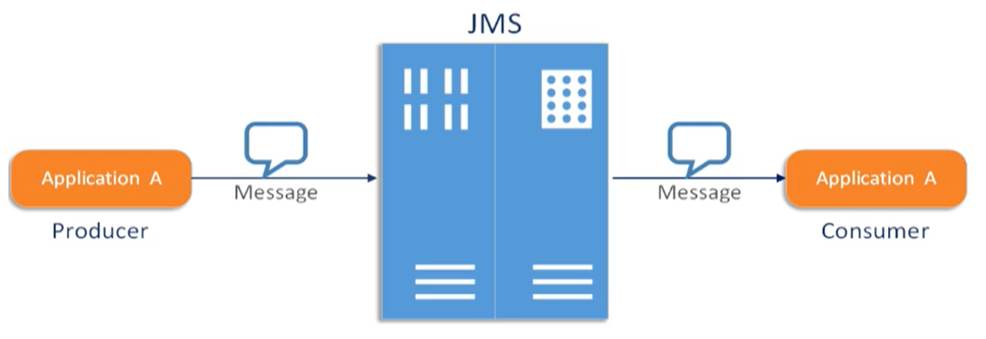
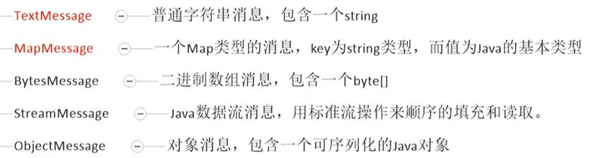

# ActiveMQ

## 1. ActiveMQ 的安装

Apache ActiveMQ 下载 Linux 版 tarball

- 运行

```bash
./bin/activemq start
```

- 停止

```bash
./bin/activemq stop
```

## 2. 接收消息的两种方法

### recive() 方法

```java
public class JmsConsumer {
    private static final String ACTIVE_MQ_URL = "tcp://192.168.2.200:61616";
    private static final String QUEUE_NAME = "queue01";

    public static void main(String[] args) throws JMSException, IOException {
        ActiveMQConnectionFactory activeMQConnectionFactory = new ActiveMQConnectionFactory(ACTIVE_MQ_URL);

        Connection connection = activeMQConnectionFactory.createConnection();
        connection.start();

        Session session = connection.createSession(false, Session.AUTO_ACKNOWLEDGE);

        Queue queue = session.createQueue(QUEUE_NAME);
        MessageConsumer consumer = session.createConsumer(queue);

        while (true) {
            TextMessage message = (TextMessage) consumer.receive(6000L);
            if (null != message) {
                System.out.println(message.getText());
            } else {
                break;
            }
        }

        consumer.close();
        session.close();
        connection.close();
    }
}
```

### 监听器

```java
public class JmsConsumer {
    private static final String ACTIVE_MQ_URL = "tcp://192.168.2.200:61616";
    private static final String QUEUE_NAME = "queue01";

    public static void main(String[] args) throws JMSException, IOException {
        ActiveMQConnectionFactory activeMQConnectionFactory = new ActiveMQConnectionFactory(ACTIVE_MQ_URL);

        Connection connection = activeMQConnectionFactory.createConnection();
        connection.start();

        Session session = connection.createSession(false, Session.AUTO_ACKNOWLEDGE);

        Queue queue = session.createQueue(QUEUE_NAME);
        MessageConsumer consumer = session.createConsumer(queue);

        // 监听器方法
        consumer.setMessageListener(message -> {
            if (null != message && message instanceof TextMessage) {
                TextMessage textMessage = (TextMessage) message;
                try {
                    System.out.println(textMessage.getText());
                } catch (JMSException e) {
                    e.printStackTrace();
                }
            }
        });

        System.in.read();
        consumer.close();
        session.close();
        connection.close();
    }
}
```

## 3. JMS规范

### 3.1 JMS是什么

Java消息服务(Java Message Service)指的是两个应用程序之间进行异步通信的API，它为标准协议和消息服务提供了一组通用接口，包括创建、发送、读取消息等，用于支持Java应用程序开发。在JavaEE中，当两个应用程序使用JMS进行通信时，它们之间不是直接相连的，而是通过一个共同的消息收发服务组件关联起来以达到解耦/异步削峰的效果。




### 3.2 消息头

JMS 的消息头有以下常用属性：
**JMSDestination**：消息目的地
**JMSDeliveryMode**：消息持久化模式
**JMSExpiration**：消息过期时间
**JMSPriority**：消息的优先级
**JMSMessageID**：消息的唯一标识符。后面我们会介绍如何解决幂等性。

说明：消息的生产者可以set这些属性，消息的消费者可以get这些属性。
这些属性在send方法里面也可以设置。

### 3.3 消息体


5种消息体格式：



### 3.4 消息属性

如果需要除消息头字段之外的值，那么可以使用消息属性。他是识别/去重/重点标注等操作，非常有用的方法。
他们是以属性名和属性值对的形式制定的。可以将属性是为消息头的扩展，属性指定一些消息头没有包括的附加信息，比如可以在属性里指定消息选择器。消息的属性就像可以分配给一条消息的附加消息头一样。它们允许开发者添加有关消息的不透明附加信息。它们还用于暴露消息选择器在消息过滤时使用的数据。

## 如何保证消息的可靠性

1. 消息的持久化
2. 事务
3. 签收机制

### 1.消息的持久化与非持久化

- 非持久化
服务器宕机，消息不存在。

```java
messageProducer.setDeliveryMode(DeliveryMode.NON_PERSISTENT);
```

- 持久化
服务器宕机后，消息依然存在。

```java
messageProducer.setDeliveryMode(DeliveryMode.PERSISTENT);
```

> 持久化消息，保证这些消息只被传送一次和成功使用一次。对于这些消息，可靠性是优先考虑的因素。
> 可靠性的另一个重要方面是确保持久性消息传送至目标后，消息服务在向消费者传送它们之前不会丢失这些消息。

在不设置 producer 的 **DeliveryMode** 时，默认为持久化。

## Q & A

### ActiveMQ 启动后无法访问 Console

1. `firewalld` 端口未放开
2. `jetty` 监听的 ip 为 **127.0.0.1**，应该为 **0.0.0.0** 监听所有网卡上的请求(`conf/jetty.xml` -> `beanId = jettyPort` -> `host`)

## JavaEE

Java EE是一系列技术标准所组成的平台，包括：

- **Applet** - Java Applet
- **EJB** - 企业级JavaBean（Enterprise Java Beans）
- **JAAS** - Java Authentication and Authorization Service
- **JACC** - J2EE Authorization Contract for Containers
- **JAF** - Java Beans Activation Framework
- **JAX-RPC** - Java API for XML-Based Remote Procedure Calls
- **JAX-WS** - Java API for XML Web Services
- **JAXM** - Java API for XML Messaging
- **JAXP** - Java XML解析API（Java API for XML Processing）
- **JAXR** - Java API for XML Registries
- **JCA** - J2EE连接器架构（J2EE Connector Architecture）
- **JDBC** - Java数据库联接（Java Database Connectivity）
- **JMS** - Java消息服务（Java Message Service）
- **JMX** - Java Management
- **JNDI** - Java名称与目录接口（Java Naming and Directory Interface）
- **JSF** - Java Server Faces
- **JSP** - Java服务器页面（Java Server Pages）
- **JSTL** - Java服务器页面标准标签库（Java Server Pages Standard Tag Library）
- **JTA** - Java事务API（Java Transaction API）
- **JavaMail**
- **Servlet** - Java Servlet API
- **StAX** - Streaming APIs for XML Parsers
- **WS** - Web Services
