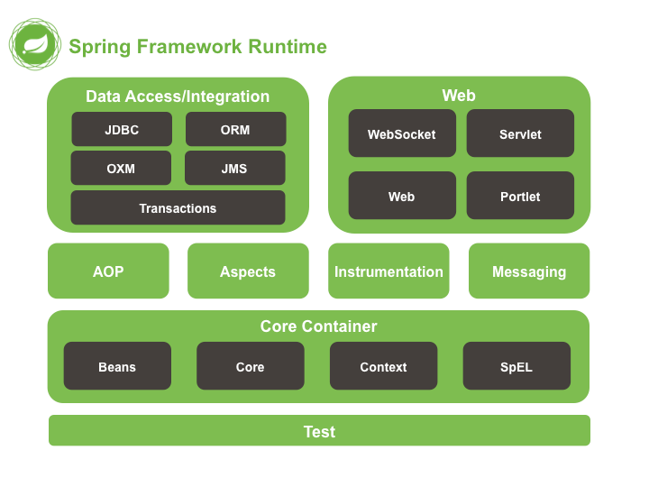
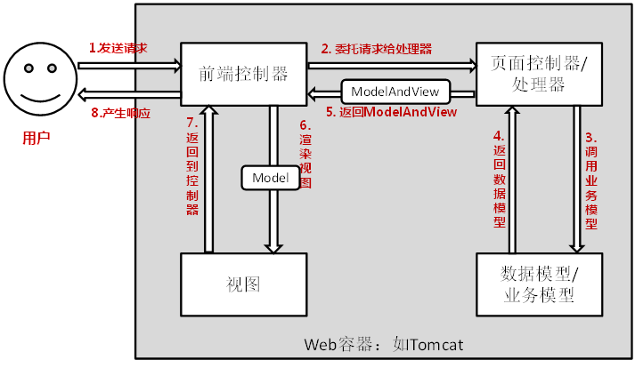

# SpringMVC笔记

## SpringMVC简介

Spring 为展现层提供的基于 MVC 设计理念的优秀的 Web 框架，是目前最主流的 MVC 框架之一

SpringMVC属于Spring框架中的web模块



## HelloWorld

**流程**:
1 导包

```text
日志记录
commons-logging-1.1.3.jar
支持注解
spring-aop-4.0.0.RELEASE.jar

Spring核心容器模块
spring-beans-4.0.0.RELEASE.jar
spring-context-4.0.0.RELEASE.jar
spring-core-4.0.0.RELEASE.jar
spring-expression-4.0.0.RELEASE.jar

Spring Web模块
spring-web-4.0.0.RELEASE.jar
spring-webmvc-4.0.0.RELEASE.jar
```

2 写配置

配置springmvc的前端控制器，指定springmvc配置文件位置

**WEB-INF/web.xml**:

```xml
<!-- SpringMVC思想是有一个前端控制器能拦截所有请求，并智能派发;
  	这个前端控制器是一个servlet；应该在web.xml中配置这个servlet来拦截所有请求
   -->

<!-- The front controller of this Spring Web application, 
responsible for handling all application requests -->
<servlet>
    <servlet-name>springDispatcherServlet</servlet-name>
    <servlet-class>org.springframework.web.servlet.DispatcherServlet</servlet-class>

    <init-param>
        <!-- contextConfigLocation:指定SpringMVC配置文件位置 -->
        <param-name>contextConfigLocation</param-name>
        <param-value>classpath:springmvc.xml</param-value>
    </init-param>
    <!-- servlet启动加载，servlet原本是第一次访问创建对象；
    load-on-startup:服务器启动的时候创建对象；值越小优先级越高，越先创建对象；
        -->
    <load-on-startup>1</load-on-startup>
</servlet>

<!-- Map all requests to the DispatcherServlet for handling -->
<servlet-mapping>
    <servlet-name>springDispatcherServlet</servlet-name>
    <!--  
        /*和/都是拦截所有请求； /：会拦截所有请求，但是不会拦截*.jsp；能保证jsp访问正常；
        /*的范围更大；还会拦截到*.jsp这些请求；一但拦截jsp页面就不能显示了；
        -->
    <url-pattern>/</url-pattern>
</servlet-mapping>
```

3 使用注解标注控制器

```java
@Controller
public class MyFirstController {
/**
    *   @RequestMapping:告诉SpringMVC这个方法处理什么请求；
    *   / 代表从当前项目下开始；处理当前项目下的hello请求
    */
@RequestMapping("/hello")
public String myfirstRequest(){
    System.out.println("请求收到了....正在处理中");
    //视图解析器自动拼串；
    //<property name="prefix" value="/WEB-INF/pages/"></property>
    //<property name="suffix" value=".jsp"></property>
    //   (前缀)/WEB-INF/pages/+返回值(success)+后缀（.jsp）
    return "success";
}
```

(配置视图解析器用于页面地址的拼接)

**spring.xml**:

```xml
<!-- 配置一个视图解析器 ；能帮我们拼接页面地址-->
<bean class="org.springframework.web.servlet.view.InternalResourceViewResolver">
    <property name="prefix" value="/WEB-INF/pages/"></property>
    <property name="suffix" value=".jsp"></property>
</bean>
```

**配置总结**:

1. 配置依赖
2. 配置web.xml,使前置控制器拦截所有在web.xml没有匹配到url-pattern的请求
3. 配置Spring.xml,开启自动注解扫描(,配置视图解析器,用于请求转发时的url拼串)
4. 为控制器添加注解(@Controller/@RequestMapping)

**运行流程**:



1. 客户端请求提交到DispatcherServlet
2. 由DispatcherServlet控制器查询一个或多个HandlerMapping，找到处理请求的Controller
3. DispatcherServlet将请求提交到Controller（也称为Handler）
4. Controller调用业务逻辑处理后，返回ModelAndView
5. DispatcherServlet查询一个或多个ViewResoler视图解析器，找到ModelAndView指定的视图
6. 视图负责将结果显示到客户端

1）、客户端点击链接会发送 `http://localhost:8080/springmvc/hello` 请求
2）、来到tomcat服务器；
3）、SpringMVC的前端控制器收到所有请求；
4）、来看请求地址和@RequestMapping标注的哪个匹配，来找到到底使用那个类的哪个方法来处理
5）、前端控制器找到了目标处理器类和目标方法，直接利用返回执行目标方法；
6）、方法执行完成以后会有一个返回值；SpringMVC认为这个返回值就是要去的页面地址
7）、拿到方法返回值以后；用视图解析器进行拼串得到完整的页面地址；
8）、拿到页面地址，前端控制器帮我们转发到页面；

**RequestMapping**:
@RequestMapping；
就是告诉SpringMVC；这个方法用来处理什么请求；
这个/是可以省略，即使省略了，也是默认从当前项目下开始；
习惯加上比较好    /hello  /hello
一个请求路径只能由一个方法处理,否则抛异常

**默认配置文件位置**:
如果不指定配置文件位置？
如果不指定也会默认去找一个文件；
就在web应用的/WEB-INF下创建一个名叫`前端控制器名-servlet.xml`

**url-pattern**:

`/`: 拦截所有请求，不拦截jsp页面，*.jsp请求
`/*`: 拦截所有请求，拦截jsp页面，*.jsp请求
处理`*.jsp`是tomcat做的事；所有项目的小web.xml都是继承于大web.xml(Tomcat全局web配置)
DefaultServlet是Tomcat中处理静态资源的Servlet
除过jsp，和servlet外剩下的都是静态资源；
index.html：静态资源，tomcat就会在服务器下找直接到这个资源并返回;
我们前端控制器的/禁用了tomcat服务器中的DefaultServlet
1）服务器的大web.xml中有一个DefaultServlet是url-pattern=/
2）我们的配置中前端控制器 url-pattern=/
静态资源会来到DispatcherServlet（前端控制器）看那个方法的RequestMapping是这个index.html
3）为什么jsp又能访问；因为我们没有覆盖服务器中的JspServlet的配置
4） `/*`  直接就是拦截所有请求；我们写`/`；也是为了迎合后来Rest风格的URL地址

## Tomcat url-pattern匹配规则

详情: [Servlet容器Tomcat中web.xml中url-pattern的配置详解[附带源码分析]](https://www.cnblogs.com/fangjian0423/p/servletcontainer-tomcat-urlpattern.html)

用户请求这里进行url匹配的时候是有优先级的。 我们从上到下以优先级的高低进行说明：

规则1：精确匹配，使用contextVersion的exactWrappers (url-pattern直接写明路径)
规则2：前缀匹配，使用contextVersion的wildcardWrappers (url-pattern以`/*`结尾)
规则3：扩展名匹配，使用contextVersion的extensionWrappers (url-pattern以`*.`开始,如JspServlet)
规则4：使用资源文件来处理servlet，使用contextVersion的welcomeResources属性，这个属性是个字符串数组
规则7：使用默认的servlet，使用contextVersion的defaultWrapper (url-pattern == `/`,如DefaultServlet,用于加载静态资源)

根据上述url匹配优先级:
若Spring的前端控制器的url-pattern为`/*`,前缀匹配优先级高于扩展名匹配,所以原本由JspServlet(`url-pattern=*.jsp`)处理的jsp资源请求将被Spring的前端控制器处理,从而不能正确返回jsp页面

## @RequestMapping

@RequestMapping可以标注在**类**和**方法**上,标注在类上表示为当前类所有的方法的请求地址指定一个基准路径

```java
@RequestMapping("test")
@Controller
public class RequestMappingController {

    @RequestMapping("/handle01")
    public String handle01() {
        System.out.println("RequestMappingController.handle01");
        return "success";
    }
}
```

若要调用handle01方法,则要访问路径为`/test/handle01`,@RequestMapping()中的路径中的`/`可以省略,层级关系之间能够自动加入`/`进行分割

### 属性

#### method

限定请求方式
HTTP协议中的所有请求方式：
【GET】, HEAD, 【POST】, PUT, PATCH, DELETE, OPTIONS, TRACE
method=RequestMethod.POST：只接受这种类型的请求，默认是什么都可以；
@RequestMapping(value = "/handle01", method = {RequestMethod.POST, RequestMethod.GET})
不是规定的方式报错：4xx:都是客户端错误
405 - Request method 'GET' not supported

#### param

params：规定请求参数
params 和 headers支持简单的表达式：

param1: 表示请求必须包含名为 param1 的请求参数
eg：params={"username"}:
发送请求的时候必须带上一个名为username的参数；没带都会400

---
!param1: 表示请求不能包含名为 param1 的请求参数
eg:params={"!username"}
发送请求的时候必须不携带上一个名为username的参数；带了都会400

---
param1 != value1: 表示请求包含名为 param1 的请求参数，但其值不能为 value1
eg：params={"username!=123"}
发送请求的时候;携带的username值必须不是123(不带username或者username不是123)

---
{“param1=value1”, “param2”}: 请求必须包含名为 param1 和param2 的两个请求参数，且 param1 参数的值必须为 value1
eg:params={"username!=123","pwd","!age"}
`@RequestMapping(value = "/handle02", params = {"username=123", "age!=88", "!sex"})`
请求参数必须满足以上规则；
请求的username不能是123，必须有pwd的值，不能有age

**NOTE**: param指定的参数是url上的参数,不规定post请求体中的参数,也就是说param属性是用来规定**请求行(GET请求参数)** 的

#### header

规定请求头的各个字段及其值,也和params属性一样能写简单的表达式

`@RequestMapping(value = "/handle03", header = {"user-agent=...", "...", ...})`

#### consumes

只接受内容类型是哪种的请求，规定请求头中的Content-Type

#### produces

告诉浏览器返回的内容类型是什么，给响应头中加上Content-Type:text/html;charset=utf-8

### ant风格的url

URL地址可以写模糊的通配符：
`?` : 能替代任意一个字符
`*` : 能替代任意多个字符，和一层路径
`**` : 能替代多层路径

## 请求参数获取

### @PathVariable 路径上的占位符

`@RequestMapping`上的URL可以使用占位符,占位符的值能够作为参数传给控制器方法

语法就是可以在任意路径的地方写一个{变量名}
**NOTE**: 路径上的占位符只能占一层路径,url匹配时占位符优先级最高

```java
@RequestMapping("/{username}")
public String handle03(@PathVariable("username") String username) {
    System.out.println("占位符为: " + username);
    return "success";
}
```

### REST风格的URL地址约束

使用简洁的URL提交请求，以请求方式区分对资源操作

|URL|请求方法|操作|
|--|--|--|
|books/1|GET|获取一号图书的资源|
|books/1|PUT|更新一号图书的资源|
|books/1|DELETE|删除一号图书的资源|
|books|POST|插入一个图书记录|

URL使用`/资源名/资源标识符`的形式,CRUD操作通过请求方法来进行区分

**实现代码**:

```java
@Controller
public class BookController {
    /**
     * 处理查询图书请求
     * @param id
     * @return
     */
    @RequestMapping(value="/book/{bid}",method=RequestMethod.GET)
    public String getBook(@PathVariable("bid")Integer id) {
        System.out.println("查询到了"+id+"号图书");
        return "success";
    }

    /**
     * 图书删除
     * @param id
     * @return
     */
    @RequestMapping(value="/book/{bid}",method=RequestMethod.DELETE)
    public String deleteBook(@PathVariable("bid")Integer id) {
        System.out.println("删除了"+id+"号图书");
        return "success";
    }

    /**
     * 图书更新
     * @return
     */
    @RequestMapping(value="/book/{bid}",method=RequestMethod.PUT)
    public String updateBook(@PathVariable("bid")Integer id) {
        System.out.println("更新了"+id+"号图书");
        return "success";
    }

    @RequestMapping(value="/book",method=RequestMethod.POST)
    public String addBook() {
        System.out.println("添加了新的图书");
        return "success";
    }
}
```

由于jsp只能发送GET和POST请求,无法发送DELETE和PUT请求,所以需要使用spring提供的filter来将请求在交给controller处理前修改请求方法

`HiddenHttpMethodFilter`拦截所有请求,如果请求是POST方式,并且有`_method`属性,则将HttpRequest中的method属性值改为指定的请求方法,然后放行.否则直接放行

```xml
<filter>
    <filter-name>HiddenHttpMethodFilter</filter-name>
    <filter-class>org.springframework.web.filter.HiddenHttpMethodFilter</filter-class>
</filter>

<filter-mapping>
    <filter-name>HiddenHttpMethodFilter</filter-name>
    <url-pattern>/*</url-pattern>
</filter-mapping>
```

jsp中的DELETE和PUT请求的提交方式:

```html
<!-- 普通GET请求 -->
<a href="book/1">查询图书</a>
<br/>

<!-- 普通POST请求 -->
<form action="book" method="post">
    <input type="submit" value="添加1号图书"/>
</form>
<br/>

<!-- 发送DELETE请求 -->
<!-- 在表单中添加_method属性,并指定请求方式 -->
<form action="book/1" method="post">
    <input name="_method" value="delete"/>
    <input type="submit" value="删除1号图书"/>
</form><br/>

<!-- 发送PUT请求 -->
<!-- 在表单中添加_method属性,并指定请求方式 -->
<form action="book/1" method="post">
    <input name="_method" value="put"/>
    <input type="submit" value="更新1号图书"/>
</form><br/>
```

### 高版本的Tomcat的RestCURD不接收DELETE和PUT请求方法

由于高版本Tomcat只能接收GET和POST请求方法,不接受DELETE和PUT,所以导致了405  
可以将jsp页面设置为errorpage,这样tomcat的异常将不会抛出

### @RequestParam

SpringMVC默认方式获取请求参数: 直接给方法上写一个和请求参数同名的变量,这个变量来接收请求参数的值  
如果请求存在这个参数则传入这个参数,如果没有这个参数,则传入null

`@RequestParam`注解可以标注方法的形参,表示该形参传入的是`@RequestParam`指定的请求参数值,这个指定的请求参数在请求中必须携带,否则`HTTP Status 400 - Required String parameter 'RequestParameter' is not present`

属性`required`可以指定这个请求参数是否是必须的,默认为true.该为false后,若请求参数不存在这传入null

属性`defaultValue`指定没有指定请求参数时,传入的值

```java
public String handle01(@RequestParam(value = "username", required = false, defaultValue = "noParam") String user) {}
```

<==>

```java
String user = request.getParameter("username") != null ? request.getParameter("username") : "noParam";
```

#### 和@PathVariable的区别

@PathVariable是用于获取url路径上的值,而@RequestParam用于获取请求参数的值

### @RequestHeader

获取请求头中的值,同样也有required和defaultValue属性,可以设定该请求头参数是否必须以及默认值

若请求头中没有带指定的键值对,则 **HTTP Status 400 - Missing request header 'User_Agent' for method parameter of type String**

```java
public String handle02(@RequestHeader(value = "Header-Agent", required = false, defaultValue = "noHeader") String header) {}
```

<==>

```java
String header = request.getHeader("Header-Agent") != null ? request.getHeader("Header-Agent") != null : "noHeader";
```

### @CookieValue

获取某个cookie的值,也用required和defaultValue两个属性

若浏览器没有指定cookie:**HTTP Status 400 - Missing cookie 'JSESSIONID' for method parameter of type String**

拥有required和defaultValue属性

```java
    public String handle03(@CookieValue("JSESSIONID") String jid) {}
```

### 自定义POJO的自动封装

SpringMVC能够自动地将请求参数(GET/POST都可以)封装到一个pojo中

1）、将POJO中的每一个属性，从request参数中尝试获取出来，并封装即可.若未找到pojo中属性对应的请求参数,则该属性封装为null(引用类型属性)或"null"(String类型属性)或0(Java原生数字类型)
2）、还可以级联封装,属性的属性
3）、请求参数的参数名和对象中的属性名一一对应就行

```java
 @RequestMapping("/book")
public String handle04(Book book) {
    System.out.println(book);
    return "success";
}
```

```html
<form action="book" method="post">
    书名: <input type="text" name="bookName"><br>
    售价: <input type="text" name="price"><br>
    作者: <input type="text" name="author"><br>
    作者省: <input type="text" name="address.province"><br>
    作者市: <input type="text" name="address.city"><br>
    <input type="submit" value="提交">
</form>
```

### 原生ServletAPI

SpringMVC可以直接在参数上写原生API(javax.servlet包中)

```java
@RequestMapping("Servlet")
public String handle05(HttpServletRequest request, HttpServletResponse response, HttpSession session) {
    request.setAttribute("requestTest", "请求域参数");
    session.setAttribute("sessionTest", "会话域中参数");
    return "success";
}
```

**HttpServletRequest**
**HttpServletResponse**
**HttpSession**

**java.security.Principal**
Locale：国际化有关的区域信息对象

**InputStream**：
ServletInputStream inputStream = request.getInputStream();
**OutputStream**：
ServletOutputStream outputStream = response.getOutputStream();

**Reader**：
BufferedReader reader = request.getReader();
**Writer**：
PrintWriter writer = response.getWriter();

### 中文乱码的解决

**请求乱码**:

GET请求：改server.xml；在8080端口处URIEncoding="UTF-8" (高版本Tomcat以解决)

POST请求：
在第一次获取请求参数之前设置 `request.setCharacterEncoding("UTF-8");`
自己写一个filter,SpringMVC已经实现了这个filter

响应乱码：
`response.setContentType("text/html;charset=utf-8")`

**设置Spring提供的CharacterEncodingFilter**:

/WEB-INF/web.xml

```xml
<!-- 配置一个字符编码的Filter；一定注意：字符编码filter一般都在其他Filter之前； -->
<filter>
    <filter-name>CharacterEncodingFilter</filter-name>
    <filter-class>org.springframework.web.filter.CharacterEncodingFilter</filter-class>

    <!-- encoding：指定解决POST请求乱码 -->
    <init-param>
        <param-name>encoding</param-name>
        <param-value>UTF-8</param-value>
    </init-param>

    <!-- forceEncoding:强制刷新Request或Response的编码字符集,顺手解决响应乱码；response.setCharacterEncoding(this.encoding); -->
    <init-param>
        <param-name>forceRequestEncoding</param-name>
        <param-value>true</param-value>
    </init-param>
    <init-param>
        <param-name>forceResponseEncoding</param-name>
        <param-value>true</param-value>
    </init-param>

</filter>
<filter-mapping>
    <filter-name>CharacterEncodingFilter</filter-name>
    <url-pattern>/*</url-pattern>
</filter-mapping>
```

**NOTE**: CharacterEncodingFilter要设置在HiddenHttpMethodFilter(用于转换PUT/DELETE请求)前面,否则前者不起作用  
url-pattern都被匹配的情况下,filter的执行顺序按照web.xml中配置的顺序执行.由于HiddenHttpMethodFilter中已经获取的请求参数,所以CharacterEncodingFilter的修改编码字符集的设置没有起作用.

SpringMVC前端控制器写完就直接写字符编码过滤器

该过滤器源码中将传入的request的编码设定为了传入的encoding值

## 数据输出

### 1. Map Model ModelMap参数

SpringMVC除过在方法上传入原生的request和session外还能怎么样把数据带给页面
1）、可以在方法处传入Map、或者Model或者ModelMap。
给这些参数里面保存的所有数据都会放在请求域中。可以在页面获取

关系：
Map，Model，ModelMap：最终都是BindingAwareModelMap在工作；
给BindingAwareModelMap中保存的东西都会被放在请求域中；


示例代码:

```java
@Controller
public class OutputController {
    @RequestMapping("/output01")
    public String handle01(Map<String, Object> outputMap) {
        outputMap.put("msg", "map");
        System.out.println(outputMap.getClass());
        return "success";
    }

    @RequestMapping("/output02")
    public String handle02(Model model) {
        model.addAttribute("msg", "model");
        System.out.println(model.getClass());
        return "success";
    }

    @RequestMapping("/output03")
    public String handle03(ModelMap modelMap) {
        modelMap.put("msg", "modelMap");
        System.out.println(modelMap.getClass());
        return "success";
    }
}
```

### 2. ModelAndView返回类型

2）、方法的返回值可以变为ModelAndView类型；
既包含视图信息（页面地址）也包含模型数据（给页面带的数据）；
而且数据是放在请求域中；
request、session、application中request最常用,所以Spring的数据返回放在了request中

示例代码:

```java
@RequestMapping("/output04")
public ModelAndView handle04() {
    ModelAndView modelAndView = new ModelAndView("success");
    modelAndView.addObject("msg", "modelAndView");
    System.out.println(modelAndView.getClass());
    return modelAndView;
}
```

new ModelAndView时能够使用默认构造器,然后再设置视图名字

```java
@RequestMapping("/output04")
public ModelAndView handle04() {
    ModelAndView modelAndView = new ModelAndView();
    modelAndView.setViewName("success");
    modelAndView.addObject("msg", "modelAndView");
    System.out.println(modelAndView.getClass());
    return modelAndView;
}
```

### 3. @SessionAttributes将数据写入HttpSesssion中

SpringMVC提供了一种可以临时给Session域中保存数据的方式；
使用一个注解`@SessionAttributes`(只能标在类上)

`@SessionAttributes(value="msg")`
给BindingAwareModelMap中保存的数据，或者ModelAndView中的数据，
同时给session中放一份；
value指定保存数据时要给session中放的数据的key；
value={"msg", "..."}：只要BindingAwareModelMap/ModelAndView中保存的是这种key的数据，给Session中放一份
types={String.class, ...}：只要保存的是这种类型的数据，给Session中也放一份

后来推荐@SessionAttributes就别用了，可能会引发异常；
给session中放数据请使用**原生API HttpSession**

### @ModelAttribute

用于解决全字段更新时,部分字段不允许更新从而导致该字段的数据没有从请求参数中传过来传给Controller,最后导致dao更新数据库时将null值覆盖了原本不允许更新/用户未更新的字段.

在dao层可以使用mybatis的动态SQL解决该问题

被`@ModelAttribute`修饰的方法将先于目标处理方法运行,将数据库中的数据封装至bean,然后存入BindingAwareModelMap中.  
目标方法的bean参数用`@ModelAttribute`修饰,表示该参数从BindingAwareModelMap中获取,并根据请求参数更新其中对应的属性.而不是直接创建新的bean对象,导致未赋值的值为null的问题.

工作原理


## 源码分析
