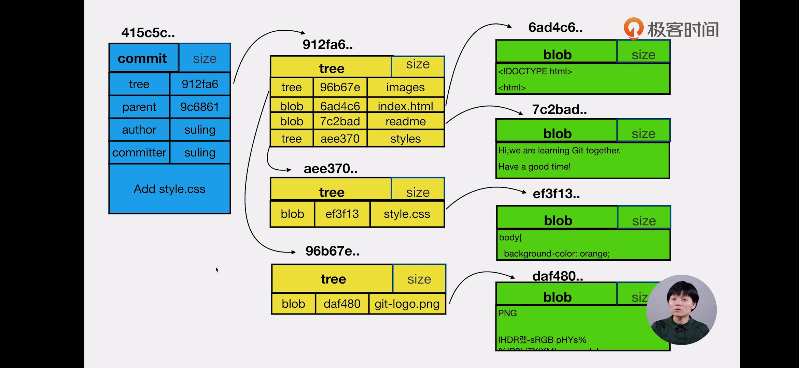
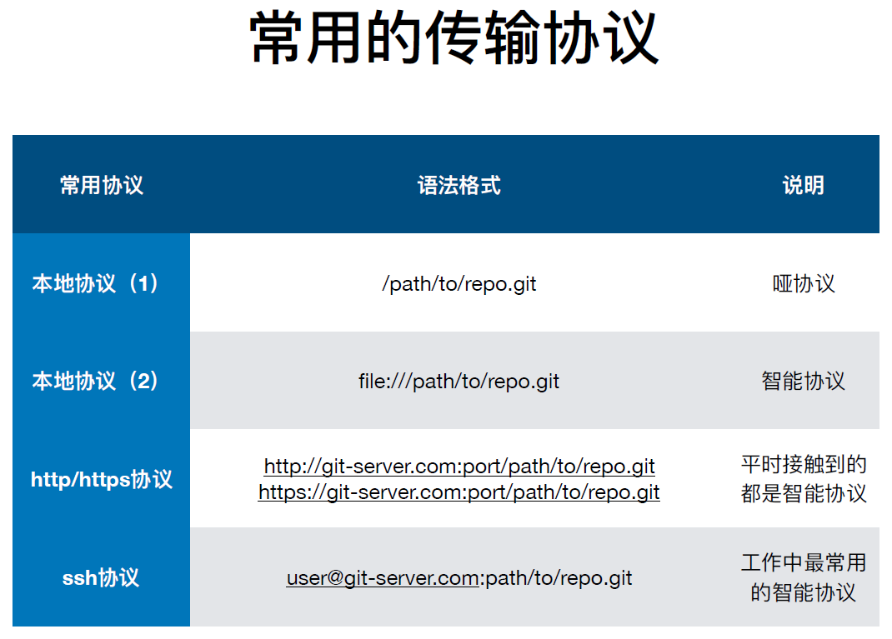

# git笔记

## git的基本操作

### config的3个作用域

**local**:只对当前仓库有效
**global**:对登录用户所有仓库有效
**system**:对系统的所有用户有效

3个作用域的优先级：  


```shell
git config --list --local                       # 查看版本库范围的所有设置(若不指定local，则显示所有范围的设置)
git config --list --global                      # 查看global范围的设置参数
git config --list --system                      # 查看system范围的设置
git config --list user.name                     # 只显示user.name的值
git config --local user.name 'username'         # 修改local(版本库)范围的user.name(若不加变量作用域，则默认为local)
git config --global user.email 'email@domain'   # 修改global范围的user.email3
git config --unset varname                      # 删除变量
git config --local --edit                       # 使用文本编辑器编辑各域的配置文件(默认为local)
```

### git的别名

[git的别名(git-scm)](https://git-scm.com/book/zh/v2/Git-%E5%9F%BA%E7%A1%80-Git-%E5%88%AB%E5%90%8D)

```shell
git config --local alias.amend commit -a --amend
```

一下两条命令等价:

```shell
git commit -a --amend
git amend
```

```shell
git config --global alias.visual '!gitk'        # 设置执行外部命令
```

### git常用命令

```shell
git init                        # 初始化版本库
git add filename                # 添加文件至暂存区
git add -u                      # 添加已tracked并修改的文件至暂存区
git add -A                      # 将当前工作区的所有文件add至暂存区
git commit -m 'commit message'  # 提交当前暂存区至历史版本库
```

```shell
git status                      # 查看工作区的状态
git log --all --oneline --gragh # 查看版本库的提交历史
                                # --all:查看所有分支的提交历史，默认为当前分支
                                # --oneline:所有提交历史显示成一行
                                # --gragh:图像化的显示提交的历史，若有all选项，则会显示所有分支的演进过程
git log branchname              # 查看指定分支的提交历史，与--all一起使用则无效
git branch -v                   # 显示分支 -v:分支最后一次提交的message
```

### git的结构

**下图中存在的问题: git reset \<file\> 只将repo中的文件恢复至staging 而不恢复workspace**


### .git目录

* **HEAD** : 当前的分支的引用(refs/heads/master)
* **config** : local的配置文件(当前版本库)
* **refs** : heads 和 tags
* **/refs/heads/master** : master指针指向的commit ID
* **objects** ：git的对象  dirname + filename = object_ID

```shell
git cat-file -t object  # 查看该对象的类型(type)
git cat-file -p object  # 查看该对象的内容
```

### git的对象

1. **commit**   提交/变更
2. **tree**     树
3. **blob**     文件

#### 结构示意图



一个tree可以包含多个blob和多个tree。一个tree对应一个目录，这个tree会包含这个目录下的所有blob和tree(目录的嵌套)。  
git add 执行后会在.git/objects/中创建对应文件的blob，commit后创建commit和tree

### 分离HEAD(头指针)

```shell
git checkout commitID           # 切换HEAD到某个commit，切换分支
```

HEAD->commitID
在此基础上能够继续commit，但若checkout至其他branch,则在头指针分离的情况下的commit会丢失。

### 分支的创建

```shell
git checkout -b branchname commitID(branch)         # 创建新的分支
git diff HEAD HEAD^                                 # 比较HEAD和HEAD的父commit的差别
HEAD^2                                              # 第2个父节点
HEAD~2                                              # 父节点 的 父节点
```

可以基于某个分支创建新的分支，也能基于某个commit创建新分支。HEAD指向分支 == 指向那个分支最新的commit。

### 分支的删除

```shell
git branch -d branch_name       # 删除指定的分支
git branch -D branch_name       # 强制删除该分支
```

使用-d 在删除前Git会判断在该分支上开发的功能是否被merge的其它分支。如果没有，不能删除。如果merge到其它分支，但之后又在其上做了开发，使用-d还是不能删除。-D会强制删除。

### commit message的修改

```shell
git commit --amend              # 修改最近一次commit。若stage中有内容，则会将这些stage中的文件合并至上一次的commit中。
                                # 该commit在修改后commitID会发生变化，因为message作为commit的一个属性发生变化后,commit hash发生了变化
git rebase -i parentCommitID    # 修改任意一次的commit parentCommitID为父commitID
```

进入rebase交互模式后，修改需要修改的commit前的pick为r,随后:wq,将分离HEAD至该commit，自动调用vim编辑该`commit(.git/COMMIT_EDITMSG)`,:wq后会重建所有后续commit，commitID会发生变化

### 多个commit合并为一个commit

```shell
git rebase -i parentCommit
squash commitID
```

git rebase -i 开始commit [结束commit], 在执行这个命令时，
如果没有指定 结束commit,那么结束commit 默认为当前分支最新的 commit，那么rebase 结束后会自动更新当前分支指向的 commit,
如果指定了结束 commit，而且结束 commit不是当前分支最新的 commit，那么rebase 后会有生成一个 游离的 HEAD，而且当前分支指向的commit 不会更新

### 不连续的commit的合并

在`rebase -i`中，调整commit的顺序后再sqaush
?文件的变更历史发生了变化，文件内容是否不完整，影响正常理解

### git diff

```shell
git diff --cached                               # 比较暂存区和HEAD(当前分支)之间的差异
git diff --staged
git diff [filename]                             # 比较工作区和暂存区之间的差异
git diff HEAD [filename]                        # 比较工作区与HEAD之间的差异
git diff commitID_old commitID_new [filename]   # 后边的commit与前边的commit做对比，可以指定对比的文件
```

### git reset & git checkout

```shell
git reset --soft commitID           # 将HEAD的引用(即当前分支)指向commit
git reset [--mixed] commitID        # 将HEAD的引用(即当前分支)指向commit,并将暂存区的内容同步成commit的内容(commit-->stage)
git reset --hard commitID           # 将HEAD的引用(即当前分支)指向commit,使暂存区和工作区的内容都恢复成commitID的内容，！“工作区危险”命令！，会丢失工作区中的内容！
                                    # 等价于 删除了commitID后的所有commit，HEAD/ref->commitID,并使暂存区和工作区都同步成HEAD
git reset [commitID] filename       # file level,有filename时恢复暂存区中该文件为commit中的内容(对暂存区操作)(commit缺省值为HEAD)

git checkout commitID               # 将历史库中的内容覆盖至WD&index(切换分支)
git checkout [commitID] filename    # file level,将commit的内容覆盖到index和workdir(commit-->index/workspace)(对工作区和暂存区操作)(commit缺省值为HEAD)
```

> 下面的速查表列出了命令对树的影响。 “HEAD” 一列中的 “REF” 表示该命令移动了 HEAD 指向的分支引用，而 “HEAD” 则表示只移动了 HEAD 自身。 特别注意 WD Safe? 一列——如果它标记为 NO，那么运行该命令之前请考虑一下。

| |HEAD|Index|Workdir|WD Safe?|
|-|----|:-----:|:-------:|:--------:|
|__Commit Level__|
|reset --soft [commit]|REF|NO|NO|YES|
|reset [commit]|REF|YES|NO|YES|
|reset --hard [commit]|REF|YES|YES|NO|
|checkout [commit]|HEAD|YES|YES|YES|
|__File Level__|
|reset (commit) [file]|NO|YES|NO|YES|
|checkout (commit) [file]|NO|YES|YES|NO|

**[更详细的解释，关于reset和checkout](https://git-scm.com/book/zh/v2/Git-%E5%B7%A5%E5%85%B7-%E9%87%8D%E7%BD%AE%E6%8F%AD%E5%AF%86)**

### git rm

```shell
git rm filename                     # 将暂存区和工作区中的该文件删除
git rm --cached filename            # 将暂存区中的该文件删除
git ls-files                        # 查看暂存区中的文件
```

commit之后文件会从版本库中删除

### git stash

`git stash`默认情况缓存以下文件：

~ git跟踪的但未添加到暂存区的修改

~ 添加到暂存区的修改
不会缓存以下文件：
~ 在工作目录中的新文件
~ 被忽略的文件

```shell
git stash                   # 将 git跟踪的但未添加到暂存区的修改 添加到暂存区的修改 缓存至stash list 中
git stash list              # 查看缓存中的内容
git stash pop [stash@{0}]   # 将一个stash恢复，缺省值为最近一个(stash@{0}),并在list中删除该stash
git stash apply [stash@{0}] # 将一个stash恢复，缺省值为最近一个(stash@{0}),list中不会删除该stash
```

### .gitignore

>The problem is that **.gitignore ignores just files that weren't tracked before (by git add)**. Run git reset name_of_file to unstage the file and keep it. In case you want to also remove given file from the repository (after pushing), use git rm --cached name_of_file.

.gitignore只忽略未被跟踪(`git add filename`)的文件
add后可以通过`git reset filename`来unstage,即将版本库中的该文件覆盖至index中，但因为HEAD中没有该文件，所以index中也没有该文件，等价于unstage。也能通过`git rm --cached filename`将index中的文件删除,来实现unstage
如果已经将需要ignore的文件commit,可以通过git rm --cached filename将index中的该文件删除，然后再`git commit --amend`

```shell
.gitignore:
*.class         # 忽略的文件
.idea/          # 忽略目录下的所有文件
!.git/*         # 不忽略该目录下的所有文件
```

### git的备份



```shell
git clone [--bare] url                        # 从远端clone一个仓库
```

--bare 指clone裸仓库，其中包含所有分支。否则只包含远端仓库的当前分支。

```shell
git remote -v                               # 查看远程版本库信息
git remote add reponame url                 # 添加remote
git push reponame branchname                # push 指定的分支
git push reponame --all                     # push 所有分支
```

### git fetch

将远端的仓库拉至本地，但**不执行merge**操作
`git fetch reponame`

### git pull

将远端的仓库拉至本地，并**执行merge**操作

rebase后导致HEAD和remote不是fast-forward,只能rebase remote后的commit?也不能使用amend(rebase实现)

### git 使用技巧(from PegasusWang)

```shell
alias gco='git checkout'
alias ga='git add'
alias gcm='git commit -m'
```

[av63256332](https://www.bilibili.com/video/av63256332)

### git 设置代理

```shell
git config --global http.proxy socks5://127.0.0.1:1080
```

### git的默认文本编辑器

```shell
git config --global core.editor "vim"
```

---

## 多人合作

### 双方修改了不同的文件

因为不存在冲突，所以能够auto-merge。
`git fetch && git merge ; git pull`
>如果在进行git push之前发现远程又有了更新，比较好的做法应该是，将本地的提交回退掉，避免掉无用的远程merge本地分支的提交记录，可以使用如下命令：
1.git reset HEAD~
2.git pull
然后重新进行新的提交，这样就可以避免掉远程与本地分支的merge提交记录，让git的提交历史更加干净
>>或者把本地的提交基于远端分支做 rebase ，在本地解决掉冲突并完成自测。

### 双方修改了同一文件的不同区域

因为不存在冲突，git也能够auto-merge,执行git pull && git push

### 双方修改了同一文件的同一区域

此时git无法决定保留哪个更改，所以无法auto-merge,需要手动解决冲突后，再
`git add && git commit`
或
`git add && git merge --continue`

### 同时修改了一个文件的文件名和内容

git能够自动merge rename 和 内容变更

### 同一文件改成了不同的文件名

需要手动git rm 不需要的文件，解决冲突后再`git commit -am'message'`

### 多人开发中应避免的操作

#### 向集成分支执行push -f

`git push -f remote_repo`
>自己独自使用的分支，可以采用push -f 的方式。
团队集成分支，通常做法不是去掉不想要的commit，而是把不想要的commit的内容采用revert的方式生成新的commit，以此去掉不想要的变更。然后push到远端

#### 向集成分支执行变基操作

`git rebase`

---

## Github

### search

`keywords in:readme stars:>1000`
`'code','code' filename:fileName`

### ssh key 生成

[Generating a new SSH key and adding it to the ssh-agent](https://help.github.com/en/articles/generating-a-new-ssh-key-and-adding-it-to-the-ssh-agent)

### merge

feature->master

#### merge commit

如同`git commit`，无冲突则自动merge

#### Squash and merge

把需要merge的分支的所有commit进行squash，然后merge至master
具体表现为：将feature分支所有commit squash为一个commit，然后将该commit rebase至master分支
该操作不会移动feature的refs
等价与`git merge --squash`

#### Rebase and merge

直接将feature的所有commit rebase 至 master

---

## git提交信息规范

[优雅的提交你的 Git Commit Message](https://juejin.im/post/5afc5242f265da0b7f44bee4)

[Commit message 和 Change log 编写指南](http://www.ruanyifeng.com/blog/2016/01/commit_message_change_log.html)

---
