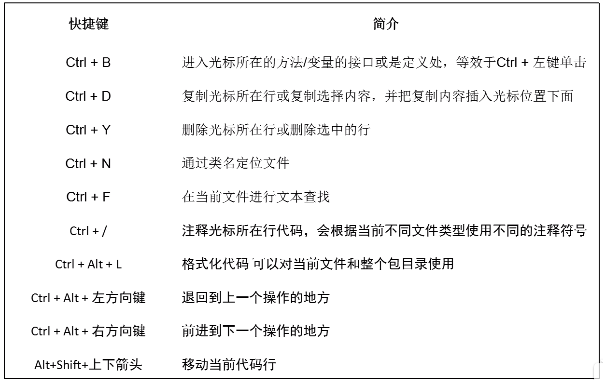
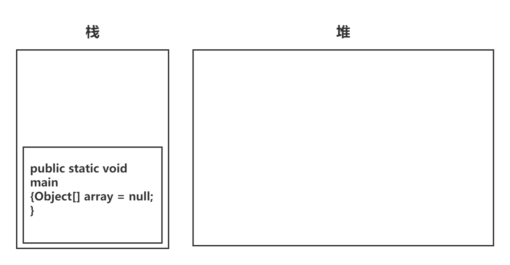
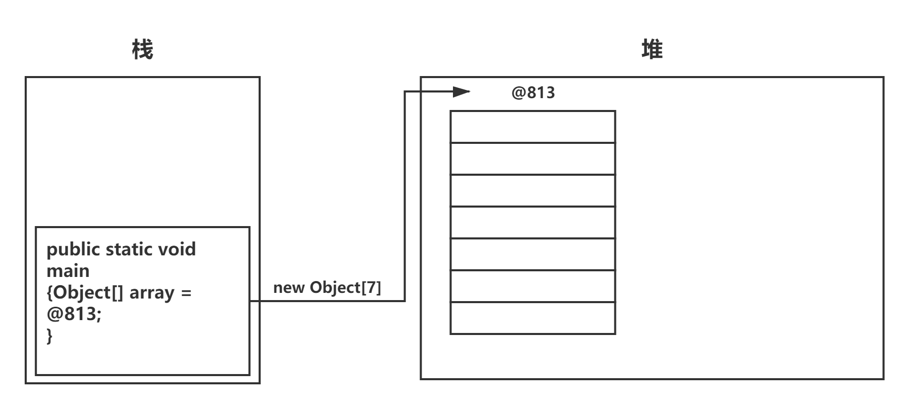
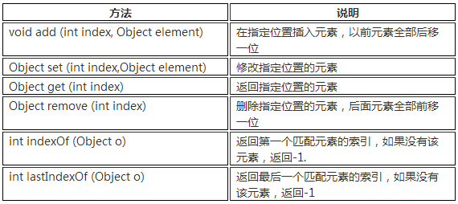

# Java学习笔记

## 学习路线

### 1. 语言的入门和进阶

- [x] Java基础语法
- [x] OO编程思想
- [x] 集合
- [x] IO
- [x] 异常
- [x] 泛型
- [x] 反射
- [ ] 多线程
- [ ] 函数式

Core Java

- [ ] lambada   1D
- [ ] 内部类    1D
- [ ] 代理      1D
- [ ] 异常      1D
- [ ] 日志      1D
- [ ] 泛型      2D
- [ ] 集合      3D
- [ ] 部署      2D
- [ ] 并发      4D
- [ ] JDBC

### 2.Web基础和工具

- [ ] 前端基础(html/javascript/css) jquery, ajax, jsp, cookie, session
- [ ] http基础
- [ ] servlet基础
- [x] git,svn代码管理工具

### 3.企业级应用框架

- [ ] maven/gradle项目管理工具
- [ ] Spring全家桶(Spring, Spring MVC, Spring Boot)
- [ ] 关系型数据库相关(MySQL, jdbc, MyBatis, Hibernate)
- [ ] 非关系型数据库(Redis)
- [ ] 模板引擎(thymeleaf, freemarker)

### 4.高级应用框架

- [ ] 搜索引擎(elastic search)
- [ ] RPC框架(Dubbo, Spring Cloud)
- [ ] 中间件技术(RabbitMQ, RocketMQ, ActiveMQ, Kafka)
- [ ] 虚拟化技术(Docker, Kubernetes)

### 5.高级话题

- [ ] jvm优化和排错, GC分析, 数据库高级优化

---

### IDEA常用快捷键



---

## 算法

### 冒泡排序

```java

public class ex5_5 {
    public static void main(String[] args) {
        int n = 10;
        int[] array = new int[n];
        for (int i = 0; i < n; i++) {
            array[i] = (int) (Math.random() * 101);
        }
        for (int num :
                array) {
            System.out.print(num + "\t");
        }
        System.out.println();
        int count = 1;
        for (int i = array.length - 1; i > 0; i--) {
            int moveCount = 0;
            for (int j = 0; j < i; j++) {
                int temp;
                if (array[j] > array[j + 1]) {
                    temp = array[j + 1];
                    array[j + 1] = array[j];
                    array[j] = temp;
                    moveCount++;
                }
            }
            System.out.print("\n第" + count + "次排序: \t");
            count++;
            for (int num :
                    array) {
                System.out.print(num + "\t");
            }
            //若数组元素一次都未移动，则不再进行排序
            if (moveCount == 0)
                break;
        }

    }
}

```

## 数值类型之间的转换

```java
int n = 123456789;
float f = n;    // f is 1.2345679E8
```

使用上面两个数值进行二元操作时，先要将两个操作数转换为同一种类型，然后再进行计算。

- 如果两个操作数中有一个是double类型，另一个操作数将会转换成double类型

- 否则，如果其中一个操作数是float类型，另一个操作数将会转换成float类型

- 否则，如果其中一个操作数是long类型，另一个操作数将会转换成long类型

- 否则，两个操作数都将被转换成为int类型

### 强制类型转换

- 若存在信息丢失的可能性，则必须显式的的强制类型转换

## 初始化对象实例域的顺序

1. 所有数据域被初始化为默认值(0、false、null);
2. 按照在类声明中出现的次序，依次执行所有域初始化语句(`private int temp = 20;`)和初始化块(`{temp = 20;}`);
3. 如果构造器第一行调用了第二个构造器，则执行第二个构造器主体(`this(···);`);
4. 执行这个构造器的主体。

## Java中用于控制可见性的4个访问修饰符

1.仅对**本类**可见——`private`
2.对所有类可见——`public`
3.对本包和所有子类可见——`protected`
4.对本包可见——default，不需要修饰符

## 类、超类和子类

> 如果子类的构造器没有显式地调用超类的构造器，则将自动地调用超类默认(没有参数)的构造器。如果超类没有不带参数的构造器，并且在子类的构造器中又没有显式地调用超类的其他构造器，则Java编译器将报告错误。

```java
Object.equals() 比较两个对象变量是否指向同一个引用，Object的equals的作用与==相同
==              比较是否为同一个引用
```

equals()方法的用途是比较两个对象之间的内容是否相等
在两个对象相等(未必是同一个引用)的情况下，其hashCode也应该相等，hashCode应该反映该对象的所有域变量的状态

## 接口

### 静态方法

Java SE8中，允许在接口中增加**静态方法**。

### 默认方法

```java
public interface Comparable<T>
{
    default int compareTo(T other) { return 0; }
    // 默认所有元素相同
}
```

使用默认方法能够保证 *源代码兼容*

### 解决默认方法冲突

1. 超类优先
2. 接口冲突 在实现类中必须指定调用哪个接口的默认方法，只要有一个接口实现了同名的默认方法，就必须指明调用哪个接口的对应方法

```java
class Student implements Person, Named
{
    public String getName() { return Person.super.getName(); }
    // 即Named的getName方法
}
```

通过实现Comparable和Comparator接口来调用Arrays.sort()方法来进行数组的排序
浅拷贝值只拷贝java基础数据类型，而不拷贝对象
数组类型的clone()方法均为深拷贝

## 内部类

### 成员内部类

#### 非静态内部类

由于非静态内部类可以访问外部类的实例域，所以一定要在外部类已经实现的情况下才能实现非静态内部类。

>i. 非静态内部类必须寄存在一个外部类对象里。因此，如果有一个非静态内部类对象那么一定存在对应的外部类对象。非静态内部类对象单独属于外部类的某个对象。  
ii. 非静态内部类可以直接访问外部类的成员，但是外部类不能直接访问非静态内部类成员。  
iii. 非静态内部类不能有静态方法、静态属性和静态初始化块。  
iv. 外部类的静态方法、静态代码块不能访问非静态内部类，包括不能使用非静态内部类定义变量、创建实例。  
v. 成员变量访问要点：  
    1.内部类里方法的局部变量：变量名。
    2.内部类属性：this.变量名。  
    3.外部类属性：外部类名.this.变量名。

#### 静态内部类

>ii. 使用要点：  
     1. 当一个静态内部类对象存在，并不一定存在对应的外部类对象。 因此，静态内部类的实例方法不能直接访问外部类的实例方法。  
     2. 静态内部类看做外部类的一个静态成员。 因此，外部类的方法中可以通过：“静态内部类.名字”的方式访问静态内部类的静态成员，通过 new 静态内部类()访问静态内部类的实例。

由于静态内部类不需要实例化，所以无法使用需要实例化的域和方法。

#### 匿名内部类

适合那种只需要使用一次的类。比如：键盘监听操作等等。

1. 匿名内部类没有访问修饰符。
2. 匿名内部类没有构造方法。因为它连名字都没有那又何来构造方法呢。

## 字符串比较

>1. equals方法用来检测两个字符串内容是否相等。如果字符串s和t内容相等，则s.equals(t)返回true，否则返回false。  
>2. 要测试两个字符串除了大小写区别外是否是相等的，需要使用equalsIgnoreCase方法。  
>3. 判断字符串是否相等不要使用"=="。

## 面向对象的内存分析

Java虚拟机的内存可以分为三个区域：栈stack、堆heap、方法区method area。

**栈的特点如下**：

1. 栈描述的是方法执行的内存模型。每个方法被调用都会创建一个栈帧(存储局部变量、操作数、方法出口等)
2. JVM为每个线程创建一个栈，用于存放该线程执行方法的信息(实际参数、局部变量等)
3. 栈属于线程私有，不能实现线程间的共享!
4. 栈的存储特性是“先进后出，后进先出”
5. 栈是由系统自动分配，速度快!栈是一个连续的内存空间!

**堆的特点如下：**

1. 堆用于存储创建好的对象和数组(数组也是对象)
2. JVM只有一个堆，被所有线程共享
3. 堆是一个不连续的内存空间，分配灵活，速度慢!

**方法区(又叫静态区)特点如下：**

1. JVM只有一个方法区，被所有线程共享!
2. 方法区实际也是堆，只是用于存储类、常量相关的信息!
3. 用来存放程序中永远是不变或唯一的内容。(类信息【Class对象】、静态变量、字符串常量等)


### 数组的创建和初始化过程

定义数组只是在栈内存中创建**局部变量**，该变量为指向任何内存空间，即null

```java
Object[] array;
```



创建数组对象，并将数组变量指向堆中创建的数组对象

```java
Object[] array = new Object[7];
```



动态初始化数组

```java
array[0] = new Object();
```


## instanceof

引用变量名 instanceof 类名 来判断该引用类型变量所“指向”的对象是否属于该类或该类的子类。

## 自动装箱和拆箱

由编译器提供的功能，使Java原始类型能够自动的转变为对应的包装类对象。

### 自动装箱

基本类型的数据处于需要对象的环境中时，会自动转为“对象”。

```java
Integer i = 100;//自动装箱
//相当于编译器自动为您作以下的语法编译：
Integer i = Integer.valueOf(100);//调用的是valueOf(100)，而不是new Integer(100)
```

### 自动拆箱

每当需要一个值时，对象会自动转成基本数据类型，没必要再去显式调用intValue()、doubleValue()等转型方法。

```java
Integer i = 100;
int j = i;//自动拆箱
//相当于编译器自动为您作以下的语法编译：
int j = i.intValue();
```

整型、char类型所对应的包装类，在自动装箱时，对于-128~127之间的值会进行缓存处理，其目的是提高效率。

## StringBuild & StringBuffer

>StringBuffer JDK1.0版本提供的类，线程安全，做线程同步检查， 效率较低。  
StringBuilder JDK1.5版本提供的类，线程不安全，不做线程同步检查，因此效率较高。 建议采用该类。

### 常用方法

```java
public StringBuilder append(String str);
public StringBuilder deleteCharAt(int index);
public StringBuilder delete(int start, int end);
public StringBuilder insert(int offset, char c);
public StringBuilder reverse();
public String toString();
```

## 容器

### List

List是有序，元素内容可重复的容器
**有序**:List中每个元素都有索引标记。可以根据元素的索引标记(在List中的位置)访问元素，从而精确控制这些元素。
**可重复**:List允许加入重复的元素。更确切地讲，List通常允许满足 e1.equals(e2) 的元素重复加入容器。
List接口常用的实现类有3个：`ArrayList`、`LinkedList`和`Vector`。



如何选用`ArrayList`、`LinkedList`、`Vector`?

 1. 需要线程安全时，用`Vector`。
 2. 不存在线程安全问题时，并且查找较多用`ArrayList`(一般使用它)。
 3. 不存在线程安全问题时，增加或删除元素较多用`LinkedList`。

#### ArrayList

ArrayList底层是用数组实现的存储。 特点：查询效率高，增删效率低，线程不安全。

#### LinkedList

LinkedList底层用双向链表实现的存储。特点：查询效率低，增删效率高，线程不安全。

#### Vector

Vector底层是用数组实现的List，相关的方法都加了同步检查，因此“线程安全,效率低”。

### Map

Map就是用来存储“键(key)-值(value) 对”的。 Map类中存储的“键值对”通过键来标识，所以“键对象”不能重复。
Map 接口的实现类有`HashMap`、`TreeMap`、`HashTable`、`Properties`等。


#### HashMap

HashMap采用哈希算法实现，是Map接口最常用的实现类。 由于底层采用了哈希表存储数据，我们要求键不能重复，如果发生重复，新的键值对会替换旧的键值对。 HashMap在查找、删除、修改方面都有非常高的效率。
线程不安全，效率高。允许key或value为null。

#### HashTable

线程安全，效率低。不允许key或value为null。

#### TreeMap

TreeMap和HashMap实现了同样的接口Map，因此，用法对于调用者来说没有区别。HashMap效率高于TreeMap;在需要**排序**的Map时才选用TreeMap。

### Set

Set容器特点：无序、不可重复。
**无序**指Set中的元素没有索引，我们只能遍历查找;
**不可重复**指不允许加入重复的元素。更确切地讲，新元素如果和Set中某个元素通过equals()方法对比为true，则不能加入;
甚至，Set中也只能放入一个null元素，不能多个。**对自定义对象排序需要实现Compareable接口**

Set常用的实现类有：`HashSet`、`TreeSet`等，我们一般使用`HashSet`。

#### HashSet

HashSet是采用哈希算法实现，底层实际是用HashMap实现的(HashSet本质就是一个简化版的HashMap)，因此，查询效率和增删效率都比较高。

#### TreeSet

TreeSet底层实际是用TreeMap实现的，内部维持了一个简化版的TreeMap，通过key来存储Set的元素。 TreeSet内部需要对存储的元素进行排序，因此，我们对应的类需要实现Comparable接口。这样，才能根据compareTo()方法比较对象之间的大小，才能进行内部排序。

1. 由于使用排序二叉树实现排序，需要对元素做内部排序。 如果要放入TreeSet中的类没有实现Comparable接口，则会抛出异常：java.lang.ClassCastException。
2. TreeSet中不能放入null元素。(null无法进行比较、排序)

### 遍历结合的方法总结

#### 遍历List

1.普通`for`循环

```java
for(int i=0;i<list.size();i++){//list为集合的对象名
    String temp = (String)list.get(i);
    System.out.println(temp);
}
```

2.增强for循环

```java
for (String temp : list) {
    System.out.println(temp);
}
```

3.Iterator迭代器(1)

```java
for(Iterator iter= list.iterator();iter.hasNext();){
    String temp = (String)iter.next();
    System.out.println(temp);
}
```

4.Iterator迭代器(2)

```java
Iterator  iter =list.iterator();
while(iter.hasNext()){
    Object  obj =  iter.next();
    iter.remove();//如果要遍历时，删除集合中的元素，建议使用这种方式！
    System.out.println(obj);
}
```

#### 遍历Set

1.增强for循环

```java
for(String temp:set){
    System.out.println(temp);
}
```

2.Iterator迭代器

```java
for(Iterator iter = set.iterator();iter.hasNext();){
    String temp = (String)iter.next();
    System.out.println(temp);
}
```

#### 遍历Map

1.根据keySet获取value

```java
Map<Integer, Man> maps = new HashMap<Integer, Man>();
Set<Integer>  keySet =  maps.keySet();
for(Integer id : keySet){
    System.out.println(maps.get(id).name);
}
```

2.遍历entrySet

```java
Set<Entry<Integer, Man>>  ss = maps.entrySet();
for (Iterator iterator = ss.iterator(); iterator.hasNext();) {
    Entry e = (Entry) iterator.next();
    System.out.println(e.getKey()+"--"+e.getValue());
```

## IO

### File类

#### File类 常用方法

##### 路径相关

`File.seoarator` : 操作系统的文件分割符(如Linux的'/'、Windows的'\\')
`getName()` : 获取文件(目录或文件)名
`getPath()` : 获取路径名(即创建File对象时传入的实参)
`getAbsolutePath()` : 永远返回File对象的绝对路径
`getParent()` : 返回父级路径(以传入参数为准)
`getParentFile()` : 返回父级File对象，不存在则为null

---

##### 文件相关

`exists()` : 文件是否存在
`isFile()` : 文件是否是文件
`isDirectory()` : 文件是否是目录文件

`length()` : 文件存储空间大小

`createNewFile()` : 创建文件
`delete()` : 删除文件

---

##### 目录相关

若需要创建的目录已存在，则返回false
`mkdir()` : 创建目录，需保证上一级目录存在，否则创建失败，返回false
`mkdirs()` : 如果父目录不存在则一同创建

`list()` : 列出下级文件名称
`listFiles()` : 返回下级文件对应的File对象(使用绝对路径创建的File对象)
`listRoots()` : 根路径

### 字符集

#### 常用字符集

`utf-8` `utf-16` `utf-16 LE`(小端) `utf-16 BE`(大端) `ISO-8859-1` `GBK`

utf-8中，中文占用3个字节，字母(A to Z 0 to 9)占用1个字节
默认使用项目字符集

#### 编码

字符 --> 字节(二进制)
`"test".getByes()` : 返回字符串对应的`Byte[]`

#### 解码

字节(二进制) --> 字符
解码使用String的构造方法

```java
String(byte bytes[], int offset, int length, Charset charset)
String(byte bytes[], Charset charset)
```

#### 乱码

1. 字节数不够
2. 字符集不统一

### 四个抽象类

#### InputStream

字节输入流的父类，数据单位为字节
`FileInputStream`

#### OutputStream

字节输出流的父类，数据单位为字节
`FileOutputStream`

#### Reader

字符输入流的父类，数据单位为字符
`FileReader`

#### Writer

字符输出流的父类，数据单位为字符
`FileWriter`

### IO标准步骤

1. 创建源
2. 选择流
3. 操作
4. 释放系统资源

`FileInputStream` 无法访问目录文件，会抛出 `FileNotFoundException`
`FileOutputStream.write(byte[] flush,int offest,int length)` 方法需要指定写入byte数组的长度，来避免将byte数组末尾未读取到数据的元素写入目标文件(EOF的位置)，造成不可预知的问题
`write(byte[] flush)` 可能会输出多余的数据
`String(byte[] bytes)` 方法也应注意bytes长度的问题，默认解码长度为`bytes.length`

### 节点流

与数据源直接交互
文件字节流 `FileInputStream` `FileOutputStream`
文件字符流 `FileReader` `FileWriter`
字节数组流 `ByteArrayInputStream` `ByteArrayOutStream`
其中 `ByteArrayOutStream` 由于需要使用 `toByteArray()` 方法，父类中不存在，所以不能使用多态来调用该方法，需向下强制转型

#### 字节数组流

用于缓冲输入输出的字节
缓冲器中的内容可以通过 `baos.toByteArray()` 获得
使用字节数组流能够更加方便的在内存中保存字节流，使循环得到的byte[] 能够最终合并为一个完整的、包含整个文件的字节数组
尽管使用`FileInputStream`也能够将文件的字节传输到栈内存中，但单次read的大小有限，不易将每个flush合并成一个完整的byte[]。使用`ByteArrayOutputStream`可以将通过`FileInputStream`获得的`字节数组`存入一块连续的内存中，然后通过`toByteArray()`方法返回完整的字节数组(类似`StringBuilder.toString()`返回完整的字符串)。然后在需要使用该数据的时候，再使用`ByteArrayInputStream`字节数组输入流 分批读取内存中的数据 到程序中 (虽然还是内存->内存，但内存大小、位置不同)。

`ByteArrayInputStream` : 字节数组输入流
`ByteArrayOutputStream` : 字节数组输出流

### 处理流

#### 缓冲流

`BufferedInputStream` 缓冲字节输入流  
`BufferedOutputStream` 缓冲字节输出流
选择合适的单次读入字节数也能大幅提高流的速度

`BufferedReader` 缓冲字符输入流 readLine()方法不返回换行符，需要结合使用`BufferedWrite.newLine()`方法来换行
`BufferedWriter` 缓冲字符输出流

#### 转换流

`InputStreamReader` 将字节流转换为字符流，以字符流的形式操作字节流，并且能为字节流指定字符集
`OutputStreamWriter`

#### 数据流

`DataInputStream`
`DataOutputStream` 输出Java原始类型的变量到 字节数组 或 文件中

#### 对象流

`ObjectInputStream` 反序列化
`ObjectOutputStream` 序列化
只有继承`java.io.Serializable`接口的对象，才能够序列化。该接口为空接口，只用于JVM使用
Java关键词: `transient` 不需要序列化的域
该流为继承`closeable`接口，故无法使用`try...with`

#### 随机读取写入流

`RandomAccessFile` 通过 `seed()` 方法来指定读写的位置

`SequenceInputStream` 将多个输入流合并为一个输入流，多个输入流压入Vector中，然后使用Vector创建序列流。

### 总结

1. 按流的方向分类：
    输入流：数据源到程序(InputStream、Reader读进来)。
    输出流：程序到目的地(OutPutStream、Writer写出去)。
2. 按流的处理数据单元分类：
    字节流：按照字节读取数据(InputStream、OutputStream)。
    字符流：按照字符读取数据(Reader、Writer)。
3. 按流的功能分类：
    节点流：可以直接从数据源或目的地读写数据。
    处理流：不直接连接到数据源或目的地，是处理流的流。通过对其他流的处理提高程序的性能。
4. IO的四个基本抽象类：InputStream、OutputStream、Reader、Writer
5. InputStream的实现类：
    FileInputStream
    ByteArrayInutStream
    BufferedInputStream
    DataInputStream
    ObjectInputStream
6. OutputStream的实现类：
    FileOutputStream
    ByteArrayOutputStream
    BufferedOutputStream
    DataOutputStream
    ObjectOutputStream
    PrintStream
7. Reader的实现类
    FileReader
    BufferedReader
    InputStreamReader
8. Writer的实现类
    FileWriter
    BufferedWriter
    OutputStreamWriter
9. 把Java对象转换为字节序列的过程称为对象的序列化。
10. 把字节序列恢复为Java对象的过程称为对象的反序列化。

## 多线程

### 实现多线程的几种方式

1. 继承Thread类并重写run方法，通过start方法启动线程
2. 继承Runnable接口(推荐) 使用代理类对象启动线程
3. 继承Callable接口，重写call方法

> 简单的线程体可以使用lambda表达式来实现

### 线程的5个状态

一个线程对象在它的生命周期内，需要经历5个状态。

**新生状态(New)**
用new关键字建立一个线程对象后，该线程对象就处于新生状态。处于新生状态的线程有自己的内存空间，通过调用start方法进入就绪状态。

**就绪状态(Runnable)**
处于就绪状态的线程已经具备了运行条件，但是还没有被分配到CPU，处于“线程就绪队列”，等待系统为其分配CPU。就绪状态并不是执行状态，当系统选定一个等待执行的Thread对象后，它就会进入执行状态。一旦获得CPU，线程就进入运行状态并自动调用自己的run方法。有4中原因会导致线程进入就绪状态：

1. 新建线程：调用start()方法，进入就绪状态;
2. 阻塞线程：阻塞解除，进入就绪状态;
3. 运行线程：调用yield()方法，直接进入就绪状态;
4. 运行线程：JVM将CPU资源从本线程切换到其他线程。

**运行状态(Running)**
在运行状态的线程执行自己run方法中的代码，直到调用其他方法而终止或等待某资源而阻塞或完成任务而死亡。如果在给定的时间片内没有执行结束，就会被系统给换下来回到就绪状态。也可能由于某些“导致阻塞的事件”而进入阻塞状态。

**阻塞状态(Blocked)**
阻塞指的是暂停一个线程的执行以等待某个条件发生(如某资源就绪)。有4种原因会导致阻塞：

1. 执行sleep(int millsecond)方法，使当前线程休眠，进入阻塞状态。当指定的时间到了后，线程进入就绪状态。
2. 执行wait()方法，使当前线程进入阻塞状态。当使用nofity()方法唤醒这个线程后，它进入就绪状态。
3. 线程运行时，某个操作进入阻塞状态，比如执行IO流操作(read()/write()方法本身就是阻塞的方法)。只有当引起该操作阻塞的原因消失后，线程进入就绪状态。
4. join()线程联合: 当某个线程等待另一个线程执行结束后，才能继续执行时，使用join()方法。

**死亡状态(Terminated)**
死亡状态是线程生命周期中的最后一个阶段。线程死亡的原因有两个。一个是正常运行的线程完成了它run()方法内的全部工作; 另一个是线程被强制终止，如通过执行stop()或destroy()方法来终止一个线程(注：stop()/destroy()方法已经被JDK废弃，不推荐使用)。
当一个线程进入死亡状态以后，就不能再回到其它状态了。

### Thread的常用方法

**Thread.sleep()**
使线程阻塞millis毫秒，进入TIMED_WATING状态，该线程阻塞

**Thread.yield()**
使线程直接进入就绪状态，让出本次cpu调度

**start()**
使线程进入就绪状态，运行状态与就绪状态称为 RUNNABLE

**join()**
使当前线程需要等待另一个线程执行完毕后，在继续执行，当前线程进入BLOCKED状态
IO操作也会导致线程进入BLOCKED状态

**Thread.currentThread()**
返回调用start()方法的对象(Thread及其子类)

**Thread.activeCount()**
返回当前执行的线程数

**setName()**
设置该Thread对象的线程名

**getName()**
获取该Thread对象的线程名

**isAlive()**
判断该线程是否存活

**getState()**
获取该线程的状态(`NEW` `RUNNABLE` `WAITING` `TIMED_WAITING` `BLOCKER` `TERMINATED`)

### 守护线程

线程分为用户线程和守护线程，守护线程是为用户线程服务的，jvm停止不用等待守护线程执行完毕
默认创建的线程为用户线程，JVM需要等待所有用户线程执行完毕才会停止
>每个线程都有优先权。 具有较高优先级的线程优先于优先级较低的线程执行。 每个线程可能也可能不会被标记为守护程序。 当在某个线程中运行的代码创建一个新的Thread对象时，新线程的优先级最初设置为等于创建线程的优先级，并且当且仅当创建线程是守护进程时才是守护线程。
当Java虚拟机启动时，通常有一个非守护进程线程（通常调用某些指定类的名为main的方法）。 Java虚拟机将继续执行线程，直到发生以下任一情况：
1.已经调用了Runtime类的exit方法，并且安全管理器已经允许进行退出操作。
2.所有不是守护进程线程的线程都已经死亡，无论是从调用返回到run方法还是抛出超出run方法的run 。

### 并发与并行的区别

**并发** 两个线程(任务)交替执行
**并行** 两个线程(任务)同时执行
**主线程** 即为main方法执行的线程

### Thread和Runable的区别

如果一个类继承Thread，则不适合资源共享。但是如果实现了Runable接口，则很容易的实现资源共享。
**总结：**
**实现Runable接口比继承Thread类具有的优势：**

1. 适合多个相同的程序代码的线程去共享一个资源
2. 可以避免Java中单继承的局限性
3. 增加程序健壮性，实现解耦操作，代码可以被多个线程共享，代码和线程独立
4. 线程池只能放入实现Runable或Callable类线程，不能直接放入继承Thread的类

>在Java中，每次程序运行至少启动2个线程。一个是main线程，一个是垃圾回收线程。因为每当使用Java命令执行一个类的时候，实际上都会启动一个JVM，每一个JVM其实就是在操作系统中启动了一个进程。
