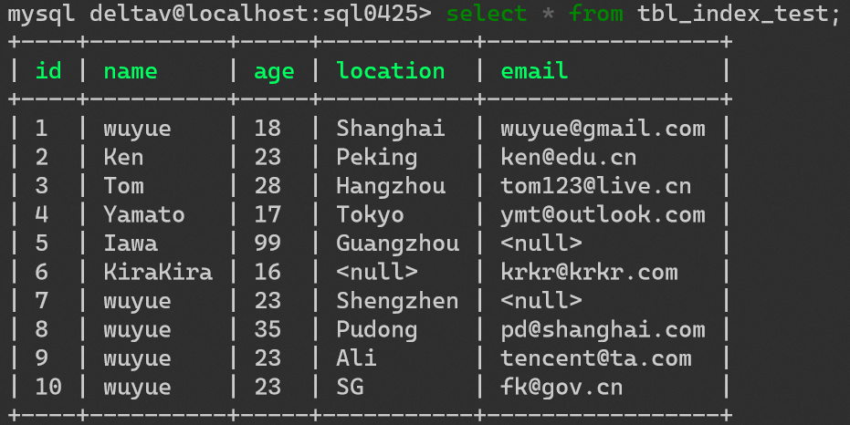
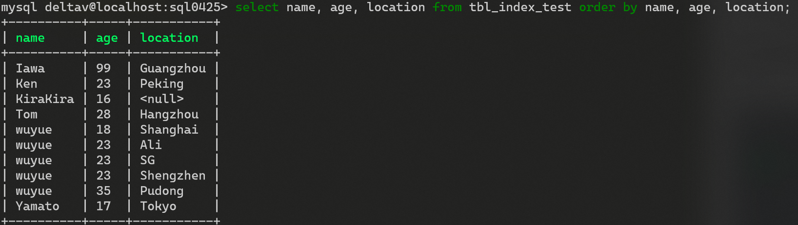
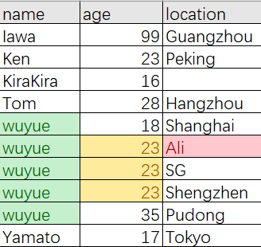
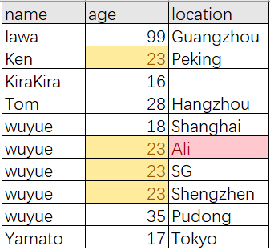

# MySQL Advance Note

## MySQL配置文件

### 二进制日志log-bin

用于主从复制

### 错误日志log-error

默认是关闭的,记录严重的警告和错误信息,每次启动和关闭的详细信息等.

### 查询日志log

默认关闭,记录查询的sql语句，如果开启会减低mysql的整体性能，因为记录日志也是需要消耗系统资源的

### 数据文件

数据库数据默认放置于Linux文件系统的`/var/lib/mysql`下
一个目录对应一个数据库schema

#### .frm文件

form,存放表结构

#### .myd文件

myData,存放表数据

#### .myi文件

myIndex,存放表索引

## 索引

索引是一种经过排序、能够执行快速查找算法的一种数据结构
索引也是一张表,其中记录了索引字段的信息,以及其对应的硬盘地址

### MySQL索引的分类

#### 单值索引

只包含一个字段的索引,一个表可以有多个单值索引

#### 复合索引

包含多个字段的索引

#### 唯一索引

索引字段的值必须唯一,当可以为null(如主键字段)

### 索引的创建

#### CREATE INDEX

```sql
CREATE [UNIQUE]INDEX INDEX_NAME ON TABLE_NAME(COLNAME, ..., ...);
```

#### ALTER TABLE

```sql
ALTER TABLE_NAME ADD [UNIQUE] INDEX [INDEX_NAME] ON (COL_NAME);
```

### 索引的删除

```sql
DROP INDEX INDEX_NAME ON TABLE_NAME;
```

### 索引的查看

```sql
SHOW INDEX FROM TABLE_NAME;
```

#### 使用 CREATE TABLE 语句

索引也可以在创建表（CREATE TABLE）的同时创建。在 CREATE TABLE 语句中添加以下语句。语法格式：

```sql
CONSTRAINT PRIMARY KEY [索引类型] (<列名>,…)
```

在 CREATE TABLE 语句中添加此语句，表示在创建新表的同时创建该表的主键。

---

语法格式：

```sql
KEY | INDEX [<索引名>] [<索引类型>] (<列名>,…)
```

在 CREATE TABLE 语句中添加此语句，表示在创建新表的同时创建该表的索引。

---

语法格式：

```sql
UNIQUE [ INDEX | KEY] [<索引名>] [<索引类型>] (<列名>,…)
```

在 CREATE TABLE 语句中添加此语句，表示在创建新表的同时创建该表的唯一性索引。

---

语法格式：

```sql
FOREIGN KEY <索引名> <列名>
```

在 CREATE TABLE 语句中添加此语句，表示在创建新表的同时创建该表的外键。

---

在使用 CREATE TABLE 语句定义列选项的时候，可以通过直接在某个列定义后面添加 PRIMARY KEY 的方式创建主键。而当主键是由多个列组成的多列索引时，则不能使用这种方法，只能用在语句的最后加上一个 PRIMARY KEY(<列名>，…) 子句的方式来实现。

### explain

[查询结果的相关字段](https://segmentfault.com/a/1190000008131735)

explain出来的结果可能根据表中的记录不同而不同

### 索引最左匹配原则

```sql
CREATE INDEX IDX_COL1_COL2_COL3 ON TABLE_NAME(col1, col2, col3);
```

对于符合索引而言,它的索引字段的排序顺序如下:
1.对第一个索引字段排序
2.在第一个索引字段相同的情况下,对第二个索引字段排序
3.第二个索引字段相同,对第三个索引字段排序,以此类推

也就是说,索引表的排序类似于`ORDER BY col1, col2, col3`的排序规则.那么从整个索引角度来看,只有第一个索引字段是排序过的,能够直接进行等值或范围筛选,得到数据的物理地址.而第二个索引字段只有在第一个索引字段确定了一个唯一的值时,它才是有顺序的.否则第二个索引字段就是无须的,第二和第三个字段索引都将失效.

### 单表查询索引有效/失效情况

假设存在以下的表



并对`name` `age` `location`字段建立复合索引
则索引表索引字段的排序如下图所示



#### 全值匹配 - 有效

```sql
SELECT * FROM tbl_index_test WHERE name = 'wuyue' AND age = 23 AND location = 'Ali';
```

**result**:


**explain**:


可以看到,这个查询的类型为ref,并用到的复合索引的三个字段,索引字段的查询条件均为const常量

**索引的查询步骤可以等价为下图**:



查询SQL有3个查询条件,先查询name字段为'wuyue'的索引,由于索引的第一字段就是name,所以name字段是经过排序的,能够使用快速查找定位出5条索引记录
在name为确定值时,age也是经过排序的,所以能够快速的找到age=23的3条索引记录
最后确定location字段的值,从而找到了一条唯一的索引记录,从而得该数据的硬盘位置

#### 违反最佳左前缀法则 - 失效

```sql
SELECT * FROM tbl_index_test WHERE age = 23 AND location = 'Ali';
```

**explain**:


**索引的查询步骤可以等价为下图**:



由于没有使用第一个索引字段,直接查询第二个索引字段,而在name没有确定的情况下,age字段是乱序的,所以导致对索引字段age的查询需要遍历整个数据表,而无法使用索引快速查找

#### 在索引字段上做任何操作(计算、函数、自动/手动类型转换) - 失效

```sql
SELECT * FROM tbl_index_test WHERE LEFT(name,5) = 'wuyue';
```

name字段的左边5个字符与查询条件相同

索引表中没有对`LEFT(name,5)`进行排序,自然无法使用name字段的索引

#### 在非最后一个索引字段使用范围条件 - 失效

在使用了范围条件的索引字段后的所以索引字段失效

```sql
SELECT * FROM tbl_index_test WHERE name = 'wuyue' AND age > 19 AND location = 'Ali';
```

**explain**:


**索引的查询步骤可以等价为下图**:


由于age使用的范围查询,所以导致后边的location字段是乱序的,从而最后一个字段无法使用索引(key_len = 102)

#### 使用覆盖索引 - 有效

查询字段与条件字段均为索引字段时,将使用覆盖索引,直接从索引表中获取数据,可以进一步降低硬盘的随机IO,提高性能
而减少使用select *

#### 在SQL中使用!= 或 <> - 失效

相当于范围查询,导致其后的索引字段失效

```sql
SELECT * FROM tbl_index_test WHERE name != 'wuyue' AND age = 23 AND location = 'Ali';
```

**explain**:


```sql
SELECT * FROM tbl_index_test WHERE name = 'wuyue' AND age <> 23 AND location = 'Ali';
```

**explain**:


可以看出,当第一个索引字段使用不等值条件时,直接进行了全表扫描.而第二个索引字段使用不等条件时,却使用的两个索引字段(key_len = 102)

#### 查询条件中包括 is null / is not null - 失效

#### like以通配符开头 - 失效

根据索引字段的排序理解, '%yue'无法使用快速查找,而'wu%'可以,因为字符串的索引排序是从首字符开始排序的

#### 字符串不加引号 - 失效

类型自动转换

#### 查询条件使用or - 可能失效
