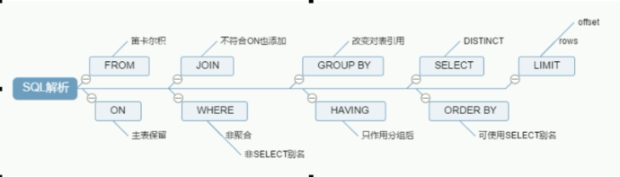

# MySQL Advance Note

## MySQL 配置文件

### 二进制日志 log-bin

用于主从复制

### 错误日志 log-error

默认是关闭的,记录严重的警告和错误信息,每次启动和关闭的详细信息等.

### 查询日志 log

默认关闭,记录查询的 sql 语句，如果开启会减低 mysql 的整体性能，因为记录日志也是需要消耗系统资源的

### 数据文件

数据库数据默认放置于 Linux 文件系统的`/var/lib/mysql`下
一个目录对应一个数据库 schema

#### .frm 文件

form,存放表结构

#### .myd 文件

myData,存放表数据

#### .myi 文件

myIndex,存放表索引

## MySQL的逻辑框架


### 1.Connectors

指的是不同语言中与SQL的交互

### 2.Management Serveices & Utilities

系统管理和控制工具

### 3.Connection Pool: 连接池

管理缓冲用户连接，线程处理等需要缓存的需求。
负责监听对 MySQL Server 的各种请求，接收连接请求，转发所有连接请求到线程管理模块。每一个连接上 MySQL Server 的客户端请求都会被分配（或创建）一个连接线程为其单独服务。而连接线程的主要工作就是负责 MySQL Server 与客户端的通信，
接受客户端的命令请求，传递 Server 端的结果信息等。线程管理模块则负责管理维护这些连接线程。包括线程的创建，线程的 cache 等。

### 4.SQL Interface: SQL接口

接受用户的SQL命令，并且返回用户需要查询的结果。比如select from就是调用SQL Interface

### 5.Parser: 解析器

SQL命令传递到解析器的时候会被解析器验证和解析。解析器是由Lex和YACC实现的，是一个很长的脚本。
在 MySQL中我们习惯将所有 Client 端发送给 Server 端的命令都称为 query ，在 MySQL Server 里面，连接线程接收到客户端的一个 Query 后，会直接将该 query 传递给专门负责将各种 Query 进行分类然后转发给各个对应的处理模块。
主要功能：
a . 将SQL语句进行语义和语法的分析，分解成数据结构，然后按照不同的操作类型进行分类，然后做出针对性的转发到后续步骤，以后SQL语句的传递和处理就是基于这个结构的。
b.  如果在分解构成中遇到错误，那么就说明这个sql语句是不合理的

### 6.Optimizer: 查询优化器

SQL语句在查询之前会使用查询优化器对查询进行优化。就是优化客户端请求的 query（sql语句） ，根据客户端请求的 query 语句，和数据库中的一些统计信息，在一系列算法的基础上进行分析，得出一个最优的策略，告诉后面的程序如何取得这个 query 语句的结果
他使用的是“选取-投影-联接”策略进行查询。
用一个例子就可以理解： select uid,name from user where gender = 1;
这个select 查询先根据where 语句进行选取，而不是先将表全部查询出来以后再进行gender过滤
这个select查询先根据uid和name进行属性投影，而不是将属性全部取出以后再进行过滤
将这两个查询条件联接起来生成最终查询结果

### 7.Cache和Buffer： 查询缓存

他的主要功能是将客户端提交 给MySQL 的 Select 类 query 请求的返回结果集 cache 到内存中，与该 query 的一个 hash 值 做一个对应。该 Query 所取数据的基表发生任何数据的变化之后， MySQL 会自动使该 query 的Cache 失效。在读写比例非常高的应用系统中， Query Cache 对性能的提高是非常显著的。当然它对内存的消耗也是非常大的。
如果查询缓存有命中的查询结果，查询语句就可以直接去查询缓存中取数据。这个缓存机制是由一系列小缓存组成的。比如表缓存，记录缓存，key缓存，权限缓存等

### 8.存储引擎接口

存储引擎接口模块可以说是 MySQL 数据库中最有特色的一点了。目前各种数据库产品中，基本上只有 MySQL 可以实现其底层数据存储引擎的插件式管理。这个模块实际上只是 一个抽象类，但正是因为它成功地将各种数据处理高度抽象化，才成就了今天 MySQL 可插拔存储引擎的特色。
从图2还可以看出，MySQL区别于其他数据库的最重要的特点就是其插件式的表存储引擎。MySQL插件式的存储引擎架构提供了一系列标准的管理和服务支持，这些标准与存储引擎本身无关，可能是每个数据库系统本身都必需的，如SQL分析器和优化器等，而存储引擎是底层物理结构的实现，每个存储引擎开发者都可以按照自己的意愿来进行开发。
注意：存储引擎是基于表的，而不是数据库。

### 查看数据库支持的存储引擎

```sql
show engines;
show variables like '%storage_engin%';
```

### MyISAM与InnoDB区别


## SQL执行顺序



## 7种join


## 索引

索引是一种经过排序、能够执行快速查找算法的一种数据结构
索引也是一张表,其中记录了索引字段的信息,以及其对应的硬盘地址

### MySQL 索引的分类

#### 单值索引

只包含一个字段的索引,一个表可以有多个单值索引

#### 复合索引

包含多个字段的索引

#### 唯一索引

索引字段的值必须唯一,当可以为 null(如主键字段)

### 索引的创建

#### CREATE INDEX

```sql
CREATE [UNIQUE]INDEX INDEX_NAME ON TABLE_NAME(COLNAME, ..., ...);
```

#### ALTER TABLE

```sql
ALTER TABLE_NAME ADD [UNIQUE] INDEX [INDEX_NAME] ON (COL_NAME);
```

### 索引的删除

```sql
DROP INDEX INDEX_NAME ON TABLE_NAME;
```

### 索引的查看

```sql
SHOW INDEX FROM TABLE_NAME;
```

#### 使用 CREATE TABLE 语句

索引也可以在创建表（CREATE TABLE）的同时创建。在 CREATE TABLE 语句中添加以下语句。语法格式：

```sql
CONSTRAINT PRIMARY KEY [索引类型] (<列名>,…)
```

在 CREATE TABLE 语句中添加此语句，表示在创建新表的同时创建该表的主键。

---

语法格式：

```sql
KEY | INDEX [<索引名>] [<索引类型>] (<列名>,…)
```

在 CREATE TABLE 语句中添加此语句，表示在创建新表的同时创建该表的索引。

---

语法格式：

```sql
UNIQUE [ INDEX | KEY] [<索引名>] [<索引类型>] (<列名>,…)
```

在 CREATE TABLE 语句中添加此语句，表示在创建新表的同时创建该表的唯一性索引。

---

语法格式：

```sql
FOREIGN KEY <索引名> <列名>
```

在 CREATE TABLE 语句中添加此语句，表示在创建新表的同时创建该表的外键。

---

在使用 CREATE TABLE 语句定义列选项的时候，可以通过直接在某个列定义后面添加 PRIMARY KEY 的方式创建主键。而当主键是由多个列组成的多列索引时，则不能使用这种方法，只能用在语句的最后加上一个 PRIMARY KEY(<列名>，…) 子句的方式来实现。

### explain

[查询结果的相关字段](https://segmentfault.com/a/1190000008131735)

// explain 出来的结果可能根据表中的记录不同而不同

### 索引最左匹配原则

```sql
CREATE INDEX IDX_COL1_COL2_COL3 ON TABLE_NAME(col1, col2, col3);
```

对于符合索引而言,它的索引字段的排序顺序如下: 1.对第一个索引字段排序 2.在第一个索引字段相同的情况下,对第二个索引字段排序 3.第二个索引字段相同,对第三个索引字段排序,以此类推

也就是说,索引表的排序类似于`ORDER BY col1, col2, col3`的排序规则.那么从整个索引角度来看,只有第一个索引字段是排序过的,能够直接进行等值或范围筛选,得到数据的物理地址.而第二个索引字段只有在第一个索引字段确定了一个唯一的值时,它才是有顺序的.否则第二个索引字段就是无须的,第二和第三个字段索引都将失效.

### 单表查询索引有效/失效情况

假设存在以下的表


并对`name` `age` `location`字段建立复合索引
则索引表索引字段的排序如下图所示


#### 全值匹配 - 有效

```sql
SELECT * FROM tbl_index_test WHERE name = 'wuyue' AND age = 23 AND location = 'Ali';
```

**result**:


**explain**:


可以看到,这个查询的类型为 ref,并用到的复合索引的三个字段,索引字段的查询条件均为 const 常量

**索引的查询步骤可以等价为下图**:


查询 SQL 有 3 个查询条件,先查询 name 字段为'wuyue'的索引,由于索引的第一字段就是 name,所以 name 字段是经过排序的,能够使用快速查找定位出 5 条索引记录
在 name 为确定值时,age 也是经过排序的,所以能够快速的找到 age=23 的 3 条索引记录
最后确定 location 字段的值,从而找到了一条唯一的索引记录,从而得该数据的硬盘位置

#### 违反最佳左前缀法则 - 失效

```sql
SELECT * FROM tbl_index_test WHERE age = 23 AND location = 'Ali';
```

**explain**:


**索引的查询步骤可以等价为下图**:


由于没有使用第一个索引字段,直接查询第二个索引字段,而在 name 没有确定的情况下,age 字段是乱序的,所以导致对索引字段 age 的查询需要遍历整个数据表,而无法使用索引快速查找

#### 在索引字段上做任何操作(计算、函数、自动/手动类型转换) - 失效

```sql
SELECT * FROM tbl_index_test WHERE LEFT(name,5) = 'wuyue';
```

name 字段的左边 5 个字符与查询条件相同

索引表中没有对`LEFT(name,5)`进行排序,自然无法使用 name 字段的索引

#### 在非最后一个索引字段使用范围条件 - 失效

在使用了范围条件的索引字段后的所以索引字段失效

```sql
SELECT * FROM tbl_index_test WHERE name = 'wuyue' AND age > 19 AND location = 'Ali';
```

**explain**:


**索引的查询步骤可以等价为下图**:


由于 age 使用的范围查询,所以导致后边的 location 字段是乱序的,从而最后一个字段无法使用索引(key_len = 102)

#### 使用覆盖索引 - 有效

查询字段与条件字段均为索引字段时,将使用覆盖索引,直接从索引表中获取数据,可以进一步降低硬盘的随机 IO,提高性能
而减少使用 select \*

#### 在 SQL 中使用!= 或 <> - 失效

相当于范围查询,导致其后的索引字段失效

```sql
SELECT * FROM tbl_index_test WHERE name != 'wuyue' AND age = 23 AND location = 'Ali';
```

**explain**:


```sql
SELECT * FROM tbl_index_test WHERE name = 'wuyue' AND age <> 23 AND location = 'Ali';
```

**explain**:


可以看出,当第一个索引字段使用不等值条件时,直接进行了全表扫描.而第二个索引字段使用不等条件时,却使用的两个索引字段(key_len = 102)

#### 查询条件中包括 is null / is not null - 失效

#### like 以通配符开头 - 失效

根据索引字段的排序理解, '%yue'无法使用快速查找,而'wu%'可以,因为字符串的索引排序是从首字符开始排序的
'wu%'为有序的范围,而'%yue'为无序的范围,所以无法使用索.
NOTE: 虽然 like 查询类似范围查询,但其后的索引字段依旧能够正常索引,可以理解为 like 是等值查询条件?

#### 字符串不加引号 - 失效

类型自动转换

#### 查询条件使用 or - 可能失效

#### 疑问

第一个索引字段的范围查询会直接变成数据表的全表查询而不是第一个索引字段的索引范围查询?
第一个索引字段使用范围查询会导致全表扫描
对第一个索引字段使用 order by 也有可能使用全表扫描

### 一般性建议

对于单键索引，尽量选择针对当前query过滤性更好的索引
在选择组合索引的时候，当前Query中过滤性最好的字段在索引字段顺序中，位置越靠前越好。
在选择组合索引的时候，尽量选择可以能包含当前query中的where子句中更多字段的索引
尽可能通过分析统计信息和调整query的写法来达到选择合适索引的目的

## 查询截取分析

## 数据库锁

## 主从复制
