# 跟着 Spring 学设计模式

## 观察者模式

定义对象间的一种一对多的依赖关系，当一个对象的状态发生改变时，所有依赖于它的对象都得到通知并自动更新

**又称**：发布订阅、消息通知机制、事件监听、事件驱动编程

利用 Spring 事件机制改造，利用观察者模式设计高扩展性的代码

Spring 中的 ApplicationListener(ApplicationEvent)

**案例**：



3个监听器，在 `UnderwritingEvent` 被触发的时候，执行 `onApplicationEvent()` 方法

App Listener:

```java
@Component
@Slf4j
public class AppListener implements ApplicationListener<UnderwritingEvent> {
    @Override
    public void onApplicationEvent(UnderwritingEvent event) {
        log.info("App start...");
    }
}
```

Message Listener:

```java
@Slf4j
@Component
public class MessageListener implements ApplicationListener<UnderwritingEvent> {
    @Override
    public void onApplicationEvent(UnderwritingEvent event) {
        log.info("message start...");
    }
}
```

WeChat Listener

```java
@Component
@Slf4j
public class WeChatListener implements ApplicationListener<UnderwritingEvent> {
    @Override
    public void onApplicationEvent(UnderwritingEvent event) {
        log.info("WeChat start...");
    }
}
```

---

事件类

```java
public class UnderwritingEvent extends ApplicationEvent {
    public UnderwritingEvent(Object source) {
        super(source);
    }
}
```

---

承保业务类

```java
@Service
@Slf4j
public class UnderWritingServiceImpl {
    private final ApplicationContext applicationContext;

    public UnderWritingServiceImpl(ApplicationContext applicationContext) {
        this.applicationContext = applicationContext;
    }

    public void underWriting() {
        log.info("start underwriting...");
        applicationContext.publishEvent(new UnderwritingEvent("underwriting finish"));
    }
}
```

执行 `UnderWritingServiceImpl.underWriting()` 后，输出如下

```text
2020-08-15 21:27:54.641  INFO 5108 --- [           main] c.w.d.u.UnderWritingServiceImpl          : start underwriting...
2020-08-15 21:27:54.643  INFO 5108 --- [           main] com.wuyue.design.listener.AppListener    : App start...
2020-08-15 21:27:54.644  INFO 5108 --- [           main] c.wuyue.design.listener.MessageListener  : message start...
2020-08-15 21:27:54.644  INFO 5108 --- [           main] c.wuyue.design.listener.WeChatListener   : WeChat start...
```

---

监听器方法默认同步执行，若使用了线程池则异步执行。如下方 Spring 代码所示。

```java
@Override
public void multicastEvent(final ApplicationEvent event, @Nullable ResolvableType eventType) {
    ResolvableType type = (eventType != null ? eventType : resolveDefaultEventType(event));
    Executor executor = getTaskExecutor();
    for (ApplicationListener<?> listener : getApplicationListeners(event, type)) {
        if (executor != null) {
            executor.execute(() -> invokeListener(listener, event));
        }
        else {
            invokeListener(listener, event);
        }
    }
}
```

最终执行 Listener 的 `onApplicationEvent()` 方法

```java
@SuppressWarnings({"rawtypes", "unchecked"})
private void doInvokeListener(ApplicationListener listener, ApplicationEvent event) {
    try {
        listener.onApplicationEvent(event);
    }
    catch (ClassCastException ex) {
        String msg = ex.getMessage();
        if (msg == null || matchesClassCastMessage(msg, event.getClass())) {
            // Possibly a lambda-defined listener which we could not resolve the generic event type for
            // -> let's suppress the exception and just log a debug message.
            Log logger = LogFactory.getLog(getClass());
            if (logger.isTraceEnabled()) {
                logger.trace("Non-matching event type for listener: " + listener, ex);
            }
        }
        else {
            throw ex;
        }
    }
}
```

## 模板方法模式

定义**一个算法**的骨架，将骨架中的**特定步骤延迟到子类**中（特定步骤由子类实现）。模板方法模式使得子类可以**不改变**算法的结构即可重新定义该算法的某些特定步骤。

又称：回调方法、钩子函数

## 代理模式

Spring AOP 中 **JDK 动态代理**就是利用代理模式技术实现的

## 工厂方法模式

**FactoryBean 接口**，实现了该接口的 Bean 是一类特殊的 Bean。Spring在使用 getBean() 方法获得这个 Bean 时，返回的不是 factory 这个 Bean 本身，而是这个 Bean.getObject() 方法的返回值对象。

## 单例模式

**Bean 实例**模式就是单例，这个单例是基于 IOC 容器，而非 JVM。

## 适配器模式

SpringMVC 中的处理器适配器 **HandlerAdapter**，让 Handler 的扩展变得容易。

## 简单工厂

BeanFactory

## 策略模式

Resource

定义了**一系列的算法**，并将每一个算法**封装**起来，而且使得他们**可以相互替换**，让算法独立于使用它的客户而独立变换。
