# Spring 笔记

## Spring模块


## pom配置

```xml
<dependencies>
    <dependency>
        <groupId>org.springframework</groupId>
        <artifactId>spring-context</artifactId>
        <version>5.2.4.RELEASE</version>
    </dependency>
</dependencies>
```

## IOC/DI

### IOC:(Inversion(反转) Of Control) 控制反转

- 控制:
  - 资源的获取方式:
    主动式：创建需要的对象

    ```java
    Person person = new Person();
    ```

  - 被动式：资源的获取不是我们自己创建，而是交给一个容器来创建和设置

  ```java
  BookServlet{
          BookService bs;
          public void test01(){
              bs.checkout();
          }
  }
  ```

- 容器：管理所有的组件（有功能的类）；假设，BookServlet受容器管理，BookService也受容器管理；容器可以自动的探查出那些组件（类）需要用到另一写组件（类）；容器帮我们创建BookService对象，并把BookService对象赋值过去；将主动的new资源变为被动的接受资源；

### DI:(Dependency Injection) 依赖注入

容器能知道哪个组件（类）运行的时候，需要另外一个类（组件）；容器通过反射的形式，将容器中准备好的BookService对象注入（利用反射给属性赋值）到BookServlet中；

只要IOC容器管理的组件，都能使用容器提供的强大功能；

## IOC容器

**步骤**:

1. 在配置文件中注册组件
2. 使用ClassPathXMLApplicationContext()实例化IOC容器
3. 通过IOC容器获取指定的对象

### 组件的注册

使用`<bean>`标签实例化一个对象

```xml
<bean id="person01" class="com.wuyue.domain.Person">
```

- 属性:
  - class: 要注册的组件的类全限定名
  - id: 这个对象在IOC容器中的唯一标识

**等价于**:

```java
Person person01 = new Person()
```

#### 通过\<property\>标签为指定的bean属性赋值

```xml
<bean id="person01" class="com.wuyue.domain.Person">
    <property name="name" value="wuyue"/>
    <property name="age" value="18"/>
    <property name="email" value="wuyue@wuyue.com"/>
    <property name="gender" value="m"/>
</bean>

<bean id="person02" class="com.wuyue.domain.Person">
    <property name="name" value="nini"/>
</bean>

```

- property属性:
  - name: bean对象的属性名
  - value: 属性值(该属性的数据类型只能是Java原生数据类型，这样IOC才能正确的进行自动类型转换(将xml中的String转为属性的真实数据类型))

IOC通过bean类的setter/getter方法的方法名来判断属性名，即 setUserName() --> userName ，所以setter/getter方法名发生改变会导致bean的属性也发生变化，属性名是有setter和getter方法决定的，而不是bean的实例域决定的

property标签等价于java中的 `person.setProperty();` 调用已实例化的对象中的setter方法为指定的属性赋值

#### 使用bean的构造构造方法完成实例化

```xml
<bean id="person03" class="com.wuyue.domain.Person">
    <constructor-arg name="age" value="19"/>
    <constructor-arg name="email" value="spring@test.com"/>
    <constructor-arg name="gender" value="f"/>
    <constructor-arg name="name" value="spring"/>
</bean>
<bean id="person04" class="com.wuyue.domain.Person">
    <constructor-arg value="妮妮"/>
    <constructor-arg value="24"/>
    <constructor-arg value="nini@test.com" index="3"/>
    <constructor-arg value="f"/>
</bean>
```

调用组件的有参构造器完成对象的实例化
constructor-arg标签的数量应与构造器的形参数量一致

- 属性:
  - name: 构造器形参名
  - value: 简单数据类型的值
  - index: 该标签对应构造器中参数的索引位置

其中的name属性可以省略，constructor-arg标签中的值应与构造器参数的位置相对应

#### 通过p命名空间为bean赋值

#### 属性的引用

```xml
<property name="" ref="">
```

使用property的ref属性，可以指定外部的bean对象，若引用的外部对象是单实例的，则直接引用该对象;  
若外部引用对象是多实例的，则会创建一个新的对象，并赋值


#### bean的继承

**NOTE**: 使用parent属性继承的引用类型对象是父类真实对象的一个深克隆，即 对引用类型成员变量的修改不会影响父类中该成员变量的值

#### 使用工厂模式创建实例

#### 使用静态工厂创建实例

```xml
<bean class="com.wuyue.factory.CarStaticFactory" id="carStaticFactory" factory-method="getCar">
    <constructor-arg value="5000"/>
</bean>
```

#### 使用实例工厂创建实例

```xml
<bean class="com.wuyue.factory.CarInstanceFactory" id="carInstanceFactory"/>
<bean class="com.wuyue.domain.Car" id="car" factory-bean="carInstanceFactory" factory-method="getCar">
    <constructor-arg value="800000"/>
</bean>
```

先创建工厂实例，再调用工程实例创建对象

#### 使用FactoryBean实现类工厂创建实例

```xml
<bean class="com.wuyue.factory.CarFactoryWithBean" id="car2"/>
```

```java
public class CarFactoryWithBean implements FactoryBean<Car> {
    @Override
    public Car getObject() throws Exception {
        Car car = new Car();
        car.setCarName("Benz");
        return car;
    }

    @Override
    public Class<?> getObjectType() {
        return Car.class;
    }

    @Override
    public boolean isSingleton() {
        return true;
    }
}
```

在配置文件中直接注册这个工厂类即可，能够直接从IOC容器获取实例  
**NOTE**: 使用FactoryBean实现类工厂创建实例，不论是否是单实例，该工厂都只在获取实例对象的时候才会创建对象。
不同于普通的单例模式，在IOC容器初始化完成之前就创建实例

#### 创建带有生命周期方法的bean

生命周期:bean的创建到销毁；

```xml
<bean id="book01" class="com.atguigu.bean.Book"
destroy-method="myDestory" init-method="myInit" >
</bean>
```

- ioc容器中注册的bean的生命周期
1.单例bean，容器启动的时候就会创建好，容器关闭也会销毁创建的bean
2.多实例bean，获取的时候才创建

我们可以为bean自定义一些生命周期方法: spring在创建或者销毁的时候就会调用指定的方法  
这些初始化方法会在对象实例完成、property参数都设置完毕后执行。初始化和销毁方法不能带有参数，但可以抛出异常

- 定义了初始化和销毁方法的bean生命周期
  - 单例:
容器启动---->构造器---->(执行property标签的赋值)---->(初始化方法)---->(销毁方法)---->(容器关闭)
  - 多实例:
获取bean对象---->构造器---->(执行property标签的赋值)---->(初始化方法)---->(容器关闭不会调用bean的销毁方法)

- 后置处理器:
  - 单例:
容器启动---->构造器---->(执行property标签的赋值)---->(后置处理器before)---->(初始化方法)---->(后置处理器after)---->bean初始化完成---->(销毁方法)---->(容器关闭)
  - 多实例:
获取bean---->构造器---->(执行property标签的赋值)---->(后置处理器before)---->(初始化方法)---->(后置处理器after)---->bean初始化完成---->(销毁方法)

无论bean是否有初始化方法；后置处理器都会默认其有，还会继续工作;后置处理器对任何从该IOC容器中获取的对象都执行

#### IOC容器配置文件中引入外部的Properties文件

实例化PropertySourcesPlaceholderConfigurer对象，指定location属性为properties文件的路径，相对路径默认从类路径开始

```xml
<bean class="org.springframework.context.support.PropertySourcesPlaceholderConfigurer">
    <property name="location" value="dbconfig.properties"/>
</bean>
```

通过${key}的方式，获取指定key的value值

*Druid数据库连接池的单实例对象:*

```xml
<bean id="dataSource" class="com.alibaba.druid.pool.DruidDataSource" init-method="init" destroy-method="close">
    <property name="url" value="${mysql.url}"/>
    <property name="username" value="${mysql.username}"/>
    <property name="password" value="${mysql.password}"/>

    <property name="filters" value="stat"/>

    <property name="maxActive" value="20"/>
    <property name="initialSize" value="1"/>
    <property name="maxWait" value="60000"/>
    <property name="minIdle" value="1"/>

    <property name="timeBetweenEvictionRunsMillis" value="60000"/>
    <property name="minEvictableIdleTimeMillis" value="300000"/>

    <property name="testWhileIdle" value="true"/>
    <property name="testOnBorrow" value="false"/>
    <property name="testOnReturn" value="false"/>

    <property name="poolPreparedStatements" value="true"/>
    <property name="maxOpenPreparedStatements" value="20"/>

    <property name="asyncInit" value="true"/>
</bean>
```

#### 自动装配

自动为自定义的类型进行赋值

自动装配：（仅限于对自定义类型的属性有效）

在bean标签中设置autowire属性

- autowire="default/no"：不自动装配；不自动为car属性赋值
- autowire="byName"：按照名字；
以属性名(car)作为id去容器中找到这个组件，给他赋值；如果找不到就装配null；
<==> car = ioc.getBean("car");
- autowire="byType":
1.以属性的类型作为查找依据去容器中找到这个组件；如果容器中有多个这个类型的组件，报错；
NoUniqueBeanDefinitionException:
No qualifying bean of type [com.atguigu.bean.Car] is defined:
expected single matching bean but found 2: car01,car02
2.若未找到这个类型的组件,则装配null
<==> car = ioc.getBean(Car.class);
- autowire="constructor":
按照构造器进行赋值；
1.先按照有参构造器参数的类型进行装配（成功就赋值）；没有就直接为组件装配null即可。
2.如果按照类型找到了多个；参数的名作为id继续匹配;找到就装配；找不到就null；
3.不会报错；

#### SpEL

SpEL(Spring Expression Language)Spring表达式语言

能够在在SpEL中使用字面量、引用其他bean、引用其他bean的某个属性值、【 调用非静态方法、调用静态方法】、使用运算符

```xml
<bean id="person04" class="com.atguigu.bean.Person">
  <!-- 字面量：${};   #{} -->
  <property name="salary" value="#{12345.67*12}"></property>
  <!--  引用其他bean的某个属性值、 -->
  <property name="lastName" value="#{book01.bookName}"></property>
  <!--  引用其他bean、 -->
  <property name="car" value="#{car}"></property>
  <!-- 
      调用静态方法： UUID.randomUUID().toString();
      #{T(全类名).静态方法名(1,2)}
     -->
 <property name="email" value="#{T(java.util.UUID).randomUUID().toString().substring(0,5)}"></property>
 <!--   调用非静态方法;  对象.方法名  -->
 <property name="gender" value="#{book01.getBookName()}"></property>
</bean>
```

#### 通过注解注册组件

通过给bean上添加某些注解,可以快速的将bean加入到IOC容器中

- Spring有四个注解
  - @Controller
  **控制器**    推荐给控制器层(servlet)的组件添加这个注解
  - @Service
  **业务逻辑**  推荐业务逻辑层(service)的组件添加这个注解
  - @Repository
  **仓库**      推荐数据库层(dao 持久化层)的组件使用这个注解
  - @Component
  **组件**      不属于以上几层的组件添加这个注解

**NOTE**: 注解可以随意添加,Spring底层不会验证这个组件是否和注解指定的层次一致,推荐各层使用各层的注解以提高代码可读性

**使用注解将组件快速的加入到容器中的步骤**:

1. 给要添加的组件标上以上四个注解之一
2. 在Spring IOC配置文件中使用`<context:component-scan base-package="">`标签指定自动扫描组件的基包,Spring会自动注册该包下及其子包下的所有使用了注解的类
3. 导入aop包以提供注解模式

**NOTE**: 使用注解创建的bean对象id为类名首字母小写.和使用配置文件加入到容器中的组件行为默认都是一样的,如组件的id默认就是类名首字母小写 组件的作用域默认就是单例的

**详细说明**
[1]base-package属性指定一个需要扫描的基类包，Spring容器将会扫描这个基类包及其子包中的所有类。
[2]当需要扫描多个包时可以使用逗号分隔。
[3]如果仅希望扫描特定的类而非基包下的所有类，可使用resource-pattern属性过滤特定的类，示例：

```xml
<context:component-scan
  base-package="com.atguigu.component"
  resource-pattern="autowire/*.class"/>
```

##### 通过注解添加的组件默认行为的调整

###### 更改默认id

在注册注解中指定value的值

```java
@Component("componentName")
```

###### 更改作用域

使用@Scope注解,指定注解的value为bean的作用域

```java
@Scope("prototype")
```

##### 包含于排除

component-scan下可以拥有若干个include-filter和exclude-filter子节点

###### 使用\<context: exclude-filter>排除不需要注册的类

```xml
<context:component-scan base-package="com.wuyue">
    <context:exclude-filter type="assignable" expression="com.wuyue.service.BookService"/>
</context:component-scan>
```

*属性type的值和expression表达式的说明*:

|    类别    |           示例            |                             说明                             |
| :--------: | :-----------------------: | :----------------------------------------------------------: |
| annotation | com.atguigu.XxxAnnotation | 过滤所有标注了XxxAnnotation的类。这个规则根据目标组件是否标注了指定类型的注解进行过滤。 |
| assignable |    com.atguigu.BaseXxx    | 过滤所有BaseXxx类的子类。这个规则根据目标组件是否是指定类型的子类的方式进行过滤。 |
|  aspectj   |   com.atguigu.*Service+   | 所有类名是以Service结束的，或这样的类的子类。这个规则根据AspectJ表达式进行过滤。 |
|   regex    |   com\.atguigu\.anno\.*   | 所有com.atguigu.anno包下的类。这个规则根据正则表达式匹配到的类名进行过滤。 |
|   custom   | com.atguigu.XxxTypeFilter | 使用XxxTypeFilter类通过编码的方式自定义过滤规则。该类必须实现org.springframework.core.type.filter.TypeFilter接口 |

###### \<context:exclude-filter>指定包含的组件

\<context:include-filter>子节点表示要包含的目标类  
默认情况下\<context:component-sacn>会将所有组件都进行扫描,所以一定要禁用默认过滤规则才能使\<context:include-filter>标签生效

注意：通常需要与use-default-filters属性配合使用才能够达到“仅包含某些组件”这样的效果。即：通过将use-default-filters属性设置为false，禁用默认过滤器，然后扫描的就只是include-filter中的规则指定的组件了。

```xml
<context:component-scan use-default-filters="false" base-package="com.wuyue">
    <context:include-filter type="assignable" expression="com.wuyue.service.BookService"/>
</context:component-scan>
```

### 使用@Autowired注解实现根据类型实现自动装配

#### @Autowired执行步骤

**先按照类型去容器中找到对应的组件 <==> bookService = ioc.getBean(BookService.class)**
-----**找到一个**: 直接赋值
-----**没有找到**: 抛异常
-----**找到多个**: 以需要自动装配的变量**变量名**作为id继续匹配,若未找到则抛异常

在通过类型找到多个bean实例时,可以使用@Qualifier("idName")注解指定bean的名称,若仍未找到对应的bean则抛异常

>先通过byType查找bean,如果存在类型的多个实例就尝试使用可以通过Primary和Priority注解来确定，如果也确定不了，最后通过byName。

**默认情况**下，所有使用@Autowired注解的属性都需要被设置。当Spring找不到匹配的bean装配属性时，会抛出异常。  
若某一属性允许不被设置(null)，可以设置@Autowired注解的required属性为 false,有对应的bean则装配,没有则不装配,不抛异常

@Autowired能够为方法的参数自动装配,参数也能够标注@Qualifier()注解来指定装配的bean的id.  
**NOTE**: 被@Autowired标注的方法在IOC容器初始化的时候就会被执行

**Q**: 尽管在方法上的@Autowired设置了request为false,但如果在容器中没有找到对应id的bean依旧会抛出异常;用@Qualifier注解指定的id若找不到,则方法不被执行

构造器、普通字段(即使是非public)、一切具有参数的方法都可以应用@Autowired注解

#### @Autowired和@Resource的区别

@Autowired @Resource @Inject 都是自动装配的意思
@Autowired 功能强大,是Spring提供的注解
@Resource javax包提供的注解

@Resource 扩展性更强,因为是Java的标准.如果切换成另一个容器框架,@Resource依然可以使用,@Autowired则不行

### 泛型依赖注入

Spring可以通过带泛型的父类类型来确定这个子类的类型,Spring注入依赖的时候不光选择类型对应的组件,并且会找到对应泛型的组件


## Spring的单元测试

1. 导包: spring-test-x.x.x.RELEASE.jar
2. @ContextConfiguration(locations="")指定Spring配置文件的位置
3. @Runwith指定用哪种驱动进行单元测试,默认是junit
@RunWith(SpringJUnit4ClassRunner.class) 使用Spring的测试模块来执行标了@Test注解的测试方法
不需要使用ioc.getBean()来获取组件,直接使用@Autowired获取组件,Spring自动装配

## AOP

Aspect Oriented Programming: 面向切面编程
面向切面编程：基于OOP基础之上新的编程思想;指在程序运行期间，将某段代码动态的切入到指定方法的指定位置进行运行的这种编程方式，面向切面编程

AOP不用对象实现接口就可以实现动态代理的功能


### HelloWorld

#### 1.导包

spring-aspects-4.0.0.RELEASE.jar : 基础版

加强版的面向切面编程（即使目标对象没有实现任何接口也能创建动态代理）
com.springsource.net.sf.cglib-2.2.0.jar
com.springsource.org.aopalliance-1.0.0.jar
com.springsource.org.aspectj.weaver-1.6.8.RELEASE.jar

**POM**:

```xml
<dependency>
    <groupId>org.springframework</groupId>
    <artifactId>spring-aspects</artifactId>
    <version>5.2.4.RELEASE</version>
</dependency>
```

若要使用基于xml的aop切面,则需要使用上述的依赖

#### 2.将目标类和切面类(封装了通知方法(在目标方法执行前后执行的方法))加入到ioc容器中

@Component
@Repository
@Service
@Controller

#### 3.告诉Spring哪个是切面类

@Aspect: 标记切面类

#### 4.添加注解,告诉Spring，切面类里面的每一个方法(通知方法)，都是何时何地运行(连接点)

**5个通知注解**
@Before：在目标方法之前运行 **前置通知**
@After：在目标方法结束之后 **后置通知**
@AfterReturning：在目标方法正常返回之后 **返回通知**
@AfterThrowing：在目标方法抛出异常之后运行 **异常通知**
@Around：环绕 **环绕通知**

*各注解等效的运行阶段*:

```java
try{
    @Before
    method.invoke(obj,args);
    @AfterReturning
  }catch(e){
    @AfterThrowing
  }finally{
    @After
  }
```

#### 5.修改xml配置文件,开启基于注解的AOP模式

增加如下配置

```xml
<!--  开启基于注解的AOP功能；aop名称空间-->
<aop:aspectj-autoproxy/>
```

#### 6.测试

```java
Calculator bean = ioc.getBean(Calculator.class);
bean.add(2, 1);
```

从ioc容器中拿到目标对象 注意:如果想要用类型，一定用 他的**接口类型**，不要用它本类

### AOP细节

#### IOC容器中保存的是组件的代理对象

AOP的底层就是动态代理,容器中保存的组件是他的代理对象,不是本类的类型  
接口不用加载到IOC容器中,即便加了spring也不会创建对象,相当于告诉spring,IOC容器中可能有这种类型的组件  
在没有被切的情况下,IOC中创建的就是原生对象,若被切面了,则IOC中创建被切面对象的代理对象  
通过id也能够获取IOC中的代理对象,id为原生对象类名首字母小写

若被切面对象实现了接口,则spring使用jdk动态代理为目标对象创建代理对象.若被切面对象无接口实现,则spring使用CGLIB为目标对象创建一个子类用于代理目标对象.  
目标类没有接口时,从IOC容器获取对象就直接使用**本类类型**获取,因为代理对象是一个子类

反编译后的代理对象类声明:

```java
public class CalculatorImpl$$EnhancerBySpringCGLIB$$ea9e3ffd extends CalculatorImpl implements SpringProxy, Advised, Factory {...}
```

使用以下代码导出**CGLIB**字节码到指定的路径下,该属性要在IOC容器初始化前设置:

```java
System.setProperty(DebuggingClassWriter.DEBUG_LOCATION_PROPERTY, ".");
```

导出**JDK动态代理**字节码至指定目录:

**高版本JDK**:

```java
System.getProperties().put("jdk.proxy.ProxyGenerator.saveGeneratedFiles", "true");
```

低版本JDK:

```java
System.getProperties().put("sun.misc.ProxyGenerator.saveGeneratedFiles", "true");
```

#### 切入点表达式的写法

**固定格式**: execution(访问权限符 返回值类型 方法全类名(参数列表))
  
**通配符**:

- **\*** 作用:
1）**匹配零个或者任意个字符**: `execution(public int com.atguigu.impl.MyMath*r.*(int, int))`
2）**匹配任意一个参数**: 第一个是int类型,第二个参数任意类型;（匹配两个参数） `execution(public int com.atguigu.impl.MyMath*.*(int, *))`
3）**匹配一层路径** `execution(public com.*.*.methodName(paramList))`
若写在全限定名的开头,则表示**匹配任意层路径** `execution(*.className.methodName(paramList))`
若后边没有限定类名和方法名,则\*代表**任意路径的任意类的任意方法** `execution(public *(int, int))`
4）**权限位置不能写\***,权限位置不写就表示**任意权限类型**.(只能切public类型的方法, 所以public是**可选的**)

- **..** 作用:
1）匹配**任意多个参数，任意类型参数**
2）匹配**任意多层路径**
`execution(public int com.atguigu..MyMath*.*(..));`

记住两种；
最精确的：execution(public int com.atguigu.impl.MyMathCalculator.add(int,int))
最模糊的：execution(* *.*(..))：千万别写；

"&&" "||" "!"

&&：要切入的位置满足这两个表达式
execution(public int com.atguigu..MyMath*.*(..))&&execution(* *.*(int,int)) && execution(*(..))

||:满足任意一个表达式即可
execution(public int com.atguigu..MyMath*.*(..))&&execution(* *.*(int,int)) || execution(*.*(..))

!：只要不是这个位置都切入
!execution(public int com.atguigu..MyMath*.*(..))

#### 通知方法执行顺序

```java
try{
  @Before
  method.invoke(obj,args);
  @AfterReturning
}catch(){
  @AfterThrowing
}finally{
  @After
}
```

正常执行: @Before(前置通知) ====> @After(后置通知) ====> @AfterReturning(正常返回)
异常执行: @Before(前置通知) ====> @After(后置通知) ====> @AfterThrowing(方法异常)

若通知方法中抛出异常,则会造成执行顺序改变

#### JoinPoint获取目标方法的信息

我们可以在通知方法运行的时候，拿到目标方法的详细信息；

只需要为通知方法的参数列表上写一个参数:
JoinPoint joinPoint:封装了当前目标方法的详细信息

```java
public static void methodStart(JoinPoint joinPoint) {
    Object[] args = joinPoint.getArgs();
    Signature signature = joinPoint.getSignature();
    String name = signature.getName();
    logger.info(name + " 方法被执行, 参数为 " + Arrays.toString(args));
}
```

#### throwing和returning指定接收异常和返回值的形参名

告诉Spring哪个参数是用来接收异常,哪个参数是用来接收返回值的
throwing="exception": 告诉Spring哪个参数是用来接收异常
returning="result": result形参用于接收返回值

```java
@AfterReturning(value = "execution(public int com.wuyue.CalculatorImpl.*(int,int))", returning = "result")
public static void methodReturn(JoinPoint joinPoint, Object result) {{}

@AfterThrowing(value = "execution(public int com.wuyue.CalculatorImpl.*(int,int))", throwing = "e")
public static void methodException(JoinPoint joinPoint, Exception e) {}
```

**NOTE**:
Spring对通知方法的要求不严格,唯一要求的就是方法的参数列表一定不能乱写
通知方法是Spring利用反射调用的,每次方法调用得确定这个方法的参数表的值,参数表上的每一个参数,Spring都得知道是什么
JoinPoint:认识
不知道的参数一定告诉Spring这是什么？

`Exception exception`: 指定通知方法可以接收哪些异常
`Object result`: 指定通知方法能够接收哪些返回类型

#### 切入点表达式的重用

抽取可重用的切入点表达式；
1、随便声明一个没有实现的返回void的空方法
2、给方法上标注@Pointcut注解,注解中写入要重用的切入点表达式

```java
@Pointcut("execution(public int com.wuyue.CalculatorImpl.*(int,int))")
public void point() {
}

@Before("point()")
public static void methodStart(JoinPoint joinPoint) {}
```

在其他类中使用全限定类名.方法名也能够引用外部的切入点表达式

#### 环绕通知

@Around:环绕通知是Spring中强大的通知,相当于整个动态代理需要执行的自定义代码

```java
try{
  //前置通知
  method.invoke(obj,args);
  //返回通知
}catch(e){
  //异常通知
}finally{
  //后置通知
}
```

环绕通知中有一个参数: ProceedingJoinPoint pjp, 可以通过该参数调用真实对象的方法,该参数同时继承了JoinPoint,可以获取目标方法的方法信息

```java
@Around("point()")
public Object aroundAdvise(ProceedingJoinPoint proceedingJoinPoint) throws Throwable {
    Object retval = null;
    try {
        System.out.println("前置通知: " + proceedingJoinPoint.getSignature().getName());
        Object[] args = proceedingJoinPoint.getArgs();
        // 只有下方的方法才会帮我们执行目标方法
        retval = proceedingJoinPoint.proceed(args);
        System.out.println("返回通知: " + retval);
    } catch (Exception e) {
        System.out.println("异常通知: " + e);
    } finally {
        System.out.println("后置通知");
    }
    // 返回值就是代理对象的方法的返回值
    return retval;
}
```

#### 环绕通知与普通通知的执行顺序

环绕通知：是优先于普通通知执行，执行顺序；

```java
[普通前置]
{
  try{
    环绕前置
    环绕执行：目标方法执行
    环绕返回
  }catch(){
    环绕出现异常
  }finally{
    环绕后置
  }
}
[普通后置]
[普通方法返回/方法异常]
```

新的顺序：
（环绕前置---普通前置）----目标方法执行----环绕正常返回/出现异常-----环绕后置----普通后置---普通返回或者异常

执行结果

```java
环绕前置通知: add
18:24:00 [main] INFO  com.wuyue.LogUtils - add 方法被执行, 参数为 [1, 2]
环绕返回通知: 3
环绕后置通知
18:24:00 [main] INFO  com.wuyue.LogUtils - add 方法结束
18:24:00 [main] INFO  com.wuyue.LogUtils - add 方法返回, 结果为 3
---------------------------------------------------------------------------------------
环绕前置通知: div
18:24:00 [main] INFO  com.wuyue.LogUtils - div 方法被执行, 参数为 [3, 0]
环绕异常通知: java.lang.ArithmeticException: / by zero
环绕后置通知
18:24:00 [main] INFO  com.wuyue.LogUtils - div 方法结束
18:24:00 [main] WARN  com.wuyue.LogUtils - div 方法异常, 异常为 java.lang.ArithmeticException: / by zero
```

**NOTE**: 在环绕通知中捕获的异常需要向外抛出,这样普通异常通知才能捕获相应的异常,否则普通通知会认为目标方法正常结束并返回了.

若只是想查看程序运行的细节,不改变目标方法的运行信息,可以使用普通通知.若需要修改目标方法的参数等信息,影响目标方法的,可以使用环绕通知.

#### 多切面的执行顺序

多个切面类默认按照类名的首字母排序从小到大开始执行,即A to Z.  
可以通过注解@Order改变多个切面类的执行顺序,传入@Order的int值越小,优先级越高,@Order的默认值为Integer.MAX  
切面类中的通知方法采用先进后出的顺序执行,完整执行顺序如下图所示  
LogUtils切面类的优先级更高,所以最先执行.  
LogUtils的前置通知 -> 执行VaAspect的前置通知 -> 执行目标方法 -> VaAspect的后置通知 -> VaAspect返回/异常通知 -> LogUtils后置通知 -> LogUtils返回/异常通知


测试结果

```java
A 环绕前置通知: add
A add 方法被执行, 参数为 [1, 2]
B 环绕前置通知: add
B add 方法被执行, 参数为 [1, 2]
目标方法执行
B 环绕返回通知: 3
B 环绕后置通知
B add 方法结束
B add 方法返回, 结果为 3
A 环绕返回通知: 3
A 环绕后置通知
A add 方法结束
A add 方法返回, 结果为 3
```



#### AOP使用场景

1. AOP加日志保存到数据库
2. AOP做权限验证
3. AOP做安全检查
4. AOP做事务控制

### 基于配置文件的AOP

- 基于注解的AOP步骤；
1、将目标类和切面类都加入到ioc容器中。@Component
2、告诉Spring哪个是切面类。@Aspect
3、在切面类中使用五个通知注解来配置切面中的这些通知方法都何时何地运行
4、开启基于注解的AOP功能

- 基于XML配置文件的AOP配置步骤 `<aop:config>`
1.将目标类和切面类注册至IOC容器中 `<bean>`
2.指定切面类 `<aop:aspect>`
3.指定切面类中通知方法的切入点表达式及其参数 `<aop:before>` `<aop:after-returning>`...

**NOTE**:

1. `<aop:pointcut>`可以指定需要复用的切入点表达式,若该标签放于`<aop:config>`下,则aop配置全局可用,否则只能在一个切面类的配置中使用
2. `<aop:aspect>`可以使用`order`属性指定该切面类的切入优先级,默认为写在前的切面类先执行切入
3. 在符合通知方法执行顺序的情况下,写在前的通知方法先执行(对于 前置通知 环绕前置通知 而言)
4. **\*** Spring是根据切入点表达式中的**类名**到IOC容器中查找这个组件,然后再创建它的代理对象.Spring通过**类名首字母小写**作为id查找容器中的组件,若组件注册时没用使用**类名首字母小写**,Spring将抛出异常

```xml
<!--  基于配置的AOP-->
<!-- 1. 将目标类和切面类注册至IOC容器中 -->
<bean id="myMathCalculator" class="com.atguigu.impl.MyMathCalculator"></bean>
<bean id="BValidateApsect" class="com.atguigu.utils.BValidateApsect"></bean>
<bean id="logUtils" class="com.atguigu.utils.LogUtils"></bean>

<!-- 需要AOP名称空间 -->
<aop:config>
  <aop:pointcut expression="execution(* com.atguigu.impl.*.*(..))" id="globalPoint"/>


  <!-- 普通前置  ===== 目标方法  =====(环绕执行后置/返回)====普通后置====普通返回    -->
  <!-- 2. 指定切面类：@Aspect -->
  <!-- 当前切面能用的切入点表达式 -->
  <aop:aspect ref="logUtils" order="1">
    <!-- 配置哪个方法是前置通知；method指定方法名 
    logStart@Before("切入点表达式")
    -->
    <!-- 3. 指定切面类中通知方法的切入点表达式及参数 -->
    <aop:around method="myAround" pointcut-ref="mypoint"/>
    <aop:pointcut expression="execution(* com.atguigu.impl.*.*(..))" id="mypoint"/>
    <aop:before method="logStart" pointcut="execution(* com.atguigu.impl.*.*(..))"/>
    <aop:after-returning method="logReturn" pointcut-ref="mypoint" returning="result"/>
    <aop:after-throwing method="logException" pointcut-ref="mypoint" throwing="exception"/>
    <aop:after method="logEnd" pointcut-ref="mypoint"/>
  </aop:aspect>

  <aop:aspect ref="BValidateApsect" order="3">
    <aop:before method="logStart" pointcut-ref="globalPoint"/>
    <aop:after-returning method="logReturn" pointcut-ref="globalPoint" returning="result"/>
    <aop:after-throwing method="logException" pointcut-ref="globalPoint" throwing="exception"/>
    <aop:after method="logEnd" pointcut-ref="globalPoint"/>
  </aop:aspect>
</aop:config>

<!--注解：快速方便
  配置：功能完善；重要的用配置，不重要的用注解；
  -->
```

## 基于Spring的事务控制

由于AOP的各个切面通知符合事务控制的模式,所以Spring可以用于控制事务

**声明式事务**:
以前通过复杂的编程来编写一个事务，替换为只需要告诉Spring哪个方法是事务方法即可；Spring自动进行事务控制；

**编程式事务**:

```java
TransactionFilter{
  try{
      //获取连接
      //设置非自动 提交
      chain.doFilter();
      //提交
  }catch(Exception e){
      //回滚
  }finllay{
      //关闭连接释放资源
  }
}
```

AOP:环绕通知可以去做；
  //获取连接
  //设置非自动 提交
  目标代码执行
  //正常提交
  //异常回滚
  //最终关闭

事务管理代码的固定模式作为一种横切关注点，可以通过AOP方法模块化，进而借助Spring AOP框架实现声明式事务管理。

## 事务控制

### 使用注解为某个方法添加事务控制

1）、配置事务管理器
2）、开启基于注解的事务
3）、给事务方法加@Transactional注解

```xml
<!-- 注册数据源事务管理器,控制数据源 -->
<bean class="org.springframework.jdbc.datasource.DataSourceTransactionManager"
      id="dataSourceTransactionManager">
    <property name="dataSource" ref="dataSource"/>
</bean>
<!-- 开启基于注解的事务控制模式,若事务管理器id为transactionManager,则transaction-manager属性可以省略 -->
<tx:annotation-driven transaction-manager="dataSourceTransactionManager"/>
```

### @Transactional注解的属性

**NOTE**: 被事务管理器管理的组件,在容器中是一个代理对象

#### timeout

`int timeout() default TransactionDefinition.TIMEOUT_DEFAULT;`

事务超出指定的执行时长后自动终止并回滚,单位为秒

#### readOnly

`boolean readOnly() default false;`

设置事务为只读事务,可以对事务进行优化,加快查询速度.事务中只能有DQL操作,若执行DML则会抛出异常

#### noRollbackFor/noRollbackForClassName

`Class<? extends Throwable>[] noRollbackFor() default {};`
`String[] noRollbackForClassName() default {};`

设置哪些异常发生后事务不回滚,使原来回滚的异常不回滚  
`noRollbackFor = {RuntimeException.class, ...}` 需要提供一个异常类Class对象的数组  
`noRollbackForClassName = {"java.lang.RuntimeException", "...", ...}` 需要提供异常类的全限定类名的String数组

**NOTE**: Spring默认**只回滚RuntimException运行时异常**,而**不回滚CheckedException已检查异常**  
异常只有抛出给Spring框架,事务管理器才能够根据这个异常执行相应的回滚,若在方法中就被try/catch捕获,则事务管理器不会进行回滚

#### rollbackFor/rollbackForClassName

`Class<? extends Throwable>[] rollbackFor() default {};`
`String[] rollbackForClassName() default {};`

设置哪些异常发生后事务需要回滚,使原来不回滚的异常发生回滚  
`rollbackFor = {RuntimeException.class, ...}` 需要提供一个异常类Class对象的数组  
`rollbackForClassName = {"java.lang.RuntimeException", "...", ...}` 需要提供异常类的全限定类名的String数组

#### isolation

设置事务的隔离级别

`Isolation isolation() default Isolation.DEFAULT;`

`isolation = Isolation.READ_UNCOMMITTED` **读未提交**
`isolation = Isolation.READ_COMMITTED` **读已提交**
`isolation = Isolation.REPEATABLE_READ` **可重复读**
`isolation = Isolation.SERIALIZABLE` **串行化**

#### propagation

如果有多个事务进行嵌套运行，propagation属性决定子事务是否要和大事务共用一个事务

`Propagation propagation() default Propagation.REQUIRED;`

事务的传播行为,默认为`Propagation.REQUIRED`

`propagation = Propagation.NEVER`

**枚举类Propagation的枚举值及其描述**:


**REQUIRED**: 若存在父事务,则与父事务共享一个事务,若本事务方法出现异常,则整个事务回滚,并上抛异常.
**REQUIRES_NEW**: 总是创建一个新的事务(连接),若存在父事务则将其挂起(暂停).若本事务方法抛出异常,则本事务回滚,并将异常上抛.若父事务方法中没有处理该异常,则父事务也回滚,并上抛异常.


如果事务方法是REQUIRED,则事务的属性都是继承于父事务(共享事务)的,且自行修改无效  
而propagation=Propagation.REQUIRES_NEW的事务方法的属性可以自行调整

##### 本类事务方法之间的调用

具体调用方法如下所示:

```java
@Serivce
public class BookService{
    @Transactional(propagation = Propagation.REQUIRES_NEW)
    public void checkout(String userName, String isbn) {
        // 库存 - 1
        bookDao.updateStock(isbn);
        // 获取书籍价格
        Integer price = bookDao.getPrice(isbn);
        // 扣除账号余额
        bookDao.updateBalance(userName, price);
    }

    @Transactional(propagation = Propagation.REQUIRES_NEW)
    public void updatePrice(String isbn, int price) {
        bookDao.updatePrice(isbn, price);
    }

    @Transactional
    public void mulTx() {
        this.checkout("Tom", "ISBN-001");
        this.updatePrice("ISBN-002", 2000);
        int i = 10 / 0;
    }
}
```

checkout()和updatePrice()事务方法都使用REQUIRES_NEW的传播行为,即开启自己的事务.
**现象**: 本类中存在一个mulTx的方法调用了上述的两个方法,并在mulTx()最后一行抛出一个算数除零异常,按正常理解,前两个事务方法应该已经将事务提交,不会受到这个异常的影响.但实际上mulTx中的所有事务都回滚了.
**原因**: 通过IOC容器获得该类的代理对象,再调用mulTx()的情况下,调用的是代理对象的mulTx()方法,能够进行事务控制.而在mulTx()方法中调用的是目标真实对象的checkout()和updatePrice()方法,不是代理对象的方法,而在目标对象中的所有方法都没有被事务管理器控制(被切片 增强),所以这两个方法在本类中被调用时没有开启自己的事务,而是共享了mulTx()的事务,所以一旦mulTx()抛异常并回滚,checkout()和updatePrice()方法中的数据库操作也会回滚.

### 使用XML进行事务控制

1. 配置事务管理器`<tx:advice>`及其事务属性`<tx:attributes>`,指定事务方法和事务方法的属性`<tx:method>`
2. 配置aop切面`<aop:config>`,引用事务事务管理器配置`<aop:advisor>`

```xml
<!-- 2. 配置aop切面<aop:config>,引用事务事务管理器配置<aop:advisor> -->
<aop:config>
    <!--         事务管理器配置                       切入点表达式-->
    <aop:advisor advice-ref="transactionInterceptor" pointcut="execution(* com.wuyue.service.BookService.*(..))"/>
</aop:config>

<!-- 1. 配置事务管理器<tx:advice>及其事务属性<tx:attributes>,指定事务方法和事务方法的属性<tx:method> -->
<tx:advice transaction-manager="dataSourceTransactionManager" id="transactionInterceptor">
    <tx:attributes>
        <!-- 指明哪些方法是事务方法；
        切入点表达式只是说，事务管理器要切入这些方法，
        哪些方法加事务使用tx:method指定的 -->
        <tx:method name="*"/>
        <tx:method name="checkout" propagation="REQUIRES_NEW"/>
        <tx:method name="updatePrice" propagation="REQUIRED" timeout="20"/>
        <tx:method name="get*" read-only="true"/>
    </tx:attributes>
</tx:advice>
```

## Listener

Spring有自己的监听器,在项目启动的时候创建IOC容器,在项目结束的时候清理容器

## JavaWeb

Servlet由于是web服务器自己创建的,所以无法通过IOC管理

## IOC容器源码

创建好的对象最终会保存在一个map中
ioc容器之一：保存单实例bean的地方
ioc就是一个容器，单实例bean保存在一个map中

## BeanFactory和ApplicationContext的区别

ApplicationContext是BeanFactory的子接口
BeanFactory：bean工厂接口；负责创建bean实例；容器里面保存的所有单例bean其实是一个map；Spring最底层的接口；
ApplicationContext：是容器接口；更多的负责容器功能的实现；（可以基于beanFactory创建好的对象之上完成强大的容器）
容器可以从map获取这个bean，并且aop。di。在ApplicationContext接口的下的这些类里面；

BeanFactory最底层的接口，ApplicationContext留给程序员使用的ioc容器接口；ApplicationContext是BeanFactory的子接口；
ApplicationContext

Spring里面最大的模式就是工厂模式；
`<bean class=""></bean>`
BeanFactory：bean工厂；工厂模式；帮用户创建bean

## 问题

### 1

aop虽然catch了异常但依旧将异常抛给了JVM,环绕方法没有将异常抛给JVM

### 2

事务管理源码

### 3

```java
@Serivce
public class BookService {
    private BookDao bookDao;

    @Autowired
    private BookService bookService;
}
```

Spring没有循环创建BookService对象,而是正常运行

## POM依赖

```xml
<!-- Spring的主依赖,包含spring-context/spring-aop/spring-beans/spring-core/spring-expression,提供了Spring的IOC容器/基于注解的bean aspect配置等功能 -->
<dependency>
    <groupId>org.springframework</groupId>
    <artifactId>spring-context</artifactId>
    <version>5.2.4.RELEASE</version>
</dependency>

<!-- Spring JdbcTemplate -->
<dependency>
    <groupId>org.springframework</groupId>
    <artifactId>spring-jdbc</artifactId>
    <version>5.2.4.RELEASE</version>
</dependency>

<!-- 基于xml的aspect配置 -->
<dependency>
    <groupId>org.springframework</groupId>
    <artifactId>spring-aspects</artifactId>
    <version>5.2.4.RELEASE</version>
</dependency>
```
